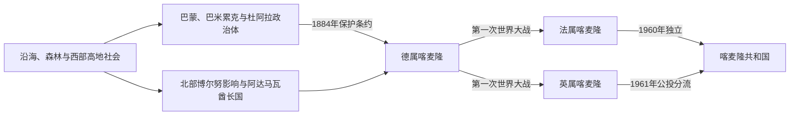

# 喀麦隆的前殖民社会与殖民统治

## 时间

古代—1961年

## 概括

喀麦隆生态与语言极为多样。南部沿海杜阿拉等控制河口贸易，西部高地发展巴米累克酋邦和巴蒙王国，北部则受卡涅姆—博尔努和19世纪阿达马瓦酋长国影响。现代国界主要源于德国殖民及一战后的英法分治。

## 演进图

## 王国兴起、殖民分治与统一问题

- 巴蒙王国传统把建国追溯至约14世纪的恩查雷·延。王权以丰班宫廷、分封酋长和工艺贸易整合高地，易卜拉欣·恩乔亚在19世纪末至20世纪初创制文字、编修王史并尝试在德国与法国之间维护自主；法国1920年代废黜并放逐他，王号此后主要承担文化与地方权威。
- 巴米累克地区由多个独立酋邦组成，没有单一王朝。每个“丰”与宫廷社团、土地首领及市场网络相互制衡。杜阿拉河口的贝尔、阿夸等王族则通过棕榈油和欧洲贸易取得中介地位，德国试图绕过其商业权并征地，最终在1914年处决反对征收的鲁道夫·杜阿拉·曼加·贝尔。
- 北部阿达马瓦酋长国源于莫迪博·阿达马参加索科托圣战。拉米多向索科托哈里发承认宗教宗主权，同时让地方富拉尼首领征税、牧养和发动军事扩张；德国和英国、法国的殖民划界把这一网络切入数国。
- 德国1884年取得保护条约后以公司、种植园、铁路和军队向内陆征服。1916年战败并非本地政权自然演化，而是欧洲战争的直接结果；国际联盟委任统治又把领土分成法英行政、教育与法律体系。
- 法属托管区1955年取缔喀麦隆人民联盟后，游击战争持续到独立以后；英属区1961年公投则把北部并入尼日利亚、南部并入喀麦隆。未设置独立选项及随后联邦被撤销，成为今日英语区争议的历史根源。

完整王号、分支与殖民政权转换见[中非王国、酋长国与殖民统治者表](/%E4%BA%BA%E6%96%87%E7%A7%91%E5%AD%A6/%E5%8E%86%E5%8F%B2/%E9%9D%9E%E6%B4%B2/%E4%B8%AD%E9%9D%9E/%E4%B8%AD%E9%9D%9E%E7%8E%8B%E5%9B%BD%E3%80%81%E9%85%8B%E9%95%BF%E5%9B%BD%E4%B8%8E%E6%AE%96%E6%B0%91%E7%BB%9F%E6%B2%BB%E8%80%85%E8%A1%A8.md)。

## 主要社会与政权

| 社会或政权 | 大致时期 | 特征 |
|---|---|---|
| 巴蒙王国 | 约14世纪以后 | 丰班宫廷、书写系统与工艺 |
| 巴米累克酋邦 | 西部高地 | 密集农业、宫廷和商贸网络 |
| 杜阿拉沿海政权 | 近代早期 | 棕榈油、奴隶与欧洲贸易中介 |
| 阿达马瓦酋长国 | 19世纪 | 索科托圣战后富拉尼政治网络 |

## 殖民统治

德国1884年与杜阿拉首领签约建立喀麦隆保护地，发展种植园、铁路和强制劳工。一战后法国取得大部分，英国取得沿尼日利亚边境两条狭长地带，分别按委任统治和托管制度治理，教育、法律和行政语言由此分化。

## 重要事件

- 19世纪初莫迪博·阿达马建立阿达马瓦酋长国。
- 1884年德国宣布喀麦隆保护地。
- 1916年德军撤出，一战后喀麦隆被英法分治。
- 1948年喀麦隆人民联盟成立，要求立即独立和统一。
- 1955年法国镇压人民联盟，独立前后形成持续游击战争。
- 1961年英属南喀麦隆公投选择与法属喀麦隆联合。

## 演变关系

殖民边界和资源制度直接塑造[喀麦隆的独立建国与现代发展](/%E4%BA%BA%E6%96%87%E7%A7%91%E5%AD%A6/%E5%8E%86%E5%8F%B2/%E9%9D%9E%E6%B4%B2/%E4%B8%AD%E9%9D%9E/%E5%96%80%E9%BA%A6%E9%9A%86/%E7%8B%AC%E7%AB%8B%E5%BB%BA%E5%9B%BD%E4%B8%8E%E7%8E%B0%E4%BB%A3%E5%8F%91%E5%B1%95.md)。
