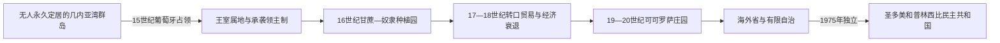

# 圣多美和普林西比的前殖民社会与殖民统治

## 时间

15世纪—1975年

## 概括

圣多美和普林西比在葡萄牙人15世纪抵达前没有已知永久居民。葡萄牙以罪犯、犹太儿童和定居者建立据点，并强迫大量非洲奴隶种植甘蔗，形成欧洲人、自由黑人、奴隶和逃亡者组成的克里奥尔社会。

## 演进图

## 殖民建立、劳动制度与终结

- 群岛在欧洲人到达前没有可证实的常住国家，因此不能套用“本土王朝被征服”的叙事。葡萄牙王室先授予承袭领地，由受赠领主招募定居者、管理司法并组织甘蔗园；1493年阿尔瓦罗·德·卡米尼亚扩大圣多美殖民。
- 早期糖业把岛屿变成大西洋种植园试验场：欧洲资本、制糖设备与从非洲大陆贩入的奴隶结合，产品输往欧洲。奴隶逃入山区形成安哥拉尔社群，1595年自称国王的阿马多尔领导起义，一度控制圣多美大部，数月后被捕处死。
- 17世纪后巴西糖业竞争、土壤消耗和反抗使群岛糖业衰落，圣多美转为奴隶贸易与航运节点。19世纪咖啡、可可繁荣促成大型“罗萨”公司庄园；法律上的废奴并未消除强迫性劳动，殖民当局以合同、债务、体罚和限制迁徙控制外来工人。
- 行政权由葡萄牙总督、庄园公司和地方“摄政区”官员分层行使，本地多数人口缺乏代表权。1953年总督卡洛斯·戈尔古略推动强迫招工，引发巴特帕镇压；惨案使劳工问题与民族认同结合。
- 圣多美和普林西比解放委员会后改组为解放运动，并在加蓬等地活动。葡萄牙1974年康乃馨革命摧毁继续殖民战争的政治基础，双方通过《阿尔及尔协定》移交权力，1975年独立直接终结总督制。

殖民行政阶段与实际权力角色见[中非王国、酋长国与殖民统治者表](/%E4%BA%BA%E6%96%87%E7%A7%91%E5%AD%A6/%E5%8E%86%E5%8F%B2/%E9%9D%9E%E6%B4%B2/%E4%B8%AD%E9%9D%9E/%E4%B8%AD%E9%9D%9E%E7%8E%8B%E5%9B%BD%E3%80%81%E9%85%8B%E9%95%BF%E5%9B%BD%E4%B8%8E%E6%AE%96%E6%B0%91%E7%BB%9F%E6%B2%BB%E8%80%85%E8%A1%A8.md)。

## 主要社会与政权

| 社会或政权 | 大致时期 | 特征 |
|---|---|---|
| 圣多美糖业殖民地 | 15—17世纪 | 早期大西洋甘蔗种植园和奴隶劳动 |
| 安哥拉尔逃亡者社会 | 16世纪以后 | 南部山林独立聚落与殖民对抗 |
| 罗萨种植园体系 | 19—20世纪 | 可可咖啡庄园、合同劳工和葡萄牙公司 |

## 殖民统治

16世纪圣多美一度是世界主要糖产地，后被巴西超越。19世纪废奴后，殖民者以“合同工”制度从安哥拉、佛得角和莫桑比克输入劳工，可可庄园条件近似强迫劳动。1953年巴特帕惨案成为民族主义记忆。

## 重要事件

- 1470年代葡萄牙航海者记录群岛，1493年圣多美定居扩大。
- 1595年阿马多尔领导大规模奴隶起义并一度控制岛上大部。
- 19世纪可可取代糖成为主要出口，罗萨庄园扩张。
- 1900年代国际反奴役运动揭露合同劳工制度。
- 1953年殖民政府镇压巴特帕抗议，造成大量死亡。

## 演变关系

殖民边界和资源制度直接塑造[圣多美和普林西比的独立建国与现代发展](/%E4%BA%BA%E6%96%87%E7%A7%91%E5%AD%A6/%E5%8E%86%E5%8F%B2/%E9%9D%9E%E6%B4%B2/%E4%B8%AD%E9%9D%9E/%E5%9C%A3%E5%A4%9A%E7%BE%8E%E5%92%8C%E6%99%AE%E6%9E%97%E8%A5%BF%E6%AF%94/%E7%8B%AC%E7%AB%8B%E5%BB%BA%E5%9B%BD%E4%B8%8E%E7%8E%B0%E4%BB%A3%E5%8F%91%E5%B1%95.md)。
