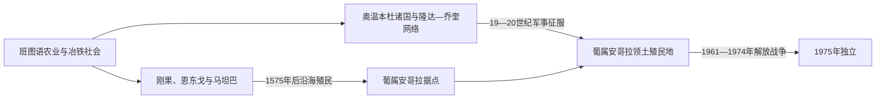

# 安哥拉的前殖民社会与殖民统治

## 时间

古代—1975年

## 概括

安哥拉北部属于刚果王国文化圈，中部高原形成本格拉、比耶等奥温本杜国家，宽扎河流域有恩东戈和马坦巴。葡萄牙1575年建立罗安达后以奴隶贸易和军事联盟向内陆扩张，但直到19世纪末至20世纪初才控制大部分现代疆域。

## 演进图

## 王权扩张、抵抗与殖民征服

- 刚果王国通过省级总督、王室选举与天主教宫廷影响安哥拉北部；恩东戈的统治者使用“恩戈拉”王号，以宽扎河谷贡赋和军事随从立国。葡萄牙把这一王号转写为殖民地名称，却从未因此获得对内陆的自然继承权。
- 17世纪恩津加·姆班德先继承恩东戈权力，再以马坦巴为根据地，运用外交、基督教洗礼、荷兰联盟和机动作战抵抗葡萄牙。她1663年去世后，马坦巴王朝延续两个多世纪，直到葡萄牙19世纪末逐步剥夺主权。
- 奥温本杜诸国依托本格拉高原商队把蜡、象牙和奴隶运往海岸。比耶、万博等王权借商路崛起，也因贸易竞争、火器扩散和殖民远征而分化；乔奎从东部扩张并吸收隆达政治与艺术传统。
- 葡萄牙长期实际控制罗安达、本格拉及若干堡垒，以非洲盟军和“蓬贝罗”商人深入内陆。巴西1888年废奴和欧洲瓜分压力迫使其把沿海贸易帝国改造成领土殖民地；1902年拜伦杜战争、1904年穆库塞战役及此后南部征服才基本确立现代边界内的军事控制。
- 20世纪“土著民—同化民”制度、强制合同工和定居者夺地支持咖啡与矿业出口。1961年拜沙-德卡桑热镇压、罗安达监狱袭击和北部起义把分散抗争转成长期解放战争；葡萄牙国内革命而非殖民军战场完胜，最终直接导致1975年撤离。

完整王号、共治争议与殖民行政转折见[中非王国、酋长国与殖民统治者表](/%E4%BA%BA%E6%96%87%E7%A7%91%E5%AD%A6/%E5%8E%86%E5%8F%B2/%E9%9D%9E%E6%B4%B2/%E4%B8%AD%E9%9D%9E/%E4%B8%AD%E9%9D%9E%E7%8E%8B%E5%9B%BD%E3%80%81%E9%85%8B%E9%95%BF%E5%9B%BD%E4%B8%8E%E6%AE%96%E6%B0%91%E7%BB%9F%E6%B2%BB%E8%80%85%E8%A1%A8.md)。

## 主要社会与政权

| 社会或政权 | 大致时期 | 特征 |
|---|---|---|
| 刚果王国南部 | 约14—19世纪 | 基督教宫廷与大西洋贸易 |
| 恩东戈王国 | 约16—17世纪 | 恩戈拉王权和宽扎河网络 |
| 马坦巴王国 | 17—19世纪 | 金加女王的反葡中心及后继国家 |
| 奥温本杜诸国 | 17—19世纪 | 本格拉高原商队、象牙与奴隶贸易 |
| 隆达—乔奎网络 | 东部 | 铜、象牙、艺术和跨境政治 |

## 殖民统治

葡萄牙以罗安达和本格拉为沿海据点，大量奴隶被运往巴西。废奴后转向橡胶、咖啡、棉花和强制合同劳工，殖民征服延续至20世纪。定居者和公司占地，教育与“同化民”资格极有限；1961年北部起义、罗安达镇压和棉区暴动开启解放战争。

## 重要事件

- 1575年保罗·迪亚斯·德·诺瓦伊斯建立罗安达。
- 17世纪金加女王在恩东戈和马坦巴之间抵抗葡萄牙。
- 17—19世纪安哥拉成为巴西奴隶贸易主要来源地之一。
- 1900年代葡萄牙通过军事行动控制高原和南部王国。
- 1961年多地起义标志安哥拉独立战争开始。

## 演变关系

殖民边界和资源制度直接塑造[安哥拉的独立建国与现代发展](/%E4%BA%BA%E6%96%87%E7%A7%91%E5%AD%A6/%E5%8E%86%E5%8F%B2/%E9%9D%9E%E6%B4%B2/%E4%B8%AD%E9%9D%9E/%E5%AE%89%E5%93%A5%E6%8B%89/%E7%8B%AC%E7%AB%8B%E5%BB%BA%E5%9B%BD%E4%B8%8E%E7%8E%B0%E4%BB%A3%E5%8F%91%E5%B1%95.md)。
