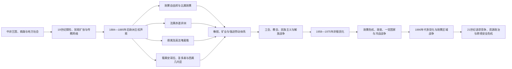

# 殖民资源体系、独立与中非冲突

## 时间

约1870年代—2026年7月。

## 概括

中非的殖民化不是欧洲在会议桌上画线后立即完成的过程。探险、条约和国际承认先制造主权声索，特许公司、传教站、铁路与武装哨所随后沿河流和商路推进，地方社会又以战争、迁徙、逃亡、谈判和日常规避持续抵抗。刚果自由邦、法属赤道非洲、德属喀麦隆及其英法继承地、西属几内亚、葡属安哥拉和圣多美虽制度不同，却普遍把税收、强迫劳动、土地和资源出口置于殖民国家核心。

二十世纪中叶独立后，各国继承了为出口而建的铁路港口、地域不均的教育与行政、殖民军队以及切割旧政治网络的边界。独立危机、冷战干预、军事政变和一党体制因此不能归结为某种抽象的“资源诅咒”或“族群仇恨”；它们是殖民制度、全球商品市场、国内权力竞争和外部安全介入共同作用的结果。与此同时，工会、教会、妇女组织、城市社团、地方市场、选举运动与和平机制一直在塑造另一条国家建设主线。

## 殖民分割与现代国家

| 殖民单元 | 控制者与时间 | 主要治理方式 | 主要现代继承国家或地区 |
|---|---|---|---|
| 刚果自由邦 | 比利时国王利奥波德二世个人控制，1885—1908年 | 特许公司、武装征收、橡胶与象牙配额、人质和强迫劳动 | 刚果民主共和国 |
| 比属刚果 | 比利时国家，1908—1960年 | 殖民行政、教会教育、矿业公司和种族化家长式统治 | 刚果民主共和国 |
| 法属赤道非洲 | 法国，1910—1958年；由此前各殖民地合组 | 特许公司、税役、强制征募、联邦总督和有限地方行政 | 加蓬、刚果共和国、中非共和国、乍得 |
| 德属喀麦隆 | 德国，1884—1916年 | 公司和种植园、土地征收、军事远征、强迫劳动 | 喀麦隆及邻国部分边境地区 |
| 法属喀麦隆、英属喀麦隆 | 一战后委任统治，后为联合国托管地 | 法区集中治理；英区分别与尼日利亚行政相连 | 喀麦隆；英属北区并入尼日利亚 |
| 西属几内亚 | 西班牙，1778年取得声索、19世纪后期加强控制，至1968年 | 比奥科可可种植园、外来劳工、教会和大陆木材开发 | 赤道几内亚 |
| 葡属安哥拉 | 葡萄牙在沿海据点始于16世纪，19—20世纪完成领土殖民，至1975年 | 特许公司、强迫劳动、定居殖民、种植园与矿业 | 安哥拉及卡宾达飞地 |
| 圣多美和普林西比 | 葡萄牙，15世纪后期—1975年 | 蔗糖、咖啡和可可种植园，奴隶制及其后的契约／强迫劳工 | 圣多美和普林西比 |

## 演进图

## 欧洲主权声索如何变成实际统治

### 条约、地图与武装哨所

十九世纪后期，欧洲探险者和商业代理人同非洲统治者签署大量内容、译法和授权范围不对等的条约。非洲签署者可能理解为友好、贸易或保护关系，欧洲政府却把它们解释为割让对外主权。1884—1885年柏林会议并未逐条划定全部中非边界，也没有赋予欧洲列强一种合法“瓜分权”；它确立的有效占领和通报等原则，加速了列强把纸面声索转为行政和军事控制。

河流是殖民推进的关键。刚果河及乌班吉、桑加等支流便于轮船、兵员和货物进入，铁路则绕过瀑布区，把矿区和种植园连接到海港。殖民国家的实际控制常呈飞地状：首都、港口、矿区和铁路沿线较强，偏远地区依赖被承认或新造的“酋长”。把这种不均匀控制误写成从某年起每一寸领土都由殖民政府直接治理，会掩盖征服持续数十年的事实。

### 地方抵抗与殖民中介

中非社会以正面作战、破坏道路、逃避征税、迁离劳工征募区、隐瞒产量、利用列强竞争等方式抵抗。部分首领又与殖民者合作以对付地方对手，或在新行政中争取职位。殖民统治因此既使用欧洲军官，也依赖非洲士兵、翻译、税吏、商人和被改造的地方权威。合作不等于自由选择；武力威胁、人口损失和制度性不平等决定了谈判边界。

## 刚果自由邦：特许公司与暴力征收

利奥波德二世借国际协会、探险条约和“人道”“自由贸易”承诺，在1885年获得刚果自由邦的国际承认。该国家并非比利时殖民地，而是与利奥波德个人相连的主权实体。为了支付行政、军队和基础设施成本并获取利润，自由邦宣布大片“空地”和自然资源归国家所有，把区域交给特许公司，依靠公安军征集橡胶与象牙。

天然橡胶需求在十九世纪末暴涨。村落被规定配额，士兵扣押人质、焚毁聚落、处决或残害无法交额者。砍手既与证明弹药使用有关，也成为恐怖统治象征；不同地区暴力形式和死亡规模并不相同，人口灾难还包含饥荒、疾病、生育下降和逃亡。不能用一个未经证实的精确数字概括全部损失，但大规模人口崩溃和系统性暴力没有争议。

非洲幸存者、传教士和前官员提供证词，埃德蒙·莫雷尔、罗杰·凯斯门特等推动国际运动。1904年凯斯门特报告及随后调查使暴行更难掩盖。1908年，比利时议会接管自由邦，改为比属刚果。接管结束了国王个人国家，却没有终结强迫劳动、种族等级和资源飞地。

## 比属刚果：矿业、家长制与独立准备不足

比利时殖民政府与天主教传教网络、联合矿业等大公司形成“殖民三位一体”。加丹加铜、锡、工业金刚石、铀等进入全球产业与战争经济；铁路、矿镇和劳工营地围绕出口建设。教育覆盖扩大，但大多停留在初等和职业层次，高等教育及非洲人高级行政训练极少。城市中的“进化者”即受教育精英获得有限身份特权，却无平等政治权利。

第二次世界大战后，城市劳工、教会团体、文化协会和民族主义组织迅速发展。1959年利奥波德维尔骚乱后，比利时仓促接受独立，1960年6月新国家成立时，本地高级军官和行政人才极少，中央、各省和殖民企业之间的权力安排也未解决。这不是说刚果人“尚未准备好自治”，而是殖民政府长期拒绝有序移交，最后又急速撤退。

## 法属赤道非洲：特许经营、税役与铁路

法国在加蓬河口、中刚果、乌班吉沙立和乍得逐步建立殖民地，1910年合组法属赤道非洲，首府设于布拉柴维尔。早期大片区域授予特许公司，公司以征收橡胶、象牙和其他产品获利；税款迫使居民进入货币劳动，武装惩罚和人口迁移普遍存在。

1921—1934年修建刚果—海洋铁路时，殖民政府从中刚果及更远地区强制征募工人。疾病、营养不良、事故和恶劣劳动造成大量死亡，铁路成为殖民基础设施由谁承担代价的典型。二战期间，法属赤道非洲多数地区较早支持自由法国，布拉柴维尔成为重要政治中心。1944年布拉柴维尔会议提出改革强迫劳动、扩大代表等方向，却没有承诺立即独立。

1946年后法国联盟、公民权扩大、议会政治和工会活动改变殖民秩序；1956年框架法推进地方自治。1958年公投后，法属赤道非洲解体为自治共和国，1960年前后分别独立。联邦主义方案未能维持，各地精英、法国利益和不同财政条件推动建立独立国家。

## 喀麦隆：从德国殖民到英法分治

德国1884年宣布喀麦隆保护地，随后以军事远征、土地征收、种植园和道路劳工扩展实际控制。一战期间英法军队占领殖民地，国联把大部分划为法国委任统治地，西部狭长地区由英国管理并分别依附尼日利亚北部、南部行政。二战后两者转为联合国托管地，目标名义上包括走向自治。

法区民族主义既有议会路线，也有喀麦隆人民联盟领导的武装反殖民斗争；法国及其盟友实施严厉镇压。1960年法属喀麦隆独立。1961年联合国组织的公民投票只提供同尼日利亚或同喀麦隆联合的选择：北部英属喀麦隆选择加入尼日利亚，南部选择与喀麦隆组成联邦。1972年联邦改为单一制国家，1984年国名变化进一步强化法语区主导的观感。普通法、教育和地方自治争议长期累积，2016年以后演变成严重的英语区危机。它不是“古老族群战争”，而与委任统治分割、联邦承诺和国家中央化直接相关。

## 葡萄牙与西班牙殖民地

葡萄牙在安哥拉和圣多美的存在开始较早，但十九世纪末以后才以现代殖民国家方式扩大内陆控制。法律上奴隶制废除后，契约劳工和强制劳动仍把大量非洲人送入种植园、道路和矿区。安哥拉二十世纪的定居殖民、土地占有和种族等级加深矛盾，1961年多地起义开启长期解放战争。葡萄牙1974年革命后仓促撤出，安哥拉各解放运动的竞争迅速国际化。

赤道几内亚由比奥科岛、安诺本岛和大陆木尼河地区组成。西班牙统治依靠可可种植园、尼日利亚等地劳工、天主教教育和高度集中的殖民行政。1968年独立后，弗朗西斯科·马西亚斯·恩圭马建立极端暴力独裁，国家机构和人口遭到重创；1979年政变后特奥多罗·奥比昂掌权。1990年代石油带来高额收入，却未自动形成广泛公共服务和政治开放。

## 非殖民化与独立路径

| 地区 | 主要独立时间 | 权力移交特点 | 初期难题 |
|---|---|---|---|
| 法属赤道非洲四国 | 1960年 | 由自治共和国转为独立，与法国维持密切制度和安全关系 | 国家财政差异、军队政治化、边远地区整合 |
| 刚果民主共和国 | 1960年 | 比利时仓促移交，殖民军和矿业结构未完成重组 | 军队兵变、加丹加与南开赛分离、外部干预 |
| 喀麦隆 | 1960—1961年 | 法区独立后与南部英属托管地组成联邦 | 反殖民战争余波、联邦权力与语言法制差异 |
| 赤道几内亚 | 1968年 | 西班牙结束殖民统治 | 权力高度个人化、行政脆弱和暴力统治 |
| 圣多美和普林西比 | 1975年 | 葡萄牙革命后移交 | 单一作物经济、土地与国家企业重组 |
| 安哥拉 | 1975年 | 解放战争后葡萄牙迅速撤离，多个运动争夺首都与国际承认 | 古巴、南非、美国、苏联等介入的长期内战 |

## 刚果危机与蒙博托国家

1960年独立数日后，公安军兵变，比利时出兵，加丹加在莫伊兹·冲伯领导下分离，南开赛也出现分离政权。总统约瑟夫·卡萨武布、总理帕特里斯·卢蒙巴、军方领导人约瑟夫-德西雷·蒙博托及各省力量围绕宪法权力和冷战取向冲突。联合国刚果行动部署大规模维和部队，但其授权和行为备受争议。卢蒙巴在比利时和刚果对手参与的过程中于1961年被杀，成为非洲反殖民象征。联合国军1963年结束加丹加分离，中央秩序仍不稳定；蒙博托1965年政变掌权。

蒙博托后来把国家改名扎伊尔，以真实性运动、一党制度和个人崇拜集中权力。他利用冷战反共地位获得外援，同时通过庇护网络控制军政精英。1970年代“扎伊尔化”没收和转移企业，管理混乱、铜价变化、外债和腐败削弱经济；正式国家能力下降并不意味着社会停止运转，教会、市场和跨境网络承担许多公共功能。冷战结束后外援基础动摇，多党转型被拖延，军队失序加深。

## 安哥拉战争与区域冷战

安哥拉人民解放运动、安哥拉民族解放阵线和争取安哥拉彻底独立全国联盟在反葡斗争中已存在分歧。1975年独立前后，三方争夺首都和国家权力，古巴与苏联支持安人运，南非和美国等支持其对手，扎伊尔也介入。战争同纳米比亚独立斗争和南非种族隔离政权的地区战略相连。

1988年纽约协议促成古巴军队撤离并推进纳米比亚独立。冷战结束后，1991年比塞斯协议试图以选举和军队整合结束战争；1992年选举争议后战事重启。2002年若纳斯·萨文比被杀，安哥拉内战结束。石油为战后重建提供财政，也强化了沿海国家精英与内陆、城市与乡村之间的不均衡。

## 两次刚果战争及其延续

1994年卢旺达大屠杀后，大量难民和包括前卢旺达政府军、民兵在内的武装进入扎伊尔东部。1996年，卢旺达、乌干达支持洛朗-德西雷·卡比拉领导的联盟起兵，1997年推翻蒙博托，恢复“刚果民主共和国”国名。这场第一次刚果战争同时包含清除跨境武装、推翻扎伊尔政权和区域国家利益。

1998年卡比拉与原盟友决裂，卢旺达、乌干达支持新的反政府力量；安哥拉、津巴布韦、纳米比亚等支持刚果政府，第二次刚果战争成为多国战争。2002—2003年和平安排建立过渡政府，但外国军队撤出和全国选举没有消除东部武装、土地冲突、矿产走私和地方安全困境。伊图里、基伍及周边持续出现武装重组，联合国维和行动的保护能力与退出安排反复成为争议。

到2026年7月，AFC／M23在刚果东部维持平行行政并与刚果军队及盟友交战，联合国报告其获得卢旺达国防军支持；刚果政府、卢旺达及AFC／M23相关的华盛顿、多哈等和平进程取得若干框架性进展，但战斗、平民伤亡和大规模流离失所仍在延续。应把“签署和平框架”与“冲突已经结束”严格区分。

## 其他独立国家的政治轨迹

### 刚果共和国与加蓬

刚果共和国独立后经历政变、社会主义一党体制和1990年代多党化。1997年内战使德尼·萨苏-恩格索重新掌权，石油收入、总统制和反对派空间成为长期议题。加蓬在奥马尔·邦戈长期统治下依靠石油、执政党和对法关系维持稳定表象；2023年军方在有争议选举后夺权，过渡进程于2025年举行总统选举并建立新制度。两国均说明石油收入可以支撑国家财政，却也可能绕过广泛纳税协商、强化权力集中。

### 乍得与中非共和国

乍得殖民边界把萨赫勒、撒哈拉和南部农业区纳入一国。独立后的南北权力失衡、利比亚介入、苏丹—达尔富尔冲突外溢和军事政权相互叠加。2021年伊德里斯·代比阵亡后，军方过渡由其子马哈马特·伊德里斯·代比领导，2024年选举结束名义过渡；到2026年，东部仍承受苏丹战争难民压力，政治权利与反对派空间受到关注。

中非共和国自独立以来经历博卡萨统治、政变和国家能力不均。2012年塞雷卡联盟进攻后，反巴拉卡武装兴起，冲突常被宗教标签概括，但地方安全、商路、牧地、政治排斥和外部武装同样关键。2014年联合国中非共和国多层面综合稳定团部署。政府在俄罗斯安全伙伴等外援下恢复部分地区控制，2025—2026年出现更多自愿返回，但全国仍有大量国内流离失所者和境外难民，苏丹战争也持续外溢。

### 喀麦隆与赤道几内亚

喀麦隆独立后由艾哈迈杜·阿希乔建立高度集中体制，保罗·比亚1982年继任。北部受到博科圣地及其分支袭击，英语区危机则源于殖民分治和联邦制度遗产。赤道几内亚1979年以来由奥比昂长期统治，石油改变经济规模和城市景观，但政治权力、财富分配和接班安排高度集中。

## 资源政治的机制

“资源丰富导致战争”不是完整解释。资源对政治的影响取决于开采地点、运输方式、所有权、税制、军队和国际市场。

- **飞地型开采**：矿山、油田、铁路和港口可以同周边农业经济连接很弱，国家容易依赖少数公司与出口节点。
- **租金集中**：石油和大型矿业收入由中央或国有企业接收，可减少政府向广泛纳税人协商的压力。
- **边境商业化**：黄金、钻石、木材和钴等可通过非正式路线流通，为军队、反叛组织、地方精英和跨国商人提供资金。
- **价格周期**：铜、石油和其他商品价格下跌会突然削弱财政，放大债务、工资拖欠和军队失序。
- **外部安全交换**：政府可能用采矿权、军事基地或合同换取武器、训练与外交支持。
- **社会能动性**：矿工工会、社区组织、记者和司法行动也能迫使公司与政府回应劳动、环境和收益分配问题。

## 兴衰与冲突的分层分析

### 结构因素

殖民边界把跨国亲属和商路切开，又把历史联系较弱的区域置于同一行政；教育、交通与医疗投资集中在出口地带；殖民军队的首要任务是维持秩序而非公民防卫。独立国家继承这些结构，并面对财政狭窄、首都偏重和地方代表不足。

### 外部压力

冷战援助保护若干威权政权，代理战争把本地竞争国际化。冷战后，结构调整、债务和援助条件改变国家财政；邻国战争、难民与武装跨境流动使安全问题区域化。全球对石油、铜、钴、铀、钻石、木材和橡胶的需求持续影响政治选择。

### 直接触发因素

军队兵变、争议选举、总统死亡、和平协议破裂、反叛联盟攻占城市或商品价格骤降，常是危机爆发的直接触发点。它们只有放在长期制度和区域关系中才能解释。例如1996年扎伊尔战争由东部难民营武装和区域干预触发，却建立在蒙博托国家衰败、地方公民权争议和数十年跨境政治之上。

## 重要事件

| 时间 | 事件 | 结果与长期影响 |
|---|---|---|
| 1884—1885年 | 柏林会议时期的欧洲主权竞逐 | 加速纸面声索，但实际征服和边界落实延续数十年 |
| 1885—1908年 | 刚果自由邦 | 橡胶与象牙强制征收造成系统性暴力和人口灾难 |
| 1904—1908年 | 国际调查与比利时接管 | 自由邦暴行曝光，个人国家改为比利时殖民地，强迫劳动遗产延续 |
| 1910年 | 法属赤道非洲正式合组 | 法国把四殖民地置于联邦总督框架，财政和劳工仍高度不均 |
| 1921—1934年 | 刚果—海洋铁路修建 | 强制征募和高死亡率体现殖民基础设施的社会代价 |
| 1944年 | 布拉柴维尔会议 | 推动殖民改革讨论，却未承诺立即独立 |
| 1958—1961年 | 法属中非解体、刚果独立与喀麦隆重组 | 多个现代国家建立，殖民军队、边界与联邦问题随之继承 |
| 1960—1965年 | 刚果危机 | 分离、外部干预、卢蒙巴遇害和蒙博托崛起重塑冷战中非 |
| 1961—1975年 | 葡属安哥拉解放战争 | 葡萄牙革命促成独立，竞争性解放运动转入内战 |
| 1975—2002年 | 安哥拉内战 | 国内权力斗争与全球、地区冷战叠加，2002年才结束大规模战争 |
| 1996—1997年 | 第一次刚果战争 | 蒙博托倒台，区域军队和东部武装成为国家重建核心问题 |
| 1998—2003年 | 第二次刚果战争与过渡 | 多国参战，和平协议结束正式战争但未消除东部暴力 |
| 2012—2014年 | 中非共和国新一轮内战与联合国部署 | 塞雷卡、反巴拉卡及外部力量冲突造成长期人道危机 |
| 2016年以后 | 喀麦隆英语区危机 | 殖民分治和联邦争议演变为武装冲突与平民伤亡 |
| 2023—2026年 | 加蓬政权更替及中非多地安全重组 | 军事过渡、选举、外部安全伙伴和区域和平机制并行 |
| 2025—2026年 | 刚果东部和平进程与持续战斗 | 多边框架取得进展，但AFC／M23、外部支持和人道危机尚未解决 |

## 历史辨析

- **殖民国家不是从柏林会议当日完整出现。** 国际承认、边界谈判和地方军事征服是不同阶段。
- **“间接统治”并非保留原样传统。** 殖民者选择、废立或创造首领，把流动权威固定为行政和“部族”类别。
- **独立后冲突不能用“古老族群仇恨”解释。** 身份边界受到殖民人口分类、土地制度、政党动员和战争经历重塑。
- **资源本身不会自动产生专制或战争。** 关键在开采制度、财政透明、地方权利、外部市场和安全组织。
- **名义主权与实际控制需区分。** 政府可能获国际承认但不能稳定治理全部领土，反叛组织也可能控制城市而缺乏合法国家地位。
- **现代和平协议是过程节点而非终点。** 应继续核对执行、撤军、解除武装、司法与难民返回，而不是以签字日期替代结果。

## 前后关系与延伸阅读

- 上级导航：[中非历史](/%E4%BA%BA%E6%96%87%E7%A7%91%E5%AD%A6/%E5%8E%86%E5%8F%B2/%E9%9D%9E%E6%B4%B2/%E4%B8%AD%E9%9D%9E/README.md)
- 前殖民大西洋主线：[刚果王国与大西洋中非](/%E4%BA%BA%E6%96%87%E7%A7%91%E5%AD%A6/%E5%8E%86%E5%8F%B2/%E9%9D%9E%E6%B4%B2/%E4%B8%AD%E9%9D%9E/%E5%88%9A%E6%9E%9C%E7%8E%8B%E5%9B%BD%E4%B8%8E%E5%A4%A7%E8%A5%BF%E6%B4%8B%E4%B8%AD%E9%9D%9E.md)
- 前殖民内陆主线：[卢巴、隆达与刚果盆地网络](/%E4%BA%BA%E6%96%87%E7%A7%91%E5%AD%A6/%E5%8E%86%E5%8F%B2/%E9%9D%9E%E6%B4%B2/%E4%B8%AD%E9%9D%9E/%E5%8D%A2%E5%B7%B4%E3%80%81%E9%9A%86%E8%BE%BE%E4%B8%8E%E5%88%9A%E6%9E%9C%E7%9B%86%E5%9C%B0%E7%BD%91%E7%BB%9C.md)
- 国家阶段：[刚果民主共和国历史](/%E4%BA%BA%E6%96%87%E7%A7%91%E5%AD%A6/%E5%8E%86%E5%8F%B2/%E9%9D%9E%E6%B4%B2/%E4%B8%AD%E9%9D%9E/%E5%88%9A%E6%9E%9C%E6%B0%91%E4%B8%BB%E5%85%B1%E5%92%8C%E5%9B%BD/README.md)、[安哥拉历史](/%E4%BA%BA%E6%96%87%E7%A7%91%E5%AD%A6/%E5%8E%86%E5%8F%B2/%E9%9D%9E%E6%B4%B2/%E4%B8%AD%E9%9D%9E/%E5%AE%89%E5%93%A5%E6%8B%89/README.md)、[喀麦隆历史](/%E4%BA%BA%E6%96%87%E7%A7%91%E5%AD%A6/%E5%8E%86%E5%8F%B2/%E9%9D%9E%E6%B4%B2/%E4%B8%AD%E9%9D%9E/%E5%96%80%E9%BA%A6%E9%9A%86/README.md)、[中非共和国历史](/%E4%BA%BA%E6%96%87%E7%A7%91%E5%AD%A6/%E5%8E%86%E5%8F%B2/%E9%9D%9E%E6%B4%B2/%E4%B8%AD%E9%9D%9E/%E4%B8%AD%E9%9D%9E%E5%85%B1%E5%92%8C%E5%9B%BD/README.md)
