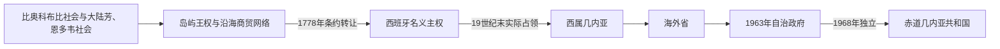

# 赤道几内亚的前殖民社会与殖民统治

## 时间

古代—1968年

## 概括

赤道几内亚由彼此分离的岛屿与大陆领土组成。布比人在比奥科岛建立村落和王权传统，大陆由芳、恩多韦等社会组成；安诺本形成葡语—克里奥尔文化。现代疆域源于葡萄牙把几内亚湾权利转让给西班牙。

## 演进图

## 岛陆权力、殖民组合与独立

- 比奥科的布比村落由氏族首领、宗教权威和地区性王权联系，约19世纪的莫卡王把若干部落纳入松散联盟；其继承者马拉博在西班牙控制已强化的条件下仍保留象征权威。大陆木尼河区的芳与恩多韦没有统一王朝，而以宗族、长老会和贸易首领组织。
- 安诺本在葡萄牙殖民后形成以非洲奴隶后裔为主体的克里奥尔社会；比奥科则一度有英国反奴隶贸易基地克拉伦斯镇。1778年葡萄牙把名义权利转给西班牙，但疾病、财政不足和本地抵抗使西班牙长期只控制少数海岸点。
- 1858年后西班牙重新派驻总督，1900年与法国划定木尼河边界，1926年将比奥科、木尼河、安诺本和科里斯科合并。殖民国家由总督直接领导，天主教传教会掌握大部分教育，费尔南多波种植园主依赖尼日利亚合同劳工。
- 可可繁荣使岛屿基础设施领先大陆，也造成布比土地流失和区域不平等。大陆20世纪才被系统军事占领并发展木材；“土著”受分离法律管制，少数“解放民”取得有限公民资格。
- 1959年改设两个海外省，1963年自治政府仍受西班牙高级专员制约。联合国去殖民化压力、流亡民族主义与西班牙内部政策转变促成1968年宪法公投和选举，10月12日主权移交，总督和高级专员体系终结。

岛屿王号与殖民行政节点见[中非王国、酋长国与殖民统治者表](/%E4%BA%BA%E6%96%87%E7%A7%91%E5%AD%A6/%E5%8E%86%E5%8F%B2/%E9%9D%9E%E6%B4%B2/%E4%B8%AD%E9%9D%9E/%E4%B8%AD%E9%9D%9E%E7%8E%8B%E5%9B%BD%E3%80%81%E9%85%8B%E9%95%BF%E5%9B%BD%E4%B8%8E%E6%AE%96%E6%B0%91%E7%BB%9F%E6%B2%BB%E8%80%85%E8%A1%A8.md)。

## 主要社会与政权

| 社会或政权 | 大致时期 | 特征 |
|---|---|---|
| 布比社会 | 比奥科岛 | 山地村落、氏族与巴萨克王权 |
| 芳人社会 | 大陆内陆 | 迁徙、宗族和农业网络 |
| 恩多韦沿海社会 | 木尼河沿岸 | 渔业和大西洋贸易 |
| 安诺本克里奥尔社会 | 16世纪以后 | 葡萄牙定居、奴隶后裔与岛屿文化 |

## 殖民统治

葡萄牙15世纪抵达比奥科和安诺本，1778年《埃尔帕尔多条约》把权利转给西班牙。西班牙19世纪末才强化控制，1926年合并为西属几内亚；比奥科可可种植园依赖来自利比里亚和尼日利亚的劳工，大陆木材开发扩大。

## 重要事件

- 1470年代葡萄牙航海者到达比奥科和安诺本。
- 1778年葡萄牙向西班牙转让殖民主张。
- 1900年法西条约确定大陆木尼河边界。
- 1926年岛屿与大陆合并为西属几内亚。
- 1959年改为西班牙海外省，1963年获得有限自治。

## 演变关系

殖民边界和资源制度直接塑造[赤道几内亚的独立建国与现代发展](/%E4%BA%BA%E6%96%87%E7%A7%91%E5%AD%A6/%E5%8E%86%E5%8F%B2/%E9%9D%9E%E6%B4%B2/%E4%B8%AD%E9%9D%9E/%E8%B5%A4%E9%81%93%E5%87%A0%E5%86%85%E4%BA%9A/%E7%8B%AC%E7%AB%8B%E5%BB%BA%E5%9B%BD%E4%B8%8E%E7%8E%B0%E4%BB%A3%E5%8F%91%E5%B1%95.md)。
