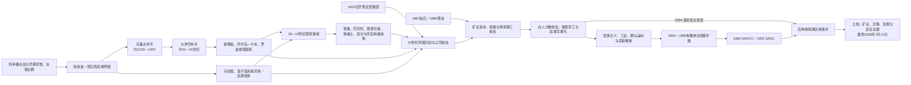

# 南部非洲历史

## 历史主线

南部非洲的长时段历史不能从欧洲殖民开始。科伊桑采集狩猎与牧业社会、班图语族农业和冶铁社群、跨林波波河与赞比西河的农牧—矿产网络，共同构成早期基础。约公元10世纪以后，马蓬古布韦、大津巴布韦、穆塔帕、托尔瓦—卡米、罗兹维、马拉维与洛齐等国家先后或并行发展，以牛群、贡赋、仪式王权、金矿和印度洋商路组织权力；中心迁移通常意味着政治网络重组，并非居民或文明突然消失。

18世纪末至19世纪，环境波动、贸易竞争、继承冲突、军事制度革新、难民吸收以及开普和印度洋殖民边疆扩张相互作用，促成祖鲁、巴苏陀、恩德贝莱、斯威士、佩迪、加沙及茨瓦纳诸政体重组。“姆费卡内／迪法卡内”可用来描述这场动荡，却不能把所有迁徙归因于祖鲁扩张，更不能据此制造“无人土地”叙事。

1652年后，开普定居殖民逐渐深入内陆；19世纪后期帝国分割、公司特许和矿业革命把整片区域编入土地剥夺、税收、铁路港口与跨境合同劳工体系。白人少数统治在南非、南罗得西亚和西南非洲尤为严密，葡属安哥拉与莫桑比克则以强迫劳工、特许公司和地方中介维持。20世纪民族主义、工会、群众抗争、武装斗争、国际压力和前线国家协作共同推动独立；1990年纳米比亚独立、1994年南非首次不分种族全国选举，终结了区域最后两个主要白人少数统治节点。

此后的南部非洲以南部非洲发展共同体为主要合作框架。殖民边界和种族法制已经改变，但矿产—港口走廊、跨境移工、土地不均、解放党长期执政、地方冲突与气候风险仍连接各国历史。阅读时应把高原国家、19世纪国家重组和殖民—解放体系视为连续而不等同的三层主线，再进入国家目录核对当地王权、殖民行政和现代政治。

## 时间导航

| 顺序 | 主题 | 时间范围 | 简要概括 |
|---|---|---|---|
| 1 | [马蓬古布韦、大津巴布韦与赞比西河国家](/%E4%BA%BA%E6%96%87%E7%A7%91%E5%AD%A6/%E5%8E%86%E5%8F%B2/%E9%9D%9E%E6%B4%B2/%E5%8D%97%E9%83%A8%E9%9D%9E%E6%B4%B2/%E9%A9%AC%E8%93%AC%E5%8F%A4%E5%B8%83%E9%9F%A6%E3%80%81%E5%A4%A7%E6%B4%A5%E5%B7%B4%E5%B8%83%E9%9F%A6%E4%B8%8E%E8%B5%9E%E6%AF%94%E8%A5%BF%E6%B2%B3%E5%9B%BD%E5%AE%B6.md) | 约公元900年—19世纪 | 说明高原与河谷国家如何凭借农牧、冶铁、贡赋、仪式权威、黄金和印度洋贸易兴起，又如何因资源、商路、继承、地方离心与外部介入而转型。 |
| 2 | [祖鲁、索托、茨瓦纳与十九世纪国家重组](/%E4%BA%BA%E6%96%87%E7%A7%91%E5%AD%A6/%E5%8E%86%E5%8F%B2/%E9%9D%9E%E6%B4%B2/%E5%8D%97%E9%83%A8%E9%9D%9E%E6%B4%B2/%E7%A5%96%E9%B2%81%E3%80%81%E7%B4%A2%E6%89%98%E3%80%81%E8%8C%A8%E7%93%A6%E7%BA%B3%E4%B8%8E%E5%8D%81%E4%B9%9D%E4%B8%96%E7%BA%AA%E5%9B%BD%E5%AE%B6%E9%87%8D%E7%BB%84.md) | 约18世纪末—19世纪末 | 梳理祖鲁、巴苏陀、恩德贝莱、斯威士、佩迪、加沙和茨瓦纳诸政体的形成、统治结构、继承节点、殖民碰撞及“姆费卡内／迪法卡内”争议。 |
| 3 | [定居殖民、矿业体系与南部非洲解放](/%E4%BA%BA%E6%96%87%E7%A7%91%E5%AD%A6/%E5%8E%86%E5%8F%B2/%E9%9D%9E%E6%B4%B2/%E5%8D%97%E9%83%A8%E9%9D%9E%E6%B4%B2/%E5%AE%9A%E5%B1%85%E6%AE%96%E6%B0%91%E3%80%81%E7%9F%BF%E4%B8%9A%E4%BD%93%E7%B3%BB%E4%B8%8E%E5%8D%97%E9%83%A8%E9%9D%9E%E6%B4%B2%E8%A7%A3%E6%94%BE.md) | 1652年—2026年7月14日 | 解释开普定居殖民、帝国分割、矿业—移工体系、白人少数政权、前线国家、解放战争、民主转型及其长期结构遗产。 |

三篇专题在时间上有意重叠：19世纪非洲国家形成必须与殖民边疆并读，20世纪国家独立也必须放回跨境矿业、交通和战争网络理解。专题页维护跨国机制；具体君主、国家元首、政府首脑与国内事件在国家目录维护，避免重复世系。

## 世系与权力结构专表

- [南部非洲王国、酋长国与殖民统治者表](/%E4%BA%BA%E6%96%87%E7%A7%91%E5%AD%A6/%E5%8E%86%E5%8F%B2/%E9%9D%9E%E6%B4%B2/%E5%8D%97%E9%83%A8%E9%9D%9E%E6%B4%B2/%E5%8D%97%E9%83%A8%E9%9D%9E%E6%B4%B2%E7%8E%8B%E5%9B%BD%E3%80%81%E9%85%8B%E9%95%BF%E5%9B%BD%E4%B8%8E%E6%AE%96%E6%B0%91%E7%BB%9F%E6%B2%BB%E8%80%85%E8%A1%A8.md)：集中维护祖鲁、巴苏陀、斯威士、恩德贝莱、加沙、洛齐及高原王权的复位、摄政和证据缺口。
- [南部非洲独立国家元首与权力结构表](/%E4%BA%BA%E6%96%87%E7%A7%91%E5%AD%A6/%E5%8E%86%E5%8F%B2/%E9%9D%9E%E6%B4%B2/%E5%8D%97%E9%83%A8%E9%9D%9E%E6%B4%B2/%E5%8D%97%E9%83%A8%E9%9D%9E%E6%B4%B2%E7%8B%AC%E7%AB%8B%E5%9B%BD%E5%AE%B6%E5%85%83%E9%A6%96%E4%B8%8E%E6%9D%83%E5%8A%9B%E7%BB%93%E6%9E%84%E8%A1%A8.md)：区分君主、总督、总统、首相、军政府和代理国家元首，并核验当代制度至2026年7月14日。

## 重要转折与时间节点

| 时间 | 转折 | 区域意义 |
|---|---|---|
| 约900—1300年 | 林波波—沙谢地区由施罗达、K2发展至马蓬古布韦 | 农牧、牛群、贸易和神圣王权结合，形成可由考古辨识的等级国家。 |
| 约13—15世纪 | 大津巴布韦成为高原重要政治与贸易中心 | 本地石砌建筑、金产区与印度洋网络相连，后续中心向穆塔帕和卡米等地转移。 |
| 16—17世纪 | 葡萄牙沿莫桑比克海岸与赞比西河介入 | 商站、传教、军事远征和普拉佐领地改变贸易与王位竞争，却未立即消灭内陆国家。 |
| 约1680年代—19世纪初 | 罗兹维、马拉维、洛齐等多中心格局 | 地方首领、贡赋网络和河谷交通继续支撑本地国家。 |
| 约1810—1840年代 | 祖鲁兴起、难民迁徙与多国重组 | 军事与政治创新、环境和贸易压力、殖民边疆共同重塑人口与国家。 |
| 1652—1806年 | 荷兰东印度公司据点演为开普定居殖民，英国最终控制开普 | 土地扩张、奴隶制和边疆战争构成日后殖民国家的南端基础。 |
| 1867、1886年 | 金刚石与黄金发现 | 大资本、铁路、矿山大院与跨境合同劳工把区域经济重心推向南非。 |
| 1880年代—1910年 | 帝国分割、公司统治与南非联邦建立 | 现代边界、白人少数政治和不同殖民行政模式制度化。 |
| 1948年 | 南非国民党全面推行种族隔离 | 既有土地、劳工和身份控制被整合成更严密的种族国家。 |
| 1964—1975年 | 内陆保护国与葡属殖民地相继独立 | 多数统治国家扩大，前线国家网络与冷战地区战争同时形成。 |
| 1980年 | 津巴布韦独立，南部非洲发展协调会议成立 | 罗得西亚白人统治终结，区域合作以削弱对种族隔离南非的依赖为目标。 |
| 1988—1990年 | 纽约协议、联合国过渡与纳米比亚独立 | 西南非洲殖民统治结束，安哥拉—纳米比亚战场转入新的政治阶段。 |
| 1992—1994年 | 南共体成立；南非完成全民选举 | 区域主轴由反殖民协调转向发展、安全与一体化。 |
| 2017年至今 | 德尔加杜角叛乱及跨国应对 | 独立后的地方排斥、资源分配、极端主义和地区安全合作交织。 |

## 国家入口

| 国家 | 入口 | 核心线索 |
|---|---|---|
| 马拉维 | [马拉维历史](/%E4%BA%BA%E6%96%87%E7%A7%91%E5%AD%A6/%E5%8E%86%E5%8F%B2/%E9%9D%9E%E6%B4%B2/%E5%8D%97%E9%83%A8%E9%9D%9E%E6%B4%B2/%E9%A9%AC%E6%8B%89%E7%BB%B4/README.md) | 马拉维政治共同体、尼亚萨兰、独立与共和国。 |
| 赞比亚 | [赞比亚历史](/%E4%BA%BA%E6%96%87%E7%A7%91%E5%AD%A6/%E5%8E%86%E5%8F%B2/%E9%9D%9E%E6%B4%B2/%E5%8D%97%E9%83%A8%E9%9D%9E%E6%B4%B2/%E8%B5%9E%E6%AF%94%E4%BA%9A/README.md) | 隆达—卢巴影响、北罗得西亚、铜带与独立国家。 |
| 津巴布韦 | [津巴布韦历史](/%E4%BA%BA%E6%96%87%E7%A7%91%E5%AD%A6/%E5%8E%86%E5%8F%B2/%E9%9D%9E%E6%B4%B2/%E5%8D%97%E9%83%A8%E9%9D%9E%E6%B4%B2/%E6%B4%A5%E5%B7%B4%E5%B8%83%E9%9F%A6/README.md) | 高原国家、恩德贝莱、罗得西亚、解放战争与共和国。 |
| 莫桑比克 | [莫桑比克历史](/%E4%BA%BA%E6%96%87%E7%A7%91%E5%AD%A6/%E5%8E%86%E5%8F%B2/%E9%9D%9E%E6%B4%B2/%E5%8D%97%E9%83%A8%E9%9D%9E%E6%B4%B2/%E8%8E%AB%E6%A1%91%E6%AF%94%E5%85%8B/README.md) | 斯瓦希里—印度洋联系、葡萄牙殖民、解放、内战与国家重建。 |
| 纳米比亚 | [纳米比亚历史](/%E4%BA%BA%E6%96%87%E7%A7%91%E5%AD%A6/%E5%8E%86%E5%8F%B2/%E9%9D%9E%E6%B4%B2/%E5%8D%97%E9%83%A8%E9%9D%9E%E6%B4%B2/%E7%BA%B3%E7%B1%B3%E6%AF%94%E4%BA%9A/README.md) | 德属西南非、赫雷罗—纳马灾难、南非统治与独立。 |
| 博茨瓦纳 | [博茨瓦纳历史](/%E4%BA%BA%E6%96%87%E7%A7%91%E5%AD%A6/%E5%8E%86%E5%8F%B2/%E9%9D%9E%E6%B4%B2/%E5%8D%97%E9%83%A8%E9%9D%9E%E6%B4%B2/%E5%8D%9A%E8%8C%A8%E7%93%A6%E7%BA%B3/README.md) | 茨瓦纳诸政体、贝专纳保护国与共和国。 |
| 南非 | [南非历史](/%E4%BA%BA%E6%96%87%E7%A7%91%E5%AD%A6/%E5%8E%86%E5%8F%B2/%E9%9D%9E%E6%B4%B2/%E5%8D%97%E9%83%A8%E9%9D%9E%E6%B4%B2/%E5%8D%97%E9%9D%9E/README.md) | 科伊桑与非洲国家、定居殖民、矿业、种族隔离和民主转型。 |
| 莱索托 | [莱索托历史](/%E4%BA%BA%E6%96%87%E7%A7%91%E5%AD%A6/%E5%8E%86%E5%8F%B2/%E9%9D%9E%E6%B4%B2/%E5%8D%97%E9%83%A8%E9%9D%9E%E6%B4%B2/%E8%8E%B1%E7%B4%A2%E6%89%98/README.md) | 莫舒舒、巴苏陀王国、英国保护与山地君主国。 |
| 斯威士兰 | [斯威士兰历史](/%E4%BA%BA%E6%96%87%E7%A7%91%E5%AD%A6/%E5%8E%86%E5%8F%B2/%E9%9D%9E%E6%B4%B2/%E5%8D%97%E9%83%A8%E9%9D%9E%E6%B4%B2/%E6%96%AF%E5%A8%81%E5%A3%AB%E5%85%B0/README.md) | 斯威士王国、英属保护与现代绝对君主制。 |

## 组织说明

本目录依历史网络纳入马拉维、赞比亚、津巴布韦和莫桑比克。安哥拉主要放在[中非历史](/%E4%BA%BA%E6%96%87%E7%A7%91%E5%AD%A6/%E5%8E%86%E5%8F%B2/%E9%9D%9E%E6%B4%B2/%E4%B8%AD%E9%9D%9E/README.md)，但其反殖民战争、冷战内战及与纳米比亚独立相关的跨境战场仍属于南部非洲解放体系。国家边界是导航工具，不应用来切断跨境王国、劳工路线和解放组织。

## 直接上级

- [撒哈拉以南非洲历史](/%E4%BA%BA%E6%96%87%E7%A7%91%E5%AD%A6/%E5%8E%86%E5%8F%B2/%E9%9D%9E%E6%B4%B2/README.md)
