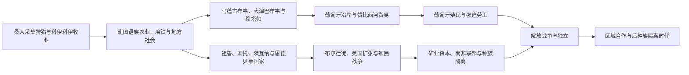

# 南部非洲历史

南部非洲历史包括科伊桑采集狩猎与牧业社会、班图语族农业扩散、马蓬古布韦和大津巴布韦等高原国家，以及祖鲁、索托、恩德贝莱等19世纪政权。葡萄牙、荷兰和英国殖民扩张、钻石黄金矿业与白人定居政权最终形成南非主导的区域劳工体系。

## 区域专题

- [马蓬古布韦、大津巴布韦与赞比西河国家](/%E4%BA%BA%E6%96%87%E7%A7%91%E5%AD%A6/%E5%8E%86%E5%8F%B2/%E9%9D%9E%E6%B4%B2/%E5%8D%97%E9%83%A8%E9%9D%9E%E6%B4%B2/%E9%A9%AC%E8%93%AC%E5%8F%A4%E5%B8%83%E9%9F%A6%E3%80%81%E5%A4%A7%E6%B4%A5%E5%B7%B4%E5%B8%83%E9%9F%A6%E4%B8%8E%E8%B5%9E%E6%AF%94%E8%A5%BF%E6%B2%B3%E5%9B%BD%E5%AE%B6.md)
- [祖鲁、索托、茨瓦纳与十九世纪国家重组](/%E4%BA%BA%E6%96%87%E7%A7%91%E5%AD%A6/%E5%8E%86%E5%8F%B2/%E9%9D%9E%E6%B4%B2/%E5%8D%97%E9%83%A8%E9%9D%9E%E6%B4%B2/%E7%A5%96%E9%B2%81%E3%80%81%E7%B4%A2%E6%89%98%E3%80%81%E8%8C%A8%E7%93%A6%E7%BA%B3%E4%B8%8E%E5%8D%81%E4%B9%9D%E4%B8%96%E7%BA%AA%E5%9B%BD%E5%AE%B6%E9%87%8D%E7%BB%84.md)
- [定居殖民、矿业体系与南部非洲解放](/%E4%BA%BA%E6%96%87%E7%A7%91%E5%AD%A6/%E5%8E%86%E5%8F%B2/%E9%9D%9E%E6%B4%B2/%E5%8D%97%E9%83%A8%E9%9D%9E%E6%B4%B2/%E5%AE%9A%E5%B1%85%E6%AE%96%E6%B0%91%E3%80%81%E7%9F%BF%E4%B8%9A%E4%BD%93%E7%B3%BB%E4%B8%8E%E5%8D%97%E9%83%A8%E9%9D%9E%E6%B4%B2%E8%A7%A3%E6%94%BE.md)

## 国家入口

| 国家 | 入口 | 核心线索 |
|---|---|---|
| 马拉维 | [马拉维历史](/%E4%BA%BA%E6%96%87%E7%A7%91%E5%AD%A6/%E5%8E%86%E5%8F%B2/%E9%9D%9E%E6%B4%B2/%E5%8D%97%E9%83%A8%E9%9D%9E%E6%B4%B2/%E9%A9%AC%E6%8B%89%E7%BB%B4/README.md) | 马拉维王国、尼亚萨兰与独立 |
| 赞比亚 | [赞比亚历史](/%E4%BA%BA%E6%96%87%E7%A7%91%E5%AD%A6/%E5%8E%86%E5%8F%B2/%E9%9D%9E%E6%B4%B2/%E5%8D%97%E9%83%A8%E9%9D%9E%E6%B4%B2/%E8%B5%9E%E6%AF%94%E4%BA%9A/README.md) | 隆达—卢巴影响、北罗得西亚与铜矿国家 |
| 津巴布韦 | [津巴布韦历史](/%E4%BA%BA%E6%96%87%E7%A7%91%E5%AD%A6/%E5%8E%86%E5%8F%B2/%E9%9D%9E%E6%B4%B2/%E5%8D%97%E9%83%A8%E9%9D%9E%E6%B4%B2/%E6%B4%A5%E5%B7%B4%E5%B8%83%E9%9F%A6/README.md) | 大津巴布韦、罗得西亚与解放战争 |
| 莫桑比克 | [莫桑比克历史](/%E4%BA%BA%E6%96%87%E7%A7%91%E5%AD%A6/%E5%8E%86%E5%8F%B2/%E9%9D%9E%E6%B4%B2/%E5%8D%97%E9%83%A8%E9%9D%9E%E6%B4%B2/%E8%8E%AB%E6%A1%91%E6%AF%94%E5%85%8B/README.md) | 斯瓦希里海岸、葡萄牙殖民、解放与内战 |
| 纳米比亚 | [纳米比亚历史](/%E4%BA%BA%E6%96%87%E7%A7%91%E5%AD%A6/%E5%8E%86%E5%8F%B2/%E9%9D%9E%E6%B4%B2/%E5%8D%97%E9%83%A8%E9%9D%9E%E6%B4%B2/%E7%BA%B3%E7%B1%B3%E6%AF%94%E4%BA%9A/README.md) | 德属西南非、赫雷罗—纳马战争与独立 |
| 博茨瓦纳 | [博茨瓦纳历史](/%E4%BA%BA%E6%96%87%E7%A7%91%E5%AD%A6/%E5%8E%86%E5%8F%B2/%E9%9D%9E%E6%B4%B2/%E5%8D%97%E9%83%A8%E9%9D%9E%E6%B4%B2/%E5%8D%9A%E8%8C%A8%E7%93%A6%E7%BA%B3/README.md) | 茨瓦纳酋邦、贝专纳保护国与共和国 |
| 南非 | [南非历史](/%E4%BA%BA%E6%96%87%E7%A7%91%E5%AD%A6/%E5%8E%86%E5%8F%B2/%E9%9D%9E%E6%B4%B2/%E5%8D%97%E9%83%A8%E9%9D%9E%E6%B4%B2/%E5%8D%97%E9%9D%9E/README.md) | 科伊桑、殖民定居、矿业、种族隔离与民主转型 |
| 莱索托 | [莱索托历史](/%E4%BA%BA%E6%96%87%E7%A7%91%E5%AD%A6/%E5%8E%86%E5%8F%B2/%E9%9D%9E%E6%B4%B2/%E5%8D%97%E9%83%A8%E9%9D%9E%E6%B4%B2/%E8%8E%B1%E7%B4%A2%E6%89%98/README.md) | 莫舒舒、巴苏陀王国与山地国家 |
| 斯威士兰 | [斯威士兰历史](/%E4%BA%BA%E6%96%87%E7%A7%91%E5%AD%A6/%E5%8E%86%E5%8F%B2/%E9%9D%9E%E6%B4%B2/%E5%8D%97%E9%83%A8%E9%9D%9E%E6%B4%B2/%E6%96%AF%E5%A8%81%E5%A3%AB%E5%85%B0/README.md) | 斯威士王国、英属保护与绝对君主制传统 |

## 组织说明

本目录按历史网络纳入马拉维、赞比亚、津巴布韦和莫桑比克；安哥拉放在[中非历史](/%E4%BA%BA%E6%96%87%E7%A7%91%E5%AD%A6/%E5%8E%86%E5%8F%B2/%E9%9D%9E%E6%B4%B2/%E4%B8%AD%E9%9D%9E/README.md)，但其解放战争属于同一南部非洲区域体系。

## 直接上级

- [撒哈拉以南非洲历史](/%E4%BA%BA%E6%96%87%E7%A7%91%E5%AD%A6/%E5%8E%86%E5%8F%B2/%E9%9D%9E%E6%B4%B2/README.md)
