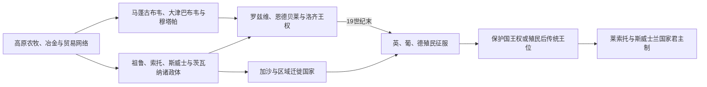

# 南部非洲王国、酋长国与殖民统治者表

## 口径与证据限制

本表按在位顺序列出南部非洲主要王权，摄政、复位、殖民后受限王位和并立继承均明确标注。口述传统中的早期年代用“约”；没有可靠王名的考古国家直接写明资料中断，不把遗址名称当作君主姓名。殖民后传统王位仍可具有文化或习惯法地位，但不等于国家元首。

## 王权演进

## 祖鲁王系

| 顺序 | 统治者 | 在位 | 继承、复位与关键事件 |
|---|---|---|---|
| 1 | 森赞加科纳 | 约1787—1816年 | 祖鲁尚为较小首领地 |
| 2 | 恰卡 | 1816—1828年 | 在姆特特瓦支持下继承，后扩张国家；被弟弟刺杀 |
| 3 | 丁冈 | 1828—1840年 | 参与刺杀后即位；被姆潘德—布尔联盟击败 |
| 4 | 姆潘德 | 1840—1872年 | 借布尔支持夺位；在位后期王子内战 |
| 5 | 塞奇瓦约 | 1872—1879年 | 英祖战争中被俘，王国被分割 |
| 5复 | 塞奇瓦约 | 1883—1884年 | 英国允许在受限领地复位，内战后受伤去世 |
| 6 | 迪尼祖鲁 | 1884—1913年 | 借布尔雇佣军争位；1887年后为殖民统治下受限王 |
| 7 | 所罗门·卡迪尼祖鲁 | 1913—1933年 | 南非联邦下传统王 |
| 摄政 | 王族摄政委员会 | 1933—1948年 | 继承人年幼与承认程序期间 |
| 8 | 西普里安·贝库祖鲁 | 1948—1968年 | 南非种族隔离体制下传统王 |
| 摄政 | 伊斯雷尔·麦克瓦伊泽尼王子 | 1968—1971年 | 继承人未成年 |
| 9 | 古德威尔·兹韦利蒂尼 | 1968年继承、1971—2021年亲政 | 夸祖鲁及后种族隔离时代传统王 |
| 摄政 | 曼特丰比·德拉米尼-祖鲁王后 | 2021年3—4月 | 遗嘱指定的短期摄政，任内去世 |
| 10 | 米苏祖鲁·卡兹韦利蒂尼 | 2021年至今 | 王族继承诉讼与国家承认曾有争议；不掌南非中央行政 |

1879年乌伦迪失守和1887年英国吞并是祖鲁国家主权终结的两个层次；后续王位是受殖民及南非宪法规范的传统王权。

## 巴苏陀—莱索托王系

| 顺序 | 统治者 | 在位 | 身份与关键事件 |
|---|---|---|---|
| 1 | 莫舒舒一世 | 约1822—1870年 | 建国者；1868年请求英国保护 |
| 2 | 莱齐耶一世 | 1870—1891年 | 高级首领，保护下继承 |
| 3 | 莱罗托利 | 1891—1905年 | 最高首领 |
| 4 | 莱齐耶二世 | 1905—1913年 | 最高首领 |
| 5 | 格里菲思·莱罗托利 | 1913—1939年 | 最高首领 |
| 6 | 西伊索·格里菲思 | 1939—1940年 | 任内去世 |
| 摄政 | 曼采博·阿梅莉娅·马察巴 | 1941—1960年 | 为年幼继承人摄政 |
| 7 | 莫舒舒二世 | 1960—1970年 | 先为最高首领，1966年成为国王；1970年流亡 |
| 摄政 | 马莫哈托王太后 | 1970年 | 国王流亡期间摄政 |
| 7复 | 莫舒舒二世 | 1970—1990年 | 复位；与军政府冲突后被废 |
| 8 | 莱齐耶三世 | 1990—1995年 | 首次即位，后让位给父亲 |
| 7再复 | 莫舒舒二世 | 1995—1996年 | 第二次复位，车祸去世 |
| 8复 | 莱齐耶三世 | 1996年至今 | 第二次即位，现为宪政礼仪元首 |

王权在1868年后受英国保护，1966年才成为独立国家君主；现代政府首脑另见[南部非洲独立国家元首与权力结构表](/%E4%BA%BA%E6%96%87%E7%A7%91%E5%AD%A6/%E5%8E%86%E5%8F%B2/%E9%9D%9E%E6%B4%B2/%E5%8D%97%E9%83%A8%E9%9D%9E%E6%B4%B2/%E5%8D%97%E9%83%A8%E9%9D%9E%E6%B4%B2%E7%8B%AC%E7%AB%8B%E5%9B%BD%E5%AE%B6%E5%85%83%E9%A6%96%E4%B8%8E%E6%9D%83%E5%8A%9B%E7%BB%93%E6%9E%84%E8%A1%A8.md)。

## 斯威士德拉米尼王系

| 顺序 | 国王或摄政 | 在位 | 说明 |
|---|---|---|---|
| 1 | 恩格瓦内三世 | 约1745—1780年 | 常被视为现代斯威士王国奠基者 |
| 2 | 恩德武贡耶 | 约1780—1815年 | 扩展德拉米尼统治 |
| 3 | 索布扎一世 | 约1815—1836年 | 在地区重组中巩固国家 |
| 摄政 | 洛吉巴·西梅拉内王太后 | 1836—1840年 | 为年幼继承人摄政 |
| 4 | 姆斯瓦蒂二世 | 1840—1868年 | 国家扩张，斯威士名称与其统治相连 |
| 摄政 | 赞齐莱·恩德万德韦王太后 | 1868—1875年 | 王位安排期摄政 |
| 5 | 姆班泽尼 | 1875—1889年 | 大量土地与矿权特许造成主权危机 |
| 摄政 | 蒂巴蒂·恩坎布勒王太后 | 1889—1894年 | 继承人未成年 |
| 6 | 恩格瓦内五世 | 1895—1899年 | 年轻国王，任内去世 |
| 摄政 | 拉博齐贝尼·姆德卢利王太后 | 1899—1921年 | 南非共和国和英国统治转换期间摄政 |
| 7 | 索布扎二世 | 1921—1982年 | 1899年继承、1921年亲政；1968年独立后仍在位 |
| 摄政 | 泽莉韦·肖维萨王太后 | 1982—1983年 | 王族权争中被替换 |
| 摄政 | 恩通比王太后 | 1983—1986年 | 主持继承；亲政后仍为共同传统元首 |
| 8 | 姆斯瓦蒂三世 | 1986年至今 | 国王兼实际最高政治权力 |

斯威士继承不是简单父子长子制。王族选择特定王后之子，王太后和王族会议在王位空缺时具有决定作用。

## 恩德贝莱与加沙迁徙国家

### 恩德贝莱

| 顺序 | 统治者或机构 | 在位 | 说明 |
|---|---|---|---|
| 1 | 姆齐利卡齐 | 约1823—1868年 | 离开祖鲁体系后迁徙建国 |
| 摄政／王族委员会 | 继承争议 | 1868—1870年 | 部分集团等待失踪王子恩库曼内，王位空缺 |
| 2 | 洛本古拉 | 1870—1894年 | 1893年公司军征服后出逃，翌年去世 |

此后恩德贝莱传统王位出现复兴主张，但没有连续、普遍承认的主权君主序列，不能把现代文化领袖倒接成国家国王。

### 加沙

| 顺序 | 统治者 | 在位 | 说明 |
|---|---|---|---|
| 1 | 索尚加内 | 约1825—1858年 | 恩德万德韦相关集团北迁建国 |
| 2 | 马韦韦 | 1858—1861年 | 继承战争一方 |
| 3 | 姆齐拉 | 1861—1884年 | 在葡萄牙支持下击败马韦韦 |
| 4 | 贡贡哈纳 | 1884—1895年 | 葡军攻破曼贾卡泽后被俘流放 |
| 候选 | 戈迪德王子 | 1895年 | 被俘继承人，未建立稳定统治，不计正式国王 |

## 洛齐／巴罗策利通加

早期口述年代不能精确，但王名顺序较稳定。科洛洛征服期必须与洛齐王系分列。

| 顺序 | 统治者 | 约在位 | 说明 |
|---|---|---|---|
| 1 | 姆布 | 传统早期 | 建国祖先之一，年代不详 |
| 2 | 因扬博 | 年代不详 | 口述次序 |
| 3 | 耶塔一世 | 年代不详 | 口述次序 |
| 4 | 恩加拉马 | 年代不详 | 口述次序 |
| 5 | 耶塔·纳卢特 | 年代不详 | 口述次序 |
| 6 | 恩贡巴拉 | 年代不详 | 口述次序 |
| 7 | 尤布亚 | 年代不详 | 口述次序 |
| 8 | 姆瓦纳维纳一世 | 年代不详 | 口述次序 |
| 9 | 姆瓦纳扬达·利瓦莱 | 约18世纪 | 口述次序 |
| 10 | 穆兰布瓦·桑图卢 | 约1780—1830年 | 常视为前殖民鼎盛统治者 |
| 11 | 西卢梅卢梅 | 约1830年 | 短期继承 |
| 12 | 姆布克瓦努 | 约1830—1838年 | 科洛洛入侵前在位 |
| 征服 | 塞贝特瓦内 | 科洛洛统治，约1838—1851年 | 征服者，不属洛齐王系 |
| 征服 | 马莫奇萨内 | 科洛洛统治，1851年 | 塞贝特瓦内之女，短期让位 |
| 征服 | 塞克莱图 | 科洛洛统治，1851—1863年 | 在位后期国家分裂 |
| 征服 | 姆博洛洛 | 科洛洛统治，1863—1864年 | 被洛齐复国运动推翻 |
| 13 | 西波帕·卢坦古 | 1864—1876年 | 洛齐王系复辟 |
| 14 | 姆瓦纳维纳二世 | 1876—1878年 | 短期在位 |
| 15 | 卢博西／莱瓦尼卡一世 | 1878—1884年 | 第一任期 |
| 16 | 阿库富纳 | 1884—1885年 | 政变后短期在位 |
| 15复 | 莱瓦尼卡一世 | 1885—1916年 | 复位；与英属南非公司订立争议特许 |
| 17 | 耶塔三世 | 1916—1945年 | 英国保护下利通加 |
| 18 | 伊米维科 | 1945—1948年 | 短期在位 |
| 19 | 姆瓦纳维纳三世 | 1948—1968年 | 北罗得西亚末期及赞比亚独立初期 |
| 20 | 姆比库西塔·莱瓦尼卡二世 | 1968—1977年 | 传统王 |
| 21 | 伊卢特·耶塔四世 | 1977—2000年 | 传统王 |
| 22 | 卢博西·伊米维科二世 | 2000年至今 | 传统王，不是赞比亚国家元首 |

## 穆塔帕、罗兹维与考古国家

### 穆塔帕可辨认主线

姓名拼写和编号因葡萄牙文献与绍纳传统而异，若干时期有葡萄牙扶植者与本地支持者并立。

| 顺序 | 姆韦内穆塔帕 | 约在位 | 说明 |
|---|---|---|---|
| 1 | 尼亚钦巴·穆托塔 | 约1430—1450年 | 建国传统核心 |
| 2 | 马托佩·尼扬赫赫韦·内贝扎 | 约1450—1480年 | 扩张至鼎盛 |
| 3 | 马武拉·马奥布韦 | 约1480年 | 短期继承 |
| 4 | 穆科姆贝罗·尼亚胡马 | 约1480—1490年 | 王位争夺期 |
| 5 | 昌加米雷 | 约1490—1494年 | 统治者名后成为地区王号 |
| 6 | 卡库约·科穆尼亚卡 | 约1494—1530年 | 次序有争议 |
| 7 | 内尚圭·穆嫩比雷 | 约1530—1550年 | 葡萄牙接触扩大 |
| 8 | 奇韦雷·尼亚索罗 | 约1550—1560年 | 在位年约数 |
| 9 | 内戈莫·奇里萨姆胡鲁 | 约1560—1589年 | 长期统治 |
| 10 | 加齐·鲁塞雷 | 约1589—1623年 | 与葡萄牙关系加深 |
| 11 | 尼扬布·卡帕拉里泽 | 1623—1629年 | 被葡萄牙击败 |
| 12 | 马武拉·姆汉德／费利佩 | 1629—1652年 | 葡萄牙支持即位 |
| 13 | 西蒂·卡祖鲁卡穆萨帕 | 1652—1663年 | 王位冲突 |
| 14 | 卡姆哈拉帕苏·穆孔布韦 | 1663—1692年 | 后期重要统治者 |
| 并立 | 尼亚卡姆比拉、尼亚曼德·姆汉德等 | 17世纪末 | 多中心争位，年份和控制区冲突 |
| 15 | 尼亚梅恩德·姆汉德 | 约1694—1707年 | 与罗兹维、葡萄牙势力竞争 |
| — | 18—19世纪多个穆塔帕支系 | 年代与次序不一 | 王号继续但主权范围收缩；各支系资料不足，不能合并成单线 |
| 末段 | 奇奥科·丹达等地方穆塔帕支系 | 至约1902年 | 葡萄牙最终军事控制赞比西南岸残余政权 |

### 罗兹维昌加米雷

| 顺序 | 统治者 | 约在位 | 说明 |
|---|---|---|---|
| 1 | 昌加米雷·多姆博 | 约1684—1695年 | 驱逐高原部分葡萄牙势力，建立罗兹维强权 |
| 2 | 继任昌加米雷姓名和次序多有冲突 | 18世纪 | “昌加米雷”是重复王号，文献无法稳定对应每一代 |
| 末代核心 | 奇里萨姆胡鲁支系统治者 | 19世纪初—1830年代 | 恩戈尼、科洛洛和恩德贝莱迁徙战争中瓦解 |

大津巴布韦和马蓬古布韦没有可由考古材料确认的国王姓名。把“莫诺莫塔帕”或现代绍纳姓氏倒填为遗址君主会制造伪史。

## 茨瓦纳诸科西：为何不能合并一表

| 政体 | 19—20世纪主要统治序列 | 说明 |
|---|---|---|
| 恩瓦托 | 塞科马一世 → 马查迪摄政／王位竞争 → 卡马三世 → 塞科马二世 → 策凯迪摄政 → 塞雷茨·卡马 | 塞雷茨与英国的婚姻冲突使其一度被放逐；独立后成为总统而非世袭国王 |
| 夸纳 | 塞切莱一世 → 塞贝莱一世 → 塞贝莱二世 → 后续科西 | 科特拉议事和王族承认制约科西 |
| 恩瓦凯采 | 加塞伊茨韦 → 巴托恩一世 → 巴托恩二世 → 后续科西 | 1895年巴托恩一世与卡马、塞贝莱赴英 |
| 塔瓦纳 | 莱特绍拉等19世纪科西 → 莫雷米诸继承者 | 奥卡万戈地区独立世系 |

上述各系彼此并立。“博茨瓦纳国王”并不存在；独立后国家元首由宪法产生，酋长院只具咨询地位。

## 贝姆巴、马拉维与奥万博等多支王号

| 王权 | 序列处理 | 证据说明 |
|---|---|---|
| 贝姆巴奇蒂穆库 | 以奇蒂穆库为重复王号，另有蒙巴、恩库拉等高级首领 | 母系王族和多宫廷使殖民文献常把职位名当个人名，需在贝姆巴专页按王号分支维护 |
| 马拉维卡隆加 | 早期卡隆加王号延续于多个分支 | 15—17世纪的口述世代不能与单一公历连续表精确对应 |
| 卡泽姆贝 | 参见洛齐以北的隆达迁徙王权 | 重复王号与支系并立，不等同赞比亚国家元首 |
| 奥万博诸王国 | 昂东加、乌库安亚马等各有独立国王／首领 | 不是一个“奥万博王朝”；殖民边界又把部分王国分入安哥拉 |
| 赫雷罗、纳马 | 多个最高首领和地方支系并立 | 马赫雷罗、萨穆埃尔·马赫雷罗、亨德里克·维特布伊等是特定政治体领袖，非全纳米比亚国王 |

## 殖民行政与实际权力

| 殖民阶段 | 法定最高权力 | 实际地方结构 | 直接终结 |
|---|---|---|---|
| 开普、纳塔尔与两布尔共和国 | 英国总督／殖民首相；布尔共和国国家总统 | 定居者议会、突击队、传统首领与矿业资本 | 1902年南非战争后英方统一，1910年组成联邦 |
| 贝专纳、巴苏陀兰、斯威士兰保护国 | 英国高级专员与驻地专员 | 科西／国王保留习惯法、土地及地方法院 | 分别于1966、1966、1968年独立 |
| 南罗得西亚 | 英属南非公司管理人，1923年后总督与自治殖民政府 | 白人议会、土地委员会和公司矿业网络 | 1965年单方面独立未获承认；1979—1980年英国总督过渡后独立 |
| 北罗得西亚、尼亚萨兰 | 英国总督 | 地区行政官、矿业／庄园公司和传统首领 | 联邦1963年解体，1964年分别独立 |
| 德属西南非洲及南非占领 | 德国总督；1915年后南非行政长官 | 殖民军、定居农场、保留地和合同劳工体系 | 联合国过渡监督后1990年纳米比亚独立 |
| 葡属莫桑比克 | 葡萄牙总督／总督长 | 特许公司、普拉佐领主、区行政官和强迫劳动中介 | 解放战争与葡萄牙革命后1975年独立 |

殖民行政首长常短期轮换，完整人名表需按特定殖民地和任期另建；这里先把君主、传统首领、总督、公司和政府首脑的权力层级分开。
