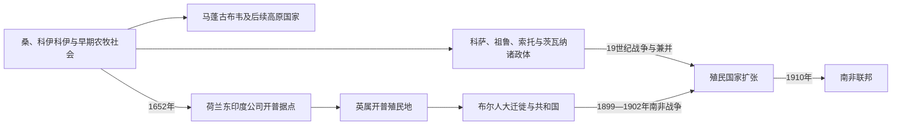

# 南非的前殖民社会与殖民统治

## 时间

史前时期—1910年

## 概括

南非拥有极重要的早期人类遗址。桑人采集狩猎、科伊科伊牧业和班图语族农业冶铁社会长期互动；北部马蓬古布韦参与印度洋黄金贸易，东部和高原后来形成科萨、祖鲁、索托、茨瓦纳等国家。欧洲定居殖民使土地、劳工和种族秩序发生根本变化。

## 演进图

## 社会形成、征服与殖民国家

- 南非史前和前殖民社会不是“无人地带”。桑人狩猎采集网络、科伊科伊人牧社会和约公元一千纪以来的班图语农牧—冶铁村落在不同生态区交错；土地、水源、牛群与贸易关系持续变化。
- 马蓬古布韦约13世纪借林波波河农业、黄金和印度洋贸易形成分层王权，后续人口与商业中心北移至大津巴布韦。南非东南部的科萨、祖鲁，内陆的索托、茨瓦纳和佩迪等则各有王族、议事会和年龄团制度，不能视为欧洲到来后才出现。
- 荷兰东印度公司1652年建立补给站，通过自由市民农场、奴隶输入和突击队扩张。科伊科伊人口受战争、天花和土地丧失重创，逃奴、欧洲移民、亚洲与非洲奴隶后裔共同形成开普复杂社会。
- 英国1806年永久占领开普，废奴、法律变化与土地竞争推动部分布尔人1830年代“大迁徙”。他们建立纳塔利亚、德兰士瓦和奥兰治自由邦，同时与恩德贝莱、祖鲁、索托、茨瓦纳等发生战争；所谓“空地”是为占地服务的殖民神话。
- 钻石和黄金发现把区域从定居边疆变为工业矿业中心。英国为控制矿产、铁路与关税先后吞并非洲王国并与布尔共和国开战；1902年《弗里尼欣和约》结束南非战争，1910年白人政体合并为联邦，黑人、科尔德人与印度裔多数被排除于国家建构。

主要王权完整顺序、复位及殖民主权转换见[南部非洲王国、酋长国与殖民统治者表](/%E4%BA%BA%E6%96%87%E7%A7%91%E5%AD%A6/%E5%8E%86%E5%8F%B2/%E9%9D%9E%E6%B4%B2/%E5%8D%97%E9%83%A8%E9%9D%9E%E6%B4%B2/%E5%8D%97%E9%83%A8%E9%9D%9E%E6%B4%B2%E7%8E%8B%E5%9B%BD%E3%80%81%E9%85%8B%E9%95%BF%E5%9B%BD%E4%B8%8E%E6%AE%96%E6%B0%91%E7%BB%9F%E6%B2%BB%E8%80%85%E8%A1%A8.md)。

## 主要社会与政权

| 社会或政权 | 大致时期 | 特征 |
|---|---|---|
| 桑人与科伊科伊社会 | 长期存在 | 采集狩猎、牧业和开普生态网络 |
| 马蓬古布韦 | 约11—13世纪 | 黄金贸易与早期阶层化国家 |
| 科萨诸国 | 约16—19世纪 | 东开普牛牧农业与殖民边疆战争 |
| 祖鲁王国 | 19世纪初以后 | 恰卡改革、年龄团军队和中央王权 |
| 巴苏陀、茨瓦纳等国家 | 19世纪 | 山地防御、城镇酋邦与区域贸易 |

## 殖民统治

荷兰东印度公司1652年建立开普站，定居者夺取科伊科伊土地并输入亚洲、非洲奴隶。英国1795年、1806年控制开普，废奴和边疆政策推动部分布尔人1830年代大迁徙。钻石和黄金使英国决心统一地区，南非战争后于1910年建立排除黑人多数政治权的南非联邦。

## 重要事件

- 1652年扬·范里贝克建立开普补给站。
- 1779—1879年开普殖民者与科萨诸国发生一系列边疆战争。
- 1830年代布尔人大迁徙建立纳塔利亚、奥兰治和德兰士瓦政权。
- 1867年钻石、1886年黄金发现引发矿业革命。
- 1879年英祖战争中祖鲁先胜于伊散德尔瓦纳，后被征服。
- 1899—1902年南非战争后英国击败布尔共和国。

## 演变关系

殖民土地、劳工和行政制度直接影响[南非的独立建国与现代发展](/%E4%BA%BA%E6%96%87%E7%A7%91%E5%AD%A6/%E5%8E%86%E5%8F%B2/%E9%9D%9E%E6%B4%B2/%E5%8D%97%E9%83%A8%E9%9D%9E%E6%B4%B2/%E5%8D%97%E9%9D%9E/%E7%8B%AC%E7%AB%8B%E5%BB%BA%E5%9B%BD%E4%B8%8E%E7%8E%B0%E4%BB%A3%E5%8F%91%E5%B1%95.md)。
