# 定居殖民、矿业体系与南部非洲解放

## 时间

1652年—2026年7月14日

## 概括

南部非洲的殖民秩序由三种相互嵌套的力量塑造：开普及罗得西亚的欧洲定居扩张、南非金刚石—黄金工业形成的跨境矿业劳工体系，以及葡萄牙、德国和英国对内陆与海岸的帝国分割。土地剥夺、税收、通行证、劳工招募、种族化公民权和公司统治把农村家庭、酋长领地、矿山与港口连接成不平等的区域经济。

反殖民斗争也因此跨越国界。赞比亚、坦桑尼亚、博茨瓦纳、安哥拉和莫桑比克等“前线国家”为津巴布韦、纳米比亚和南非解放组织提供后方，同时承受罗得西亚和南非的军事袭击、经济封锁及代理战争。1990年纳米比亚独立和1994年南非首次不分种族全国选举标志白人少数政权终结，却没有自动消除土地、矿产所有权、空间隔离和移工制度的遗产。

## 演进图

```mermaid
flowchart LR
    VOC["1652 开普荷兰公司据点"] --> Cape["开普定居殖民与奴隶制"]
    Cape --> British["1806后英国开普统治"]
    British --> Trek["1830年代布尔人大迁徙"]
    Trek --> Boer["布尔共和国与非洲国家战争"]
    Diamond["1867 金刚石"] --> Minerals["矿业革命与跨境移工体系"]
    Gold["1886 黄金"] --> Minerals
    Boer --> War["1899—1902 南非战争"]
    War --> Union["1910 南非联邦"]
    Partition["1880年代帝国分割<br/>英／德／葡／公司统治"] --> Colonial["区域殖民国家"]
    Union --> Apartheid["1948—1994 种族隔离政权"]
    Colonial --> Nationalism["工会、民族主义与武装解放"]
    Apartheid --> Frontline["前线国家与跨境战争"]
    Nationalism --> Frontline
    Frontline --> Independence["1975—1990 安哥拉、莫桑比克、津巴布韦、纳米比亚独立"]
    Apartheid -->|1994 民主转型| Post["后种族隔离南部非洲"]
    Independence --> SADC["1980 SADCC／1992 SADC"]
    SADC --> Post
    Post --> Legacy["土地、矿业、移工、不平等与安全挑战<br/>截至2026年7月"]
```

## 一、开普定居殖民的形成

1652年，荷兰东印度公司在桌湾建立补给站，最初目标是为往返亚洲船只供应食物。公司很快允许部分雇员成为“自由市民”，农牧场向开普半岛和内陆扩展。1659—1660年及1670年代的科伊科伊—荷兰冲突以土地、牲畜和水源为核心；天花等疫病、债务依附和殖民武装进一步破坏科伊科伊人的自主。公司又从印度洋、东南亚和非洲其他地区输入奴隶，使开普社会从建立之初就同时具有定居殖民和奴隶社会特征。

边疆农民以机动畜牧和突击队制度推进，对桑人实施长期暴力并夺取土地。英国1795年占领开普，1803年短暂归还巴达维亚共和国，1806年再度占领。英国废止奴隶贸易、推行英语行政并于1834年实施奴隶解放；补偿方式、劳工控制和东部边疆战争加重荷兰语定居者不满。1830年代起约数以万计的布尔迁徙者离开开普，在内陆建立纳塔利亚、奥兰治自由邦和南非共和国等政治体，并与祖鲁、恩德贝莱、巴苏陀、佩迪和茨瓦纳诸国争夺土地和劳动力。

殖民边疆不是欧洲人进入“空地”。人口迁徙与战争确实改变聚落，但非洲首领、难民群体、格里夸和科拉纳社群、传教站与定居者长期交错。条约常在语言、主权观念和武力极不对等的条件下签订，后来又被殖民政府用作固定边界和私人土地所有权的依据。

## 二、帝国分割与殖民统治结构

| 殖民单元 | 主要统治机构 | 控制机制 | 长期影响 |
|---|---|---|---|
| 开普、纳塔尔及1910年后的南非联邦 | 英国总督、殖民议会；联邦成立后由白人选举政府主导 | 土地法、种族化选举权、通行证、警察和地方酋长行政 | 建成地区最强国家与工业中心，也制度化白人少数权力 |
| 奥兰治自由邦、南非共和国 | 布尔共和国总统、议会和地方突击队 | 农场占地、附庸劳工、种族化公民权 | 1902年战败后并入英国体系，其精英在联邦和种族隔离国家再度掌权 |
| 南罗得西亚、北罗得西亚、尼亚萨兰 | 英属南非公司，后改由英国殖民官僚；南罗得西亚有白人自治政府 | 公司特许、土地划分、屋税、矿权与间接统治 | 形成津巴布韦、赞比亚、马拉维三国边界和不均衡经济 |
| 贝专纳、巴苏陀兰、斯威士兰 | 英国驻地专员和高级专员，地方王权／酋长并存 | 对外权与财政受控，保留部分传统土地和首领机构 | 避免被南非完全吞并，但经济高度依赖南非 |
| 德属西南非及南非托管时期 | 德国殖民政府；第一次世界大战后由南非管理 | 定居占地、军事镇压、劳工控制，后延伸南非种族隔离法制 | 赫雷罗和纳马人口灾难、土地不平等与长期独立斗争 |
| 葡属莫桑比克、安哥拉 | 总督、地方行政官、特许公司、种植园和商贸网络 | 强迫劳工、税收、特许公司、同化身份和警察军事统治 | 农村劳力外流、地区差距及1975年后国家能力不足 |
| 南非控制下的西南非 | 南非行政官与地方种族化管理机构 | 保留地、合同劳工、警察和军事占领 | 使纳米比亚解放与南非区域战争直接相连 |

殖民统治并不完全相同：保护国保留王权空间，南罗得西亚形成自治的白人定居政权，葡萄牙在广阔乡村往往依靠地方中介和强迫劳工，南非则发展出工业化而严密的种族国家。共同点是以领土边界、土地登记、税收和强制力重新定义人口与资源。

## 三、矿业革命与区域劳工体系

1867年前后金伯利地区发现钻石，1886年威特沃特斯兰德发现金矿。深层金矿需要巨额资本、机械、炸药和稳定劳动力，矿业公司遂合并为大型企业，并与国家共同塑造低工资黑人移工制度。

### 运作机制

1. **土地和税收压力**：土地剥夺、屋税与现金税迫使农村家庭进入工资市场，但家庭仍在乡村承担劳动力再生产成本。
2. **合同招募**：招工机构从莫桑比克、马拉维、莱索托、斯威士兰、贝专纳、北罗得西亚及南非保留地招募男性，合同期结束后遣返。
3. **矿山大院**：封闭式宿舍、通行证和警察限制工人流动；技术岗位、工资和工会资格按种族分层。
4. **区域交通**：铁路优先连接矿区、种植园和港口，强化内陆经济对南非、罗得西亚及莫桑比克港口的依赖。
5. **酋长与殖民官合作**：部分地方首领、税务官和劳工经纪参与招募，国家并非只在边境控制移民。
6. **家庭与性别分工**：成年男性长期外出，妇女和老人承担农业、抚养和地方社会再生产，造成持续的家庭分离。

矿业资本的崛起推动英国兼并金刚石区、围绕德兰士瓦黄金资源的帝国竞争，并为南非战争提供结构背景。1899—1902年战争中，英国以焦土政策和集中营摧毁布尔共和国的农业与补给；非洲人既被征用为劳工、侦察员和士兵，也遭流离和营地死亡。1902年英国获胜后与布尔精英和解，1910年建立南非联邦，却把绝大多数黑人排除在全国政治之外。

## 四、土地法、白人少数统治与种族隔离

1913年《原住民土地法》把非洲人可合法拥有或租用的土地限制在狭小区域，随后保留地有所扩大，但仍远低于人口比例。城市管理、矿山颜色线、通行证和劳工法在1948年前已经形成；国民党上台后将这些做法整合为“种族隔离”。

| 制度领域 | 关键措施 | 实际作用 |
|---|---|---|
| 身份分类 | 1950年人口登记等法律 | 把居民强制划分为种族类别，决定居住、教育、工作和婚姻权利 |
| 空间隔离 | 集团住区法、强迫迁移、保留地与“班图斯坦” | 清除被划为“白人区”的非白人社区，把黑人政治权利转移到缺乏主权的家园 |
| 劳工控制 | 通行证、合同、岗位保留和工会限制 | 保持矿业、农业和城市服务的廉价且可驱逐劳动力 |
| 政治排除 | 取消有限非白人选举权，镇压组织与集会 | 白人议会垄断中央权力，黑人代表机构无实权 |
| 教育和社会服务 | 班图教育及分离的医疗、交通和公共设施 | 以不平等财政塑造代际技能和财富差距 |
| 地区安全 | 占领纳米比亚、扶持代理武装、跨境袭击 | 把国内少数统治的生存与周边战争相连接 |

1952年反抗不公正法运动、1955年《自由宪章》、1960年沙佩维尔惨案和非国大／泛非主义者大会遭禁，标志群众抗争与国家镇压升级。非国大“民族之矛”、泛非主义者大会“波戈”及纳米比亚西南非洲人民组织等转向武装斗争。1976年索韦托学生起义、工会复兴、黑人民权意识运动与1980年代城镇起义使国家治理成本上升；国际制裁、撤资、文化抵制和冷战格局变化进一步挤压政权。

1989年德克勒克政府开始拆除部分控制，1990年释放纳尔逊·曼德拉并解禁主要组织。谈判伴随夸祖鲁—纳塔尔和城镇暴力、右翼破坏及权力分享争议。1994年4月举行首次不分种族全国选举，非国大获胜，临时宪法和后来的1996年宪法建立多党、权利法案和独立司法框架。

## 五、民族主义、武装解放与跨境战争

### 早期独立与前线国家

第二次世界大战后，城市工人、退伍军人、教会、农民协会和受教育精英推动民族主义。马拉维和赞比亚于1964年独立，博茨瓦纳和莱索托于1966年独立，斯威士兰于1968年独立。坦桑尼亚、赞比亚、博茨瓦纳以及后来的安哥拉、莫桑比克、津巴布韦构成“前线国家”协作网络，为未独立地区的解放组织提供外交、训练、难民安置和交通支持。

这些国家并非同一阵营：马拉维一度与南非保持密切关系，博茨瓦纳在支持解放和避免遭军事摧毁之间谨慎平衡，安哥拉与莫桑比克又卷入国内武装冲突。所谓“前线”是一种政治协调机制，不是统一军事指挥部。

### 葡萄牙殖民地

安哥拉民族解放战争自1961年全面升级，人民解放运动、民族解放阵线和争取彻底独立全国联盟既反殖民又彼此竞争。1974年葡萄牙“康乃馨革命”推翻独裁政权后，去殖民突然加速；1975年安哥拉独立，三方冲突在古巴、南非、美国和苏联等外力介入下转为长期内战，直至2002年主要战事结束。

莫桑比克解放阵线1964年在北部发动武装斗争，1974年停火，1975年独立。新政府实行一党社会主义和国有化，葡萄牙技术人员大量离境，行政与经济骤变。罗得西亚和南非支持莫桑比克全国抵抗运动，政府亦依赖外援，1977—1992年内战造成大规模死亡、流离和基础设施破坏。1992年罗马和平协议结束主要战争，后续政治军事危机经2019年和平安排进一步缓和。

### 罗得西亚与津巴布韦

1953—1963年罗得西亚与尼亚萨兰联邦试图把南罗得西亚白人政治和铜带经济结合，遭非洲民族主义反对而解体。1965年，伊恩·史密斯政府单方面宣布独立，意图阻止多数统治。津巴布韦非洲人民联盟及其军队、津巴布韦非洲民族联盟及其军队从赞比亚和莫桑比克等后方展开游击战；罗得西亚军队实施跨境袭击。

1979年兰开斯特宫协议规定停火、英方短暂接管和多数选举。1980年4月津巴布韦独立。独立终结白人少数政权，却留下土地分配、两支解放军整合和政党竞争问题；1980年代古库拉洪迪暴力又显示“解放胜利”并不等于内部包容自动实现。

### 纳米比亚、安哥拉战场与地区和解

第一次世界大战后，南非以国际联盟委任统治西南非，并逐步延伸种族隔离。联合国1966年终止南非委任统治；西南非洲人民组织的武装斗争同年进入新阶段。安哥拉1975年独立后成为西南非洲人民组织的重要后方，也成为南非、安哥拉政府、古巴军队与安盟交战的地区战场。

1988年纽约协议把古巴分阶段撤军、安哥拉—南非停火和执行联合国安理会第435号决议联系起来。联合国过渡时期援助团1989年监督停火、部队集结、遣返和制宪选举；纳米比亚于1990年3月21日独立。这一结果来自数十年纳米比亚动员、地区战争、外交谈判和国际监督的结合，不能只归因于单场战役或冷战结束。

## 重要事件与时间节点

| 时间 | 事件 | 影响 |
|---|---|---|
| 1652年 | 荷兰东印度公司建立开普据点 | 定居扩张、奴隶输入和土地冲突开始制度化 |
| 1795、1806年 | 英国两度占领并最终控制开普 | 开普纳入英国帝国和印度洋战略 |
| 1834—1830年代末 | 奴隶解放与布尔人大迁徙 | 劳工关系重组，定居扩张深入内陆 |
| 1867、1886年 | 金刚石与黄金发现 | 南非成为工业矿业中心，跨境移工体系扩展 |
| 1884—1885年 | 德国、英国、葡萄牙及公司加速领土分割 | 现代殖民边界和不同统治模式定型 |
| 1899—1902年 | 南非战争 | 布尔共和国被英国征服，为1910年联邦铺路 |
| 1904—1908年 | 德属西南非对赫雷罗和纳马的灭绝性战争 | 人口灾难、土地掠夺与纳米比亚长期记忆 |
| 1910年 | 南非联邦成立 | 白人英布和解与黑人全国政治排除结合 |
| 1913年 | 《原住民土地法》 | 土地隔离成为矿业劳工和种族国家基础 |
| 1948年 | 国民党上台 | 法定种族隔离全面化 |
| 1960年 | 沙佩维尔惨案、解放组织遭禁 | 地下活动、流亡和武装斗争扩大 |
| 1964—1968年 | 马拉维、赞比亚、博茨瓦纳、莱索托、斯威士兰独立 | 前线国家和保护国后继国家格局形成 |
| 1965年 | 南罗得西亚单方面宣布独立 | 国际制裁与解放战争升级 |
| 1974—1975年 | 葡萄牙革命；安哥拉、莫桑比克独立 | 殖民统治结束，冷战代理战争扩大 |
| 1976年 | 索韦托起义 | 南非国内群众抗争和国际声援出现新高潮 |
| 1980年 | 津巴布韦独立；南部非洲发展协调会议成立 | 白人统治空间缩小，区域经济解放进入制度合作 |
| 1988—1990年 | 纽约协议、联合国过渡行动、纳米比亚独立 | 南非对西南非的统治结束 |
| 1990—1994年 | 南非解禁组织、谈判与首次全民选举 | 种族隔离国家转型为宪政民主 |
| 1992年 | 南部非洲发展协调会议改组为南部非洲发展共同体；莫桑比克和平协议 | 区域任务由解放协调转向发展、安全和一体化 |
| 2002年 | 安哥拉主要内战结束 | 地区最大冷战遗留战争之一终结 |
| 2017年后 | 莫桑比克德尔加杜角叛乱 | 资源开发、地方排斥和跨国圣战网络形成新安全危机 |
| 2021—2024年 | 南共体驻莫桑比克特派团部署后撤出 | 地区部队帮助收复部分地区，但冲突未根除 |
| 截至2026年7月 | 德尔加杜角仍有袭击、流离与返乡重建并存 | 显示区域解放后的国家整合和安全治理仍未完成 |

## 解放运动、国家与实际权力结构

| 地区／阶段 | 名义或正式机构 | 实际权力与主要参与者 | 关键矛盾 |
|---|---|---|---|
| 白人南罗得西亚 | 总理、白人议会与安全部队 | 罗得西亚阵线、军警、农场与商业精英 | 以少数选举体制阻止多数统治 |
| 葡属安哥拉、莫桑比克 | 葡萄牙总督与殖民军 | 殖民行政、特许公司、定居者和地方中介 | 强迫劳工、土地、种族身份与反殖民战争 |
| 南非种族隔离时期 | 总统／总理、白人议会 | 国民党、军警、安全机构、矿业资本；“班图斯坦”政府缺乏主权 | 国内统治与区域军事化相互支撑 |
| 前线国家 | 各国政府与首脑会议 | 坦桑尼亚、赞比亚、博茨瓦纳、安哥拉、莫桑比克、津巴布韦等按时期协作 | 支持解放与本国安全、经济依赖之间的张力 |
| 纳米比亚过渡 | 联合国特别代表、制宪会议 | 联合国过渡团、南非行政、SWAPO及其他政党 | 停火执行、难民回归、自由选举和部队撤离 |
| 南非民主过渡 | 多党谈判机构、临时行政安排 | 非国大、国民党、因卡塔、社会运动、工会、商界和安全机构 | 多数统治、宪法保障、暴力控制和经济连续性 |

## 白人少数体系为何崛起、衰落并终结

| 因果层次 | 形成与维持 | 衰落与终结 |
|---|---|---|
| 结构因素 | 土地占有、矿业资本、铁路港口、廉价移工和税收国家互相支持 | 城市化使黑人劳工不可被永久隔离；教育、工会和群众组织扩大 |
| 制度因素 | 种族化公民权、警察、通行证、地方首领行政和区域军事优势 | 法律合法性崩塌，治理成本和治安暴力上升，统治集团内部出现分歧 |
| 外部环境 | 英帝国支持、冷战反共合作和周边殖民地构成缓冲 | 周边国家独立、国际制裁与撤资、苏东变化及地区战争成本上升 |
| 直接触发 | 矿产繁荣、战争胜利和殖民合并使国家能力增强 | 1980年代经济与政治危机、1988年地区协议、1990年解禁和持续谈判 |
| 谈判条件 | 国家掌握军警，解放组织拥有群众合法性和地区支持 | 双方均难以单方面取胜，遂以选举、宪法和权力保障换取和平转型 |

因此，1994年不是种族隔离“自然放弃”，也不是武装斗争单独军事取胜，而是国内群众压力、劳工组织、武装与外交、国际制裁、经济约束和统治精英选择共同作用的结果。

## 解放后的延续、变化与当前问题

### 区域合作

1980年，九个多数统治国家建立南部非洲发展协调会议，目标之一是降低对种族隔离南非的交通和经济依赖。1992年组织转为南部非洲发展共同体，南非1994年加入。其任务扩展至贸易、基础设施、公共卫生、选举观察与安全合作，但成员主权、资源差异和执行能力限制一体化深度。

### 结构性遗产

- **土地与空间**：殖民农场、保留地和种族隔离城市布局造成财富与公共服务差距；土地改革在南非、津巴布韦、纳米比亚采取不同路径并伴随政治争议。
- **矿业与劳动**：矿产出口仍是南非、博茨瓦纳、赞比亚、津巴布韦、纳米比亚等经济的重要部分；矿区社区的环境、住房和收益分配问题持续。
- **跨境移工**：旧矿山合同体系缩小却未消失，非正式迁移和排外暴力又形成新问题。
- **解放党执政**：多个国家长期由解放运动转型的政党执政，其历史合法性与选举竞争、腐败监督和代际更替之间出现张力。
- **战争后国家建设**：安哥拉和莫桑比克的内战遗产、津巴布韦早期政治暴力及纳米比亚土地问题说明民族独立只是国家整合的起点。

### 截至2026年7月14日

德尔加杜角叛乱自2017年持续。莫桑比克政府、卢旺达部队及2021年部署的南共体特派团一度收复若干城镇；南共体部队于2024年完成撤出。此后袭击与人口流离并未停止，2025—2026年联合国资料仍记录暴力、保护预警、返乡和生计重建同时存在。冲突既有跨国极端主义联系，也与地方政治排斥、就业、土地、资源收益和公共服务不足有关，不能只用“宗教战争”概括。

区域层面已经从反殖民解放联盟转为国家间共同体，但电力、铁路、港口和劳动力仍围绕历史形成的矿产—运输走廊运行。民主选举成为普遍制度，王国、共和国、长期执政党与竞争性联盟并存；国家能力、青年失业、气候灾害和债务压力使“政治解放—经济解放”之间的落差继续成为核心议题。

## 争议与辨析

- **“文明带来工业”叙事**：矿业确实带来铁路、城市和制造业，但其融资、土地、工资和政治权利按种族分配，基础设施首先服务矿产外运。
- **“部落战争造成殖民”叙事**：殖民者利用既有冲突，却也以条约误读、公司特许、税收和现代武器主动制造新的权力不平等。
- **解放战争单线叙事**：民族主义组织内部有路线、族群和国际盟友差异；妇女、工人、学生、教会和农村居民的作用不能被少数领导人取代。
- **冷战代理战标签**：外部援助显著延长并扩大安哥拉、莫桑比克战争，但国内权力、土地、地区差异和殖民国家遗产同样真实。
- **“奇迹式转型”叙事**：南非谈判避免更大规模战争并建立权利制度，却保留大量经济结构；政治民主化不等于社会不平等已经解决。

## 演变关系与延伸阅读

- 前殖民国家网络见[马蓬古布韦、大津巴布韦与赞比西河国家](/%E4%BA%BA%E6%96%87%E7%A7%91%E5%AD%A6/%E5%8E%86%E5%8F%B2/%E9%9D%9E%E6%B4%B2/%E5%8D%97%E9%83%A8%E9%9D%9E%E6%B4%B2/%E9%A9%AC%E8%93%AC%E5%8F%A4%E5%B8%83%E9%9F%A6%E3%80%81%E5%A4%A7%E6%B4%A5%E5%B7%B4%E5%B8%83%E9%9F%A6%E4%B8%8E%E8%B5%9E%E6%AF%94%E8%A5%BF%E6%B2%B3%E5%9B%BD%E5%AE%B6.md)。
- 殖民征服前的祖鲁、巴苏陀、恩德贝莱、斯威士、加沙与茨瓦纳国家见[祖鲁、索托、茨瓦纳与十九世纪国家重组](/%E4%BA%BA%E6%96%87%E7%A7%91%E5%AD%A6/%E5%8E%86%E5%8F%B2/%E9%9D%9E%E6%B4%B2/%E5%8D%97%E9%83%A8%E9%9D%9E%E6%B4%B2/%E7%A5%96%E9%B2%81%E3%80%81%E7%B4%A2%E6%89%98%E3%80%81%E8%8C%A8%E7%93%A6%E7%BA%B3%E4%B8%8E%E5%8D%81%E4%B9%9D%E4%B8%96%E7%BA%AA%E5%9B%BD%E5%AE%B6%E9%87%8D%E7%BB%84.md)。
- 国家层面的过程见[南非历史](/%E4%BA%BA%E6%96%87%E7%A7%91%E5%AD%A6/%E5%8E%86%E5%8F%B2/%E9%9D%9E%E6%B4%B2/%E5%8D%97%E9%83%A8%E9%9D%9E%E6%B4%B2/%E5%8D%97%E9%9D%9E/README.md)、[纳米比亚历史](/%E4%BA%BA%E6%96%87%E7%A7%91%E5%AD%A6/%E5%8E%86%E5%8F%B2/%E9%9D%9E%E6%B4%B2/%E5%8D%97%E9%83%A8%E9%9D%9E%E6%B4%B2/%E7%BA%B3%E7%B1%B3%E6%AF%94%E4%BA%9A/README.md)、[津巴布韦历史](/%E4%BA%BA%E6%96%87%E7%A7%91%E5%AD%A6/%E5%8E%86%E5%8F%B2/%E9%9D%9E%E6%B4%B2/%E5%8D%97%E9%83%A8%E9%9D%9E%E6%B4%B2/%E6%B4%A5%E5%B7%B4%E5%B8%83%E9%9F%A6/README.md)、[莫桑比克历史](/%E4%BA%BA%E6%96%87%E7%A7%91%E5%AD%A6/%E5%8E%86%E5%8F%B2/%E9%9D%9E%E6%B4%B2/%E5%8D%97%E9%83%A8%E9%9D%9E%E6%B4%B2/%E8%8E%AB%E6%A1%91%E6%AF%94%E5%85%8B/README.md)、[赞比亚历史](/%E4%BA%BA%E6%96%87%E7%A7%91%E5%AD%A6/%E5%8E%86%E5%8F%B2/%E9%9D%9E%E6%B4%B2/%E5%8D%97%E9%83%A8%E9%9D%9E%E6%B4%B2/%E8%B5%9E%E6%AF%94%E4%BA%9A/README.md)、[马拉维历史](/%E4%BA%BA%E6%96%87%E7%A7%91%E5%AD%A6/%E5%8E%86%E5%8F%B2/%E9%9D%9E%E6%B4%B2/%E5%8D%97%E9%83%A8%E9%9D%9E%E6%B4%B2/%E9%A9%AC%E6%8B%89%E7%BB%B4/README.md)、[博茨瓦纳历史](/%E4%BA%BA%E6%96%87%E7%A7%91%E5%AD%A6/%E5%8E%86%E5%8F%B2/%E9%9D%9E%E6%B4%B2/%E5%8D%97%E9%83%A8%E9%9D%9E%E6%B4%B2/%E5%8D%9A%E8%8C%A8%E7%93%A6%E7%BA%B3/README.md)、[莱索托历史](/%E4%BA%BA%E6%96%87%E7%A7%91%E5%AD%A6/%E5%8E%86%E5%8F%B2/%E9%9D%9E%E6%B4%B2/%E5%8D%97%E9%83%A8%E9%9D%9E%E6%B4%B2/%E8%8E%B1%E7%B4%A2%E6%89%98/README.md)和[斯威士兰历史](/%E4%BA%BA%E6%96%87%E7%A7%91%E5%AD%A6/%E5%8E%86%E5%8F%B2/%E9%9D%9E%E6%B4%B2/%E5%8D%97%E9%83%A8%E9%9D%9E%E6%B4%B2/%E6%96%AF%E5%A8%81%E5%A3%AB%E5%85%B0/README.md)。
- 安哥拉的完整主线置于[中非历史](/%E4%BA%BA%E6%96%87%E7%A7%91%E5%AD%A6/%E5%8E%86%E5%8F%B2/%E9%9D%9E%E6%B4%B2/%E4%B8%AD%E9%9D%9E/README.md)及其国家目录。
- 返回[南部非洲历史](/%E4%BA%BA%E6%96%87%E7%A7%91%E5%AD%A6/%E5%8E%86%E5%8F%B2/%E9%9D%9E%E6%B4%B2/%E5%8D%97%E9%83%A8%E9%9D%9E%E6%B4%B2/README.md)。
