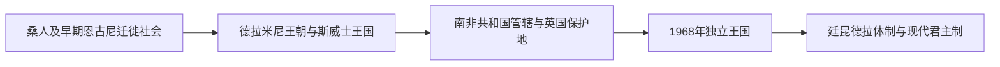

# 斯威士兰历史

今斯威士兰的斯威士国家由德拉米尼王族领导的恩古尼人群形成。索布扎一世在19世纪初把政治中心移入今国境，姆斯瓦蒂二世通过军事与婚姻扩张王国；王母与国王的双重王权、年龄团和地方酋长构成政治传统。

## 历史坐标

- 地理范围：南非与莫桑比克之间的山地、草原与低地。
- 国家形成：殖民边界、矿业劳工体系和区域解放战争共同塑造现代国家。
- 阅读方法：把内陆王国、定居殖民和南非区域经济放在同一时间线上理解。

## 阶段导航

| 顺序 | 阶段 | 时间 | 核心内容 |
|---|---|---|---|
| 1 | [前殖民社会与殖民统治](/%E4%BA%BA%E6%96%87%E7%A7%91%E5%AD%A6/%E5%8E%86%E5%8F%B2/%E9%9D%9E%E6%B4%B2/%E5%8D%97%E9%83%A8%E9%9D%9E%E6%B4%B2/%E6%96%AF%E5%A8%81%E5%A3%AB%E5%85%B0/%E5%89%8D%E6%AE%96%E6%B0%91%E7%A4%BE%E4%BC%9A%E4%B8%8E%E6%AE%96%E6%B0%91%E7%BB%9F%E6%B2%BB.md) | 古代—1968年 | 地方社会、王国、殖民征服与劳工体系 |
| 2 | [独立建国与现代发展](/%E4%BA%BA%E6%96%87%E7%A7%91%E5%AD%A6/%E5%8E%86%E5%8F%B2/%E9%9D%9E%E6%B4%B2/%E5%8D%97%E9%83%A8%E9%9D%9E%E6%B4%B2/%E6%96%AF%E5%A8%81%E5%A3%AB%E5%85%B0/%E7%8B%AC%E7%AB%8B%E5%BB%BA%E5%9B%BD%E4%B8%8E%E7%8E%B0%E4%BB%A3%E5%8F%91%E5%B1%95.md) | 1968年至今 | 解放、政治制度、经济和社会转型 |

## 关键节点

| 时间 | 事件 | 意义 |
|---|---|---|
| 19世纪初 | 斯威士王国形成 | 德拉米尼王朝整合国家 |
| 1906年 | 英国保护地建制 | 殖民统治确立 |
| 1968年 | 独立 | 斯威士兰王国成立 |
| 1973年 | 废止宪法 | 无党君主体制形成 |
| 2018年 | 英语国名改为Eswatini | 国家名称本土化 |

## 区域联系

- 上级：[南部非洲历史](/%E4%BA%BA%E6%96%87%E7%A7%91%E5%AD%A6/%E5%8E%86%E5%8F%B2/%E9%9D%9E%E6%B4%B2/%E5%8D%97%E9%83%A8%E9%9D%9E%E6%B4%B2/README.md)
- 跨区域背景：[马蓬古布韦、大津巴布韦与赞比西河国家](/%E4%BA%BA%E6%96%87%E7%A7%91%E5%AD%A6/%E5%8E%86%E5%8F%B2/%E9%9D%9E%E6%B4%B2/%E5%8D%97%E9%83%A8%E9%9D%9E%E6%B4%B2/%E9%A9%AC%E8%93%AC%E5%8F%A4%E5%B8%83%E9%9F%A6%E3%80%81%E5%A4%A7%E6%B4%A5%E5%B7%B4%E5%B8%83%E9%9F%A6%E4%B8%8E%E8%B5%9E%E6%AF%94%E8%A5%BF%E6%B2%B3%E5%9B%BD%E5%AE%B6.md)、[定居殖民、矿业体系与南部非洲解放](/%E4%BA%BA%E6%96%87%E7%A7%91%E5%AD%A6/%E5%8E%86%E5%8F%B2/%E9%9D%9E%E6%B4%B2/%E5%8D%97%E9%83%A8%E9%9D%9E%E6%B4%B2/%E5%AE%9A%E5%B1%85%E6%AE%96%E6%B0%91%E3%80%81%E7%9F%BF%E4%B8%9A%E4%BD%93%E7%B3%BB%E4%B8%8E%E5%8D%97%E9%83%A8%E9%9D%9E%E6%B4%B2%E8%A7%A3%E6%94%BE.md)
