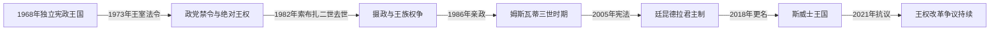

# 斯威士兰的独立建国与现代发展

## 时间

1968年至今

## 概括

斯威士兰1968年以君主立宪形式独立。索布扎二世1973年废止宪法、解散议会并禁止政党，后来以廷昆德拉地方选举和王室任命构建无党制；姆斯瓦蒂三世1986年即位，2005年新宪法保留强大君权。

## 演进图

## 王权集中、摄政与当代危机

- 独立宪法原设议会和政党竞争，但王室支持的因博科德沃民族运动掌全部议席。1972年反对党取得少数席后，索布扎二世于1973年废止宪法、解散议会并禁止政党，声称西方式制度不合本地传统；这直接终结独立初期宪政安排。
- 索布扎1982年去世后，王太后泽莉韦摄政；王族内部权争使其1983年被替换，恩通比王太后主持后续摄政。王子马霍塞蒂韦1986年加冕为姆斯瓦蒂三世，逐步清除强势王族委员会成员并集中任命。
- “廷昆德拉”制度以地方选区选出个人候选人，政党不能以组织名义竞选。国王任命总理、部分议员和法官，掌王室信托土地与安全部门；王太后仍为共同传统元首和仪式核心。
- 2005年宪法列出权利并维持议会，却没有解除政党限制或将政府改为向议会多数负责。2018年国名由“斯威士兰”改称“埃斯瓦蒂尼”，在中文笔记中保留旧常用名以匹配目录。
- 2021年青年和工人抗议要求直选总理与限制王权，安全部队镇压造成伤亡。南部非洲发展共同体斡旋未产生全面制度改革；2023年律师兼官员拉塞尔·德拉米尼由国王任命为总理。

## 现行机构（核验至2026年7月14日）

| 角色 | 人物 | 权力说明 |
|---|---|---|
| 国王、国家元首 | 姆斯瓦蒂三世 | 掌政府任命、国防和重大政策，是实际最高权力 |
| 王太后 | 恩通比 | 共同传统元首，承担王室正统和国家仪式职能 |
| 总理、政府首脑 | 拉塞尔·姆米索·德拉米尼 | 由国王任命，主持内阁但不独立于王权 |

国王、两段摄政和王太后共治结构见[南部非洲独立国家元首与权力结构表](/%E4%BA%BA%E6%96%87%E7%A7%91%E5%AD%A6/%E5%8E%86%E5%8F%B2/%E9%9D%9E%E6%B4%B2/%E5%8D%97%E9%83%A8%E9%9D%9E%E6%B4%B2/%E5%8D%97%E9%83%A8%E9%9D%9E%E6%B4%B2%E7%8B%AC%E7%AB%8B%E5%9B%BD%E5%AE%B6%E5%85%83%E9%A6%96%E4%B8%8E%E6%9D%83%E5%8A%9B%E7%BB%93%E6%9E%84%E8%A1%A8.md)。

## 延续与危机原因

- **结构因素：** 王室土地、传统首领和廷昆德拉选区把地方资源与君主联系；经济又依赖南非市场和关税分成。
- **外部压力：** 南非劳工市场、南部非洲发展共同体和国际工会关注改革，但邻国多采取调停而非强制。
- **直接触发：** 1973年反对党进入议会促使国王废宪；1982年继承空档引发王族权争；2021年请愿受阻和警察暴力使渐进诉求升级为全国抗议。

## 主要政治阶段

| 阶段 | 时间 | 权力结构与特征 |
|---|---|---|
| 独立宪政初期 | 1968—1973年 | 议会与王室并存，王室政党占优势 |
| 索布扎二世绝对君主制 | 1973—1982年 | 废宪、禁党和廷昆德拉制度奠基 |
| 姆斯瓦蒂三世时期 | 1986年至今 | 王室掌行政和立法关键权力，民主运动持续 |
| 国名重申 | 2018年 | 英语国名由Swaziland改为Eswatini |

## 重要转折

- 1968年9月6日独立。
- 1973年索布扎二世发布法令废止宪法并禁止政党活动。
- 1986年姆斯瓦蒂三世正式即位。
- 2005年新宪法生效，但政党参与和君权问题未解决。
- 2018年国王宣布英语国名改为Eswatini，以本地名称重申国家身份。

## 演变关系

前接[斯威士兰的前殖民社会与殖民统治](/%E4%BA%BA%E6%96%87%E7%A7%91%E5%AD%A6/%E5%8E%86%E5%8F%B2/%E9%9D%9E%E6%B4%B2/%E5%8D%97%E9%83%A8%E9%9D%9E%E6%B4%B2/%E6%96%AF%E5%A8%81%E5%A3%AB%E5%85%B0/%E5%89%8D%E6%AE%96%E6%B0%91%E7%A4%BE%E4%BC%9A%E4%B8%8E%E6%AE%96%E6%B0%91%E7%BB%9F%E6%B2%BB.md)。现代发展与南非矿业、跨境劳工和地区解放运动密切相连。
