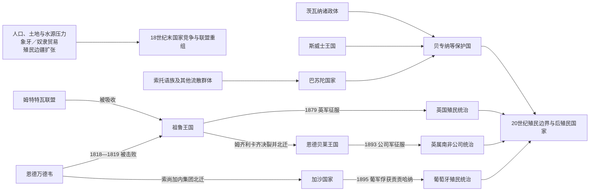

# 祖鲁、索托、茨瓦纳与十九世纪国家重组

## 时间

约1750—1900年

## 概括

18世纪末至19世纪的南部非洲经历人口增长与环境波动、象牙和奴隶贸易扩张、首领权力强化、战争和难民迁徙，随后又遭遇布尔人大迁徙、英国与葡萄牙殖民征服。祖鲁、巴苏陀、恩德贝莱、斯威士、佩迪、加沙和多个茨瓦纳政体不是同一场“祖鲁爆炸”的机械产物，而是在相互联系又各有地方条件的危机中重组。

祖鲁国家以既有年龄团和军团制度为基础，在恰卡时期扩大中央动员；莫舒舒一世通过山地防御、吸收难民和外交建立巴苏陀国家；姆齐利卡齐、索尚加内等集团迁徙并吸收沿途人口；茨瓦纳、斯威士和佩迪统治者则通过大型聚落、牛群、贸易与首领联盟维护权力。到19世纪末，殖民军队、条约与特许公司把这些国家分别纳入殖民边界，但部分王权和政治身份延续至今。

## 演进图

## 重组前的地区格局

18世纪南部非洲已有多层次政治体：东南沿海的姆特特瓦、恩德万德韦、祖鲁和恩格瓦内首领国控制牛群、年龄团与贸易；高地分布南索托、北索托和茨瓦纳诸政体；德拉肯斯堡以西、林波波河以北还有佩迪、文达、聪加等社会。年龄团、牛群贡赋和随从聚落早于恰卡，不能把全部制度创新归于单个统治者。

18世纪末至19世纪初的干旱周期和土地竞争增加风险；德拉戈阿湾象牙与奴隶贸易、开普边疆的劳工和牲畜掠夺又把地方冲突接入大西洋和印度洋市场。强势首领通过保护、婚姻、吸收被征服者和重新编组军团扩大追随者，弱小群体则迁徙、结盟或进入山地防御点。战争确实造成死亡和流散，但“大片无人土地”是后来殖民者为占地制造的政治神话。

## 主要国家的形成与发展

### 祖鲁：中央动员、继承危机与英祖战争

1816年前后，恰卡在姆特特瓦统治者丁吉斯瓦约支持下继承其父森赞加科纳的祖鲁首领地。丁吉斯瓦约死后，恰卡吸收姆特特瓦力量，并在1818—1819年前后击败兹维德领导的恩德万德韦。祖鲁王权把年龄团编为军团，建立王家军营，调配牛群、婚姻和战利品，并把不同来源人口纳入新的政治身份。军团制并非恰卡凭空发明，但其规模、纪律和对王权的依附显著增强。

1828年，恰卡被异母弟丁冈、姆兰加纳等刺杀，丁冈随后掌权。1838年，丁冈处死彼得·雷蒂夫一行并与布尔迁徙者开战；同年血河战役中祖鲁军败于安德里斯·比勒陀利乌斯率领的车阵。1840年，姆潘德联合布尔人击败丁冈并继位。1856年王子派系在恩东达库苏卡交战，塞奇瓦约一方获胜；1872年塞奇瓦约正式继位。

英国在1878年发出难以接受的最后通牒，1879年入侵。祖鲁军在伊散德尔瓦纳歼灭一支英军主力，却在装备、补给和持续动员差距下失利，乌伦迪陷落后王国被分割。塞奇瓦约短暂复位引发内战；迪尼祖鲁借布尔雇佣军支持争位，土地让渡又扩大殖民介入。1887年英国吞并祖鲁兰，王室保留社会象征和地方权威，但国家主权终结。

### 巴苏陀：吸收难民、山地防御与外交保国

莫舒舒出身科埃纳支系，约1820年起聚集遭战争和饥荒冲击的人群，先守布塔布特，1824年移至有水源、易守难攻的塔巴博休。其国家不是单一宗族扩张，而是以保护、分配牲畜、婚姻、协商和军事防御把不同索托语群体整合为巴苏陀政治共同体。

1833年莫舒舒邀请巴黎福音会传教士，利用识字人员、火器渠道和外交信息，但没有把国家交给传教士。1830—1860年代，他在祖鲁、恩德贝莱、格里夸、英国、布尔定居者与奥兰治自由邦之间周旋。巴苏陀军虽守住塔巴博休，却在土地战争中失去卡利登河谷肥沃地区。1868年莫舒舒请求英国保护，以避免被奥兰治自由邦完全吞并；1869年边界安排确认大片西部土地割让。

1870年莫舒舒去世后，莱齐耶一世继位。英国把巴苏陀兰并入开普殖民地后试图收缴枪支，1880—1881年“缴枪战争”迫使殖民政府退让；1884年巴苏陀兰恢复为英国直接管理的保护领性质单位。山地、防御、外交和保留王族结构共同解释了莱索托为何没有被南非殖民单元完全吞并。

### 恩德贝莱：迁徙国家与公司征服

姆齐利卡齐原属库马洛集团，曾依附恰卡，约1821年因贡赋和权力冲突离开祖鲁核心。他的追随者在高地草原击败或吸收部分索托—茨瓦纳群体，把不同来源人口编入分层的恩德贝莱政治与军事单位。1836—1837年与布尔迁徙者交战失利后，集团越过林波波河，最终以今津巴布韦西南部为中心建国。

1868年姆齐利卡齐去世后发生继承争议，洛本古拉于1870年确立王位。其王国以王家军镇、牛群贡赋、地方首领和被纳入的居民共同构成，不能简单描述为少数“征服者”统治固定“部落”。1888年洛本古拉签署鲁德特许权，文本理解、翻译和授权范围长期有争议；塞西尔·罗得斯据此取得英属南非公司特许状。1893年公司军利用机枪和殖民联盟击败恩德贝莱，洛本古拉出逃后去世。1896—1897年的恩德贝莱—绍纳起义遭镇压，但成为后来津巴布韦民族主义的重要历史记忆。

### 斯威士、佩迪与加沙

索布扎一世把恩格瓦内—德拉米尼王权巩固在今斯威士兰一带；姆斯瓦蒂二世在1840—1868年间以军团、王室婚姻和双重王权结构扩张，国家名称“斯威士”即与其统治相连。国王（恩格温亚马）与王太后（恩德洛武卡蒂）及王族会议共同维持正统性，继承未定时常由王太后摄政。姆班泽尼统治时期向欧洲商人批出大量土地和矿权让与，互相重叠的特许权削弱控制；19世纪末斯威士王国逐步落入南非共和国与英国的殖民安排。

佩迪国家在塞夸蒂时期利用山地据点、牛群、贸易和吸收难民恢复力量；塞库库内一世继位后既与南非共和国争夺土地，也面对内部王位竞争。1876年布尔军远征失败，英国1879年攻破佩迪要塞。该过程说明殖民征服并非欧洲军队一路无阻，也说明非洲政权会利用帝国竞争争取空间。

索尚加内领导的恩德万德韦相关集团向北迁徙，在林波波河下游至今莫桑比克南部建立加沙国家，并吸收聪加等人口。索尚加内死后，马韦韦与姆齐拉争位；葡萄牙支持姆齐拉以扩大影响。贡贡哈纳继位后试图在葡萄牙、英国和地方首领之间平衡。1895年葡军攻占曼贾卡泽并俘获贡贡哈纳，将其流放，借此把名义宗主权转为更直接的殖民统治。

### 茨瓦纳诸政体：多中心王权与保护国策略

“茨瓦纳”不是一个统一王国。夸纳、恩瓦凯采、恩瓦托、塔瓦纳等多个政体各由科西与议事会治理，以大型首府、牛牧、耕作、狩猎和贸易维系。19世纪的战争和迁徙迫使首府迁移，却也促成新联盟；传教、枪支、象牙与南非市场改变了权力资源。

1885年英国设贝专纳保护国，既为阻止德国西南非与布尔共和国连成一片，也回应部分茨瓦纳统治者寻求外部屏障的策略。1895年卡马三世、塞贝莱一世和巴托恩一世赴英国反对把领地交给英属南非公司，最终保留若干酋长领地和保护国地位。保护不是平等条约：英国控制对外关系并逐步改造司法、土地和行政，但茨瓦纳王权与会议制度保留了比南罗得西亚更多的制度连续性。

完整的祖鲁、巴苏陀、斯威士、恩德贝莱、加沙和洛齐世系另见[南部非洲王国、酋长国与殖民统治者表](/%E4%BA%BA%E6%96%87%E7%A7%91%E5%AD%A6/%E5%8E%86%E5%8F%B2/%E9%9D%9E%E6%B4%B2/%E5%8D%97%E9%83%A8%E9%9D%9E%E6%B4%B2/%E5%8D%97%E9%83%A8%E9%9D%9E%E6%B4%B2%E7%8E%8B%E5%9B%BD%E3%80%81%E9%85%8B%E9%95%BF%E5%9B%BD%E4%B8%8E%E6%AE%96%E6%B0%91%E7%BB%9F%E6%B2%BB%E8%80%85%E8%A1%A8.md)；下表只用于比较十九世纪关键节点。

## 主要统治者与继承节点

| 政权 | 在位顺序或关键阶段 | 继承关系与说明 |
|---|---|---|
| 祖鲁 | 森赞加科纳（约1787—1816）→ **恰卡**（1816—1828）→ 丁冈（1828—1840）→ 姆潘德（1840—1872）→ **塞奇瓦约**（1872—1879；1883短暂复位）→ 迪尼祖鲁（1884年后为受限王权） | 恰卡、丁冈均经暴力废立；英国1879年分割王国，1887年吞并，后续王位不再代表主权国家 |
| 巴苏陀 | **莫舒舒一世**（约1822—1870）→ 莱齐耶一世（1870—1891）→ 莱罗托利（1891—1905） | 王权延续，但1868年后处于英国保护之下；高级首领与殖民专员共同构成权力结构 |
| 恩德贝莱 | **姆齐利卡齐**（约1820年代—1868）→ 洛本古拉（1870—1894） | 1868—1870年继承争议；1893年国家被公司军征服，洛本古拉出逃后去世 |
| 加沙 | **索尚加内**（约1820年代—1858）→ 马韦韦（1858—1861）／姆齐拉（1861—1884）→ 贡贡哈纳（1884—1895） | 马韦韦与姆齐拉内战并有葡萄牙介入；贡贡哈纳被俘标志主权终结 |
| 斯威士 | 索布扎一世（约1815—1836）→ 摄政期→ **姆斯瓦蒂二世**（1840—1868）→ 王太后摄政与继承安排→ 姆班泽尼（1875—1889）→ 摄政期→ 恩格瓦内五世（1895—1899） | 国王、王太后和王族会议共同决定继承；幼主、候选王早逝和摄政使简化年表容易误导 |
| 佩迪 | 塞夸蒂（约1820年代—1861）→ 塞库库内一世（1861—1882，间有内争） | 与曼帕鲁二世等王族竞争交织；1879年军事失败后政治自主急剧收缩 |
| 茨瓦纳诸政体 | 多个科西世系并立 | 不存在可合并为一张“茨瓦纳国王表”的单一世系，应在各酋邦和博茨瓦纳专页分别维护 |

表中只列本篇所涉19世纪国家的公认主线；共治、摄政、候选人未正式即位和殖民后传统王位均在备注中区分。

## 重要事件

| 时间 | 事件 | 结果与长期影响 |
|---|---|---|
| 18世纪末 | 姆特特瓦、恩德万德韦等大型首领联盟兴起 | 为军团化、贡赋强化和祖鲁国家形成提供制度环境 |
| 1816—1819年 | 恰卡继位，吸收姆特特瓦并击败恩德万德韦 | 祖鲁王权成为东南部强权，部分败亡集团迁徙 |
| 1821—1824年前后 | 姆齐利卡齐离开祖鲁核心；莫舒舒移驻塔巴博休 | 恩德贝莱与巴苏陀两条国家形成路径展开 |
| 1828年 | 恰卡被刺，丁冈继位 | 祖鲁国家经历暴力继承但未立即瓦解 |
| 1836—1838年 | 布尔人大迁徙集团进入内陆，与恩德贝莱和祖鲁开战 | 非洲国家重组与定居殖民扩张发生正面碰撞 |
| 1840年 | 姆潘德联合布尔人击败丁冈 | 祖鲁王位和纳塔尔殖民政治相互牵连 |
| 1856年 | 祖鲁王子派系在恩东达库苏卡交战 | 塞奇瓦约确立实际继承优势，大量伤亡削弱王族 |
| 1865—1868年 | 巴苏陀—奥兰治自由邦战争 | 巴苏陀失地，莫舒舒转而请求英国保护 |
| 1876—1879年 | 佩迪先击退布尔远征，后被英军攻破 | 帝国兼并压倒地区国家间均势 |
| 1879年 | 英祖战争：伊散德尔瓦纳胜利与乌伦迪陷落 | 祖鲁军事胜利未能阻止国家被分割 |
| 1885年 | 贝专纳保护国建立 | 茨瓦纳诸政体被纳入英国战略缓冲区 |
| 1888—1893年 | 鲁德特许权、公司殖民推进与恩德贝莱战争 | 私人特许公司把商业授权转化为领土征服 |
| 1895年 | 葡军俘获加沙统治者贡贡哈纳 | 莫桑比克南部的葡萄牙直接控制增强 |
| 1895年 | 三位茨瓦纳统治者赴英争取保留领地 | 阻止保护国核心区被整体移交英属南非公司 |
| 1896—1897年 | 恩德贝莱和绍纳起义 | 镇压后公司统治制度化，也留下反殖民记忆 |

## “姆费卡内／迪法卡内”争议

| 解释路径 | 有效认识 | 局限 |
|---|---|---|
| 传统祖鲁中心论 | 注意到祖鲁扩张和战争确实推动部分迁徙 | 把整个次大陆几十年变化归罪于恰卡，遮蔽地方政治和殖民暴力 |
| 环境—人口解释 | 干旱、牧地和耕地压力会放大国家竞争 | 单靠气候无法解释冲突发生地点、结盟选择和殖民贸易 |
| 奴隶贸易与殖民边疆解释 | 德拉戈阿湾、开普劳工掠夺和枪械贸易不可忽视 | 奴隶贸易规模、时间和地区影响并不一致，不能反向否定非洲统治者能动性 |
| 多因素重组解释 | 把环境、贸易、国家创新、战争、难民吸收和殖民扩张放在同一分析框架 | 仍须逐地区验证，不能用一个概念替代具体过程 |

现代研究通常保留这一时期存在大规模动荡的事实，同时拒绝“祖鲁把土地打空、欧洲人随后进入空地”的殖民叙事。死亡规模、迁徙人数和某些战事因文字资料稀少而无法精确统计，应使用“约”“可能”和“存在争议”。

## 崛起、衰落与殖民征服的因果层次

- **结构因素**：牛群、年龄团、首领随从和贸易品为国家集中提供工具；土地、水源和继承竞争又使联盟容易分裂。
- **整合机制**：成功政权往往吸收难民和被征服者、允许地方首领保留部分权力，并用婚姻、牛群分配和新政治身份维持忠诚。
- **外部压力**：布尔定居者、英军、葡军、传教与特许公司带来火器、条约、土地登记和国际承认的不对称。
- **直接触发**：王位刺杀、继承内战、最后通牒或一次军事失败会加速崩溃，但不能单独解释此前几十年的权力变化。
- **延续因素**：巴苏陀、斯威士与茨瓦纳统治者通过山地、外交和保护国策略保留制度空间；祖鲁、恩德贝莱和加沙即使失去主权，也以王族、地方权威和民族记忆延续。

## 演变关系与延伸阅读

- 前一阶段的高原国家与贸易网络见[马蓬古布韦、大津巴布韦与赞比西河国家](/%E4%BA%BA%E6%96%87%E7%A7%91%E5%AD%A6/%E5%8E%86%E5%8F%B2/%E9%9D%9E%E6%B4%B2/%E5%8D%97%E9%83%A8%E9%9D%9E%E6%B4%B2/%E9%A9%AC%E8%93%AC%E5%8F%A4%E5%B8%83%E9%9F%A6%E3%80%81%E5%A4%A7%E6%B4%A5%E5%B7%B4%E5%B8%83%E9%9F%A6%E4%B8%8E%E8%B5%9E%E6%AF%94%E8%A5%BF%E6%B2%B3%E5%9B%BD%E5%AE%B6.md)。
- 布尔共和国、矿业劳工、殖民法制和解放战争接续至[定居殖民、矿业体系与南部非洲解放](/%E4%BA%BA%E6%96%87%E7%A7%91%E5%AD%A6/%E5%8E%86%E5%8F%B2/%E9%9D%9E%E6%B4%B2/%E5%8D%97%E9%83%A8%E9%9D%9E%E6%B4%B2/%E5%AE%9A%E5%B1%85%E6%AE%96%E6%B0%91%E3%80%81%E7%9F%BF%E4%B8%9A%E4%BD%93%E7%B3%BB%E4%B8%8E%E5%8D%97%E9%83%A8%E9%9D%9E%E6%B4%B2%E8%A7%A3%E6%94%BE.md)。
- 国家层面的王权、殖民过程和现代延续见[南非历史](/%E4%BA%BA%E6%96%87%E7%A7%91%E5%AD%A6/%E5%8E%86%E5%8F%B2/%E9%9D%9E%E6%B4%B2/%E5%8D%97%E9%83%A8%E9%9D%9E%E6%B4%B2/%E5%8D%97%E9%9D%9E/README.md)、[莱索托历史](/%E4%BA%BA%E6%96%87%E7%A7%91%E5%AD%A6/%E5%8E%86%E5%8F%B2/%E9%9D%9E%E6%B4%B2/%E5%8D%97%E9%83%A8%E9%9D%9E%E6%B4%B2/%E8%8E%B1%E7%B4%A2%E6%89%98/README.md)、[斯威士兰历史](/%E4%BA%BA%E6%96%87%E7%A7%91%E5%AD%A6/%E5%8E%86%E5%8F%B2/%E9%9D%9E%E6%B4%B2/%E5%8D%97%E9%83%A8%E9%9D%9E%E6%B4%B2/%E6%96%AF%E5%A8%81%E5%A3%AB%E5%85%B0/README.md)、[博茨瓦纳历史](/%E4%BA%BA%E6%96%87%E7%A7%91%E5%AD%A6/%E5%8E%86%E5%8F%B2/%E9%9D%9E%E6%B4%B2/%E5%8D%97%E9%83%A8%E9%9D%9E%E6%B4%B2/%E5%8D%9A%E8%8C%A8%E7%93%A6%E7%BA%B3/README.md)、[津巴布韦历史](/%E4%BA%BA%E6%96%87%E7%A7%91%E5%AD%A6/%E5%8E%86%E5%8F%B2/%E9%9D%9E%E6%B4%B2/%E5%8D%97%E9%83%A8%E9%9D%9E%E6%B4%B2/%E6%B4%A5%E5%B7%B4%E5%B8%83%E9%9F%A6/README.md)和[莫桑比克历史](/%E4%BA%BA%E6%96%87%E7%A7%91%E5%AD%A6/%E5%8E%86%E5%8F%B2/%E9%9D%9E%E6%B4%B2/%E5%8D%97%E9%83%A8%E9%9D%9E%E6%B4%B2/%E8%8E%AB%E6%A1%91%E6%AF%94%E5%85%8B/README.md)。
- 返回[南部非洲历史](/%E4%BA%BA%E6%96%87%E7%A7%91%E5%AD%A6/%E5%8E%86%E5%8F%B2/%E9%9D%9E%E6%B4%B2/%E5%8D%97%E9%83%A8%E9%9D%9E%E6%B4%B2/README.md)。
