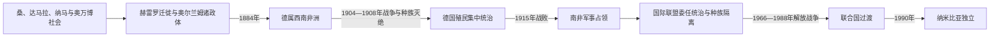

# 纳米比亚的前殖民社会与殖民统治

## 时间

古代—1990年

## 概括

纳米比亚由桑人采集狩猎者、科伊科伊牧民、达马拉、赫雷罗和奥万博等社会共同塑造。北部奥万博王国依靠农业和贸易，中央赫雷罗以牛牧和宗族政治为主，南部纳马领袖在枪械和马匹时代建立联盟。

## 演进图

## 地方政体、殖民暴力与托管争议

- 纳米比亚不同生态区形成多样政治：北部奥万博与卡万戈有农业王国和首领地，中部赫雷罗以牛群、亲属和首领联盟组织，南部纳马与奥尔兰姆发展机动骑枪集团，桑与达马拉社群则保持多种地方结构。
- 19世纪奥尔兰姆领袖容克尔·阿弗里卡纳、赫雷罗首领马赫雷罗和纳马领袖亨德里克·维特布伊围绕水源、牛群和商路结盟交战。传教站、火器和开普市场改变力量，但没有自然产生一个统一“前纳米比亚王国”。
- 德国1884年宣布保护地，以“保护条约”、公司土地和军队扩张。铁路、牧场与债务制度使赫雷罗失地；1904年起义后，冯·特罗塔下达灭绝令，把赫雷罗赶入奥马赫克沙漠。纳马继续游击战至1908年，大量人口死于屠杀、饥渴和集中营。
- 南非军队1915年击败德军，1920年获国际联盟C类委任，却把领地当作第五省管理，推行种族隔离、保留地和合同劳工。二战后南非拒绝改为联合国托管，国际法院和联合国围绕其合法性长期争执。
- 西南非洲人民组织1960年成立，1966年开始武装斗争；安哥拉独立后边境战争升级。1988年纽约协议把古巴撤军、安哥拉安全与联合国第435号决议实施相联，1989年联合国过渡援助团监督选举，1990年独立结束南非实际占领。

地方首领、奥万博王号与殖民行政转换见[南部非洲王国、酋长国与殖民统治者表](/%E4%BA%BA%E6%96%87%E7%A7%91%E5%AD%A6/%E5%8E%86%E5%8F%B2/%E9%9D%9E%E6%B4%B2/%E5%8D%97%E9%83%A8%E9%9D%9E%E6%B4%B2/%E5%8D%97%E9%83%A8%E9%9D%9E%E6%B4%B2%E7%8E%8B%E5%9B%BD%E3%80%81%E9%85%8B%E9%95%BF%E5%9B%BD%E4%B8%8E%E6%AE%96%E6%B0%91%E7%BB%9F%E6%B2%BB%E8%80%85%E8%A1%A8.md)。

## 主要社会与政权

| 社会或政权 | 大致时期 | 特征 |
|---|---|---|
| 桑人社会 | 长期存在 | 狩猎采集、岩画与沙漠生态知识 |
| 科伊科伊与纳马群体 | 近代 | 牧业、首领联盟和跨开普边疆联系 |
| 赫雷罗社会 | 18—19世纪 | 牛牧、宗族和中央高原迁徙 |
| 奥万博诸王国 | 约17—20世纪初 | 北部农业、手工业和安哥拉贸易 |

## 殖民统治

德国1884年宣布西南非保护地，定居者夺地、负债和强制劳动激化冲突。1904—1908年德军对赫雷罗和纳马实施灭绝战争，大量人口在沙漠、集中营和强迫劳工中死亡。一战南非占领，后以国际联盟委任统治名义实施并扩展种族隔离。

## 重要事件

- 19世纪初奥兰姆—纳马领袖以枪马力量进入南部。
- 1884年德国建立保护地。
- 1904年赫雷罗起义，纳马随后加入抵抗。
- 1904—1908年德国灭绝命令、集中营和劳役造成赫雷罗、纳马人口灾难。
- 1915年南非军队占领，1920年取得委任统治。
- 1966年西南非洲人民组织开始武装斗争。

## 演变关系

殖民土地、劳工和行政制度直接影响[纳米比亚的独立建国与现代发展](/%E4%BA%BA%E6%96%87%E7%A7%91%E5%AD%A6/%E5%8E%86%E5%8F%B2/%E9%9D%9E%E6%B4%B2/%E5%8D%97%E9%83%A8%E9%9D%9E%E6%B4%B2/%E7%BA%B3%E7%B1%B3%E6%AF%94%E4%BA%9A/%E7%8B%AC%E7%AB%8B%E5%BB%BA%E5%9B%BD%E4%B8%8E%E7%8E%B0%E4%BB%A3%E5%8F%91%E5%B1%95.md)。
