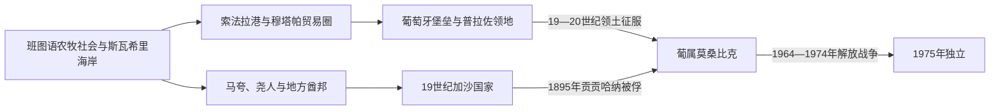

# 莫桑比克的前殖民社会与殖民统治

## 时间

古代—1975年

## 概括

莫桑比克海岸属于斯瓦希里印度洋网络，索法拉等港口转运高原黄金和象牙；内陆受穆塔帕、马拉维等王国影响。葡萄牙16世纪夺取沿海据点并进入赞比西河谷，但公司、普拉佐庄园和非洲国家长期并存。

## 演进图

## 海岸贸易、地方国家与葡萄牙征服

- 莫桑比克海岸自第一千纪后期进入斯瓦希里—印度洋网络，索法拉、莫桑比克岛等港口与内陆黄金、象牙和粮食产区交换。穆斯林商人城镇和内陆马夸、尧、绍纳等社会各有政治主体，不是葡萄牙到来前的“无国家空间”。
- 葡萄牙16世纪占据若干港口和赞比西河堡垒，却长期依靠非洲与果阿商人、婚姻网络及半世袭“普拉佐”领主。普拉佐拥有私人军队和土地征收权，名义服从王室，实际常高度自治。
- 19世纪象牙与奴隶贸易推动尧人首领和沿海商人国家扩张。索尚加内建立的加沙国家通过军团、贡赋和吸纳当地聪加人口控制南部；继承内战后姆齐拉在葡萄牙支持下获胜，其子贡贡哈纳试图在英葡之间周旋。
- 1895年葡军攻占曼贾卡泽并俘获贡贡哈纳，是加沙主权直接终结节点。葡萄牙随后仍需多年征服北部和中部；尼亚萨、莫桑比克与赞比西等特许公司以征税、强迫劳动和种植园推进“有效占领”。
- 20世纪“希巴洛”强迫劳动、劳工外输南非矿山和棉花强制种植支撑殖民财政。1960年穆埃达镇压强化民族主义，莫桑比克解放阵线1964年从北部发动战争；葡萄牙1974年革命打破战争政治基础，《卢萨卡协定》安排权力移交，1975年独立。

加沙王系、普拉佐实际统治者和殖民阶段见[南部非洲王国、酋长国与殖民统治者表](/%E4%BA%BA%E6%96%87%E7%A7%91%E5%AD%A6/%E5%8E%86%E5%8F%B2/%E9%9D%9E%E6%B4%B2/%E5%8D%97%E9%83%A8%E9%9D%9E%E6%B4%B2/%E5%8D%97%E9%83%A8%E9%9D%9E%E6%B4%B2%E7%8E%8B%E5%9B%BD%E3%80%81%E9%85%8B%E9%95%BF%E5%9B%BD%E4%B8%8E%E6%AE%96%E6%B0%91%E7%BB%9F%E6%B2%BB%E8%80%85%E8%A1%A8.md)。

## 主要社会与政权

| 社会或政权 | 大致时期 | 特征 |
|---|---|---|
| 斯瓦希里港市 | 约9—16世纪 | 索法拉、莫桑比克岛与印度洋贸易 |
| 穆塔帕影响区 | 15—17世纪 | 赞比西河南岸黄金和商路 |
| 马拉维诸国 | 约15—18世纪 | 湖区与赞比西北部政治网络 |
| 加沙帝国 | 约1820—1895年 | 索尚加内及继承者控制南部 |
| 赞比西普拉佐 | 17—19世纪 | 葡非混合庄园、私人武装和地方主权 |

## 殖民统治

葡萄牙以莫桑比克岛和索法拉为据点，19世纪末通过特许公司和军事行动才占领内陆。强制劳工、棉花种植、税收和向南非矿山输出劳工构成殖民经济；定居者和“同化民”享有特权。1964年莫桑比克解放阵线从北部发动战争。

## 重要事件

- 1505年葡萄牙占领索法拉，1507年控制莫桑比克岛。
- 17世纪普拉佐体系在赞比西河谷扩张。
- 1895年葡军俘获加沙国王冈冈汉纳。
- 1920年代后萨拉查体制加强强制棉花和劳工控制。
- 1964年解放阵线发动独立战争。

## 演变关系

殖民土地、劳工和行政制度直接影响[莫桑比克的独立建国与现代发展](/%E4%BA%BA%E6%96%87%E7%A7%91%E5%AD%A6/%E5%8E%86%E5%8F%B2/%E9%9D%9E%E6%B4%B2/%E5%8D%97%E9%83%A8%E9%9D%9E%E6%B4%B2/%E8%8E%AB%E6%A1%91%E6%AF%94%E5%85%8B/%E7%8B%AC%E7%AB%8B%E5%BB%BA%E5%9B%BD%E4%B8%8E%E7%8E%B0%E4%BB%A3%E5%8F%91%E5%B1%95.md)。
