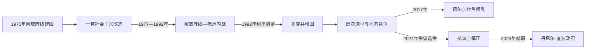

# 莫桑比克的独立建国与现代发展

## 时间

1975年至今

## 概括

葡萄牙1974年革命后迅速撤离，莫桑比克1975年独立并由解放阵线建立社会主义国家。罗得西亚和南非支持莫桑比克全国抵抗运动，内战、旱灾和国家政策共同造成巨大破坏；1992年和平协议后实行多党选举，2017年北部德尔加杜角又出现武装冲突。

## 演进图

## 革命国家、内战与多重和平进程

- 1975年葡萄牙人员快速撤离后，莫桑比克解放阵线接管行政，国有化土地、教育和医疗，建立一党社会主义国家。专业人员短缺、强制村庄化与中央政策失误造成不满，但邻国干预同样是战争形成的关键。
- 罗得西亚安全机构扶植莫桑比克全国抵抗运动破坏解放阵线对津巴布韦游击队的支持；1980年后南非接手援助。抵运袭击交通和乡村，政府军及地方政策也造成暴力。1984年《恩科马蒂协定》未立即终战，冷战结束、双方疲惫和教会斡旋才促成1992年罗马总和平协定。
- 1994年选举后，解放阵线持续执政、抵运成为主要反对党。选举与地方权力争议引发2013—2016年有限复战，2019年和平与解除武装协议吸收多数抵运部队，但残余分支和地方不满未完全消失。
- 2017年德尔加杜角伊斯兰主义叛乱起于地方失业、治理失灵与跨境激进网络，液化天然气项目和人口迁移加剧资源争议。卢旺达部队和南部非洲发展共同体力量帮助收复城镇，但安全与重建仍未完成。
- 2024年选举机构宣布丹尼尔·查波胜出，反对派维南西奥·蒙德拉内质疑结果；示威、道路封锁和安全镇压造成严重伤亡。查波2025年1月就任，任命玛丽亚·本温达·莱维为总理，政府同时面对选举合法性和北部战争。

## 现行机构（核验至2026年7月14日）

| 角色 | 人物 | 权力说明 |
|---|---|---|
| 总统、国家元首 | 丹尼尔·弗朗西斯科·查波 | 主导国防、外交和高级任命 |
| 总理、政府首脑 | 玛丽亚·本温达·莱维 | 协调内阁执行，对总统负责 |
| 北部安全实际结构 | 国防军、警察、卢旺达部队及地方伙伴 | 德尔加杜角部分区域依赖外部军事支持 |

历任总统、过渡与总理制度见[南部非洲独立国家元首与权力结构表](/%E4%BA%BA%E6%96%87%E7%A7%91%E5%AD%A6/%E5%8E%86%E5%8F%B2/%E9%9D%9E%E6%B4%B2/%E5%8D%97%E9%83%A8%E9%9D%9E%E6%B4%B2/%E5%8D%97%E9%83%A8%E9%9D%9E%E6%B4%B2%E7%8B%AC%E7%AB%8B%E5%9B%BD%E5%AE%B6%E5%85%83%E9%A6%96%E4%B8%8E%E6%9D%83%E5%8A%9B%E7%BB%93%E6%9E%84%E8%A1%A8.md)。

## 战争与政权延续原因

- **结构因素：** 殖民撤离导致干部缺口，地区经济不均和执政党—国家重叠限制政治包容。
- **外部压力：** 罗得西亚、南非直接扶植抵运延长内战；当代天然气投资、跨境武装和外军介入改变北部冲突。
- **直接触发：** 1970年代邻国破坏行动与国内强制政策结合促成全面战争；2017年地方激进组织袭击警察标志北部叛乱；2024年结果争议及反对派人员遇害引爆全国抗议。
- **和平条件：** 1992年双方军事僵局、外援下降与可信斡旋缺一不可；2019年协议只解决抵运军事问题，并未自动解决北部叛乱。

## 主要政治阶段

| 阶段 | 时间 | 权力结构与特征 |
|---|---|---|
| 社会主义建国 | 1975—1977年 | 国有化、葡萄牙定居者外流和农村改造 |
| 内战时期 | 1977—1992年 | 解放阵线与抵抗运动战争，外部支持和人道灾难 |
| 和平、多党与新冲突 | 1992年至今 | 选举政治、天然气经济、旧反对派摩擦与北部叛乱 |

## 重要转折

- 1975年6月25日独立，萨莫拉·马谢尔任总统。
- 1977年解放阵线正式确立马克思列宁主义路线，内战扩大。
- 1984年与南非签署恩科马蒂协议，但外部支援未立即停止。
- 1992年《罗马总和平协定》结束内战。
- 1994年首次多党选举；2017年德尔加杜角武装叛乱开始。

## 演变关系

前接[莫桑比克的前殖民社会与殖民统治](/%E4%BA%BA%E6%96%87%E7%A7%91%E5%AD%A6/%E5%8E%86%E5%8F%B2/%E9%9D%9E%E6%B4%B2/%E5%8D%97%E9%83%A8%E9%9D%9E%E6%B4%B2/%E8%8E%AB%E6%A1%91%E6%AF%94%E5%85%8B/%E5%89%8D%E6%AE%96%E6%B0%91%E7%A4%BE%E4%BC%9A%E4%B8%8E%E6%AE%96%E6%B0%91%E7%BB%9F%E6%B2%BB.md)。现代发展与南非矿业、跨境劳工和地区解放运动密切相连。
