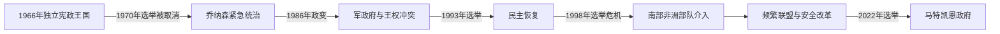

# 莱索托的独立建国与现代发展

## 时间

1966年至今

## 概括

巴苏陀兰1966年以莱索托王国独立，国王为礼仪元首。1970年首相莱布阿·乔纳森取消选举结果并实行威权统治，1986年军方夺权；1993年恢复选举，但军队、王室、政党和南非之间的关系多次引发危机。

## 演进图

## 王权、军政干预与联盟政治

- 独立宪法规定国王为礼仪元首、首相和议会掌行政。莱阿布阿·乔纳森领导的国民党在1965年选举获胜，但1970年大选落败后宣布紧急状态、暂停宪法并拘押反对派，直接终结第一次竞争性宪政。
- 乔纳森一度支持南非解放运动，南非边境封锁加重经济压力。1986年莱哈尼耶少将政变后，军政府扩大国王莫舒舒二世权力；国王与军方围绕行政权冲突，1990年被迫流亡和废位，莱齐耶三世首次即位。
- 1993年民主恢复后莫舒舒二世复位，但1996年车祸去世，莱齐耶三世再次即位。王位两次变化须区分“让位复位”和“父亲去世后的正式继承”，不能合并。
- 1998年选举制度使执政党几乎包揽席位，反对派抗议和军队哗变导致南非、博茨瓦纳部队介入。此后混合选制提高代表性，却造成政党分裂和不稳定联盟。
- 2014年军警冲突、2017年军方司令遇刺推动南部非洲发展共同体安全改革。萨姆·马特凯恩领导的新党2022年胜选，但未获修宪所需多数；王室、议会、联盟伙伴和军警改革共同约束政府。

## 现行机构（核验至2026年7月14日）

| 角色 | 人物 | 权力说明 |
|---|---|---|
| 国王、国家元首 | 莱齐耶三世 | 宪政礼仪元首，按首相建议行使多数职权 |
| 首相、政府首脑 | 萨姆·马特凯恩 | 依议会多数执政，领导内阁 |
| 实际制度制衡 | 联盟议会、军警机构、王室与南部非洲发展共同体改革框架 | 政府稳定取决于联盟和安全部门服从文官 |

国王的两次即位、莫舒舒二世复位及历任首相见[南部非洲独立国家元首与权力结构表](/%E4%BA%BA%E6%96%87%E7%A7%91%E5%AD%A6/%E5%8E%86%E5%8F%B2/%E9%9D%9E%E6%B4%B2/%E5%8D%97%E9%83%A8%E9%9D%9E%E6%B4%B2/%E5%8D%97%E9%83%A8%E9%9D%9E%E6%B4%B2%E7%8B%AC%E7%AB%8B%E5%9B%BD%E5%AE%B6%E5%85%83%E9%A6%96%E4%B8%8E%E6%9D%83%E5%8A%9B%E7%BB%93%E6%9E%84%E8%A1%A8.md)。

## 反复危机原因

- **结构因素：** 国土被南非包围、经济依赖劳工与关税收入；小规模议会中政党分裂易改变多数。
- **外部压力：** 南非边境和南部非洲发展共同体既能施压，也在危机时充当安全保证。
- **直接触发：** 1970年执政党败选引发废宪，1986年封锁与军政矛盾促成政变；1998年“赢者通吃”席位分配引爆抗议；2014年军警竞争险致再次政变。
- **制度回应：** 混合选制和军队改革降低单一冲突，却未根除联盟倒戈与不信任投票频繁的问题。

## 主要政治阶段

| 阶段 | 时间 | 权力结构与特征 |
|---|---|---|
| 独立与乔纳森统治 | 1966—1986年 | 选举危机、威权政府与对南非关系转变 |
| 军事统治与民主恢复 | 1986—1993年 | 军政府强化王室后又发生权力冲突 |
| 多党与联盟政府时代 | 1993年至今 | 选举竞争、1998年干预和频繁政党分裂 |

## 重要转折

- 1966年10月4日独立。
- 1970年执政党选举失利后宣布紧急状态并中止宪法。
- 1986年军方在南非压力背景下推翻乔纳森。
- 1993年举行民主选举恢复文官政府。
- 1998年选举争议引发骚乱，南部非洲发展共同体部队介入。

## 演变关系

前接[莱索托的前殖民社会与殖民统治](/%E4%BA%BA%E6%96%87%E7%A7%91%E5%AD%A6/%E5%8E%86%E5%8F%B2/%E9%9D%9E%E6%B4%B2/%E5%8D%97%E9%83%A8%E9%9D%9E%E6%B4%B2/%E8%8E%B1%E7%B4%A2%E6%89%98/%E5%89%8D%E6%AE%96%E6%B0%91%E7%A4%BE%E4%BC%9A%E4%B8%8E%E6%AE%96%E6%B0%91%E7%BB%9F%E6%B2%BB.md)。现代发展与南非矿业、跨境劳工和地区解放运动密切相连。
