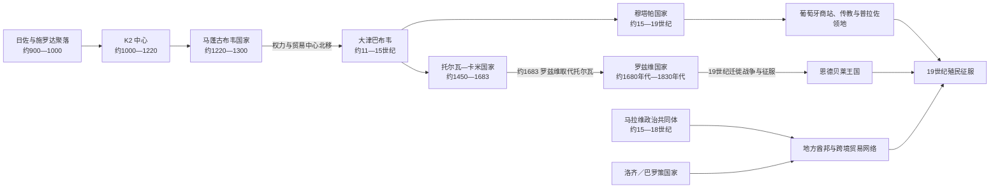

# 马蓬古布韦、大津巴布韦与赞比西河国家

## 时间

约公元900年—19世纪

## 概括

林波波河—沙谢河汇流区、津巴布韦高原和赞比西河流域并非印度洋贸易的被动腹地。当地农牧业、冶铁、牛群积累和金矿开采先形成区域性财富网络，统治集团再以贡赋、仪式权威、聚落分层和商路控制组织国家。马蓬古布韦、大津巴布韦、穆塔帕、托尔瓦—卡米、罗兹维和马拉维等政权彼此有文化与贸易联系，却不能简单排成同一王朝的直线世系。

这些国家的兴衰通常是政治中心转移，而不是居民或文明突然消失。降雨变化、牧地与薪柴压力、金矿和港口路线转移、王位竞争、地方首领离心及葡萄牙军事—商业介入共同改变了权力格局。石砌遗址、进口玻璃珠和陶瓷、金属器与口述传统可以互相补充，但早期统治者姓名和精确疆界大多无法复原。

## 演进图

## 国家形成的物质与制度基础

| 基础 | 作用 | 需要避免的误解 |
|---|---|---|
| 粟、高粱农业与牛牧 | 支持密集聚落，牛群兼具食物、婚姻交换、威望和政治再分配功能 | 国家并非只靠黄金维持 |
| 冶铁与金矿 | 铁器提高生产和军事能力；黄金成为远距离交换的重要商品 | 矿产由本地采掘者、商人和统治者共同组织，并非外来商人直接控制内陆 |
| 林波波—赞比西水系 | 串联高原、河谷、牧地和东海岸港口 | 现代国界不能套用于中世纪贸易空间 |
| 印度洋贸易 | 黄金、象牙等经索法拉、基尔瓦等港口外运，玻璃珠、布匹、陶瓷等输入 | 海贸促进国家形成，但地方农业和区域交换仍是人口生存基础 |
| 仪式王权与聚落分层 | 王室居高地或围墙区，普通居民分布于周围聚落；贡赋和仪式强化中心 | 遗址布局能说明等级，却不能自动还原完整官僚制度 |
| 地方首领网络 | 中央通过宗族、婚姻、贡赋和军事关系连接属地 | “疆域”往往是影响力梯度，不是边界固定的领土国家 |

## 主要阶段与具体过程

### 从施罗达、K2到马蓬古布韦

约900年后，林波波—沙谢河汇流区出现与远距离贸易相连的日佐文化聚落；其后K2成为更大的中心。人口、牛群与进口珠饰的集中显示财富和权力逐渐分化。约13世纪，精英居所转移到马蓬古布韦山顶，山上王室与山下居民的空间分隔、富有金器的墓葬以及附属聚落体系，说明神圣王权与等级秩序已经形成。

马蓬古布韦的优势来自四通商路、河谷农业、黄金与象牙，而非单一军事征服。13世纪末至14世纪初中心衰落。降雨减少和土地承载力下降很重要，但贸易网络、人口迁移和北方新中心兴起也参与其中；把全部变化归为一次旱灾同样过度简化。部分政治与工艺传统向北方高原转移。

### 大津巴布韦的扩张与中心转移

大津巴布韦从11世纪起持续建设，13—15世纪成为高原最重要的政治—仪式中心之一。山丘遗址、大围场和谷地建筑不是“宫殿、后宫、贫民区”的简单对应，而是多个时期累积形成的建筑群。当地工匠使用不加灰浆的花岗岩干砌技术；遗址内的本地陶器、铁器、牛骨与外来珠饰、波斯和中国陶瓷共同显示农牧基础和远途贸易。

14世纪前后，王权通过控制牛群、金产区与交换节点达到鼎盛。约15世纪，政治中心分散：人口和环境压力、周边资源消耗、黄金产区及东向商路调整、统治集团竞争都可能发挥作用。大津巴布韦没有被“神秘民族”突然弃置，其居民及绍纳语族文化延续于周边社会，新的中心在穆塔帕和卡米等地兴起。

### 穆塔帕：贡赋网络、葡萄牙介入与地方化

穆塔帕国家约在15世纪形成于津巴布韦高原北部及赞比西河南岸。传统把尼亚钦巴·穆托塔视为开创者，把其继承者马托佩与扩张联系起来；这些姓名主要来自较晚口述和葡萄牙记录，年代与亲属关系存在争议。统治者以“姆韦内穆塔帕”为称号，通过省级首领、王族任命、贡赋、宗教权威和对金矿—商路的影响维系统治。

16世纪葡萄牙人在索法拉和赞比西河沿岸设商站，并以贸易、传教和军事远征进入内陆。1561年传教士贡萨洛·达·西尔韦拉遇害后，葡萄牙以宗教和商业名义发动远征，但未能直接夺取全部金矿。17世纪王位斗争使若干竞争者寻求葡萄牙武力；1629年葡方扶立马武拉并取得条约特权，影响扩大，却仍须依赖非洲军队、商人和地方首领。普拉佐领地逐渐形成世袭化的河谷权力，拥有私人武装和依附人口，既非纯粹欧洲庄园，也不等同于穆塔帕旧制。

1690年代，罗兹维的昌加米雷·东博击败葡萄牙据点并削弱其高原影响。穆塔帕王权没有在这一刻完全消失，而是在赞比西河流域继续以缩小、分裂的形态存在，直至19世纪葡萄牙殖民征服逐步取代其政治自主。

### 托尔瓦、卡米与罗兹维

大津巴布韦权力分散后，托尔瓦统治者以卡米为中心控制西南高原。卡米石墙以平台和装饰性墙面见长，表明石砌传统发生重组而非中断。17世纪末，昌加米雷·东博领导的罗兹维击败托尔瓦并排挤葡萄牙商站，利用牛牧、贡赋、金产区和军事组织建立地区霸权。

罗兹维并非覆盖整个高原的高度集中帝国，其力量依赖首领联盟和对交通节点的影响。18世纪后地方自主增强；19世纪初的环境压力、商贸变化和区域迁徙加剧分裂。1830年代，恩戈尼和恩德贝莱集团进入高原，罗兹维诸中心先后被破坏或吸收，最终由恩德贝莱王国和多个绍纳酋邦分享空间。

### 马拉维、洛齐与赞比西中上游网络

约15世纪后，马拉维湖以南至赞比西河的契瓦语族政治共同体以“卡隆加”等称号、母系宗族和地方首领网络维系。象牙贸易和农业支持其扩张，部分地方由“隆杜”等强势首领控制。17—18世纪后，继承分裂、地方首领自主、贸易路线变化以及姚人、葡萄牙河谷势力和后来恩戈尼迁徙共同削弱跨区域整合；马拉维身份与酋长制度并未因此消失。

赞比西上游的洛齐／巴罗策国家利用洪泛平原农业、牛牧和独木舟交通，由利通加王权与地方首领组织季节性迁徙和贡赋。19世纪一度被科洛洛征服，随后洛齐王权复兴。赞比亚西北部还受到卢巴—隆达政治和商贸网络影响。这些国家与高原石城传统并列存在，不能都视为大津巴布韦的“后裔”。

## 统治结构与世系可知范围

| 政权 | 最高权力 | 统治方式 | 世系材料状况 |
|---|---|---|---|
| 马蓬古布韦 | 山顶精英与神圣王权 | 聚落等级、贡赋、贸易品再分配 | 未留下可公认复原的完整君主姓名表 |
| 大津巴布韦 | 仪式性王权及王族集团 | 牛群、贡赋、金贸与地方首领网络 | 统治者姓名无法与考古层位可靠逐一对应 |
| 穆塔帕 | 姆韦内穆塔帕 | 王族任命、省级首领、贡赋、灵媒与军事随从 | 16世纪后葡萄牙文献较多，但早期年代、复位和竞争王存在分歧 |
| 托尔瓦—卡米 | 王族中心 | 西南高原首领与商路网络 | 仅能复原部分统治者，不能伪造连续名单 |
| 罗兹维 | 昌加米雷 | 军事力量、牛牧贡赋和地方首领联盟 | 开创者东博较明确，后继顺序受口述差异影响 |
| 马拉维 | 卡隆加及地方首领 | 母系宗族、贡赋与分层酋邦 | “卡隆加”是延续性称号，不能当作单一个人 |
| 洛齐／巴罗策 | 利通加 | 洪泛平原资源调度、首领会议与贡赋 | 19世纪后谱系较清楚，早期次序仍有口述差异 |

因此，本篇采用“公认可证的统治结构与关键人物”，不把传说姓名拼接成貌似精确的完整世系；穆塔帕、罗兹维、洛齐等可辨认人名及明确资料缺口统一维护在[南部非洲王国、酋长国与殖民统治者表](/%E4%BA%BA%E6%96%87%E7%A7%91%E5%AD%A6/%E5%8E%86%E5%8F%B2/%E9%9D%9E%E6%B4%B2/%E5%8D%97%E9%83%A8%E9%9D%9E%E6%B4%B2/%E5%8D%97%E9%83%A8%E9%9D%9E%E6%B4%B2%E7%8E%8B%E5%9B%BD%E3%80%81%E9%85%8B%E9%95%BF%E5%9B%BD%E4%B8%8E%E6%AE%96%E6%B0%91%E7%BB%9F%E6%B2%BB%E8%80%85%E8%A1%A8.md)。

## 重要事件与转折

| 时间 | 事件 | 影响 |
|---|---|---|
| 约900—1000年 | 施罗达等聚落接入印度洋珠饰贸易 | 农牧和区域交换之上出现新的财富集中 |
| 约1000—1220年 | K2发展为大型中心 | 聚落分层、牛群和贸易品集中加深 |
| 约1220—1300年 | 马蓬古布韦山顶王权形成并达鼎盛 | 南部非洲出现可由考古明确辨认的等级国家 |
| 13—14世纪 | 权力与贸易中心逐步北移 | 大津巴布韦成为高原主导中心 |
| 14世纪 | 大津巴布韦达到人口、建筑和贸易高峰 | 金矿、牛牧、贡赋和仪式权威相互强化 |
| 约15世纪 | 大津巴布韦中心分散，穆塔帕与托尔瓦兴起 | 并非文明断裂，而是政治网络重新配置 |
| 1505年后 | 葡萄牙在索法拉及莫桑比克沿岸建立据点 | 海岸贸易的军事化和欧洲介入增强 |
| 1561年及其后 | 西尔韦拉遇害，葡萄牙发动赞比西远征 | 直接夺取金矿失败，但河谷商站和传教扩大 |
| 1629年 | 葡方扶立穆塔帕统治者马武拉并取得特权 | 王位竞争使外部干预制度化 |
| 约1683—1690年代 | 罗兹维取代托尔瓦并攻击葡萄牙据点 | 高原权力再集中，葡萄牙内陆影响受挫 |
| 18世纪 | 马拉维、穆塔帕与罗兹维的地方首领自主增强 | 跨区域国家转为多中心网络 |
| 1830年代 | 恩戈尼、恩德贝莱迁徙进入高原 | 罗兹维中心瓦解，19世纪国家格局重组 |
| 19世纪后期 | 英、葡殖民征服和公司统治推进 | 贡赋国家与首领网络被纳入殖民边界和劳工体系 |

## 崛起、鼎盛与衰落机制

| 层次 | 崛起与鼎盛条件 | 衰落或转型因素 |
|---|---|---|
| 结构因素 | 农牧剩余、牛群积累、冶铁、金矿、人口集中和首领网络 | 资源承载压力、地方首领离心、继承规则带来的竞争 |
| 区域网络 | 控制林波波—赞比西交通节点，把内陆商品连接东海岸 | 港口、金产区和商路转移使旧中心失去中介优势 |
| 权力机制 | 仪式王权、贡赋、婚姻和贸易品再分配使精英获得追随者 | 王室分裂、贡赋中断和附属首领转向新中心 |
| 外部压力 | 外来商品可转化为威望和政治资源 | 葡萄牙武装贸易、普拉佐势力、19世纪迁徙战争和殖民征服 |
| 直接触发 | 新中心在旧网络薄弱处吸收人口与商路 | 干旱或战争可加速迁移，但通常不是唯一原因 |

## 争议与辨析

- **本地建造问题**：大津巴布韦和卡米由本地非洲社会建造。殖民时代为否认非洲国家能力而提出的腓尼基、示巴或其他“外来建造者”说，已被考古年代、陶器序列和聚落连续性否定。
- **族群名称问题**：用“绍纳”概括相关语言文化有分析价值，但不能把现代族群身份原封不动投射到11世纪。卡兰加等地方传统及跨群体互动应保留。
- **直线继承问题**：马蓬古布韦、大津巴布韦、穆塔帕、托尔瓦和罗兹维有制度与文化连续性，却不是一套可无缝排列的单一王朝世系。
- **衰落解释问题**：环境恶化有考古与古气候支持，但人口、贸易和政治竞争同样重要；“生态崩溃”不应变成新的单因论。
- **口述与文献问题**：葡萄牙记录有商业、宗教和殖民立场，口述谱系也会服务后来王权。对共治、称号重复和早期年代应写“约”或“存在争议”。

## 演变关系与延伸阅读

- 高原国家的印度洋联系可对照[斯瓦希里海岸与印度洋世界](/%E4%BA%BA%E6%96%87%E7%A7%91%E5%AD%A6/%E5%8E%86%E5%8F%B2/%E9%9D%9E%E6%B4%B2/%E4%B8%9C%E9%9D%9E/%E6%96%AF%E7%93%A6%E5%B8%8C%E9%87%8C%E6%B5%B7%E5%B2%B8%E4%B8%8E%E5%8D%B0%E5%BA%A6%E6%B4%8B%E4%B8%96%E7%95%8C.md)。
- 19世纪恩德贝莱进入高原及殖民碰撞，接续[祖鲁、索托、茨瓦纳与十九世纪国家重组](/%E4%BA%BA%E6%96%87%E7%A7%91%E5%AD%A6/%E5%8E%86%E5%8F%B2/%E9%9D%9E%E6%B4%B2/%E5%8D%97%E9%83%A8%E9%9D%9E%E6%B4%B2/%E7%A5%96%E9%B2%81%E3%80%81%E7%B4%A2%E6%89%98%E3%80%81%E8%8C%A8%E7%93%A6%E7%BA%B3%E4%B8%8E%E5%8D%81%E4%B9%9D%E4%B8%96%E7%BA%AA%E5%9B%BD%E5%AE%B6%E9%87%8D%E7%BB%84.md)。
- 公司殖民、矿业劳工与解放战争，见[定居殖民、矿业体系与南部非洲解放](/%E4%BA%BA%E6%96%87%E7%A7%91%E5%AD%A6/%E5%8E%86%E5%8F%B2/%E9%9D%9E%E6%B4%B2/%E5%8D%97%E9%83%A8%E9%9D%9E%E6%B4%B2/%E5%AE%9A%E5%B1%85%E6%AE%96%E6%B0%91%E3%80%81%E7%9F%BF%E4%B8%9A%E4%BD%93%E7%B3%BB%E4%B8%8E%E5%8D%97%E9%83%A8%E9%9D%9E%E6%B4%B2%E8%A7%A3%E6%94%BE.md)。
- 国家层面的遗址、政权和殖民过程分别见[津巴布韦历史](/%E4%BA%BA%E6%96%87%E7%A7%91%E5%AD%A6/%E5%8E%86%E5%8F%B2/%E9%9D%9E%E6%B4%B2/%E5%8D%97%E9%83%A8%E9%9D%9E%E6%B4%B2/%E6%B4%A5%E5%B7%B4%E5%B8%83%E9%9F%A6/README.md)、[赞比亚历史](/%E4%BA%BA%E6%96%87%E7%A7%91%E5%AD%A6/%E5%8E%86%E5%8F%B2/%E9%9D%9E%E6%B4%B2/%E5%8D%97%E9%83%A8%E9%9D%9E%E6%B4%B2/%E8%B5%9E%E6%AF%94%E4%BA%9A/README.md)、[马拉维历史](/%E4%BA%BA%E6%96%87%E7%A7%91%E5%AD%A6/%E5%8E%86%E5%8F%B2/%E9%9D%9E%E6%B4%B2/%E5%8D%97%E9%83%A8%E9%9D%9E%E6%B4%B2/%E9%A9%AC%E6%8B%89%E7%BB%B4/README.md)、[莫桑比克历史](/%E4%BA%BA%E6%96%87%E7%A7%91%E5%AD%A6/%E5%8E%86%E5%8F%B2/%E9%9D%9E%E6%B4%B2/%E5%8D%97%E9%83%A8%E9%9D%9E%E6%B4%B2/%E8%8E%AB%E6%A1%91%E6%AF%94%E5%85%8B/README.md)与[南非历史](/%E4%BA%BA%E6%96%87%E7%A7%91%E5%AD%A6/%E5%8E%86%E5%8F%B2/%E9%9D%9E%E6%B4%B2/%E5%8D%97%E9%83%A8%E9%9D%9E%E6%B4%B2/%E5%8D%97%E9%9D%9E/README.md)。
- 返回[南部非洲历史](/%E4%BA%BA%E6%96%87%E7%A7%91%E5%AD%A6/%E5%8E%86%E5%8F%B2/%E9%9D%9E%E6%B4%B2/%E5%8D%97%E9%83%A8%E9%9D%9E%E6%B4%B2/README.md)。
