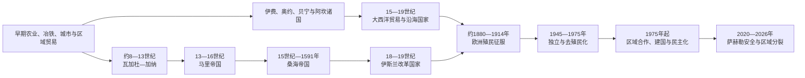

# 西非历史

## 历史主线

西非历史围绕撒哈拉南缘、尼日尔河与乍得湖、森林—草原交界及大西洋沿岸展开。瓦加杜—加纳、马里和桑海依靠跨撒哈拉商路、黄金—盐交换和多层贡赋网络兴起；卡涅姆—博尔努、豪萨城邦和莫西诸国构成平行政治体系。森林与海岸则发展出伊费、奥约、贝宁、阿散蒂、达荷美和尼日尔三角洲城邦，并通过可乐果、黄金、布匹、农产和河海交通同内陆相连。

15世纪后大西洋贸易先扩大黄金、象牙和胡椒交换，继而把区域战争与美洲奴隶制体系深度连接。18—19世纪伊斯兰改革国家重组萨赫勒，欧洲列强又通过长期战争、条约和地方联盟建立殖民边界。第二次世界大战后，工会、妇女组织、退伍军人和群众政党推动独立。新国家继承殖民行政与出口结构，并在政变、民主化、内战、区域维和和经济一体化之间发展；截至2026年，萨赫勒三国退出西非国家经济共同体，成为区域秩序的新转折。

## 按时间排序的专题导航

| 顺序 | 专题 | 时间 | 入口 | 核心问题 |
|---:|---|---|---|---|
| 1 | 萨赫勒帝国与跨撒哈拉贸易 | 前2千纪—19世纪末 | [萨赫勒帝国与跨撒哈拉贸易](/%E4%BA%BA%E6%96%87%E7%A7%91%E5%AD%A6/%E5%8E%86%E5%8F%B2/%E9%9D%9E%E6%B4%B2/%E8%A5%BF%E9%9D%9E/%E8%90%A8%E8%B5%AB%E5%8B%92%E5%B8%9D%E5%9B%BD%E4%B8%8E%E8%B7%A8%E6%92%92%E5%93%88%E6%8B%89%E8%B4%B8%E6%98%93.md) | 城市、河流、商路、贡赋、伊斯兰与地方宗教如何共同塑造内陆国家 |
| 2 | 森林王国、城邦与大西洋沿岸 | 前2千纪—19世纪末 | [森林王国、城邦与大西洋沿岸](/%E4%BA%BA%E6%96%87%E7%A7%91%E5%AD%A6/%E5%8E%86%E5%8F%B2/%E9%9D%9E%E6%B4%B2/%E8%A5%BF%E9%9D%9E/%E6%A3%AE%E6%9E%97%E7%8E%8B%E5%9B%BD%E3%80%81%E5%9F%8E%E9%82%A6%E4%B8%8E%E5%A4%A7%E8%A5%BF%E6%B4%8B%E6%B2%BF%E5%B2%B8.md) | 森林城市、神圣王权、市场和大西洋商品—奴隶贸易如何相互作用 |
| 3 | 伊斯兰改革、殖民征服与独立 | 18世纪初—2026年 | [伊斯兰改革、殖民征服与独立](/%E4%BA%BA%E6%96%87%E7%A7%91%E5%AD%A6/%E5%8E%86%E5%8F%B2/%E9%9D%9E%E6%B4%B2/%E8%A5%BF%E9%9D%9E/%E4%BC%8A%E6%96%AF%E5%85%B0%E6%94%B9%E9%9D%A9%E3%80%81%E6%AE%96%E6%B0%91%E5%BE%81%E6%9C%8D%E4%B8%8E%E7%8B%AC%E7%AB%8B.md) | 宗教革命、殖民制度、群众政治、独立建国和区域合作的连续转型 |

## 重要转折与时间节点

| 时间 | 转折 | 意义 |
|---|---|---|
| 约前3世纪起 | 杰内杰诺等城市群发展 | 西非本地城市化早于伊斯兰帝国 |
| 8—11世纪 | 瓦加杜—加纳达到高峰 | 商路税、黄金转运和属国体系形成早期萨赫勒强国 |
| 约1235年 | 曼丁联盟建立马里 | 多层贡赋和尼日尔河—撒哈拉网络重新整合 |
| 1324—1325年 | 曼萨穆萨朝觐 | 马里进入地中海和伊斯兰世界的广泛记录 |
| 15—16世纪 | 桑海、贝宁、伊费—约鲁巴等体系并盛 | 内陆与森林—海岸并非单线继承 |
| 1482年 | 埃尔米纳堡建立 | 海上黄金贸易和欧洲堡垒竞争制度化 |
| 1591年 | 通迪比战役 | 桑海帝国崩解，尼日尔河政治多中心化 |
| 17—18世纪 | 大西洋奴隶贸易高峰 | 战争、财政、人口和跨大西洋非洲侨民世界形成 |
| 1804年起 | 索科托等伊斯兰改革国家兴起 | 豪萨—萨赫勒政治、学术与社会等级重组 |
| 1880年代—1914年 | 欧洲军事征服 | 殖民边界、税收与商品出口行政形成 |
| 1957—1975年 | 加纳先行及区域独立 | 英、法、葡殖民体系相继解体 |
| 1975年 | 西非国家经济共同体成立 | 区域自由迁徙、经济和后来安全合作制度化 |
| 1990年代 | 利比里亚、塞拉利昂内战与区域干预 | 区域组织开始承担和平执行 |
| 2025年 | 布基纳法索、马里、尼日尔退出共同体 | 西非一体化与萨赫勒安全架构出现制度性分裂 |

## 国家入口

现代国家入口用于展开殖民边界形成、国家元首与政府首脑、独立后的政体变化；古代跨国帝国和贸易网络以本目录三篇区域专题为主锚点，避免在各国重复维护。

| 国家 | 入口 | 核心线索 |
|---|---|---|
| 毛里塔尼亚 | [毛里塔尼亚历史](/%E4%BA%BA%E6%96%87%E7%A7%91%E5%AD%A6/%E5%8E%86%E5%8F%B2/%E9%9D%9E%E6%B4%B2/%E8%A5%BF%E9%9D%9E/%E6%AF%9B%E9%87%8C%E5%A1%94%E5%B0%BC%E4%BA%9A/README.md) | 撒哈拉商路、桑哈贾联盟、殖民边界与多族群国家 |
| 马里 | [马里历史](/%E4%BA%BA%E6%96%87%E7%A7%91%E5%AD%A6/%E5%8E%86%E5%8F%B2/%E9%9D%9E%E6%B4%B2/%E8%A5%BF%E9%9D%9E/%E9%A9%AC%E9%87%8C/README.md) | 瓦加杜、马里、桑海核心区，法属苏丹与萨赫勒国家 |
| 塞内加尔 | [塞内加尔历史](/%E4%BA%BA%E6%96%87%E7%A7%91%E5%AD%A6/%E5%8E%86%E5%8F%B2/%E9%9D%9E%E6%B4%B2/%E8%A5%BF%E9%9D%9E/%E5%A1%9E%E5%86%85%E5%8A%A0%E5%B0%94/README.md) | 泰克鲁尔、沃洛夫国家、法国四市与独立 |
| 冈比亚 | [冈比亚历史](/%E4%BA%BA%E6%96%87%E7%A7%91%E5%AD%A6/%E5%8E%86%E5%8F%B2/%E9%9D%9E%E6%B4%B2/%E8%A5%BF%E9%9D%9E/%E5%86%88%E6%AF%94%E4%BA%9A/README.md) | 冈比亚河贸易、英属殖民地与狭长国家 |
| 几内亚比绍 | [几内亚比绍历史](/%E4%BA%BA%E6%96%87%E7%A7%91%E5%AD%A6/%E5%8E%86%E5%8F%B2/%E9%9D%9E%E6%B4%B2/%E8%A5%BF%E9%9D%9E/%E5%87%A0%E5%86%85%E4%BA%9A%E6%AF%94%E7%BB%8D/README.md) | 卡布、葡属几内亚与武装独立 |
| 几内亚 | [几内亚历史](/%E4%BA%BA%E6%96%87%E7%A7%91%E5%AD%A6/%E5%8E%86%E5%8F%B2/%E9%9D%9E%E6%B4%B2/%E8%A5%BF%E9%9D%9E/%E5%87%A0%E5%86%85%E4%BA%9A/README.md) | 富塔贾隆、瓦苏鲁与1958年独立 |
| 塞拉利昂 | [塞拉利昂历史](/%E4%BA%BA%E6%96%87%E7%A7%91%E5%AD%A6/%E5%8E%86%E5%8F%B2/%E9%9D%9E%E6%B4%B2/%E8%A5%BF%E9%9D%9E/%E5%A1%9E%E6%8B%89%E5%88%A9%E6%98%82/README.md) | 弗里敦克里奥社会、英国保护国与内战 |
| 利比里亚 | [利比里亚历史](/%E4%BA%BA%E6%96%87%E7%A7%91%E5%AD%A6/%E5%8E%86%E5%8F%B2/%E9%9D%9E%E6%B4%B2/%E8%A5%BF%E9%9D%9E/%E5%88%A9%E6%AF%94%E9%87%8C%E4%BA%9A/README.md) | 美洲殖民协会、美裔利比里亚人政权与内战 |
| 科特迪瓦 | [科特迪瓦历史](/%E4%BA%BA%E6%96%87%E7%A7%91%E5%AD%A6/%E5%8E%86%E5%8F%B2/%E9%9D%9E%E6%B4%B2/%E8%A5%BF%E9%9D%9E/%E7%A7%91%E7%89%B9%E8%BF%AA%E7%93%A6/README.md) | 阿坎—曼丁网络、法国殖民、可可经济与政治危机 |
| 加纳 | [加纳历史](/%E4%BA%BA%E6%96%87%E7%A7%91%E5%AD%A6/%E5%8E%86%E5%8F%B2/%E9%9D%9E%E6%B4%B2/%E8%A5%BF%E9%9D%9E/%E5%8A%A0%E7%BA%B3/README.md) | 阿坎与阿散蒂、黄金海岸、恩克鲁玛与泛非主义 |
| 多哥 | [多哥历史](/%E4%BA%BA%E6%96%87%E7%A7%91%E5%AD%A6/%E5%8E%86%E5%8F%B2/%E9%9D%9E%E6%B4%B2/%E8%A5%BF%E9%9D%9E/%E5%A4%9A%E5%93%A5/README.md) | 德属多哥、英法托管分治与独立 |
| 贝宁 | [贝宁历史](/%E4%BA%BA%E6%96%87%E7%A7%91%E5%AD%A6/%E5%8E%86%E5%8F%B2/%E9%9D%9E%E6%B4%B2/%E8%A5%BF%E9%9D%9E/%E8%B4%9D%E5%AE%81/README.md) | 阿贾—丰社会、达荷美、法国征服与共和国 |
| 布基纳法索 | [布基纳法索历史](/%E4%BA%BA%E6%96%87%E7%A7%91%E5%AD%A6/%E5%8E%86%E5%8F%B2/%E9%9D%9E%E6%B4%B2/%E8%A5%BF%E9%9D%9E/%E5%B8%83%E5%9F%BA%E7%BA%B3%E6%B3%95%E7%B4%A2/README.md) | 莫西王国、上沃尔特与革命—军政国家 |
| 尼日尔 | [尼日尔历史](/%E4%BA%BA%E6%96%87%E7%A7%91%E5%AD%A6/%E5%8E%86%E5%8F%B2/%E9%9D%9E%E6%B4%B2/%E8%A5%BF%E9%9D%9E/%E5%B0%BC%E6%97%A5%E5%B0%94/README.md) | 撒哈拉商路、图阿雷格—豪萨社会、殖民与萨赫勒危机 |
| 尼日利亚 | [尼日利亚历史](/%E4%BA%BA%E6%96%87%E7%A7%91%E5%AD%A6/%E5%8E%86%E5%8F%B2/%E9%9D%9E%E6%B4%B2/%E8%A5%BF%E9%9D%9E/%E5%B0%BC%E6%97%A5%E5%88%A9%E4%BA%9A/README.md) | 诺克、伊费—贝宁、豪萨—富拉尼、殖民合并与联邦 |
| 佛得角 | [佛得角历史](/%E4%BA%BA%E6%96%87%E7%A7%91%E5%AD%A6/%E5%8E%86%E5%8F%B2/%E9%9D%9E%E6%B4%B2/%E8%A5%BF%E9%9D%9E/%E4%BD%9B%E5%BE%97%E8%A7%92/README.md) | 葡萄牙群岛、克里奥尔社会、移民与独立 |

## 专表

- [西非帝国与王国统治者世系表](/%E4%BA%BA%E6%96%87%E7%A7%91%E5%AD%A6/%E5%8E%86%E5%8F%B2/%E9%9D%9E%E6%B4%B2/%E8%A5%BF%E9%9D%9E/%E8%A5%BF%E9%9D%9E%E5%B8%9D%E5%9B%BD%E4%B8%8E%E7%8E%8B%E5%9B%BD%E7%BB%9F%E6%B2%BB%E8%80%85%E4%B8%96%E7%B3%BB%E8%A1%A8.md)：集中维护跨国帝国、王国和传统王位的连续序列与争议年代。
- [西非独立国家元首与权力结构表](/%E4%BA%BA%E6%96%87%E7%A7%91%E5%AD%A6/%E5%8E%86%E5%8F%B2/%E9%9D%9E%E6%B4%B2/%E8%A5%BF%E9%9D%9E/%E8%A5%BF%E9%9D%9E%E7%8B%AC%E7%AB%8B%E5%9B%BD%E5%AE%B6%E5%85%83%E9%A6%96%E4%B8%8E%E6%9D%83%E5%8A%9B%E7%BB%93%E6%9E%84%E8%A1%A8.md)：区分国家元首、政府首脑、军政府和实际权力中心，核验至 2026 年 7 月 14 日。

## 阅读提示

- “苏丹”在许多古代阿拉伯文献中可泛指撒哈拉以南“黑人之地”，不能都理解为现代苏丹共和国。
- 古代加纳帝国位于今毛里塔尼亚—马里区域，与现代加纳共和国不是同一国家。
- 伊斯兰首先深入商人、学者和宫廷，乡村信仰、祖先礼仪和不同法律实践长期并存。
- “森林王国”不是封闭社会；黄金、可乐果、布匹、盐和移民把森林、草原、撒哈拉与海岸相连。
- 柏林会议没有一次画定所有国界，具体殖民统治来自后续战争、条约和列强协定。
- 现代国家边界多继承殖民领地，因此国家史必须同跨境帝国、语言、宗教、牧业和市场网络并读。
- 本目录把毛里塔尼亚放入西非—萨赫勒主线；撒哈拉北缘另见[北非](/%E4%BA%BA%E6%96%87%E7%A7%91%E5%AD%A6/%E5%8E%86%E5%8F%B2/%E5%8C%97%E9%9D%9E/README.md)。

## 上级与相关专题

- [撒哈拉以南非洲历史](/%E4%BA%BA%E6%96%87%E7%A7%91%E5%AD%A6/%E5%8E%86%E5%8F%B2/%E9%9D%9E%E6%B4%B2/README.md)
- [非洲通史](/%E4%BA%BA%E6%96%87%E7%A7%91%E5%AD%A6/%E5%8E%86%E5%8F%B2/%E9%9D%9E%E6%B4%B2/_%E9%80%9A%E5%8F%B2/README.md)
- [非洲贸易网络与奴隶贸易](/%E4%BA%BA%E6%96%87%E7%A7%91%E5%AD%A6/%E5%8E%86%E5%8F%B2/%E9%9D%9E%E6%B4%B2/_%E9%80%9A%E5%8F%B2/%E9%9D%9E%E6%B4%B2%E8%B4%B8%E6%98%93%E7%BD%91%E7%BB%9C%E4%B8%8E%E5%A5%B4%E9%9A%B6%E8%B4%B8%E6%98%93.md)
- [瓜分非洲、殖民统治与民族独立](/%E4%BA%BA%E6%96%87%E7%A7%91%E5%AD%A6/%E5%8E%86%E5%8F%B2/%E9%9D%9E%E6%B4%B2/_%E9%80%9A%E5%8F%B2/%E7%93%9C%E5%88%86%E9%9D%9E%E6%B4%B2%E3%80%81%E6%AE%96%E6%B0%91%E7%BB%9F%E6%B2%BB%E4%B8%8E%E6%B0%91%E6%97%8F%E7%8B%AC%E7%AB%8B.md)
