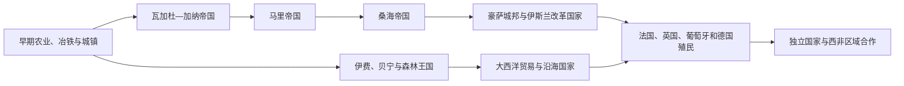

# 西非历史

西非历史围绕萨赫勒草原、尼日尔河流域、森林带和大西洋沿岸展开。跨撒哈拉贸易推动瓦加杜—加纳、马里和桑海等帝国兴起；森林与海岸则形成约鲁巴、贝宁、阿散蒂、达荷美等政治体。15世纪以后大西洋贸易改变沿海权力，19世纪伊斯兰改革国家和欧洲殖民扩张又重组内陆。

## 区域专题

- [萨赫勒帝国与跨撒哈拉贸易](/%E4%BA%BA%E6%96%87%E7%A7%91%E5%AD%A6/%E5%8E%86%E5%8F%B2/%E9%9D%9E%E6%B4%B2/%E8%A5%BF%E9%9D%9E/%E8%90%A8%E8%B5%AB%E5%8B%92%E5%B8%9D%E5%9B%BD%E4%B8%8E%E8%B7%A8%E6%92%92%E5%93%88%E6%8B%89%E8%B4%B8%E6%98%93.md)
- [森林王国、城邦与大西洋沿岸](/%E4%BA%BA%E6%96%87%E7%A7%91%E5%AD%A6/%E5%8E%86%E5%8F%B2/%E9%9D%9E%E6%B4%B2/%E8%A5%BF%E9%9D%9E/%E6%A3%AE%E6%9E%97%E7%8E%8B%E5%9B%BD%E3%80%81%E5%9F%8E%E9%82%A6%E4%B8%8E%E5%A4%A7%E8%A5%BF%E6%B4%8B%E6%B2%BF%E5%B2%B8.md)
- [伊斯兰改革、殖民征服与独立](/%E4%BA%BA%E6%96%87%E7%A7%91%E5%AD%A6/%E5%8E%86%E5%8F%B2/%E9%9D%9E%E6%B4%B2/%E8%A5%BF%E9%9D%9E/%E4%BC%8A%E6%96%AF%E5%85%B0%E6%94%B9%E9%9D%A9%E3%80%81%E6%AE%96%E6%B0%91%E5%BE%81%E6%9C%8D%E4%B8%8E%E7%8B%AC%E7%AB%8B.md)

## 国家入口

| 国家 | 入口 | 核心线索 |
|---|---|---|
| 毛里塔尼亚 | [毛里塔尼亚历史](/%E4%BA%BA%E6%96%87%E7%A7%91%E5%AD%A6/%E5%8E%86%E5%8F%B2/%E9%9D%9E%E6%B4%B2/%E8%A5%BF%E9%9D%9E/%E6%AF%9B%E9%87%8C%E5%A1%94%E5%B0%BC%E4%BA%9A/README.md) | 撒哈拉商路、桑哈贾联盟、法国殖民与多族群国家 |
| 马里 | [马里历史](/%E4%BA%BA%E6%96%87%E7%A7%91%E5%AD%A6/%E5%8E%86%E5%8F%B2/%E9%9D%9E%E6%B4%B2/%E8%A5%BF%E9%9D%9E/%E9%A9%AC%E9%87%8C/README.md) | 加纳、马里、桑海遗产与法属苏丹 |
| 塞内加尔 | [塞内加尔历史](/%E4%BA%BA%E6%96%87%E7%A7%91%E5%AD%A6/%E5%8E%86%E5%8F%B2/%E9%9D%9E%E6%B4%B2/%E8%A5%BF%E9%9D%9E/%E5%A1%9E%E5%86%85%E5%8A%A0%E5%B0%94/README.md) | 泰克鲁尔、沃洛夫国家、法国据点与独立 |
| 冈比亚 | [冈比亚历史](/%E4%BA%BA%E6%96%87%E7%A7%91%E5%AD%A6/%E5%8E%86%E5%8F%B2/%E9%9D%9E%E6%B4%B2/%E8%A5%BF%E9%9D%9E/%E5%86%88%E6%AF%94%E4%BA%9A/README.md) | 冈比亚河贸易、英属殖民地与狭长国家 |
| 几内亚比绍 | [几内亚比绍历史](/%E4%BA%BA%E6%96%87%E7%A7%91%E5%AD%A6/%E5%8E%86%E5%8F%B2/%E9%9D%9E%E6%B4%B2/%E8%A5%BF%E9%9D%9E/%E5%87%A0%E5%86%85%E4%BA%9A%E6%AF%94%E7%BB%8D/README.md) | 卡布帝国、葡萄牙殖民与武装独立 |
| 几内亚 | [几内亚历史](/%E4%BA%BA%E6%96%87%E7%A7%91%E5%AD%A6/%E5%8E%86%E5%8F%B2/%E9%9D%9E%E6%B4%B2/%E8%A5%BF%E9%9D%9E/%E5%87%A0%E5%86%85%E4%BA%9A/README.md) | 富塔贾隆、瓦苏鲁与1958年独立 |
| 塞拉利昂 | [塞拉利昂历史](/%E4%BA%BA%E6%96%87%E7%A7%91%E5%AD%A6/%E5%8E%86%E5%8F%B2/%E9%9D%9E%E6%B4%B2/%E8%A5%BF%E9%9D%9E/%E5%A1%9E%E6%8B%89%E5%88%A9%E6%98%82/README.md) | 克里奥社会、英国殖民与内战 |
| 利比里亚 | [利比里亚历史](/%E4%BA%BA%E6%96%87%E7%A7%91%E5%AD%A6/%E5%8E%86%E5%8F%B2/%E9%9D%9E%E6%B4%B2/%E8%A5%BF%E9%9D%9E/%E5%88%A9%E6%AF%94%E9%87%8C%E4%BA%9A/README.md) | 美洲殖民协会、美国—利比里亚人政权与内战 |
| 科特迪瓦 | [科特迪瓦历史](/%E4%BA%BA%E6%96%87%E7%A7%91%E5%AD%A6/%E5%8E%86%E5%8F%B2/%E9%9D%9E%E6%B4%B2/%E8%A5%BF%E9%9D%9E/%E7%A7%91%E7%89%B9%E8%BF%AA%E7%93%A6/README.md) | 阿坎迁徙、法国殖民、可可经济与政治危机 |
| 加纳 | [加纳历史](/%E4%BA%BA%E6%96%87%E7%A7%91%E5%AD%A6/%E5%8E%86%E5%8F%B2/%E9%9D%9E%E6%B4%B2/%E8%A5%BF%E9%9D%9E/%E5%8A%A0%E7%BA%B3/README.md) | 阿散蒂、黄金海岸、恩克鲁玛与泛非主义 |
| 多哥 | [多哥历史](/%E4%BA%BA%E6%96%87%E7%A7%91%E5%AD%A6/%E5%8E%86%E5%8F%B2/%E9%9D%9E%E6%B4%B2/%E8%A5%BF%E9%9D%9E/%E5%A4%9A%E5%93%A5/README.md) | 德属多哥、托管分治与独立国家 |
| 贝宁 | [贝宁历史](/%E4%BA%BA%E6%96%87%E7%A7%91%E5%AD%A6/%E5%8E%86%E5%8F%B2/%E9%9D%9E%E6%B4%B2/%E8%A5%BF%E9%9D%9E/%E8%B4%9D%E5%AE%81/README.md) | 达荷美王国、奴隶贸易与共和国 |
| 布基纳法索 | [布基纳法索历史](/%E4%BA%BA%E6%96%87%E7%A7%91%E5%AD%A6/%E5%8E%86%E5%8F%B2/%E9%9D%9E%E6%B4%B2/%E8%A5%BF%E9%9D%9E/%E5%B8%83%E5%9F%BA%E7%BA%B3%E6%B3%95%E7%B4%A2/README.md) | 莫西王国、上沃尔特与革命国家 |
| 尼日尔 | [尼日尔历史](/%E4%BA%BA%E6%96%87%E7%A7%91%E5%AD%A6/%E5%8E%86%E5%8F%B2/%E9%9D%9E%E6%B4%B2/%E8%A5%BF%E9%9D%9E/%E5%B0%BC%E6%97%A5%E5%B0%94/README.md) | 萨赫勒商路、图阿雷格与法属西非 |
| 尼日利亚 | [尼日利亚历史](/%E4%BA%BA%E6%96%87%E7%A7%91%E5%AD%A6/%E5%8E%86%E5%8F%B2/%E9%9D%9E%E6%B4%B2/%E8%A5%BF%E9%9D%9E/%E5%B0%BC%E6%97%A5%E5%88%A9%E4%BA%9A/README.md) | 诺克、伊费贝宁、豪萨—富拉尼、殖民合并与联邦 |
| 佛得角 | [佛得角历史](/%E4%BA%BA%E6%96%87%E7%A7%91%E5%AD%A6/%E5%8E%86%E5%8F%B2/%E9%9D%9E%E6%B4%B2/%E8%A5%BF%E9%9D%9E/%E4%BD%9B%E5%BE%97%E8%A7%92/README.md) | 葡萄牙群岛、克里奥尔社会与独立 |

## 组织说明

本目录把毛里塔尼亚放入西非—萨赫勒主线。北非与撒哈拉北缘另见[西亚](/%E4%BA%BA%E6%96%87%E7%A7%91%E5%AD%A6/%E5%8E%86%E5%8F%B2/%E8%A5%BF%E4%BA%9A/README.md)与[北非](/%E4%BA%BA%E6%96%87%E7%A7%91%E5%AD%A6/%E5%8E%86%E5%8F%B2/%E5%8C%97%E9%9D%9E/README.md)。
