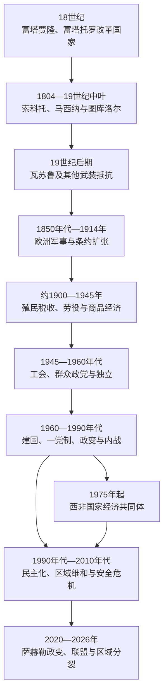

# 伊斯兰改革、殖民征服与独立

## 时间

18世纪初至2026年

## 概括

18—19世纪西非的伊斯兰改革运动既追求信仰与法律更新，也是对王权压迫、任意征税、奴役和学者地位的不满所引发的政治革命。富塔贾隆、富塔托罗、索科托、马西纳和图库洛尔等国家建立了新的埃米尔、学者和省级治理体系；它们限制某些旧统治者对穆斯林的奴役，却又通过战争、种植与家户劳动扩大对非穆斯林及战俘的奴役。萨摩里·杜尔的瓦苏鲁国家则把曼丁商人网络、伊斯兰合法性和现代火器结合，成为抗击法国征服最持久的力量之一。

欧洲殖民并非从1884年柏林会议后毫无阻力地自动完成。法国、英国、德国和葡萄牙利用海岸据点、特许公司、条约解释、非洲国家间战争及技术—后勤优势，经过约三十年的战役才建立领土统治。殖民制度以人头税、强制劳动、征兵、土地和商品出口重组既有社会，同时依赖或制造“酋长”执行命令。铁路、学校和城市职业为殖民经济服务，却也孕育工会、报刊、妇女组织、退伍军人和群众政党。

1945年后的独立来自长期抵抗、世界大战削弱欧洲、群众政治和国际反殖民环境共同作用，而非宗主国单方面“授予”。独立国家继承了殖民边界、行政语言和出口结构，也在泛非主义、军事政变、内战、民主化及区域一体化之间寻找新秩序。1975年成立的西非国家经济共同体后来承担和平与民主规范；2020年代萨赫勒政变、安全危机和对外关系重组又造成分裂，布基纳法索、马里和尼日尔于2025年1月正式退出该组织。

## 伊斯兰改革国家

### 富塔贾隆

富拉尼牧民、穆斯林学者、曼丁商人和本地农业社群长期共同生活在几内亚高地。约1725—1727年起，穆斯林学者发动圣战，击败部分非穆斯林统治者，建立以廷博为政治中心的伊玛目国。国家名义上由“阿尔马米”领导，长期形成阿尔法亚与索里亚两派轮流或争夺最高职位的制度，九个省区的学者—军政首领保有很大权力。

新政权推广古兰经教育、司法和跨区域贸易，并把高地农业、牲畜与大西洋沿岸市场连接起来。其统治同时依赖战俘奴隶在村庄和农场劳动，派系争位又削弱共同防御。法国在19世纪末以条约、内部继承冲突和军事压力逐步控制富塔贾隆，1896年击败末任独立阿尔马米博卡尔·比罗。

### 富塔托罗

塞内加尔河中游的托罗德贝学者在苏莱曼·巴尔领导下于1770年代反对登扬克王朝和外来掠奴；阿卜杜勒·卡迪尔·卡内继任阿尔马米，尝试以伊斯兰法和学者议事治理。改革者反对把自由穆斯林出售给大西洋商人，但同邻国战争和内部社会等级并未消除奴役。阿尔马米权力受选举人、地方酋长和宗教家族制约，18世纪末失败后政权更加分散。

### 索科托哈里发

奥斯曼·丹·福迪奥是戈比尔境内富拉尼托罗德贝学者，长期批评豪萨国王混合宗教、重税、腐败及迫害改革团体。1804年戈比尔王云法同其决裂，丹·福迪奥迁徙并号召圣战。各地富拉尼牧民、豪萨农民、学者和被边缘群体以不同诉求加入，1808年前后攻占多个豪萨王都。

丹·福迪奥把实际治理分给弟弟阿卜杜拉希和儿子穆罕默德·贝洛；1817年去世后，贝洛成为索科托苏丹。哈里发不是一个由首都直接管理的单一国家，而是由索科托苏丹授旗和确认的埃米尔国联盟。埃米尔向中心纳贡、承认教法与圣战合法性，仍掌握本地军队、土地和继承。卡诺、卡齐纳、扎里亚、阿达马瓦等区域被重新组织，伊洛林则成为向约鲁巴地区扩张的南部埃米尔国。

改革扩大阿拉伯文和阿贾米文写作、学校、市场与农业移民，也带来大规模战争和奴隶劳动。统治者区分自由穆斯林与可被征服的非穆斯林，但实践中身份、税收和奴役常被滥用。英国1903年攻占卡诺、索科托后废除政治主权，却保留苏丹和埃米尔作为间接统治机构；传统职位因而延续至现代尼日利亚，但不再是主权国家元首。

### 马西纳与图库洛尔帝国

塞库·阿马杜于1818年在努库马战胜对手，以哈姆达拉希为首都建立马西纳帝国。政权以学者会议和省级管理推行伊斯兰法，规定尼日尔内三角洲牧场、迁徙时间、渔业和农业使用，试图调和富拉尼牧民与定居社群。严格治理、王朝继承和对邻近非穆斯林社群的战争也造成反对。

提贾尼教团领袖哈吉·奥马尔·塔勒朝觐归来后，在富塔贾隆等地招募追随者，从1850年代建立图库洛尔 / 奥马里安国家。他以塞内加尔河上游为基地，取得火器，1857年进攻法国梅迪纳堡失败后转向内陆，1861年征服班巴拉塞古，1862年攻占马西纳。其军队同当地穆斯林和非穆斯林均发生冲突；奥马尔1864年在反叛中死亡，儿子阿赫马杜·塔勒继续统治塞古，1890年被法军夺取。宗教改革、国家扩张和殖民抵抗在这一政权中不能截然分开。

### 瓦苏鲁帝国

萨摩里·杜尔出身曼丁—朱拉商业环境，19世纪70年代在今几内亚、马里和科特迪瓦交界建立军政国家。他组织常备步兵“沙发”、购买和仿制火器、任命省级官员，并以伊斯兰作为跨族群整合工具。国家向东迁移时实行焦土和人口搬迁，对抵抗社群也施加强制。

1880年代起萨摩里同法国反复战争、谈判和撤退，试图在英法竞争间取得武器与空间。法国火力、持续补给、相邻领地合围和内部负担最终削弱其军队；1898年法军突袭俘获萨摩里并将其流放加蓬。其抵抗不是“传统长矛对现代枪炮”，而是一个主动改革军队、利用国际武器市场却受工业帝国后勤压倒的国家。

## 殖民征服

### 从海岸据点到内陆扩张

19世纪中叶以前，欧洲在西非多控制海岸小块殖民地和商站。法国总督费代尔布自1850年代沿塞内加尔河修堡、筑路并扶植或攻击地方统治者，花生出口和军事据点相互促进。英国分别经营塞拉利昂、冈比亚、黄金海岸和拉各斯，1861年吞并拉各斯，1874年把沿海领地建为黄金海岸殖民地。葡萄牙在佛得角和几内亚沿岸宣称长期权利，德国1884年宣布多哥保护地。

1884—1885年柏林会议规定列强应以“有效占领”支持沿海主张，并处理刚果、尼日尔航运等问题；它没有在一次会议上画出西非全部国界。具体边界由后来双边协定、地图直线、军事占领和与非洲统治者签订的条约形成。欧洲官员常把贸易或保护条约解释为割让主权，非洲签署者未必接受相同含义。

### 主要战争与抵抗

| 时间 | 战争或过程 | 结果 |
|---|---|---|
| 1857年 | 法军守住梅迪纳堡 | 奥马尔·塔勒转向内陆扩张，法国巩固塞内加尔河据点 |
| 1873—1874年 | 第二次英阿散蒂战争 | 英军攻入库马西，扩大黄金海岸影响 |
| 1882—1898年 | 法国与萨摩里多轮战争 | 瓦苏鲁迁移作战，萨摩里最终被俘 |
| 1889—1894年 | 法国征服达荷美 | 贝汉津抵抗失败，阿波美王权被置于保护和后续废除 |
| 1890年 | 法军攻占塞古 | 图库洛尔政治中心瓦解，法属苏丹向尼日尔扩展 |
| 1896年 | 英国占领阿散蒂；法国征服富塔贾隆 | 两个内陆政治中心失去主权 |
| 1897年 | 英国攻陷贝宁城 | 奥巴流亡，王宫被焚掠，艺术品大规模外流 |
| 1898年 | 萨摩里被俘 | 法国西非主要有组织抵抗之一终结 |
| 1900年 | 沃尔特河流域反抗、英军再战阿散蒂 | 金凳战争后阿散蒂被并入殖民地 |
| 1903年 | 英军攻占卡诺和索科托 | 哈里发主权终结，埃米尔体系转为间接统治 |
| 1915—1917年 | 沃尔特—巴尼大起义 | 多个社群反抗征兵、税收与强制，法国以大军镇压 |

非洲抵抗既包括王国正规军，也包括游击、迁村、拒税、逃亡、罢工、市场抵制和利用列强竞争。部分统治者同欧洲结盟以对付本地敌手，后来同样失去主权；“分而治之”有效，是因为它嵌入了真实而复杂的地区冲突。

## 殖民统治结构

### 法属西非

法国于1895年建立法属西非联邦，1904年后以达喀尔为联邦中心，陆续包括塞内加尔、法属苏丹、几内亚、科特迪瓦、达荷美、毛里塔尼亚、尼日尔和上沃尔特等。总督之下设殖民地总督、区司令和县级官员，地方“酋长”负责征税、征兵和劳役。所谓同化只在塞内加尔四市等有限地区给予部分居民较完整政治权；大多数“臣民”受土著法典、行政处罚和强制劳动约束。布莱兹·迪亚涅1914年当选法国议员后推动四市原住民公民权，但这不是全联邦普遍平等。

法国修建达喀尔—尼日尔等铁路，把花生、棉花和其他出口品送往港口。人头税迫使家庭进入货币经济，强制搬运、筑路和征兵造成迁徙与死亡。行政常声称实行“直接统治”，实际仍依赖地方首领、宗教家族和商人，且各殖民地差异很大。

### 英属西非

英国把冈比亚、塞拉利昂、黄金海岸和尼日利亚分别治理，没有建立与法属西非完全相同的联邦。北尼日利亚高级专员卢加德把索科托埃米尔体系纳入“间接统治”，通过传统法院和税制执行殖民政策；在缺乏集中王权的东南地区，殖民政府任命“委任酋长”，反而制造缺乏本地合法性的权力。1914年南、北尼日利亚合并，主要是财政、铁路和行政决定，不代表不同社会已经形成共同民族国家。

英国也保留王室殖民地、地方保护国、商人委员会和特许公司等多种形式。可可农户、棕榈油商人和非洲中间商有一定市场空间，土地、铁路、矿业和出口价格仍由殖民政策强烈塑造。“英国间接、法国直接”的二分只能作为倾向，不能替代逐地分析。

### 德国与葡萄牙领地

德属多哥以铁路、棉花和税收被宣传为“模范殖民地”，其财政平衡建立在强制、土地征收和不平等权力上。第一次世界大战初英法军占领多哥，战后分成英、法委任统治区；英属多哥兰1956年公投后并入黄金海岸，法属多哥则于1960年独立。

葡萄牙在佛得角建立较早的克里奥尔社会，在几内亚内陆的有效控制直到19—20世纪之交才扩大。20世纪“土著”身份、强迫劳动和葡萄牙拒绝去殖民化，使几内亚比绍后来走向长期武装战争；佛得角则成为跨大西洋移民、港口和殖民行政中心。

## 社会变化与群众政治

### 税收、劳动与商品经济

殖民经济把铁路和公路设计为生产区—港口走廊，而非优先连接区域内部。塞内冈比亚花生、黄金海岸可可、尼日利亚棕榈产品、几内亚矿产及科特迪瓦种植园扩大。农民并非全部被动：可选择作物、组织合作、走私过境或迁往工资更高地区；殖民价格、土地政策、强制劳动和商社垄断仍限制收益。

废除法定奴隶制是长期而不完整的过程。逃亡者利用殖民法院争取自由，殖民官员又常为维持地方秩序而保护旧主人。家庭依附、抵押、童工和强迫婚姻可能在“习惯法”名义下延续。

### 战争、教育与城市组织

两次世界大战征募大量“塞内加尔步兵”及英属西非部队，名称覆盖许多并非塞内加尔人的士兵。退伍军人带回工资、组织经验和平等待遇要求，强制征兵也触发乡村抵抗。传教和政府学校培养教师、书记员、教士与专业人士；教育分布极不均衡，法语、英语、葡萄牙语成为跨族群行政语言，同时压低本地语言在正式制度中的地位。

市场妇女、农民、码头工人和铁路工人不是精英民族主义的附属。1929年尼日利亚东南妇女战争反对委任酋长、税务调查和男性殖民权力；1947—1948年达喀尔—尼日尔铁路大罢工争取同工同酬和社会权利；黄金海岸1948年退伍军人游行遭枪击后发生骚乱，促使群众政党迅速发展。

## 去殖民化与独立

### 英属领地

黄金海岸联合大会起初由律师、商人和酋长推动宪政改革；夸梅·恩克鲁玛1949年建立大会人民党，以“立即自治”、罢工、报刊和基层组织扩大群众动员。1950年“积极行动”后恩克鲁玛被捕，政党却在1951年选举获胜；经过逐步自治，黄金海岸与英属多哥兰于1957年组成加纳，成为撒哈拉以南殖民地独立的重要先例。

尼日利亚的民族委员会、行动集团和北方人民大会分别依托跨区知识界、约鲁巴西部和豪萨—富拉尼北部等基础。英国以联邦制调和人口、宗教、财政和地区竞争，尼日利亚于1960年独立；联邦安排也把殖民时期形成的地区政党竞争带入新国家。塞拉利昂1961年、冈比亚1965年独立。殖民地宪政谈判不能掩盖工人、妇女、农民和地方运动对改革节奏的推动。

### 法属领地

1944年布拉柴维尔会议提出改革而非立即独立。1946年法国废除土著法典和法定强制劳动，建立法兰西联盟，西非代表进入法国议会；乌弗埃—博瓦尼领导的法案对取消强迫劳动尤其关键。非洲民主联盟、工会和各地政党在联邦合作与领地利益之间竞争。1956年《框架法》扩大领地普选和政府权力，却也把政治资源下放到殖民边界内，削弱建立统一法属西非国家的可能。

1958年戴高乐公投要求各领地在加入法兰西共同体与立即独立之间选择，塞古·杜尔领导的几内亚投“否”并立即独立，法国迅速撤回人员与设备。其余领地先加入共同体，随后在1960年前后独立。法属苏丹和塞内加尔组成的马里联邦于1960年独立后数月即因权力、财政和外交分歧解体，成为马里共和国与塞内加尔共和国。科特迪瓦、尼日尔、上沃尔特、达荷美、毛里塔尼亚等也分别建国。

### 葡属几内亚与佛得角

阿米尔卡·卡布拉尔等人1956年建立几内亚和佛得角非洲独立党。1963年几内亚比绍武装斗争全面展开，运动在部分农村建立行政、学校和医疗网络；葡萄牙以大军和强制迁村反击。卡布拉尔1973年遇刺，同年独立运动单方面宣布建国；1974年葡萄牙革命后获得承认。佛得角1975年独立，最初设想同几内亚比绍统一，1980年几内亚比绍政变后两国分道。

### 独立时间概览

| 时间 | 国家或领地 | 关键路径 |
|---|---|---|
| 1847年 | 利比里亚 | 美洲殖民协会定居点宣布共和国；本地多数长期被排除于美裔利比里亚人政治 |
| 1957年 | 加纳 | 群众政党、选举自治与英属多哥兰公投 |
| 1958年 | 几内亚 | 拒绝法兰西共同体，立即独立 |
| 1960年 | 塞内加尔、马里、科特迪瓦、尼日尔、上沃尔特、达荷美、毛里塔尼亚、尼日利亚、多哥 | 法兰西共同体瓦解、马里联邦解体或英国联邦谈判 |
| 1961年 | 塞拉利昂 | 英属殖民地与保护国联合独立 |
| 1965年 | 冈比亚 | 英联邦内独立，后成为共和国 |
| 1973—1974年 | 几内亚比绍 | 武装解放、单方面建国及葡萄牙正式承认 |
| 1975年 | 佛得角 | 葡萄牙革命后协商移交 |

## 独立后的国家与区域秩序

### 建国困境

独立政府需要把殖民地行政单位转化为拥有共同政治规则的国家。出口依赖、财政薄弱、地区不平等和军队继承使许多国家在一党制与政变间摆动。领导人常以防止族群分裂和加速发展为由集中权力，反对派则被贴上地区主义或外国代理标签。冷战援助支持教育、工业和基础设施，也让外部力量扶植友好政权。

殖民边界并非只制造冲突。非洲国家普遍接受既有边界，以避免全面领土战争；跨境语言、宗教、牧业和市场网络则继续运作。法国军事、货币和企业联系在多国独立后延续，被支持者视为稳定与融资渠道，被批评者视为“法非关系”和主权受限。英语国家和葡语国家同样保留法律、教育与贸易依赖。

### 区域合作、内战与民主化

1975年《拉各斯条约》建立西非国家经济共同体，最初重在关税、贸易和人员流动；1993年修约后，和平、安全、民主和司法职能扩大。1990年代，利比里亚和塞拉利昂内战造成大规模屠杀、流离失所和童兵问题，区域监测部队先后介入，行动既阻止部分暴力，也受到偏袒、纪律和主权争议。国际部队、和平协议和国内社会共同结束战争。

1990年代多党化后，多国实现选举轮替，军队并未退出全部政治。科特迪瓦内战、几内亚比绍反复政变、冈比亚2016年选举危机及萨赫勒武装组织扩张显示国家能力差异。区域法院、自由迁徙和调停机制形成超越殖民边界的制度成果，但共同货币和统一市场进展有限。

### 2020—2026年的萨赫勒分裂

2012年马里北部战争后，圣战组织、地方自卫力量、跨境走私、国家军队和外部部队的战争扩散到布基纳法索与尼日尔。平民既遭武装组织袭击，也承受反恐行动和民兵报复。军方以文官政府无力恢复安全为由在马里2020、2021年、几内亚2021年、布基纳法索2022年和尼日尔2023年夺权；政变并未迅速终结暴力。

马里、布基纳法索和尼日尔2023年建立萨赫勒国家联盟，2024年宣布邦联，并在同西非国家经济共同体及传统西方伙伴冲突中扩大新安全合作。三国完成一年通知期后于2025年1月29日正式退出西非国家经济共同体。截至2026年7月，后者有12个成员，人员流动、贸易、货币、反恐和外交如何同三国衔接仍在谈判。这是独立后区域一体化最严重的裂痕之一，但西非跨境社会与市场并未随组织成员变化消失。

## 统治结构比较

| 阶段 | 法定或名义权力 | 实际执行者 | 关键特征 |
|---|---|---|---|
| 伊斯兰改革国家 | 哈里发、阿尔马米、埃米尔或教法政府 | 学者家族、省级军政首领、地方酋长和军队 | 宗教合法性与分层贡赋并存，中心对各省控制不一 |
| 法属西非 | 法国总统 / 殖民部长、联邦总督 | 区司令、行政官、地方酋长、商社 | 联邦集中、土著法典、税收、劳役和有限同化 |
| 英属西非 | 英国君主及殖民大臣 | 各殖民地总督、埃米尔 / 酋长、地方官 | 分殖民地治理，间接统治与王室直辖并用 |
| 葡萄牙领地 | 葡萄牙政府 | 总督、行政站、企业和地方中介 | 去殖民化最晚，强迫劳动和同化等级延续较久 |
| 独立国家 | 总统、总理、议会和法院 | 政党、军队、官僚、商业与地方网络 | 宪法制度受一党制、政变、个人统治或民主轮替不同影响 |
| 区域组织 | 成员国首脑会议、委员会和法院 | 各国政府及区域机构 | 贸易与自由迁徙之外，也介入和平、安全和宪政危机 |

## 重要事件

| 时间 | 事件 | 结果与长期影响 |
|---|---|---|
| 约1725—1727年 | 富塔贾隆改革战争 | 建立学者—省区联盟国家 |
| 1770年代 | 富塔托罗托罗德贝革命 | 反对旧王朝和掠奴，形成受选举人制约的阿尔马米政权 |
| 1804—1808年 | 丹·福迪奥圣战 | 索科托哈里发重组豪萨及周边地区 |
| 1818年 | 马西纳帝国建立 | 以教法和资源规则治理尼日尔内三角洲 |
| 1850—1860年代 | 奥马尔·塔勒扩张 | 图库洛尔帝国征服塞古、马西纳并同法国冲突 |
| 1884—1885年 | 柏林会议 | 强化有效占领规则，列强加快但尚未完成领土征服 |
| 1890—1903年 | 法英击败西非主要王国 | 殖民边界和间接统治体系形成 |
| 1915—1917年 | 沃尔特—巴尼战争 | 大规模乡村反殖民抵抗遭镇压 |
| 1929年 | 尼日利亚东南妇女战争 | 市场妇女挑战税务、委任酋长和殖民性别秩序 |
| 1947—1948年 | 达喀尔—尼日尔铁路罢工 | 劳工平等与反殖民政治结合 |
| 1957年 | 加纳独立 | 推动撒哈拉以南独立浪潮与泛非主义 |
| 1958—1960年 | 法属西非解体 | 几内亚先独立，法兰西共同体和马里联邦相继瓦解 |
| 1963—1974年 | 几内亚比绍解放战争 | 葡萄牙帝国危机与西非最后一轮去殖民化 |
| 1975年 | 西非国家经济共同体成立 | 区域经济与后来安全合作制度化 |
| 1990年代 | 区域部队介入利比里亚、塞拉利昂 | 西非组织从经济合作转向和平执行 |
| 2025年1月29日 | 布基纳法索、马里、尼日尔正式退出 | 形成12国共同体与萨赫勒三国邦联并立格局 |

## 因果分析

### 欧洲征服为何在19世纪末成功

- 工业化提供速射武器、炮舰、药物、电报和持续海运补给，改变了早期欧洲军队难以深入内陆的条件。
- 列强财政和相邻殖民地可以承受多年战争，非洲国家常同时面对继承争议、属国反叛和贸易封锁。
- 欧洲利用真实的地方冲突和条约歧义逐个击破，盟友在共同敌人失败后也往往被吞并。
- 废奴、人道和自由贸易话语为干预提供合法性，但征服结果是殖民税收、土地和主权控制。

### 独立为何在1945年后加速

- 两次世界大战削弱欧洲财政和道德权威，非洲士兵与工人获得组织经验。
- 城市化、教育、报刊、工会、市场妇女和农民运动把宪政精英诉求转成群众压力。
- 联合国反殖民规范、亚洲独立及美苏竞争提高维持殖民帝国的成本。
- 宗主国改革为选举与自治打开制度通道，却常因领地化选举把区域联邦拆成殖民边界内的国家。

### 独立后危机为何反复

- 国家继承面向出口港口的基础设施和不均衡行政，财政易受单一商品价格冲击。
- 殖民军队和高度集中的总统权力缺乏稳定文官制衡，政变被反复当作“纠正国家失败”的手段。
- 跨境牧业、武装网络和气候压力同地方土地冲突相叠，单国军事方案难以解决。
- 外部援助、军事基地和资源竞争既提供能力，也可能削弱政府问责或制造代理竞争。

## 关键辨析

- “圣战”不能只理解为富拉尼族征服豪萨族。参与者有学者、牧民、农民和城市群体，反对者也跨越族群；宗教、阶级、税收和王位政治同时存在。
- 改革国家批判对穆斯林的非法奴役，却普遍没有废除奴隶制，部分政权反而扩大战俘奴役和农庄劳动。
- 柏林会议没有凭一张地图完成全部瓜分；边界来自随后数十年的战争、条约和列强协定。
- “直接统治”与“间接统治”不是法国、英国的绝对对立。两者都依赖地方中介，也都在需要时撤换或发明酋长。
- 独立日不是社会完全去殖民化的终点。货币、法律、行政语言、企业、军事关系和知识体系仍持续重组。
- 军事政变对腐败或安全失败的批判可能有社会基础，但军政府是否能恢复安全、问责和文官政治必须另作检验，不能以夺权理由代替结果。

## 独立国家权力连续性

各国国家元首、军政府／过渡元首、总理角色和截至 2026 年 7 月的实际权力结构，集中见[西非独立国家元首与权力结构表](/%E4%BA%BA%E6%96%87%E7%A7%91%E5%AD%A6/%E5%8E%86%E5%8F%B2/%E9%9D%9E%E6%B4%B2/%E8%A5%BF%E9%9D%9E/%E8%A5%BF%E9%9D%9E%E7%8B%AC%E7%AB%8B%E5%9B%BD%E5%AE%B6%E5%85%83%E9%A6%96%E4%B8%8E%E6%9D%83%E5%8A%9B%E7%BB%93%E6%9E%84%E8%A1%A8.md)。该表区分法定元首、政府首脑和军事委员会，避免把政变过渡期写成普通总统任期。

## 演变关系

- 前史：[萨赫勒帝国与跨撒哈拉贸易](/%E4%BA%BA%E6%96%87%E7%A7%91%E5%AD%A6/%E5%8E%86%E5%8F%B2/%E9%9D%9E%E6%B4%B2/%E8%A5%BF%E9%9D%9E/%E8%90%A8%E8%B5%AB%E5%8B%92%E5%B8%9D%E5%9B%BD%E4%B8%8E%E8%B7%A8%E6%92%92%E5%93%88%E6%8B%89%E8%B4%B8%E6%98%93.md)、[森林王国、城邦与大西洋沿岸](/%E4%BA%BA%E6%96%87%E7%A7%91%E5%AD%A6/%E5%8E%86%E5%8F%B2/%E9%9D%9E%E6%B4%B2/%E8%A5%BF%E9%9D%9E/%E6%A3%AE%E6%9E%97%E7%8E%8B%E5%9B%BD%E3%80%81%E5%9F%8E%E9%82%A6%E4%B8%8E%E5%A4%A7%E8%A5%BF%E6%B4%8B%E6%B2%BF%E5%B2%B8.md)
- 殖民与独立的全非洲比较：[瓜分非洲、殖民统治与民族独立](/%E4%BA%BA%E6%96%87%E7%A7%91%E5%AD%A6/%E5%8E%86%E5%8F%B2/%E9%9D%9E%E6%B4%B2/_%E9%80%9A%E5%8F%B2/%E7%93%9C%E5%88%86%E9%9D%9E%E6%B4%B2%E3%80%81%E6%AE%96%E6%B0%91%E7%BB%9F%E6%B2%BB%E4%B8%8E%E6%B0%91%E6%97%8F%E7%8B%AC%E7%AB%8B.md)
- 各现代国家入口：[西非历史](/%E4%BA%BA%E6%96%87%E7%A7%91%E5%AD%A6/%E5%8E%86%E5%8F%B2/%E9%9D%9E%E6%B4%B2/%E8%A5%BF%E9%9D%9E/README.md)
- 上级入口：[撒哈拉以南非洲历史](/%E4%BA%BA%E6%96%87%E7%A7%91%E5%AD%A6/%E5%8E%86%E5%8F%B2/%E9%9D%9E%E6%B4%B2/README.md)
