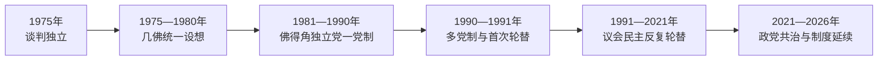

# 佛得角的独立建国与现代发展

## 时间

1975年至今

## 概括

佛得角没有发生本土大规模游击战，但其干部与葡属几内亚解放运动共享组织。1974年葡萄牙革命后谈判独立，1975年成立共和国；最初计划与几内亚比绍统一，1980年后分道扬镳，1991年实现选举政党轮替。

## 政权演进图

## 主要政治阶段

| 阶段 | 时间 | 权力结构与特征 |
|---|---|---|
| 独立党一党时期 | 1975—1990年 | 国家建设、教育医疗投入与对外移民联系 |
| 多党民主 | 1991年至今 | 议会制竞争、和平轮替与服务业发展 |
| 侨民型岛国经济 | 持续 | 侨汇、旅游、海运与外援支撑国家 |

## 建国、制度转型与重要过程

独立由葡萄牙革命后的谈判完成，佩雷拉任总统、皮雷斯任总理，几佛非洲独立党掌握国家与安全机构。新政府优先普及教育、基层医疗和抗旱治理，同时依赖外援、侨汇与粮食进口。1980年几内亚比绍政变打破两国统一设想，佛得角支部改组为佛得角非洲独立党，国家认同由“跨大陆统一”转向岛屿共和国。

1990年取消一党条款后，民主运动在1991年议会和总统选举中获胜。此后非洲独立党与民主运动都曾通过选举执政，败选者接受结果，军队保持在文官指挥下。2001年总统选举票差极小仍经法律程序交接，说明稳定不仅来自小国规模，也来自议会制、独立选举管理和跨党派认可的宪法规则。

2016年民主运动重返政府；2021年若泽·马里亚·内韦斯当选总统，而乌利塞斯·科雷亚·席尔瓦继续任总理，形成不同党派共治。总统不是政府首脑，预算、发展和日常行政由总理与议会多数主导。

## 重要转折

- 1975年7月5日独立。
- 1980年几内亚比绍政变后，佛得角放弃两国统一计划并另组政党。
- 1990年修宪开放多党政治。
- 1991年反对党赢得选举，实现撒哈拉以南非洲较早的和平轮替之一。

## 稳定条件与持续难题

| 层次 | 因素 | 影响 |
|---|---|---|
| 制度条件 | 议会制、两大党竞争、军队不干政 | 使权力轮替不必转化为国家危机 |
| 社会条件 | 教育水平、侨民参与和克里奥尔共同认同 | 缓和岛际差异并提供人才与资金 |
| 经济约束 | 旅游、侨汇和外援占比高，水粮能源依赖进口 | 全球危机、疫情和气候冲击会迅速传导 |
| 长期应对 | 海水淡化、可再生能源、区域外交和财政审慎 | 提高韧性，但不能消除外部依赖 |

完整国家元首与总理顺序见[西非独立国家元首与权力结构表](/%E4%BA%BA%E6%96%87%E7%A7%91%E5%AD%A6/%E5%8E%86%E5%8F%B2/%E9%9D%9E%E6%B4%B2/%E8%A5%BF%E9%9D%9E/%E8%A5%BF%E9%9D%9E%E7%8B%AC%E7%AB%8B%E5%9B%BD%E5%AE%B6%E5%85%83%E9%A6%96%E4%B8%8E%E6%9D%83%E5%8A%9B%E7%BB%93%E6%9E%84%E8%A1%A8.md)；截至2026年7月，若泽·马里亚·内韦斯为总统，乌利塞斯·科雷亚·席尔瓦为政府首脑。

## 演变关系

前接[佛得角的前殖民社会与殖民统治](/%E4%BA%BA%E6%96%87%E7%A7%91%E5%AD%A6/%E5%8E%86%E5%8F%B2/%E9%9D%9E%E6%B4%B2/%E8%A5%BF%E9%9D%9E/%E4%BD%9B%E5%BE%97%E8%A7%92/%E5%89%8D%E6%AE%96%E6%B0%91%E7%A4%BE%E4%BC%9A%E4%B8%8E%E6%AE%96%E6%B0%91%E7%BB%9F%E6%B2%BB.md)。现代国家的边界、行政语言和经济结构继承殖民框架，同时又被本国社会运动、军队、政党与区域组织重新塑造。
