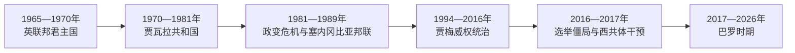

# 冈比亚的独立建国与现代发展

## 时间

1965年至今

## 概括

冈比亚1965年成为英联邦内君主国，1970年改为共和国。达乌达·贾瓦拉长期执政，1994年叶海亚·贾梅政变建立威权体制；2016年选举和地区压力促成权力转移。

## 政权演进图

## 主要政治阶段

| 阶段 | 时间 | 权力结构与特征 |
|---|---|---|
| 贾瓦拉时期 | 1965—1994年 | 议会民主与花生经济，1981年政变未遂 |
| 贾梅政权 | 1994—2017年 | 军人出身的个人化威权统治 |
| 选举转型 | 2017年至今 | 地区干预保障选举结果，推进制度和司法改革 |

## 建国、政变与选举转型

1965年独立时仍以伊丽莎白二世为国家元首，贾瓦拉任总理；1970年第二次公投通过共和国方案，贾瓦拉转任总统。其政府保留多党选举，但花生依赖、行政资源集中和执政党优势使竞争不完全均衡。1981年库科伊·桑巴·桑扬发动政变未遂，塞内加尔军队介入；两国随后组成塞内冈比亚邦联，因主权、军队和经济整合分歧于1989年解体。

1994年叶海亚·贾梅领导青年军官政变，先以军政府、后以选举总统身份统治。安全机构压制反对派与媒体，个人化决策和人权侵害逐渐成为体制特征。2016年阿达马·巴罗领导反对派联盟胜选，贾梅先承认后反悔；西非国家经济共同体调停、军事集结和邻国压力迫使其2017年离境。

巴罗政府设真相、和解与赔偿委员会调查前政权暴力，但新宪法、任期限制和安全部门改革推进缓慢。西共体驻军继续保障政权安全，说明选举转型已经发生，国家强制机构的完整重建仍未完成。

## 重要转折

- 1965年2月18日独立。
- 1970年公投后建立共和国。
- 1981年政变未遂，塞内加尔军队介入并促成短暂塞内冈比亚邦联。
- 1994年贾梅政变；2016年选举失败后拒绝交权，西共体压力促成2017年离任。

## 稳定与危机因素

| 层次 | 因素 | 影响 |
|---|---|---|
| 结构因素 | 狭小领土被塞内加尔包围、财政依赖旅游与侨汇 | 区域关系直接影响安全与经济 |
| 制度问题 | 1997年宪法总统权强、无明确总统任期上限 | 执政者可借国家资源巩固优势 |
| 外部作用 | 西共体调停、驻军与制裁威慑 | 2017年保障交权，也形成安全依赖 |
| 直接风险 | 反改革不满、军队派系与2022年未遂政变指控 | 表明威权遗产尚未完全清除 |

完整元首顺序见[西非独立国家元首与权力结构表](/%E4%BA%BA%E6%96%87%E7%A7%91%E5%AD%A6/%E5%8E%86%E5%8F%B2/%E9%9D%9E%E6%B4%B2/%E8%A5%BF%E9%9D%9E/%E8%A5%BF%E9%9D%9E%E7%8B%AC%E7%AB%8B%E5%9B%BD%E5%AE%B6%E5%85%83%E9%A6%96%E4%B8%8E%E6%9D%83%E5%8A%9B%E7%BB%93%E6%9E%84%E8%A1%A8.md)。1970年以后总统兼政府首脑；截至2026年7月，阿达马·巴罗仍任总统。

## 演变关系

前接[冈比亚的前殖民社会与殖民统治](/%E4%BA%BA%E6%96%87%E7%A7%91%E5%AD%A6/%E5%8E%86%E5%8F%B2/%E9%9D%9E%E6%B4%B2/%E8%A5%BF%E9%9D%9E/%E5%86%88%E6%AF%94%E4%BA%9A/%E5%89%8D%E6%AE%96%E6%B0%91%E7%A4%BE%E4%BC%9A%E4%B8%8E%E6%AE%96%E6%B0%91%E7%BB%9F%E6%B2%BB.md)。现代国家的边界、行政语言和经济结构继承殖民框架，同时又被本国社会运动、军队、政党与区域组织重新塑造。
