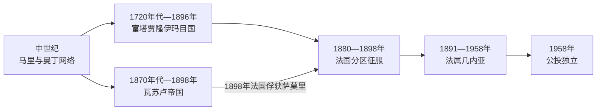

# 几内亚的前殖民社会与殖民统治

## 时间

古代—1958年

## 概括

几内亚跨越富塔贾隆高原、森林区与尼日尔河源头。北部受马里帝国和曼丁贸易影响，18世纪富拉尼学者建立富塔贾隆伊玛目国；19世纪萨摩里·杜尔建立瓦苏鲁帝国，抵抗法国扩张。

## 本地演进图

## 政权形成与统治机制

富塔贾隆由托罗德贝学者、富拉尼军队与地方联盟在18世纪改革战争后建立，最高阿尔马米在阿尔法亚、索里亚两大派系间轮替，各省由地方领袖治理。它以伊斯兰教育、贡赋、牧业和奴隶劳动维持高原国家，不能简化为单一族群王朝。瓦苏卢则由萨莫里·杜尔依靠商路、常备军、火器采购和机动首都构成，版图随战争不断移动。

两国的扩张都借助宗教或军事合法性，却受地方自主、继承争端和奴役制度限制。法国推进前，它们彼此以及同邻近曼丁、森林社群的关系已包含联盟、征服和反抗。

## 主要社会与政权

| 社会或政权 | 大致时期 | 特征 |
|---|---|---|
| 马里帝国边缘与曼丁社会 | 中世纪 | 商路、黄金与伊斯兰传播 |
| 富塔贾隆伊玛目国 | 1720年代—1896年 | 富拉尼伊斯兰联盟，控制高原与奴隶劳作 |
| 瓦苏鲁帝国 | 约1878—1898年 | 萨摩里·杜尔的军事商业国家 |

## 殖民征服的具体过程

法国先控制科纳克里和里维耶尔迪叙德沿海，再由塞内加尔、法属苏丹方向夹击内地。1896年富塔贾隆阿尔马米博卡尔·比罗在波雷达卡战败身亡，轮替伊玛目国瓦解。萨莫里则以焦土、迁都和向东转移延长抵抗，法国切断其塞拉利昂与利比里亚方向的武器贸易后，于1898年在盖莱穆俘获他。被征服政权 → 法国的箭头反映主权被夺，而非“法国文明自然扩散”。

殖民总督隶属法属西非总督，区司令依赖获承认酋长征税、征兵和征发劳工。铁路、港口、香蕉与铝土矿开发面向出口；教育名额有限。二战后工会、非洲民主联盟和塞古·杜尔的民主党把劳工诉求转为群众政治。

## 殖民统治

法国1880年代从海岸和塞内加尔方向推进，1898年俘获萨摩里·杜尔。法属几内亚纳入法属西非，发展香蕉、花生和矿产，征税和劳役推动劳工运动；艾哈迈德·塞古·杜尔由工会组织成长为民族领袖。

## 重要事件

- 18世纪富塔贾隆形成伊玛目轮替制度。
- 1882—1898年萨摩里·杜尔以机动战争抵抗法国。
- 1891年法属几内亚正式建为殖民地。
- 1958年全民公投拒绝戴高乐提出的法兰西共同体新宪法。

## 衰落、征服与史料边界

| 层次 | 因素 | 作用 |
|---|---|---|
| 结构因素 | 阿尔马米派系轮替冲突、瓦苏卢版图流动与高军费 | 削弱稳定财政和地方忠诚 |
| 外部压力 | 法军多方向推进、封锁军火与拉拢敌对社群 | 使单一战场胜利难以逆转战略包围 |
| 社会矛盾 | 贡赋、奴隶劳动和被征服社群反抗 | 限制统治者动员“全民抗战”的能力 |
| 直接触发 | 1896年波雷达卡、1898年萨莫里被俘 | 分别终结富塔贾隆和瓦苏卢主权 |

富塔贾隆是轮替、选举与省区联盟政体，不宜硬套父子王表；瓦苏卢最高统治者为萨莫里·杜尔。跨国政权序列见[西非帝国与王国统治者世系表](/%E4%BA%BA%E6%96%87%E7%A7%91%E5%AD%A6/%E5%8E%86%E5%8F%B2/%E9%9D%9E%E6%B4%B2/%E8%A5%BF%E9%9D%9E/%E8%A5%BF%E9%9D%9E%E5%B8%9D%E5%9B%BD%E4%B8%8E%E7%8E%8B%E5%9B%BD%E7%BB%9F%E6%B2%BB%E8%80%85%E4%B8%96%E7%B3%BB%E8%A1%A8.md)。殖民最高行政首脑为法国任命的几内亚总督，其上为法属西非总督和殖民部长；地方酋长是行政中介而非独立君主。

## 演变关系

殖民统治把不同社会纳入同一行政边界，并为[几内亚的独立建国与现代发展](/%E4%BA%BA%E6%96%87%E7%A7%91%E5%AD%A6/%E5%8E%86%E5%8F%B2/%E9%9D%9E%E6%B4%B2/%E8%A5%BF%E9%9D%9E/%E5%87%A0%E5%86%85%E4%BA%9A/%E7%8B%AC%E7%AB%8B%E5%BB%BA%E5%9B%BD%E4%B8%8E%E7%8E%B0%E4%BB%A3%E5%8F%91%E5%B1%95.md)留下中央机构、出口经济和地区差异。
