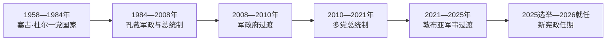

# 几内亚的独立建国与现代发展

## 时间

1958年至今

## 概括

几内亚是1958年唯一投票立即脱离法兰西共同体的殖民地。塞古·杜尔建立激进的一党国家并遭法国孤立；1984年后军政与经济开放并行，2010年首次竞争性总统选举后，制度仍多次被军事夺权打断。

## 政权演进图

## 主要政治阶段

| 阶段 | 时间 | 权力结构与特征 |
|---|---|---|
| 塞古·杜尔第一共和国 | 1958—1984年 | 一党社会主义、泛非外交与严厉政治镇压 |
| 孔戴军政时期 | 1984—2008年 | 军事夺权后市场改革，后转为文官总统制 |
| 多党与军事过渡反复 | 2008年至今 | 政变、选举和军民权力竞争交替 |

## 建国、政变与宪政转折

1958年公投中几内亚选择立即独立，法国快速撤走人员与设备，塞古·杜尔以工会—政党网络建立高度集中的一党国家。国有化、泛非外交和扫盲与政治清洗、监禁及流亡并存；1970年葡萄牙支持的海上袭击强化了政权的安全化与镇压。

1984年杜尔去世后，兰萨纳·孔戴发动政变，放弃部分国家管制并在1990年代转为形式多党制，但军队和总统府仍主导。2008年孔戴去世后达迪斯·卡马拉军政府夺权，2009年体育场镇压和内部刺杀危机促成科纳特过渡；2010年阿尔法·孔戴当选，标志首次竞争性总统选举。2020年修宪第三任期争议削弱其合法性，2021年敦布亚再以政变推翻政府。

过渡当局制定新宪法并在2025年举行总统选举，敦布亚参选获胜，2026年1月17日就任七年任期。其身份由军政府主席转为选举总统并不抹去过渡期权力来源；评估宪政恢复还需观察议会、司法、反对党空间与军队退出政治的程度。

## 重要转折

- 1958年10月2日宣布独立。
- 1970年葡萄牙支持的部队从几内亚比绍方向袭击科纳克里。
- 1984年塞古·杜尔去世后兰萨纳·孔戴政变。
- 2008年和2021年分别发生军事政变；2010年曾举行首次竞争性总统选举。

## 兴衰与制度韧性

| 层次 | 因素 | 影响 |
|---|---|---|
| 结构因素 | 铝土矿资源集中、地区与族群政治、总统权过强 | 经济增长难自动转为包容治理 |
| 军政关系 | 军队反复以反腐和任期争议为由夺权 | 短期打断危机，长期削弱规则可信度 |
| 外部环境 | 冷战阵营、国际金融、区域制裁与矿业资本 | 改变政府资源，却不能替代国内合法性 |
| 直接转折 | 1984、2008、2021年政变与2025年选举 | 构成军政—选举反复循环 |

完整元首、代理元首与主要总理序列见[西非独立国家元首与权力结构表](/%E4%BA%BA%E6%96%87%E7%A7%91%E5%AD%A6/%E5%8E%86%E5%8F%B2/%E9%9D%9E%E6%B4%B2/%E8%A5%BF%E9%9D%9E/%E8%A5%BF%E9%9D%9E%E7%8B%AC%E7%AB%8B%E5%9B%BD%E5%AE%B6%E5%85%83%E9%A6%96%E4%B8%8E%E6%9D%83%E5%8A%9B%E7%BB%93%E6%9E%84%E8%A1%A8.md)。截至2026年7月，马马迪·敦布亚为经2025年选举产生的总统，巴·乌里领导政府日常行政。

## 演变关系

前接[几内亚的前殖民社会与殖民统治](/%E4%BA%BA%E6%96%87%E7%A7%91%E5%AD%A6/%E5%8E%86%E5%8F%B2/%E9%9D%9E%E6%B4%B2/%E8%A5%BF%E9%9D%9E/%E5%87%A0%E5%86%85%E4%BA%9A/%E5%89%8D%E6%AE%96%E6%B0%91%E7%A4%BE%E4%BC%9A%E4%B8%8E%E6%AE%96%E6%B0%91%E7%BB%9F%E6%B2%BB.md)。现代国家的边界、行政语言和经济结构继承殖民框架，同时又被本国社会运动、军队、政党与区域组织重新塑造。
