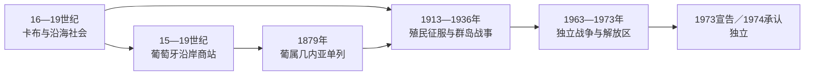

# 几内亚比绍的前殖民社会与殖民统治

## 时间

古代—1974年

## 概括

今几内亚比绍内陆曾属马里和卡布帝国网络，沿海与群岛由巴兰特、佩佩尔、比热戈等社会控制。葡萄牙商人15世纪后进入，但数百年主要依靠沿岸据点和非洲中间人进行贸易。

## 本地演进图

## 社会结构与政权机制

卡布把曼丁战争贵族、村社生产和贸易贡赋连接起来，但沿海巴兰特、佩佩尔和比热戈社会保持不同程度自治。稻田水利、年龄级、宗族与宗教权威形成多中心治理，不能因缺少宫殿国家就称为“无政治”。葡萄牙商人在卡谢乌、比绍据点依赖非洲商人、兰萨多后裔和地方首领，数百年并未控制广大内地。

19世纪卡布在富拉尼战争与地方反抗中衰落，葡萄牙才逐步把贸易主张转为领土主张。现代边界把原属塞内冈比亚和几内亚海岸的网络切开。

## 主要社会与政权

| 社会或政权 | 大致时期 | 特征 |
|---|---|---|
| 卡布帝国 | 16—19世纪 | 曼丁贵族控制内陆贡赋与商路 |
| 沿海巴兰特、佩佩尔社会 | 长期存在 | 稻作、宗族与分散政治组织 |
| 比热戈斯群岛社会 | 近代早期 | 海上贸易与对外抵抗能力强 |

## 殖民征服与解放战争的具体过程

1879年葡属几内亚从佛得角行政中分出，但“纸面殖民地”直到20世纪才扩大。1913—1915年特谢拉·平托率殖民军和非洲辅助部队进攻奥约、曼萨巴等地；比热戈群岛抵抗持续到1930年代，1936年前后葡萄牙才宣称完成“平定”。殖民行政由总督、区长、商业公司和获承认首领组成，以人头税、强迫劳动和花生出口维持，学校与医疗覆盖很低。

1956年几佛非洲独立党建立，1959年皮吉吉蒂码头工人遭镇压后转向农村组织。1963年战争展开，独立党从南部和东部建立解放区、村级委员会、学校与诊所，葡军凭城市、道路、空军和堡垒维持控制。阿米尔卡·卡布拉尔1973年遇刺没有终止组织；同年解放区宣布独立，1974年葡萄牙革命后宗主国承认。

## 殖民统治

葡萄牙把卡谢乌、比绍等设为贸易据点，参与奴隶贸易；直到19世纪末至20世纪初才通过军事行动控制内陆。殖民政府推行强制劳动、花生生产和极有限教育，1956年成立的几内亚和佛得角非洲独立党领导武装斗争。

## 重要事件

- 1440年代葡萄牙航海者抵达沿岸。
- 1879年葡属几内亚从佛得角殖民行政中分出。
- 1913—1915年葡军通过军事行动加强内陆控制。
- 1963年独立战争全面展开，解放区建立基层行政、学校和医疗网络。

## 征服与殖民统治的因果分层

| 层次 | 因素 | 作用 |
|---|---|---|
| 结构因素 | 沿海与内陆多中心政治、葡萄牙财政薄弱 | 使殖民征服长期而不彻底，也给游击组织留下空间 |
| 外部条件 | 武器、邻国基地、冷战援助与葡萄牙国内反战 | 提高独立党的持续作战能力 |
| 殖民矛盾 | 强迫劳动、低教育投入、种族化公民等级 | 扩大反殖民动员基础 |
| 直接触发 | 1959年皮吉吉蒂镇压、1974年葡萄牙革命 | 前者促成武装路线，后者使战争转为主权移交 |

卡布没有无争议的逐年完整王表，沿海社会也多非单一君主制；史料边界见[西非帝国与王国统治者世系表](/%E4%BA%BA%E6%96%87%E7%A7%91%E5%AD%A6/%E5%8E%86%E5%8F%B2/%E9%9D%9E%E6%B4%B2/%E8%A5%BF%E9%9D%9E/%E8%A5%BF%E9%9D%9E%E5%B8%9D%E5%9B%BD%E4%B8%8E%E7%8E%8B%E5%9B%BD%E7%BB%9F%E6%B2%BB%E8%80%85%E4%B8%96%E7%B3%BB%E8%A1%A8.md)。殖民最高角色为葡属几内亚总督，其上受里斯本海外部节制；解放区则由独立党领导层和地方委员会掌权，形成战争期双重政权。

## 演变关系

殖民统治把不同社会纳入同一行政边界，并为[几内亚比绍的独立建国与现代发展](/%E4%BA%BA%E6%96%87%E7%A7%91%E5%AD%A6/%E5%8E%86%E5%8F%B2/%E9%9D%9E%E6%B4%B2/%E8%A5%BF%E9%9D%9E/%E5%87%A0%E5%86%85%E4%BA%9A%E6%AF%94%E7%BB%8D/%E7%8B%AC%E7%AB%8B%E5%BB%BA%E5%9B%BD%E4%B8%8E%E7%8E%B0%E4%BB%A3%E5%8F%91%E5%B1%95.md)留下中央机构、出口经济和地区差异。
