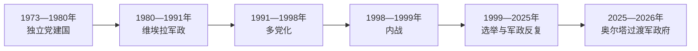

# 几内亚比绍的独立建国与现代发展

## 时间

1973—1974年至今

## 概括

独立党1973年单方面宣布独立，1974年获葡萄牙承认。独立后曾计划与佛得角统一，但1980年政变终止这一方向。军队、毒品转运、薄弱财政与政党竞争使国家多次陷入政变和政治危机。

## 政权演进图

## 主要政治阶段

| 阶段 | 时间 | 权力结构与特征 |
|---|---|---|
| 独立党一党时期 | 1974—1991年 | 路易斯·卡布拉尔执政，1980年维埃拉政变 |
| 多党化与内战 | 1991—1999年 | 开放选举，1998—1999年军事冲突推翻政府 |
| 反复选举与军政干预 | 1999年至今 | 总统、议会和军方权力冲突频繁 |

## 建国、内战与反复过渡

独立党在解放区建国，路易斯·卡布拉尔任国家元首，军队由游击力量转化而来。佛得角出身干部在党国中的比例、战后经济困难和军内不满促成若昂·贝尔纳多·维埃拉1980年政变，两国统一计划终止。1991年开放多党制后，军队没有建立稳定的文官服从关系。

1998年维埃拉解除总参谋长安苏马内·马内职务引发兵变，政府军、叛军和邻国部队把冲突扩大为内战；1999年维埃拉下台。2000年代总统、总理、议会与军方围绕任免和资源反复冲突，2009年维埃拉被杀、2012年选举期间政变，显示正式选举无法单独约束安全机构。

2020年恩巴洛在争议结果后接掌总统府，政治对立与未遂政变指控持续。2025年11月军方在选举争议期间夺权，奥尔塔·因塔-阿·纳曼任过渡总统，文官机构受“恢复国家安全与公共秩序高级军事指挥部”支配；当局宣布2026年12月举行总统与议会选举，因此截至2026年7月仍属军政过渡而非已恢复宪政。

## 重要转折

- 1973年9月24日在解放区宣布独立。
- 1974年葡萄牙正式承认主权。
- 1980年若昂·贝尔纳多·维埃拉政变，几佛统一计划终止。
- 1998—1999年内战摧毁首都并导致政府更替，之后仍发生多次军事干预。

## 危机原因与实际权力

| 层次 | 因素 | 影响 |
|---|---|---|
| 结构因素 | 税基狭小、腰果单一出口、国家机构覆盖有限 | 政党和军队争夺少量海关与援助资源 |
| 军政遗产 | 解放军队自视为建国合法性来源 | 总统难以垄断武力，军方屡次否决政治结果 |
| 跨国犯罪 | 可卡因转运与海岸监管薄弱 | 腐蚀军政网络，但不能作为所有危机的单因解释 |
| 直接触发 | 人事撤换、选举争议和总统—议会冲突 | 反复把制度僵局转化为兵变或政变 |

国家元首、代理总统和过渡元首完整顺序见[西非独立国家元首与权力结构表](/%E4%BA%BA%E6%96%87%E7%A7%91%E5%AD%A6/%E5%8E%86%E5%8F%B2/%E9%9D%9E%E6%B4%B2/%E8%A5%BF%E9%9D%9E/%E8%A5%BF%E9%9D%9E%E7%8B%AC%E7%AB%8B%E5%9B%BD%E5%AE%B6%E5%85%83%E9%A6%96%E4%B8%8E%E6%9D%83%E5%8A%9B%E7%BB%93%E6%9E%84%E8%A1%A8.md)。总理名义上领导政府，但2012、2025年过渡中军事指挥部掌握最终决定权。

## 演变关系

前接[几内亚比绍的前殖民社会与殖民统治](/%E4%BA%BA%E6%96%87%E7%A7%91%E5%AD%A6/%E5%8E%86%E5%8F%B2/%E9%9D%9E%E6%B4%B2/%E8%A5%BF%E9%9D%9E/%E5%87%A0%E5%86%85%E4%BA%9A%E6%AF%94%E7%BB%8D/%E5%89%8D%E6%AE%96%E6%B0%91%E7%A4%BE%E4%BC%9A%E4%B8%8E%E6%AE%96%E6%B0%91%E7%BB%9F%E6%B2%BB.md)。现代国家的边界、行政语言和经济结构继承殖民框架，同时又被本国社会运动、军队、政党与区域组织重新塑造。
