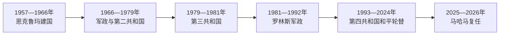

# 加纳的独立建国与现代发展

## 时间

1957年至今

## 概括

夸梅·恩克鲁玛领导群众民族主义，1957年使加纳成为撒哈拉以南首个摆脱欧洲殖民统治的国家。其泛非和工业化项目在1966年政变后中断；多次军政更替后，1992年第四共和国建立稳定选举框架。

## 政权演进图

## 主要政治阶段

| 阶段 | 时间 | 权力结构与特征 |
|---|---|---|
| 恩克鲁玛时期 | 1957—1966年 | 泛非外交、国家工业化和一党化 |
| 军政循环 | 1966—1992年 | 多次政变和短暂文官政府，罗林斯时期实施经济调整 |
| 第四共和国 | 1992年至今 | 总统制多党选举和多次和平轮替 |

## 建国、军政循环与第四共和国

独立时恩克鲁玛任总理，1960年改共和国后任总统。他以沃尔特河工程、国有企业和泛非外交推进快速现代化，同时一党化、预防拘留和外债削弱制度合法性。1966年军警趁其外访政变，之后阿夫里法、布西亚、阿昌庞、阿库福等军政与文官政府交替，经济失衡和军队自任“纠错者”使宪政难稳定。

罗林斯1979年首次政变后短暂交权，1981年再夺权并建立临时全国保卫委员会。其政府先行激进动员，后在财政危机下接受结构调整；1992年新宪法把军政统治转入第四共和国。2000年在野新爱国党胜选实现首次和平政党轮替，之后两大党多次经法院与选举交接。

2012年米尔斯病逝后，副总统马哈马依宪继任；2016年败选、2020年再败选后均接受结果。2024年马哈马胜选并于2025年复任，说明个人可以经选举回归而不必推翻制度。总统兼政府首脑，议会、选举委员会和最高法院是争议处理关键。

## 重要转折

- 1957年3月6日独立，1960年成为共和国。
- 1963年恩克鲁玛参与创建非洲统一组织。
- 1966年军警政变推翻恩克鲁玛。
- 1981年罗林斯第二次政变，后转向经济结构调整。
- 1992年新宪法生效，此后执政党多次通过选举更替。

## 兴衰与制度稳定机制

| 层次 | 因素 | 影响 |
|---|---|---|
| 早期危机 | 可可收入波动、工业化债务与一党化 | 削弱恩克鲁玛政权并为政变提供借口 |
| 军政循环 | 军队派系、通胀和文官政府短命 | 1979、1981年再次中断宪政 |
| 稳定条件 | 任期限制、竞争性两党、法院裁决和军队职业化 | 1992年后实现多次轮替 |
| 持续挑战 | 公债、货币贬值、青年就业和非法采金 | 造成强烈选举惩罚，但尚未摧毁制度框架 |

完整国家元首、军政委员会主席和礼仪元首顺序见[西非独立国家元首与权力结构表](/%E4%BA%BA%E6%96%87%E7%A7%91%E5%AD%A6/%E5%8E%86%E5%8F%B2/%E9%9D%9E%E6%B4%B2/%E8%A5%BF%E9%9D%9E/%E8%A5%BF%E9%9D%9E%E7%8B%AC%E7%AB%8B%E5%9B%BD%E5%AE%B6%E5%85%83%E9%A6%96%E4%B8%8E%E6%9D%83%E5%8A%9B%E7%BB%93%E6%9E%84%E8%A1%A8.md)。截至2026年7月，约翰·德拉马尼·马哈马为总统并兼政府首脑。

## 演变关系

前接[加纳的前殖民社会与殖民统治](/%E4%BA%BA%E6%96%87%E7%A7%91%E5%AD%A6/%E5%8E%86%E5%8F%B2/%E9%9D%9E%E6%B4%B2/%E8%A5%BF%E9%9D%9E/%E5%8A%A0%E7%BA%B3/%E5%89%8D%E6%AE%96%E6%B0%91%E7%A4%BE%E4%BC%9A%E4%B8%8E%E6%AE%96%E6%B0%91%E7%BB%9F%E6%B2%BB.md)。现代国家的边界、行政语言和经济结构继承殖民框架，同时又被本国社会运动、军队、政党与区域组织重新塑造。
