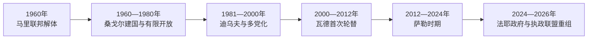

# 塞内加尔的独立建国与现代发展

## 时间

1960年至今

## 概括

塞内加尔与法属苏丹组成马里联邦后于1960年分离，利奥波德·塞达尔·桑戈尔建立以文官行政和温和社会主义为特征的共和国。国家长期保持选举竞争，但卡萨芒斯冲突、青年就业与权力集中问题持续存在。

## 政权演进图

## 主要政治阶段

| 阶段 | 时间 | 权力结构与特征 |
|---|---|---|
| 桑戈尔时期 | 1960—1980年 | 总统制、文化民族主义与有限多党化 |
| 迪乌夫时期 | 1981—2000年 | 经济调整、多党竞争和卡萨芒斯冲突 |
| 政权轮替时代 | 2000年至今 | 选举实现多次执政党更替，社会运动影响政治 |

## 建国、开放与政党轮替

塞内加尔与法属苏丹组成马里联邦并于1960年独立，但桑戈尔与莫迪博·凯塔在联邦权力和安全安排上冲突，联邦数月内解体。塞内加尔最初由总统桑戈尔与政府首脑马马杜·迪亚分权；1962年双方冲突后迪亚被捕，1963年宪法强化总统制。桑戈尔逐步从单党统治开放有限多党，并于1980年底主动辞职，迪乌夫依宪继任。

迪乌夫时期经历1981年冈比亚危机、塞内冈比亚邦联、卡萨芒斯冲突和经济调整。2000年阿卜杜拉耶·瓦德击败执政党，完成首次政党轮替；2012年其争取第三任期引发争议，马基·萨勒胜选。2024年萨勒政府延后选举被宪法委员会纠正，反对派候选人巴西鲁·迪奥马耶·法耶在获释后胜选。

法耶任命乌斯曼·松科为总理，执政党随后赢得议会多数；但两人权力与路线分歧在2026年公开化。法耶2026年5月解除松科职务，任命艾哈迈杜·阿尔阿米努·洛，松科转任国民议会议长。由此形成总统、技术官僚政府与同党议会多数之间的新型制衡和潜在僵局。

## 重要转折

- 1960年6月马里联邦取得独立，同年8月联邦解体后塞内加尔单独建国。
- 1980年桑戈尔主动辞职，由阿卜杜·迪乌夫继任。
- 1982年卡萨芒斯分离冲突开始。
- 2000年和2012年反对党通过选举接替执政党，显示文官政权轮替传统。

## 稳定机制与风险

| 层次 | 因素 | 影响 |
|---|---|---|
| 稳定条件 | 文官军队关系、宪法委员会、政党竞争与宗教教团调停 | 多次危机仍能通过制度交接 |
| 结构矛盾 | 达喀尔集中、青年失业、债务与卡萨芒斯边缘化 | 周期性抗议和地区不满 |
| 直接危机 | 1962权力冲突、2012第三任期争议、2024延选 | 测试宪法规则但未导致军事夺权 |
| 2026重组 | 法耶—松科分裂、政府与议会多数分离 | 可能强化问责，也可能造成政策僵局 |

完整总统与总理序列见[西非独立国家元首与权力结构表](/%E4%BA%BA%E6%96%87%E7%A7%91%E5%AD%A6/%E5%8E%86%E5%8F%B2/%E9%9D%9E%E6%B4%B2/%E8%A5%BF%E9%9D%9E/%E8%A5%BF%E9%9D%9E%E7%8B%AC%E7%AB%8B%E5%9B%BD%E5%AE%B6%E5%85%83%E9%A6%96%E4%B8%8E%E6%9D%83%E5%8A%9B%E7%BB%93%E6%9E%84%E8%A1%A8.md)。截至2026年7月，法耶为总统，艾哈迈杜·阿尔阿米努·穆罕默德·洛为总理，松科任国民议会议长。

## 演变关系

前接[塞内加尔的前殖民社会与殖民统治](/%E4%BA%BA%E6%96%87%E7%A7%91%E5%AD%A6/%E5%8E%86%E5%8F%B2/%E9%9D%9E%E6%B4%B2/%E8%A5%BF%E9%9D%9E/%E5%A1%9E%E5%86%85%E5%8A%A0%E5%B0%94/%E5%89%8D%E6%AE%96%E6%B0%91%E7%A4%BE%E4%BC%9A%E4%B8%8E%E6%AE%96%E6%B0%91%E7%BB%9F%E6%B2%BB.md)。现代国家的边界、行政语言和经济结构继承殖民框架，同时又被本国社会运动、军队、政党与区域组织重新塑造。
