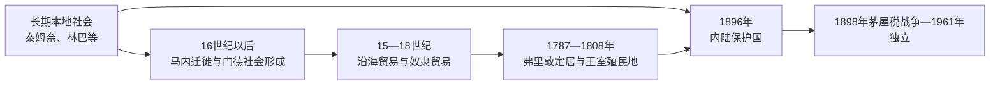

# 塞拉利昂的前殖民社会与殖民统治

## 时间

古代—1961年

## 概括

塞拉利昂内陆由泰姆奈、门德、林巴等社会组成，16世纪马内人迁徙促进军事和政治重组。沿海参与大西洋贸易，班斯岛成为英国奴隶贸易据点；18世纪末弗里敦则被规划为获释黑人定居地。

## 本地演进图

## 社会形成与权力机制

泰姆奈、林巴、洛科、门德等社群以首领、宗族、波罗和桑德社团、村社与贸易联盟治理。16世纪马内武装迁徙带来战争和政治重组，但并非一个王朝一次征服全境。海岸首领控制船舶停靠、象牙和奴隶交易，欧洲商人必须通过条约和中介取得据点。

弗里敦社会由来自英国、北美、牙买加和被英国海军解救的非洲人多批组成，逐渐形成克里奥共同体。其学校、教会和商业网络具有跨西非影响，却与内陆首领制、土地制度和殖民身份等级并存。

## 主要社会与政权

| 社会或政权 | 大致时期 | 特征 |
|---|---|---|
| 泰姆奈、林巴等北部社会 | 长期存在 | 酋邦、农业与区域贸易 |
| 门德及马内后继社会 | 16世纪以后 | 军事协会、秘密结社与南部政治 |
| 沿海舍布罗与布洛姆社会 | 近代早期 | 控制河口与欧洲商贸 |

## 殖民扩张的具体过程

1787年“自由省”定居失败后，1792年新斯科舍黑人建立弗里敦；1800年马龙人到来，1808年英国把定居地改为王室殖民地，并安置截获奴隶船上的获释非洲人。殖民总督直接治理弗里敦半岛，内陆长期仍由本地政体控制。1896年英国为阻挡法军并控制贸易宣布保护国，任命区专员和获承认的最高酋长。

1898年殖民政府征收茅屋税，拜·布雷在北部、门德领袖在南部发动抵抗；镇压后英国强化酋长制和税收。铁路、矿业和出口农业使内陆纳入殖民经济，教育和代表权仍集中弗里敦，克里奥—保护国差异成为独立后政治分野之一。

## 殖民统治

1787年起英国支持在弗里敦安置伦敦黑人穷人、北美黑人保皇派和牙买加马龙。1808年半岛成为王室殖民地和反奴隶贸易海军基地；1896年内陆被宣布为保护国，殖民政府通过酋长制征税。

## 重要事件

- 1670年代起班斯岛成为重要奴隶贸易堡垒。
- 1792年新斯科舍黑人定居者建立弗里敦社区。
- 1808年英国废除奴隶贸易后，海军解救者在弗里敦形成克里奥社会。
- 1898年人头税战争反对保护国征税和殖民干预。

## 征服与殖民结构原因

| 层次 | 因素 | 作用 |
|---|---|---|
| 结构因素 | 多中心首领制、海岸与内陆制度分离 | 让英国以不同条约和行政逐区纳入 |
| 外部压力 | 英法边界竞争、王室海军与殖民军 | 把弗里敦据点扩大为保护国 |
| 经济动机 | 关税、铁路、矿产和劳工控制 | 推动殖民国家深入内陆 |
| 直接触发 | 1896保护国、1898茅屋税 | 引发大规模战争并确立殖民税权 |

本地诸社会没有覆盖全国的单一王朝世系；区域史料见[西非帝国与王国统治者世系表](/%E4%BA%BA%E6%96%87%E7%A7%91%E5%AD%A6/%E5%8E%86%E5%8F%B2/%E9%9D%9E%E6%B4%B2/%E8%A5%BF%E9%9D%9E/%E8%A5%BF%E9%9D%9E%E5%B8%9D%E5%9B%BD%E4%B8%8E%E7%8E%8B%E5%9B%BD%E7%BB%9F%E6%B2%BB%E8%80%85%E4%B8%96%E7%B3%BB%E8%A1%A8.md)。殖民权力分为弗里敦总督／殖民地立法机构与保护地区专员／最高酋长两套，1951年宪制改革后才逐步统一。

## 演变关系

殖民统治把不同社会纳入同一行政边界，并为[塞拉利昂的独立建国与现代发展](/%E4%BA%BA%E6%96%87%E7%A7%91%E5%AD%A6/%E5%8E%86%E5%8F%B2/%E9%9D%9E%E6%B4%B2/%E8%A5%BF%E9%9D%9E/%E5%A1%9E%E6%8B%89%E5%88%A9%E6%98%82/%E7%8B%AC%E7%AB%8B%E5%BB%BA%E5%9B%BD%E4%B8%8E%E7%8E%B0%E4%BB%A3%E5%8F%91%E5%B1%95.md)留下中央机构、出口经济和地区差异。
