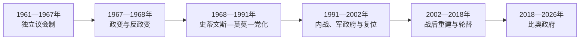

# 塞拉利昂的独立建国与现代发展

## 时间

1961年至今

## 概括

1961年独立后，塞拉利昂经历议会竞争、一党制和军人干政。钻石资源与地方排斥助长1991—2002年内战，革命联合阵线、政府军、民防组织和外部力量造成严重暴力；战后通过选举、真相委员会和特别法庭重建。

## 政权演进图

## 主要政治阶段

| 阶段 | 时间 | 权力结构与特征 |
|---|---|---|
| 独立议会时期 | 1961—1978年 | 政党竞争、军事干预与全体人民大会党上升 |
| 一党与国家衰弱 | 1978—1991年 | 史蒂文斯及后继政府，腐败和地方国家能力下降 |
| 内战与战后共和国 | 1991年至今 | 军政更替、国际干预、和平选举和制度重建 |

## 建国、内战与战后政治

1961年独立时仍以英国君主为元首，米尔顿·马尔盖任总理。1967年反对党胜选后，军方先阻止西亚卡·史蒂文斯就任，随后反政变恢复文官政府；1971年改共和国，史蒂文斯逐步集权并在1978年确立一党制。钻石收益通过庇护网络流失，国家服务和军队能力恶化。

1991年革命联合阵线从利比里亚边境发动战争，利用农村不满、钻石和强迫征募扩张。1992年斯特拉瑟军政府推翻莫莫，1996年比奥宫廷政变后组织选举，卡巴当选；1997年科罗马军政府与联阵结盟推翻卡巴，西共体部队1998年助其复位。1999年《洛美协定》、英国军事介入和联合国解除武装共同促成2002年战争结束。

战后真相与和解委员会、特别法庭和地方政府重建并行。2007、2018年发生政党轮替；比奥政府推动教育政策，但2023年选举结果与透明度遭反对派质疑。国家已避免重返内战，政治暴力、青年失业、毒品问题和财政脆弱仍需持续治理。

## 重要转折

- 1961年4月27日独立。
- 1978年宪法建立一党制。
- 1991年革命联合阵线从利比里亚边境发动叛乱。
- 2002年内战正式结束，随后设立真相与和解委员会及塞拉利昂问题特别法庭。

## 内战原因与和平条件

| 层次 | 因素 | 影响 |
|---|---|---|
| 结构因素 | 一党庇护、农村排斥、军队弱化与钻石走私 | 为叛乱扩张提供人力和资金 |
| 区域因素 | 利比里亚战争、跨境武器与西共体干预 | 既扩大冲突，也最终帮助恢复政府 |
| 直接触发 | 1991年联阵入境、1997年军队政变 | 使国家危机转化为全面战争和首都争夺 |
| 和平机制 | 解除武装、联合国维和、英国安全改革和选举 | 重建最低安全垄断与交接规则 |

完整君主立宪期、军政和共和国元首顺序见[西非独立国家元首与权力结构表](/%E4%BA%BA%E6%96%87%E7%A7%91%E5%AD%A6/%E5%8E%86%E5%8F%B2/%E9%9D%9E%E6%B4%B2/%E8%A5%BF%E9%9D%9E/%E8%A5%BF%E9%9D%9E%E7%8B%AC%E7%AB%8B%E5%9B%BD%E5%AE%B6%E5%85%83%E9%A6%96%E4%B8%8E%E6%9D%83%E5%8A%9B%E7%BB%93%E6%9E%84%E8%A1%A8.md)。1971年后总统兼政府首脑；截至2026年7月，朱利叶斯·马达·比奥任总统。

## 演变关系

前接[塞拉利昂的前殖民社会与殖民统治](/%E4%BA%BA%E6%96%87%E7%A7%91%E5%AD%A6/%E5%8E%86%E5%8F%B2/%E9%9D%9E%E6%B4%B2/%E8%A5%BF%E9%9D%9E/%E5%A1%9E%E6%8B%89%E5%88%A9%E6%98%82/%E5%89%8D%E6%AE%96%E6%B0%91%E7%A4%BE%E4%BC%9A%E4%B8%8E%E6%AE%96%E6%B0%91%E7%BB%9F%E6%B2%BB.md)。现代国家的边界、行政语言和经济结构继承殖民框架，同时又被本国社会运动、军队、政党与区域组织重新塑造。
