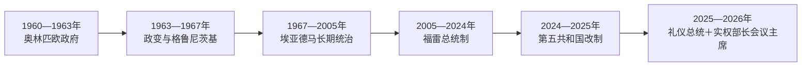

# 多哥的独立建国与现代发展

## 时间

1960年至今

## 概括

法属多哥1960年独立，西尔瓦努斯·奥林匹欧任总统。1963年政变中奥林匹欧遇害，是独立非洲早期军事政变之一；1967年纳辛贝·埃亚德马掌权并长期执政，1990年代开放多党但权力结构延续。

## 政权演进图

## 主要政治阶段

| 阶段 | 时间 | 权力结构与特征 |
|---|---|---|
| 奥林匹欧共和国 | 1960—1963年 | 强调货币与外交自主，军队规模争议加剧 |
| 军事政变与埃亚德马统治 | 1963—2005年 | 1967年后军人一党主导，北部军政网络强化 |
| 多党选举与权力延续 | 1991年至今 | 国民会议推动开放，但总统权力和执政集团延续 |

## 政变、家族统治与第五共和国

奥林匹欧独立后试图保持财政自主并限制退伍军人编入军队，1963年在西非独立国家首次成功军事政变中遇害。格鲁尼茨基任总统但无法控制军队，1967年埃亚德马夺权，建立军队—执政党体系。1990年代全国会议和抗议迫使开放多党制，军队干预、选举争议和反对派分裂仍维持其统治。

埃亚德马2005年去世后，军方先推动其子福雷直接继任；在区域压力下福雷短暂辞职，再经争议选举上台。此后宪法改革、对话和选举没有改变执政党对行政、议会和安全机构的优势。2024年新宪法把总统制改为议会制，核心行政权转给由议会多数产生、可连任的部长会议主席。

2025年让-吕西安·萨维·德托韦由议会选为共和国总统，承担礼仪与代表职能；福雷·纳辛贝转任首任部长会议主席，继续领导政府并掌握行政实权。职位变化因此不是权力轮替，而是长期执政者从总统位移至更强的政府首脑位。

## 重要转折

- 1960年4月27日独立。
- 1963年1月政变中奥林匹欧被杀。
- 1967年埃亚德马政变并建立长期统治。
- 1991年全国主权会议挑战一党体制，随后政治开放受限。
- 2005年埃亚德马去世后，其子福雷·纳辛贝在争议中过渡掌权。

## 统治延续与制度争议

| 层次 | 因素 | 影响 |
|---|---|---|
| 结构基础 | 军队忠诚、执政党地方网络和行政资源 | 支撑纳辛贝家族自1967年以来延续实际统治 |
| 制度调整 | 多党选举、任期规则与2024年议会制宪法 | 改变合法性形式，却未必改变权力集中 |
| 社会压力 | 城市抗议、侨民与反对党联盟 | 迫使局部改革，但镇压与组织分裂限制效果 |
| 直接转折 | 1963、1967政变；2005继承危机；2025职位转换 | 构成政权连续性的关键节点 |

完整国家元首及2025年后的双层角色见[西非独立国家元首与权力结构表](/%E4%BA%BA%E6%96%87%E7%A7%91%E5%AD%A6/%E5%8E%86%E5%8F%B2/%E9%9D%9E%E6%B4%B2/%E8%A5%BF%E9%9D%9E/%E8%A5%BF%E9%9D%9E%E7%8B%AC%E7%AB%8B%E5%9B%BD%E5%AE%B6%E5%85%83%E9%A6%96%E4%B8%8E%E6%9D%83%E5%8A%9B%E7%BB%93%E6%9E%84%E8%A1%A8.md)。截至2026年7月，萨维·德托韦是法定国家元首，福雷·纳辛贝以部长会议主席身份担任政府首脑和实际行政中心。

## 演变关系

前接[多哥的前殖民社会与殖民统治](/%E4%BA%BA%E6%96%87%E7%A7%91%E5%AD%A6/%E5%8E%86%E5%8F%B2/%E9%9D%9E%E6%B4%B2/%E8%A5%BF%E9%9D%9E/%E5%A4%9A%E5%93%A5/%E5%89%8D%E6%AE%96%E6%B0%91%E7%A4%BE%E4%BC%9A%E4%B8%8E%E6%AE%96%E6%B0%91%E7%BB%9F%E6%B2%BB.md)。现代国家的边界、行政语言和经济结构继承殖民框架，同时又被本国社会运动、军队、政党与区域组织重新塑造。
