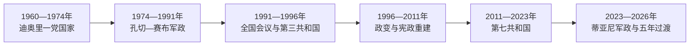

# 尼日尔的独立建国与现代发展

## 时间

1960年至今

## 概括

尼日尔1960年独立，哈马尼·迪奥里建立一党政府。铀矿、干旱和城乡差距影响国家财政，1974年政变后军政反复。1990年代图阿雷格叛乱与多党化同时展开，21世纪又面临萨赫勒跨境武装和政变。

## 政权演进图

## 主要政治阶段

| 阶段 | 时间 | 权力结构与特征 |
|---|---|---|
| 迪奥里第一共和国 | 1960—1974年 | 一党统治、亲法外交和旱灾压力 |
| 军人统治与民主过渡 | 1974—1999年 | 多次政变、全国会议和短暂宪政 |
| 第五至第七共和国与政变 | 1999年至今 | 选举制度重建，安全危机加剧，2010和2023年再现军事夺权 |

## 军政循环、安全危机与区域转向

迪奥里以一党制和对法关系建国，1973—1974年旱灾、救济腐败和军队不满促成孔切政变。孔切建立军事统治，赛布继任后在社会压力下同意1991年全国主权会议。第三共和国出现总统—总理“共治”冲突，1996年迈纳萨拉政变；1999年其在机场政变中被杀，万凯过渡后恢复选举。

坦贾1999年上台，2009年以公投延长任期造成宪政危机，2010年军方推翻他并于2011年交权。伊素福两届后在2021年把总统职位交给巴祖姆，是尼日尔首次民选交接；但西部和东南部武装袭击扩大，安全合作、军队伤亡与反法情绪加深。

2023年总统卫队扣押巴祖姆，蒂亚尼领导保卫祖国国家委员会。区域制裁未能迫使复位；尼日尔同马里、布基纳法索建立萨赫勒国家联盟，并于2025年正式退出西非国家经济共同体。2025年蒂亚尼宣誓为“共和国总统”，启动五年过渡；这不是民选交接，截至2026年7月军队委员会仍是实际权力来源。

## 重要转折

- 1960年8月3日独立。
- 1974年赛义尼·孔切政变推翻迪奥里。
- 1991年全国主权会议推动多党化。
- 1990年代图阿雷格反叛以和平协议暂告结束。
- 2010年军方推翻延长任期的坦贾；2023年总统卫队再次夺权。

## 危机原因与权力结构

| 层次 | 因素 | 影响 |
|---|---|---|
| 结构因素 | 铀依赖、贫困、人口增长和边疆国家能力不足 | 使财政与安全承压 |
| 军政关系 | 总统卫队和军队掌握强制资源 | 政治争端可迅速转化为政变 |
| 外部压力 | 跨境武装、法国／美国驻军、区域制裁与新伙伴 | 加剧主权争论并改变外交方向 |
| 直接触发 | 1974旱灾危机、2010延任、2023卫队扣押总统 | 分别开启三轮军政转折 |

完整元首和过渡主席顺序见[西非独立国家元首与权力结构表](/%E4%BA%BA%E6%96%87%E7%A7%91%E5%AD%A6/%E5%8E%86%E5%8F%B2/%E9%9D%9E%E6%B4%B2/%E8%A5%BF%E9%9D%9E/%E8%A5%BF%E9%9D%9E%E7%8B%AC%E7%AB%8B%E5%9B%BD%E5%AE%B6%E5%85%83%E9%A6%96%E4%B8%8E%E6%9D%83%E5%8A%9B%E7%BB%93%E6%9E%84%E8%A1%A8.md)。截至2026年7月，阿卜杜拉赫曼·蒂亚尼任过渡期共和国总统；总理由其任命，安全委员会保有最终权力。

## 演变关系

前接[尼日尔的前殖民社会与殖民统治](/%E4%BA%BA%E6%96%87%E7%A7%91%E5%AD%A6/%E5%8E%86%E5%8F%B2/%E9%9D%9E%E6%B4%B2/%E8%A5%BF%E9%9D%9E/%E5%B0%BC%E6%97%A5%E5%B0%94/%E5%89%8D%E6%AE%96%E6%B0%91%E7%A4%BE%E4%BC%9A%E4%B8%8E%E6%AE%96%E6%B0%91%E7%BB%9F%E6%B2%BB.md)。现代国家的边界、行政语言和经济结构继承殖民框架，同时又被本国社会运动、军队、政党与区域组织重新塑造。
