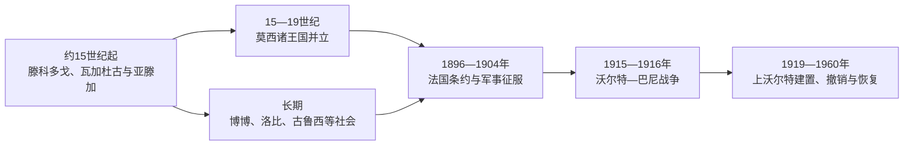

# 布基纳法索的前殖民社会与殖民统治

## 时间

古代—1960年

## 概括

布基纳法索地区以莫西诸王国最著名。约15世纪起，瓦加杜古、亚滕加、滕科多戈等王国由莫戈纳巴和地方纳巴统治，凭骑兵、贡赋与村社农业维持数百年；西部还有博博、洛比、古鲁西等社会。

## 本地演进图

## 王国形成与统治机制

莫西政治传统以纳巴王权、骑兵贵族、土地祭司和村社生产之间的分工为核心。莫戈纳巴是瓦加杜古王国最高象征，但亚滕加、滕科多戈等有各自王统，不构成一个中央集权帝国。王族分封便于扩张，也造成众多地方宫廷；土地祭司保留先住社群的宗教与土地合法性。

西部博博、洛比、古鲁西等社会有不同程度的村社联盟、年龄级和祭祀权威。莫西长期抵御马里、桑海等外部完全征服，靠的不只是骑兵，也包括分散政治和地方农业供给。

## 主要社会与政权

| 社会或政权 | 大致时期 | 特征 |
|---|---|---|
| 滕科多戈王国 | 约15世纪起 | 莫西建国传统的重要中心 |
| 瓦加杜古王国 | 约15—19世纪 | 莫戈纳巴王权与中部政治核心 |
| 亚滕加王国 | 约15—19世纪 | 北部骑兵国家，连接萨赫勒 |
| 博博、洛比与古鲁西社会 | 西部与南部 | 分散权力、农业和地方宗教 |

## 殖民征服与行政拆分的具体过程

法国从法属苏丹和科特迪瓦方向推进，1896年迫使瓦加杜古莫戈纳巴接受保护，并以条约、军事威胁和逐地远征控制其他王国。地方首领并非统一投降，西部抵抗延续。1915年征兵、税收和行政干预触发沃尔特—巴尼战争，跨族群村社摧毁殖民据点并组织大规模军队；法国调集多地兵力至1916年镇压。

1919年法国设上沃尔特殖民地；1932年为调配劳工和降低行政成本，将其分给科特迪瓦、法属苏丹和尼日尔，大量劳工被征往种植园。1947年在地方精英和传统权威要求下恢复领土，说明现代边界本身也曾受殖民劳动力政策摆布。

## 殖民统治

法国1896年迫使瓦加杜古接受保护并逐步征服各地。1919年建立上沃尔特殖民地，1932年为行政和劳动力需要被分给邻地，1947年恢复。大量劳工被征往科特迪瓦种植园和殖民工程。

## 重要事件

- 莫西王国长期抵御桑海等萨赫勒帝国的完全征服。
- 1896年法军进入瓦加杜古，莫西王权失去主权。
- 1915—1916年沃尔特—巴尼战争成为法属西非规模最大的反征兵、反征税起义之一。
- 1947年上沃尔特殖民地恢复，为独立领土奠定边界。

## 王国衰落与殖民统治原因

| 层次 | 因素 | 作用 |
|---|---|---|
| 结构因素 | 莫西诸国并立、王族分封和西部多中心社会 | 阻止单一“首都投降”代表全境，也妨碍统一防御 |
| 外部压力 | 法军多方向推进、火器和邻地后勤 | 逐区压服王国 |
| 殖民矛盾 | 征兵、税收、劳役与首领权力重塑 | 促成1915—1916年广泛起义 |
| 直接节点 | 1896瓦加杜古保护条约、1919建殖民地、1932拆分、1947恢复 | 决定殖民主权与现代领土框架 |

莫西各王国王表长且地方版本不同，本页不把多位晚期统治者压缩成模糊合称；跨区域已核实序列与史料说明见[西非帝国与王国统治者世系表](/%E4%BA%BA%E6%96%87%E7%A7%91%E5%AD%A6/%E5%8E%86%E5%8F%B2/%E9%9D%9E%E6%B4%B2/%E8%A5%BF%E9%9D%9E/%E8%A5%BF%E9%9D%9E%E5%B8%9D%E5%9B%BD%E4%B8%8E%E7%8E%8B%E5%9B%BD%E7%BB%9F%E6%B2%BB%E8%80%85%E4%B8%96%E7%B3%BB%E8%A1%A8.md)。殖民权力为法国总督／副总督—区长—获承认纳巴或酋长，传统职位在失去主权后仍参与地方治理。

## 演变关系

殖民统治把不同社会纳入同一行政边界，并为[布基纳法索的独立建国与现代发展](/%E4%BA%BA%E6%96%87%E7%A7%91%E5%AD%A6/%E5%8E%86%E5%8F%B2/%E9%9D%9E%E6%B4%B2/%E8%A5%BF%E9%9D%9E/%E5%B8%83%E5%9F%BA%E7%BA%B3%E6%B3%95%E7%B4%A2/%E7%8B%AC%E7%AB%8B%E5%BB%BA%E5%9B%BD%E4%B8%8E%E7%8E%B0%E4%BB%A3%E5%8F%91%E5%B1%95.md)留下中央机构、出口经济和地区差异。
