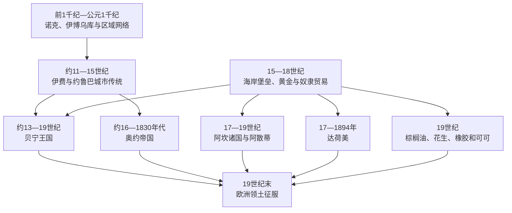

# 森林王国、城邦与大西洋沿岸

## 时间

约公元前2千纪至19世纪末

## 概括

西非森林带、森林—草原交界和大西洋沿岸拥有独立于萨赫勒帝国的城市化与国家传统。诺克文化、伊博乌库、伊费、贝宁、奥约、阿坎诸国、阿散蒂、达荷美和尼日尔三角洲城邦分别依靠农业、冶铁、黄金、可乐果、布匹、盐、河运与区域市场发展。森林不是隔绝带：曼丁—朱拉、豪萨和阿坎商人把萨赫勒盐与布匹送往南方，再把黄金和可乐果运往北方。

15世纪末欧洲船只抵达后，沿海社会没有立刻被殖民。葡萄牙、荷兰、英国、丹麦、法国等先在得到地方许可的据点和堡垒中竞争，非洲国家在数百年内仍控制大部分土地、市场和奴隶来源。大西洋对奴隶的巨量需求、火器和信贷改变了国家财政与战争，影响因地区和时期而异。19世纪废止奴隶贸易后，棕榈油、花生、橡胶和可可等“合法贸易”扩大，却常沿用债务、奴役和强制劳动关系，并为欧洲从海上贸易转向领土征服提供新理由。

## 环境与区域网络

| 空间 | 主要生产与交通 | 典型政治形态 |
|---|---|---|
| 森林—草原交界 | 山药、谷物、可乐果、黄金、林产品及南北商路 | 伊费、奥约、博诺、阿散蒂等城市或王国 |
| 尼日尔河下游 | 农业、冶铁、河运、工艺和内陆市场 | 诺克区域社会、伊费—约鲁巴城市网络 |
| 贝宁湾 | 泻湖、港口、布匹、胡椒、象牙、奴隶和棕榈油 | 贝宁、达荷美、伊杰布、沿海城邦 |
| 黄金海岸 | 黄金、可乐果、森林农业、沿海堡垒 | 阿坎诸国、芳蒂联盟、阿散蒂邦联 |
| 尼日尔三角洲 | 渔业、盐、河海转运、奴隶和棕榈油 | 邦尼、卡拉巴里、内姆贝、奥波博等“独木舟家族”城市 |
| 上几内亚海岸 | 稻作、铁器、河口贸易及曼丁网络 | 特姆内、门德、卡布及多种酋邦和商人聚落 |

城市、族群和国家名称不能互相替代。“约鲁巴”涵盖共享语言文化的多个城市和王国，不曾始终由一个国家统治；“阿坎”包括阿散蒂、芳蒂、阿夸穆、登基拉、博诺等不同政治体；尼日利亚境内的贝宁王国与现代贝宁共和国也不是同一国家。

## 城市与国家的发展

### 诺克、伊博乌库与早期区域中心

今尼日利亚中部诺克文化约在公元前1千纪以陶塑和冶铁著称，年代上限与社会组织仍随考古发现调整。大型人物陶塑说明专业工艺和仪式传统，却没有证据证明诺克是一个统一“帝国”，也不能把它直接认作后来所有西非王国的祖先。

今尼日利亚东南部伊博乌库的9世纪墓葬和窖藏出土精细失蜡法铜器、珠饰及远距离材料，显示没有宏大王宫或中央帝国也能形成高水平专业生产和贸易网络。其政治结构可能更接近有称号社团、祭司和村落联盟的复杂社会，提醒人们不要只用中央集权王国衡量文明。

### 伊费与约鲁巴城市传统

伊费约自6世纪前后由多个聚落发展，11—15世纪成为人口密集的宗教和艺术中心。12—15世纪的陶塑、铜合金与石雕以高度自然主义著称。约鲁巴传统把伊费视为世界创生地和奥杜杜瓦王统的源头；多个王室通过声称源出伊费取得戴珠冠的合法性。口述谱系表达政治—宗教关系，不等于每位城市君主都能按现代年代无争议地排列。

伊费的奥尼兼具神圣和政治角色，城市内部则有首领、宗教社团、市场妇女与各聚落权威。伊费影响贝宁、奥沃、伊杰布及其他约鲁巴城市的王权礼仪和艺术，但相似制度既来自交流、通婚和模仿，也可能来自战争与后来重写的共同祖源。

### 奥约帝国

奥约约在中世纪后期形成，传统把创建者奥兰米扬视为伊费王子。16世纪受努佩攻击后，王室一度流亡并重建，以北部草原的骑兵优势、南方城市贡赋和贸易通道扩张。17—18世纪，奥约控制或影响从尼日尔河到贝宁湾的大量约鲁巴和非约鲁巴政体，达荷美也长期向其纳贡。

奥约不是无限君主制。阿拉芬为国王，奥约梅西贵族会议以巴绍伦为首，可要求失去信任的国王自尽；奥格博尼宗教—长老组织、军事统帅阿雷—奥纳—卡坎福、各城市首领和省级统治者共同制衡。制度避免王权完全独断，却也在18世纪末因巴绍伦加哈专权、王位频繁更换和军队统帅割据陷入危机。伊洛林统帅阿丰贾引入富拉尼—穆斯林盟军后失去控制，索科托体系在伊洛林建立埃米尔国；奥约旧都约1830年代被放弃，王室南迁新奥约。帝国瓦解引发约鲁巴战争、人口迁徙和伊巴丹等新军事城市兴起。

### 贝宁王国

贝宁核心为埃多人自称的“埃多”国家。早期奥吉索王系年代主要来自口述传统；约13世纪前后，传统称埃多首领从伊费邀请奥兰米扬，其子埃韦卡建立延续至今的奥巴王系。15世纪奥巴埃武阿雷重组宫廷、军队和道路，扩大城墙与壕沟体系，使贝宁成为区域强国。奥巴兼具最高祭司、司法与军事权，世袭乌扎马首领、宫廷首领、城市首领和专业行会分担加冕、贡赋、外交和工艺生产。

葡萄牙人在15世纪末建立外交贸易关系。贝宁输出胡椒、象牙、布匹和后来更多奴隶，输入铜、珊瑚、火器及奢侈品。宫廷铜牌、纪念头像和象牙记录奥巴、王母、官员、战争及外来者，不只是装饰。贸易政策随君主和市场变化，某些时期王室限制男性奴隶出口，说明国家不是被动接受欧洲要求。

17—19世纪，继承冲突、地方首领和沿海中间商崛起削弱奥巴对贸易的控制，但王国仍保持主权。1897年，一支未经充分许可前往贝宁城的英国队伍遭伏击，多数成员被杀；英国随即发动“惩罚远征”，焚掠宫殿、流放奥巴奥冯拉姆文，并把大量王室艺术品带往海外。殖民当局1914年恢复奥巴职位，但其政治主权已被英属尼日利亚取代。

### 阿坎诸国与阿散蒂

森林黄金、可乐果和北方贸易促成博诺等早期阿坎国家。17世纪登基拉、阿夸穆和沿海芳蒂等彼此竞争，并同欧洲堡垒贸易。约1701年，库马西周边阿散蒂首领在奥塞·图图和祭司奥孔福·阿诺基领导下击败登基拉。金凳被视为整个阿散蒂共同体的灵魂，为各母系“凳位”组成的邦联提供高于单一家族的象征。

阿散蒂王“阿散蒂赫内”由合资格王族中的候选者产生，王母在提名和谱系中地位关键；库马西议事会、各地阿曼赫内和地方凳位保留权力。中央通过道路、使节、军队、贡赋和金粉货币协调广阔属地。黄金、农业、奴隶劳动及向海岸输出黄金和奴隶支撑扩张，欧洲火器反过来增强战争能力。阿散蒂并未直接占领每座海岸堡垒，而是争夺通往芳蒂中间地带和欧洲市场的路线。

19世纪五次英阿散蒂战争逐步改变力量。1824年阿散蒂军在恩萨曼科击败英军并杀死总督麦卡锡；1874年英军攻入库马西并焚毁部分城市；1896年普雷姆佩一世被放逐，王国受保护国控制；1900年英国要求交出金凳，引发由亚阿散蒂瓦领导的最后大规模战争。1901年阿散蒂被正式并入黄金海岸，1935年传统邦联在殖民框架内恢复，王位延续为文化和地方权威。

### 达荷美王国

今贝宁南部的阿贾—丰政治世界包括塔多、阿拉达、维达和阿波美。约17世纪，丰人王室在阿波美建立达荷美。韦格巴贾强化王宫、土地和年度礼仪；阿加贾于1724年征服阿拉达、1727年占领维达，取得大西洋出口，却很快遭更强的奥约迫使纳贡。直到19世纪20年代达荷美才摆脱奥约宗主。

国王依靠宫廷男性官员、与其对应的女性职官、各省首领、税吏和常备军治理。王母或女性共治角色“克波吉托”可拥有独立宗教与政治资源；被欧洲人称作“亚马逊”的女兵团是王室军队的一部分，现代常称阿戈杰。年度礼仪既确认祖先、贡赋与官员问责，也伴随处刑和奴隶分配。

奴隶出口成为达荷美重要财政来源，但国家经济还包括农业、棕榈产品、国内奴役和区域贸易。19世纪英国反奴隶贸易压力下，盖佐和格莱时期扩大棕榈油，同时奴隶出口与内部奴役并未立即终止。1890年、1892—1894年法国以科托努、波多诺伏争端为由发动战争，贝汉津抵抗失败后被流放；继任者阿戈利—阿格博在法国保护下短暂保留，1900年被废，王国主权终结。

### 尼日尔三角洲与沿海城邦

邦尼、卡拉巴里、内姆贝、埃菲克旧卡拉巴尔、伊策基里瓦里和19世纪的奥波博依靠水道而非大片领土。由商人领袖、亲属、客户和被奴役者组成的“独木舟家族”承担贸易、战争和社会吸纳。财富能让外来者和被奴役者后代上升，但家族纪律和债务也带有强制。18世纪奴隶出口扩大，19世纪棕榈油成为主业；欧洲商人试图绕过非洲中间商，领事、炮舰和公司逐步干预继承与市场。奥波博首领贾贾因抵制英国定价和直接贸易，于1887年被诱捕流放，体现商业条约向殖民主权转化。

## 大西洋贸易的分阶段变化

### 黄金、象牙与早期堡垒

葡萄牙航海者15世纪后期抵达，1482年在埃尔米纳建堡，首先寻求黄金、象牙、胡椒和绕开撒哈拉中间商的航路。荷兰、英国、丹麦、勃兰登堡和法国后来在黄金海岸建立密集堡垒。堡垒通常占地有限，必须向沿海统治者租地、缴纳礼物并依赖非洲商人取得粮食和货物；欧洲竞争反而让地方国家可以转换伙伴。

### 奴隶贸易扩大

美洲种植园和矿业需求使17—18世纪奴隶出口急剧增加。被奴役者来自战争俘虏、绑架、司法判决、债务或向市场层层转卖，来源可远离海岸。非洲统治者与商人拥有决策和获利空间，但这种“能动性”不能消除大西洋体系由外部巨量需求、船运资本和种族化世袭奴隶制推动的结构。战争、人口损失、性别比例变化和政治集中在一些地区十分严重，另一些地区则回避贸易、保护人口或从替代商品获利，影响并不均一。

### 废奴与商品出口

英国1807年禁止本国奴隶贸易，随后以海军巡逻、条约和封锁压制大西洋贩运；巴西、古巴等市场使非法贸易延续到19世纪后期。棕榈油用于工业润滑和肥皂，塞内冈比亚花生、森林橡胶和黄金海岸可可逐渐扩大。所谓“合法贸易”没有自动带来自由劳动：奴隶、抵押人、家庭附属者和被征发劳工继续生产和运输。传教学校、克里奥 / 塞拉利昂商人、巴西归侨和拉各斯知识阶层形成新的政治文化，同时欧洲以保护贸易和废奴为名加强领土干预。

1787年后弗里敦数次安置来自大西洋世界的自由黑人，1808年成为英国直辖殖民地和截获奴隶船获释者的安置中心；1822年起美国殖民协会在利比里亚海岸建立定居点，1847年成立共和国。塞拉利昂克里奥与利比里亚美裔定居者都发展出跨大西洋制度，却长期同内陆多数社群存在土地、权力和身份不平等。

## 统治结构比较

| 政体类型 | 最高权力 | 制衡与地方治理 | 经济基础 |
|---|---|---|---|
| 约鲁巴城市与奥约 | 奥尼、阿拉芬等神圣君主 | 贵族会议、奥格博尼、城市首领、军事统帅 | 农业、手工业、贡赋和南北贸易 |
| 贝宁 | 奥巴 | 乌扎马、宫廷与城市首领、专业行会 | 贡赋、胡椒、象牙、布匹、奴隶和艺术生产 |
| 阿散蒂邦联 | 阿散蒂赫内与王母 | 库马西议事会、各阿曼赫内、母系凳位 | 黄金、农业、贡赋、奴隶劳动与海岸贸易 |
| 达荷美 | 阿波美国王 | 男女性对应官员、省长、王母 / 克波吉托与军队 | 农业、奴隶出口、棕榈油和王室工场 |
| 三角洲城邦 | 阿曼亚纳博、奥卢或商人首领 | 独木舟家族、长老、商业联盟 | 河海转运、奴隶与棕榈油 |
| 无中央社会与村落联盟 | 长老、称号社团、祭司等多中心权威 | 亲属、年龄级、秘密社团和村会 | 农业、工艺与区域市场 |

## 重要事件

| 时间 | 事件 | 结果与意义 |
|---|---|---|
| 约9世纪 | 伊博乌库铜器与贸易网络 | 显示无大帝国背景下也有复杂工艺、仪式与远距交换 |
| 12—15世纪 | 伊费艺术和神圣王权高峰 | 影响约鲁巴、贝宁、奥沃等宫廷文化 |
| 15世纪 | 埃武阿雷重组贝宁 | 扩大都城、军队和王权，形成区域强国 |
| 1482年 | 葡萄牙建立埃尔米纳堡 | 海上黄金贸易制度化，欧洲堡垒竞争开始 |
| 17—18世纪 | 大西洋奴隶贸易高峰 | 战争、财政和人口结构被重塑 |
| 约1701年 | 阿散蒂击败登基拉 | 以金凳和邦联制度建立内陆强国 |
| 1724—1727年 | 达荷美征服阿拉达、维达 | 取得大西洋出口，后受奥约宗主约束 |
| 1807年以后 | 英国废奴与海军拦截 | 奴隶贸易转入非法，棕榈油等商品出口上升 |
| 1874年 | 英军攻入库马西 | 阿散蒂失去部分南方属地，英国领土扩张加快 |
| 1887年 | 奥波博贾贾被流放 | 英国突破三角洲中间商控制 |
| 1892—1894年 | 法国征服达荷美 | 贝汉津流亡，王国转为殖民统治 |
| 1897年 | 英国攻陷贝宁城 | 奥巴被逐、宫廷艺术被掠，贝宁主权终结 |
| 1900—1901年 | 金凳战争与阿散蒂并入 | 阿散蒂军事抵抗失败，传统权威后来在殖民体制内恢复 |

## 崛起与衰落机制

### 崛起条件

- 森林黄金、可乐果和农产品同萨赫勒盐、布匹和马匹形成生态互补。
- 城市首领、市场和行会组织专业工艺，王室以礼仪和祖先崇拜整合不同社群。
- 阿散蒂邦联、奥约制衡和三角洲家族等制度允许中心动员资源，又保留地方精英合作。
- 海岸贸易提供铜、火器和信贷，但强国必须先掌握内陆生产与交通，不能只靠一座欧洲堡垒。

### 衰落与征服

| 层次 | 因素 | 作用 |
|---|---|---|
| 结构因素 | 继承争议、贵族制衡转为夺权、属国反叛 | 奥约和贝宁等在外敌到来前已出现财政和军事离心 |
| 贸易变化 | 奴隶贸易禁令、商品替代、欧洲试图绕开中间商 | 削弱依赖单一出口或海岸通道的统治集团 |
| 区域战争 | 约鲁巴内战、英阿散蒂战争、达荷美—邻国冲突 | 消耗人口与财政，也给欧洲结盟和干预机会 |
| 技术与后勤 | 蒸汽炮舰、速射武器、医学和海底电报 | 19世纪后期欧洲能持续深入内陆，而不再局限堡垒 |
| 直接触发 | 条约争端、使团遇袭、保护国要求和拒绝开放市场 | 被殖民者用作征服借口，但战争目标通常是主权和贸易控制 |

## 史料与争议

- 伊费、贝宁、奥约和阿散蒂王统依靠口述谱系、宫廷艺术、考古及外来记录相互校验；早期具体在位年常不能精确到现代年表。
- “贝宁青铜器”多为黄铜，也包括象牙、木器等宫廷作品；1897年散失物既是艺术品，也是王朝档案与被掠文化财产。
- 女兵团并非整个达荷美社会的“女性平等”证明；女性军人与官员拥有权力，同时普通妇女、俘虏和奴隶仍处于等级制度中。
- 非洲国家参与奴隶贸易与欧洲殖民责任并不互相抵消。必须同时说明本地政治选择、被奴役者遭遇和大西洋资本—种植园需求。
- “无中央社会”不等于无秩序，其司法、土地和安全可由亲属、年龄级、宗教社团和村会共同维持。

## 统治者世系

跨国帝国与王国的完整可确认序列、共治／摄政和争议年代集中见[西非帝国与王国统治者世系表](/%E4%BA%BA%E6%96%87%E7%A7%91%E5%AD%A6/%E5%8E%86%E5%8F%B2/%E9%9D%9E%E6%B4%B2/%E8%A5%BF%E9%9D%9E/%E8%A5%BF%E9%9D%9E%E5%B8%9D%E5%9B%BD%E4%B8%8E%E7%8E%8B%E5%9B%BD%E7%BB%9F%E6%B2%BB%E8%80%85%E4%B8%96%E7%B3%BB%E8%A1%A8.md)。没有保存连续王表的瓦加杜、早期奥约等节点不以推测补齐。

## 演变关系

- 平行主线：[萨赫勒帝国与跨撒哈拉贸易](/%E4%BA%BA%E6%96%87%E7%A7%91%E5%AD%A6/%E5%8E%86%E5%8F%B2/%E9%9D%9E%E6%B4%B2/%E8%A5%BF%E9%9D%9E/%E8%90%A8%E8%B5%AB%E5%8B%92%E5%B8%9D%E5%9B%BD%E4%B8%8E%E8%B7%A8%E6%92%92%E5%93%88%E6%8B%89%E8%B4%B8%E6%98%93.md)
- 后续：[伊斯兰改革、殖民征服与独立](/%E4%BA%BA%E6%96%87%E7%A7%91%E5%AD%A6/%E5%8E%86%E5%8F%B2/%E9%9D%9E%E6%B4%B2/%E8%A5%BF%E9%9D%9E/%E4%BC%8A%E6%96%AF%E5%85%B0%E6%94%B9%E9%9D%A9%E3%80%81%E6%AE%96%E6%B0%91%E5%BE%81%E6%9C%8D%E4%B8%8E%E7%8B%AC%E7%AB%8B.md)
- 国家视角：[尼日利亚](/%E4%BA%BA%E6%96%87%E7%A7%91%E5%AD%A6/%E5%8E%86%E5%8F%B2/%E9%9D%9E%E6%B4%B2/%E8%A5%BF%E9%9D%9E/%E5%B0%BC%E6%97%A5%E5%88%A9%E4%BA%9A/README.md)、[加纳](/%E4%BA%BA%E6%96%87%E7%A7%91%E5%AD%A6/%E5%8E%86%E5%8F%B2/%E9%9D%9E%E6%B4%B2/%E8%A5%BF%E9%9D%9E/%E5%8A%A0%E7%BA%B3/README.md)、[贝宁共和国](/%E4%BA%BA%E6%96%87%E7%A7%91%E5%AD%A6/%E5%8E%86%E5%8F%B2/%E9%9D%9E%E6%B4%B2/%E8%A5%BF%E9%9D%9E/%E8%B4%9D%E5%AE%81/README.md)、[塞拉利昂](/%E4%BA%BA%E6%96%87%E7%A7%91%E5%AD%A6/%E5%8E%86%E5%8F%B2/%E9%9D%9E%E6%B4%B2/%E8%A5%BF%E9%9D%9E/%E5%A1%9E%E6%8B%89%E5%88%A9%E6%98%82/README.md)、[利比里亚](/%E4%BA%BA%E6%96%87%E7%A7%91%E5%AD%A6/%E5%8E%86%E5%8F%B2/%E9%9D%9E%E6%B4%B2/%E8%A5%BF%E9%9D%9E/%E5%88%A9%E6%AF%94%E9%87%8C%E4%BA%9A/README.md)
- 上级入口：[西非历史](/%E4%BA%BA%E6%96%87%E7%A7%91%E5%AD%A6/%E5%8E%86%E5%8F%B2/%E9%9D%9E%E6%B4%B2/%E8%A5%BF%E9%9D%9E/README.md)
