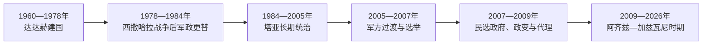

# 毛里塔尼亚的独立建国与现代发展

## 时间

1960年至今

## 概括

1960年独立后，国家在摩尔人、哈拉廷群体和塞内加尔河谷族群之间构建统一认同。西撒哈拉战争压力引发1978年政变，此后军人政治、民主化尝试、反奴役运动与萨赫勒安全问题交织。

## 政权演进图

## 主要政治阶段

| 阶段 | 时间 | 权力结构与特征 |
|---|---|---|
| 达达赫执政 | 1960—1978年 | 一党建国，参与西撒哈拉战争后被军方推翻 |
| 军人统治与制度反复 | 1978—2007年 | 多次政变，1981年宣布废除奴隶制后继续推进法律改革 |
| 选举与军政并存 | 2007年至今 | 出现民选政府与政变更替，反奴役和族群平等仍是核心议题 |

## 建国、战争与军政制度化

独立时摩洛哥一度主张毛里塔尼亚属于其领土，达达赫通过外交承认、党国建设和新首都巩固国家。1975年同摩洛哥分割西属撒哈拉南部，波利萨里奥阵线袭击铁路和城市，战争开支、军队扩张与经济危机直接导致1978年政变；军政府随后退出战争并承认西撒哈拉主权主张。

塔亚1984年政变上台，实行长期军人—总统统治。1989年同塞内加尔边境冲突演变为族群暴力、驱逐和河谷土地危机；1991年形式多党化未结束行政优势与镇压。2005年瓦勒军政府组织2007年选举，阿卜杜拉希成为民选总统，却在2008年试图调整军方高层后被阿齐兹推翻。

阿齐兹经2009年选举执政并于2019年把权力交给加兹瓦尼，是同一安全精英内部的首次有序交接。加兹瓦尼2024年连任；政府维持相对安全并扩大社会项目，但反奴役运动、哈拉廷政治代表、河谷群体平等和前总统腐败案仍检验法治。

## 重要转折

- 1960年11月28日宣布独立。
- 1978年军方推翻达达赫政府并逐步退出西撒哈拉战争。
- 1981年以法令废除奴隶制，2007年后进一步将奴役行为入罪。
- 2008年政变后重新举行选举，国家同时面对萨赫勒安全与经济多元化问题。

## 军政兴衰与社会结构

| 层次 | 因素 | 影响 |
|---|---|---|
| 结构因素 | 军队建国作用、铁矿出口与社会等级 | 使安全精英掌握财政和政治中枢 |
| 外部压力 | 西撒哈拉战争、萨赫勒武装与区域迁徙 | 1978年引发政变，后来推动安全国家化 |
| 社会矛盾 | 奴役遗产、土地和语言／族群代表 | 法律废奴后仍持续政治动员 |
| 直接转折 | 1978战争失败、2008军方人事冲突、2019内部交接 | 解释政变与稳定并存 |

完整国家元首和过渡角色见[西非独立国家元首与权力结构表](/%E4%BA%BA%E6%96%87%E7%A7%91%E5%AD%A6/%E5%8E%86%E5%8F%B2/%E9%9D%9E%E6%B4%B2/%E8%A5%BF%E9%9D%9E/%E8%A5%BF%E9%9D%9E%E7%8B%AC%E7%AB%8B%E5%9B%BD%E5%AE%B6%E5%85%83%E9%A6%96%E4%B8%8E%E6%9D%83%E5%8A%9B%E7%BB%93%E6%9E%84%E8%A1%A8.md)。设总理管理内阁，但总统控制国防、外交和高级任命；截至2026年7月，加兹瓦尼任总统。

## 演变关系

前接[毛里塔尼亚的前殖民社会与殖民统治](/%E4%BA%BA%E6%96%87%E7%A7%91%E5%AD%A6/%E5%8E%86%E5%8F%B2/%E9%9D%9E%E6%B4%B2/%E8%A5%BF%E9%9D%9E/%E6%AF%9B%E9%87%8C%E5%A1%94%E5%B0%BC%E4%BA%9A/%E5%89%8D%E6%AE%96%E6%B0%91%E7%A4%BE%E4%BC%9A%E4%B8%8E%E6%AE%96%E6%B0%91%E7%BB%9F%E6%B2%BB.md)。现代国家的边界、行政语言和经济结构继承殖民框架，同时又被本国社会运动、军队、政党与区域组织重新塑造。
