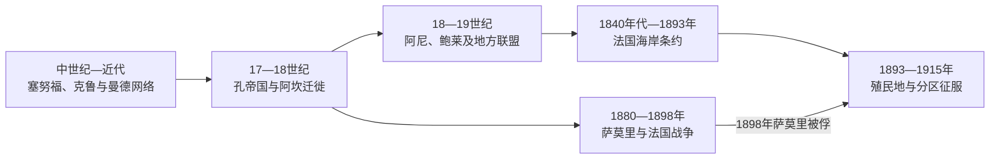

# 科特迪瓦的前殖民社会与殖民统治

## 时间

古代—1960年

## 概括

科特迪瓦南北生态差异塑造多种社会。北部与曼德商贸和孔帝国相连，东南部受阿坎迁徙及金、可乐果贸易影响，西南由克鲁等社会组成。海岸缺少大型天然港口，使欧洲早期据点少于黄金海岸。

## 本地演进图

## 社会形成与经济机制

北部孔由迪乌拉商人、伊斯兰学者和战争领袖连接可乐果、黄金与萨赫勒市场；中东部阿尼、鲍莱等阿坎政治体同黄金海岸迁徙和母系制度相关；西部克鲁、丹、古罗和塞努福社群有多样村社、年龄级与首领结构。海岸缺少良港使欧洲早期堡垒少，但并未隔绝大西洋贸易。

孔帝国和萨莫里·杜尔的瓦苏卢都跨越现代边界。阿乌拉·波库带领鲍莱迁徙的故事是重要建国记忆，具体年代与细节属于口述传统，不能当作唯一政治起源。

## 主要社会与政权

| 社会或政权 | 大致时期 | 特征 |
|---|---|---|
| 孔帝国 | 约1710—19世纪末 | 迪乌拉商人和伊斯兰学术中心 |
| 阿尼诸王国 | 17—19世纪 | 阿坎政治与黄金、可乐果贸易 |
| 鲍莱酋邦联盟 | 18世纪以后 | 阿乌拉·波库迁徙传说与中部定居 |
| 塞努福、克鲁等地方社会 | 长期存在 | 农业、宗族和区域市场 |

## 殖民征服的具体过程

法国1840年代同阿西尼、格朗巴萨姆首领签保护条约，早期影响仍局限海岸。1893年建立科特迪瓦殖民地后，总督路易-古斯塔夫·班热和后继者以军站、条约与惩罚远征向内地推进。萨莫里在北部实行机动战争和战略迁移，1898年被法军俘获；鲍莱与西部社群抵抗延续到1910年代，法国1915年前后才宣称“平定”。

区长和获承认酋长征税征工，铁路把内陆通向阿比让；咖啡、可可种植园依赖本地农民和来自上沃尔特等地的迁移劳工。强迫劳动、土地分配与移民政策既创造出口繁荣，也埋下独立后公民资格和土地权冲突。

## 殖民统治

法国1840年代签订沿岸保护条约，1893年建立殖民地。萨摩里·杜尔在北部抵抗至1898年，其他地区征服延续至20世纪初。殖民政府发展咖啡、可可种植园，吸引上沃尔特等地劳工并造成土地与身份问题。

## 重要事件

- 18世纪阿坎人群从黄金海岸方向迁入并建立阿尼、鲍莱政治体。
- 1893年科特迪瓦殖民地成立。
- 1898年萨摩里·杜尔在境内被法国俘获。
- 1944年费利克斯·乌弗埃-博瓦尼组织非洲农业工会，反对强迫劳动和殖民种植园歧视。

## 兴衰、征服与权力角色

| 层次 | 因素 | 作用 |
|---|---|---|
| 本地结构 | 多个跨境帝国、村社与迁徙政治并存 | 法国无法通过击败单一首都控制全境 |
| 经济动力 | 可可、咖啡、铁路和劳工需求 | 使殖民国家不断深入森林区 |
| 外部压力 | 法属西非多方向军队、封锁瓦苏卢军火 | 逐步削弱机动抵抗 |
| 直接触发 | 1893建殖民地、1898萨莫里被俘、1910年代西部镇压 | 完成从海岸保护到领土统治的转换 |

瓦苏卢由萨莫里·杜尔统治，孔等政权早期王表不连续；跨国世系见[西非帝国与王国统治者世系表](/%E4%BA%BA%E6%96%87%E7%A7%91%E5%AD%A6/%E5%8E%86%E5%8F%B2/%E9%9D%9E%E6%B4%B2/%E8%A5%BF%E9%9D%9E/%E8%A5%BF%E9%9D%9E%E5%B8%9D%E5%9B%BD%E4%B8%8E%E7%8E%8B%E5%9B%BD%E7%BB%9F%E6%B2%BB%E8%80%85%E4%B8%96%E7%B3%BB%E8%A1%A8.md)。殖民最高行政为法国任命的科特迪瓦总督，其上受法属西非总督节制；区长、酋长与种植园雇主分别掌握行政、地方与经济权力。

## 演变关系

殖民统治把不同社会纳入同一行政边界，并为[科特迪瓦的独立建国与现代发展](/%E4%BA%BA%E6%96%87%E7%A7%91%E5%AD%A6/%E5%8E%86%E5%8F%B2/%E9%9D%9E%E6%B4%B2/%E8%A5%BF%E9%9D%9E/%E7%A7%91%E7%89%B9%E8%BF%AA%E7%93%A6/%E7%8B%AC%E7%AB%8B%E5%BB%BA%E5%9B%BD%E4%B8%8E%E7%8E%B0%E4%BB%A3%E5%8F%91%E5%B1%95.md)留下中央机构、出口经济和地区差异。
