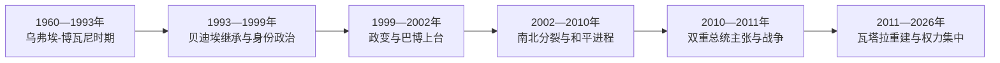

# 科特迪瓦的独立建国与现代发展

## 时间

1960年至今

## 概括

1960年独立后，乌弗埃-博瓦尼以亲法外交、移民劳工和可可咖啡出口实现“科特迪瓦奇迹”。1980年代经济衰退后，公民身份与土地政治激化，1999年政变和2002—2011年分裂危机造成战争。

## 政权演进图

## 主要政治阶段

| 阶段 | 时间 | 权力结构与特征 |
|---|---|---|
| 乌弗埃-博瓦尼时期 | 1960—1993年 | 一党主导、出口增长和大量区域移民 |
| 继承危机与国家分裂 | 1993—2011年 | 多党竞争、身份政治、政变和内战 |
| 战后重建 | 2011年至今 | 中央政府恢复控制，基础设施增长与政治和解并行 |

## 出口繁荣、内战与重建

乌弗埃-博瓦尼以单一执政党、法国安全关系、开放区域移民和可可咖啡出口构成“科特迪瓦奇迹”。国家在基础设施和阿比让建设上投入巨大，但价格崩跌、外债和土地压力在1980年代削弱模式。1993年总统去世后，贝迪埃以“科特迪瓦性”限制竞争者，公民资格、北方身份和移民土地权被政治化；1999年盖伊政变终结文官连续统治。

2000年巴博在军政府试图操纵选举失败后上台，2002年兵变使北方由新生力量控制，联合国与法国部队隔开南北。2007年瓦加杜古协议推动权力分享和选民登记。2010年选举委员会认定瓦塔拉获胜、宪法委员会宣布巴博获胜，两人并立；2011年瓦塔拉阵营进军和国际军事介入结束危机，巴博被捕。

瓦塔拉政府重建行政、道路和增长，前叛军整合、司法追责不对称及反对派信任仍成问题。2020年第三任期解释引发暴力；2025年瓦塔拉再次当选并于12月宣誓，2026年由罗贝尔·伯格雷·芒贝继续任总理。

## 重要转折

- 1960年8月7日独立。
- 1990年在经济危机和抗议下开放多党选举。
- 1999年罗贝尔·盖伊政变，终结文官连续统治。
- 2002年叛乱使国家南北分裂；2010年争议选举引发第二轮危机，2011年结束。

## 兴衰与和解条件

| 层次 | 因素 | 影响 |
|---|---|---|
| 结构因素 | 单一商品、移民劳工与土地权未制度化 | 经济下行时身份政治迅速放大 |
| 政治触发 | 继承竞争、“科特迪瓦性”和排除候选人 | 将社会差异转化为国家合法性危机 |
| 军事因素 | 军队派系、叛军控制北部和邻国战争网络 | 造成2002—2011年领土分裂 |
| 重建条件 | 全国行政恢复、投资和解除武装 | 带来增长，但包容司法与可信选举仍决定长期稳定 |

完整国家元首、并立主张和总理序列见[西非独立国家元首与权力结构表](/%E4%BA%BA%E6%96%87%E7%A7%91%E5%AD%A6/%E5%8E%86%E5%8F%B2/%E9%9D%9E%E6%B4%B2/%E8%A5%BF%E9%9D%9E/%E8%A5%BF%E9%9D%9E%E7%8B%AC%E7%AB%8B%E5%9B%BD%E5%AE%B6%E5%85%83%E9%A6%96%E4%B8%8E%E6%9D%83%E5%8A%9B%E7%BB%93%E6%9E%84%E8%A1%A8.md)。截至2026年7月，阿拉萨内·瓦塔拉任总统，罗贝尔·伯格雷·芒贝任政府首脑。

## 演变关系

前接[科特迪瓦的前殖民社会与殖民统治](/%E4%BA%BA%E6%96%87%E7%A7%91%E5%AD%A6/%E5%8E%86%E5%8F%B2/%E9%9D%9E%E6%B4%B2/%E8%A5%BF%E9%9D%9E/%E7%A7%91%E7%89%B9%E8%BF%AA%E7%93%A6/%E5%89%8D%E6%AE%96%E6%B0%91%E7%A4%BE%E4%BC%9A%E4%B8%8E%E6%AE%96%E6%B0%91%E7%BB%9F%E6%B2%BB.md)。现代国家的边界、行政语言和经济结构继承殖民框架，同时又被本国社会运动、军队、政党与区域组织重新塑造。
