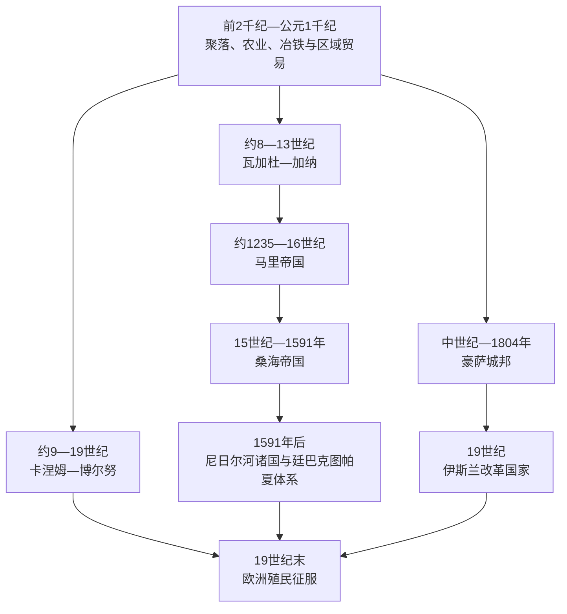

# 萨赫勒帝国与跨撒哈拉贸易

## 时间

约公元前2千纪至19世纪末

## 概括

萨赫勒并非撒哈拉以南文明的“边缘”，而是沙漠、草原、尼日尔河与乍得湖之间的交通带。季节性降雨支持谷物农业和畜牧，河流提供渔业、稻作与泛滥平原，撒哈拉盐矿、南方黄金产区和北非市场则促成远距离交换。国家控制的重点通常不是现代意义的连续边界，而是王都、河港、商队井站、矿区、市场、征税点及向中心纳贡的属国。

瓦加杜—加纳、马里和桑海并非简单的一朝取代一朝。它们的核心区、族群联盟和贸易路线相互重叠，却各有独立形成过程；旧帝国衰落后，地方王国、城市、商人网络和口述传统仍继续存在。更东的卡涅姆—博尔努、豪萨城邦及沃尔特河流域莫西诸国也构成平行主线。伊斯兰先在商人、学者和宫廷中扩散，地方宗教、祖先礼仪和非穆斯林社群长期共存。

## 环境、城市与贸易机制

### 撒哈拉不是绝对屏障

骆驼在古典时代后逐步成为撒哈拉运输主力，但跨沙漠贸易的成熟是长期过程。商队必须依赖绿洲、水井、熟悉路线的向导和能够保障沿途安全的政治力量。主要通道包括：

| 路线 | 北端 | 南端 | 主要货物与作用 |
|---|---|---|---|
| 西线 | 西吉尔马萨、摩洛哥南部 | 奥达戈斯特、瓦拉塔及瓦加杜区域 | 西非黄金、盐、铜、布匹、马匹和被奴役者 |
| 中线 | 图瓦特、塔菲拉勒特 | 廷巴克图、杰内、尼日尔河湾 | 塔加扎 / 陶代尼盐、黄金、书籍、纺织品 |
| 中东线 | 加达梅斯、加特 | 阿加德兹、豪萨城市 | 盐、皮革、可乐果、布匹、奴隶与牲畜 |
| 乍得湖线 | 的黎波里、费赞 | 卡涅姆—博尔努 | 马匹、盐、铜、奴隶及北非商品 |

黄金往往由南部矿区和森林—草原交界的商人层层转运，萨赫勒国王并不直接占有全部矿山。盐既是食物和畜牧必需品，也是可切割、计价的高价值货物。铜、可乐果、皮革、纺织品、谷物、马匹和奴隶同样重要，不能把贸易简化成“黄金换盐”。

### 城市化早于伊斯兰帝国

毛里塔尼亚东南部提希特—瓦拉塔一带在公元前2千纪已出现石砌聚落、谷物生产和区域交换；尼日尔河内三角洲的杰内杰诺约自公元前3世纪发展为大型聚落，手工业和贸易繁荣，却没有早期王宫或清真寺所代表的单一中央国家证据。后来杰内、廷巴克图、加奥、瓦拉塔、卡诺和卡齐纳等城市把农民、牧民、渔民、工匠、商人与学者连接起来。城市增长不是北非商人单方面“带来文明”，而是本地生产和跨区域交换共同作用。

## 主要政权与发展过程

### 瓦加杜—加纳帝国

瓦加杜由索宁克语社群及其盟友建立，外部阿拉伯文献常以统治者称号“加纳”指称整个政权。其核心位于今毛里塔尼亚东南与马里西部，而非现代加纳共和国。8—11世纪时，王权通过对进入和离开市场的货物征税、控制金粉流通、保护商路并接受属国贡赋积累资源。11世纪地理学家描述王都存在王室区和穆斯林商人聚居区；传统上把昆比萨利赫遗址等同于王都，但遗址、文献地名和政治中心的对应仍有争论。

约1076年“穆拉比特人攻陷加纳”曾被写成帝国突然灭亡。较谨慎的解释是：桑哈贾联盟和穆拉比特扩张确实改变西部商路与宗教政治，但关于一次决定性征服、强迫全国改宗及确切日期的证据并不一致。瓦加杜的衰落还涉及属国脱离、王位竞争、贸易路线东移、环境压力和苏苏 / 索索势力兴起。13世纪前期索索王苏曼古鲁扩张，曼丁联盟随后取代其优势；瓦加杜王族和索宁克商人并未消失，而是散入更广的西非网络。

### 马里帝国

曼丁口述史把松迪亚塔·凯塔战胜苏曼古鲁的基里纳战役视为建国转折，常约定在1235年前后。史诗保存政治记忆、家族身份和道德秩序，但不同吟游诗人版本在人物、地点和年代上有差异。“库鲁坎富加宪章”反映曼丁社会对联盟、职业群体与义务的后世记忆，不应未经说明地视为保存完整的13世纪成文宪法。

马里王号为“曼萨”。中心通过王室亲族、直属官员“法尔巴”、地方世袭首领和纳贡王国形成分层结构；骑兵控制草原，船队和河港保障尼日尔航运，朱拉 / 迪乌拉商人则连接黄金产区、森林市场和撒哈拉。松迪亚塔之后，曼萨乌利朝觐并向东扩张；一度夺权的萨库拉加强帝国，后来的曼萨穆萨约在1312—1337年把马里声望推向高峰。

1324—1325年曼萨穆萨经开罗朝觐，大量黄金施舍使马里进入地中海世界的地图与叙述。他回国后资助清真寺、学者和城市建设，但廷巴克图学术传统不是一位君主凭空创立。桑科雷、金加雷贝等清真寺周边形成彼此独立的教师—学生网络，法学、语法、神学、历史和商业文书由手抄本传播，不能直接等同于一所有统一校制的现代“大学”。

14世纪后期，短期继承、宫廷政变和属国自主削弱中心。图阿雷格在1430年代控制廷巴克图，桑海向尼日尔河湾扩张，莫西骑兵从南面袭扰，西部省份和大西洋沿岸商路也逐步脱离。马里并未在一个年份整体灭亡：曼萨仍在核心区统治到16世纪，曼丁政治与商人网络在卡布等地延续更久。

### 桑海帝国

加奥早在马里兴起前就是尼日尔河东弯的商贸与王权中心，曾由扎、松尼等王系统治，也一度向马里纳贡。松尼阿里于1464年即位后建立机动河军和骑兵，1468年前后夺取廷巴克图，经过长期围攻控制杰内，并向富拉尼牧区和莫西边界扩张。他同廷巴克图学者关系紧张，在穆斯林文献中常被描写为暴君；这些记载反映真实冲突，也带有学者群体的立场。

1493年，军政长官穆罕默德·图雷在安法奥击败松尼巴鲁，建立阿斯基亚王系。阿斯基亚穆罕默德朝觐后取得宗教声望，任命省长、税吏和军官，调整贡赋与市场管理，并支持廷巴克图学者。帝国仍依靠地方统治者和多族群军队，中央控制强弱随君主、河运和继承稳定程度变化。

16世纪后期阿斯基亚家族频繁争位，摩洛哥萨阿德苏丹艾哈迈德·曼苏尔希望控制撒哈拉盐矿和尼日尔黄金通道。1591年，装备火绳枪的摩洛哥远征军在通迪比击败人数更多的桑海军。加奥、廷巴克图和杰内随后被占，但摩洛哥驻军难以直接控制广阔内地，黄金来源也未因此完全归其掌握。桑海王系退往尼日尔河下游建立登迪政权，城市则进入帕夏、学者、商人和地方势力并立的时代。

### 卡涅姆—博尔努

乍得湖周围的卡涅姆—博尔努连接撒哈拉、尼罗河方向、豪萨地区和中非草原。赛法瓦王朝约自9世纪见于传统，11世纪统治者胡迈皈依伊斯兰。国王“迈”依赖王族、军事贵族、地方首领和跨沙漠贸易，马匹与骑兵是扩张关键。14世纪布拉拉压力和内部斗争迫使王廷由湖东北的卡涅姆迁向西南博尔努，旧王朝在新中心重建。

伊德里斯·阿卢马约于16世纪后期整军、修筑道路和据点，使用火器，与北非及奥斯曼势力外交，通常被视为博尔努高峰。18世纪王室衰弱，1800年代富拉尼圣战冲击西部；穆罕默德·卡内米以学者和军事领袖身份保住博尔努，建立新的实际统治家族。拉比赫·祖拜尔1893年征服博尔努，1900年被法军击败，传统王位随后在殖民秩序下以地方权威形式延续。

### 豪萨城邦与沃尔特河流域国家

卡诺、卡齐纳、扎里亚 / 扎扎乌、戈比尔、达乌拉、拉诺和比拉姆等豪萨城市没有组成一个长期统一帝国。城墙、市场、染织、皮革和金属手工业支撑城市国家，国王同贵族、商人、村社和学者分享资源。伊斯兰约在14—15世纪进一步进入宫廷和城市教育，地方宗教与王权礼仪仍长期存在。城邦之间的战争、税负和穆斯林改革争论成为1804年索科托圣战的背景。

莫西诸王国约自中世纪后期在今布基纳法索一带形成，依靠骑兵、王族分封和村社贡赋保持稳定。它们同马里、桑海和豪萨世界贸易或战争，多次抵御外部帝国，说明萨赫勒历史从未只有尼日尔河三大帝国一条主线。

## 统治结构比较

| 层次 | 常见角色 | 作用与限制 |
|---|---|---|
| 最高统治者 | 加纳、曼萨、松尼 / 阿斯基亚、迈、萨尔基 | 主持战争、贡赋、外交和宗教礼仪，但无法直接管理所有属地 |
| 王族与省长 | 亲族王公、法尔巴、地方总督 | 驻守战略城市、征税和征兵；势力过强时也会争位或独立 |
| 地方首领 | 被保留的国王、氏族长、村社领袖 | 维持土地、司法与日常秩序，以贡赋换取自治 |
| 军队 | 王室骑兵、步兵、河军、属国部队 | 马匹昂贵，军队动员依赖贸易收入与地方合作 |
| 商人 | 索宁克、朱拉、豪萨及北非商人网络 | 提供信贷、情报、运输和税源，跨越政权边界 |
| 学者与教士 | 卡迪、伊玛目、教师、抄写员 | 提供法律与文书服务；影响多集中在城市和宫廷 |
| 农牧生产者 | 农民、渔民、牧民、手工业者及被奴役者 | 承担国家财富基础，但在战争、征税和奴役中承受最大风险 |

## 重要事件

| 时间 | 事件 | 过程与影响 |
|---|---|---|
| 约前3世纪起 | 杰内杰诺城市群发展 | 证明尼日尔内三角洲的城市化与区域贸易早于伊斯兰帝国 |
| 8—11世纪 | 瓦加杜—加纳达到高峰 | 商路税、黄金转运和属国体系支撑早期萨赫勒大国 |
| 约1235年 | 松迪亚塔联盟战胜索索 | 马里帝国形成，口述史与外部文献共同保存其记忆 |
| 1324—1325年 | 曼萨穆萨朝觐 | 提高马里国际声望，强化学术与商业联系 |
| 1468—1470年代 | 松尼阿里控制廷巴克图、杰内 | 桑海取得尼日尔河商业与农业核心 |
| 1493年 | 阿斯基亚穆罕默德建立新王系 | 行政、宗教与军政结构进一步制度化 |
| 1591年 | 通迪比战役 | 摩洛哥火器军击败桑海，尼日尔河帝国体系分裂 |
| 16世纪后期 | 伊德里斯·阿卢马改革博尔努 | 乍得湖国家整军、扩贸并达到高峰 |
| 1804年起 | 豪萨地区富拉尼圣战 | 索科托哈里发取代多个城邦王朝，进入新的区域政治阶段 |
| 1893—1900年 | 拉比赫征服博尔努及法军推进 | 乍得湖旧国家转入殖民边界和间接统治体系 |

## 崛起机制

- **生态互补**：盐区、牧区、谷物区、河流渔业和南方黄金—可乐果产区互有需求。
- **交通征税**：王权不必占领矿山，只要保护市场、河港和商队即可征税和取得贡赋。
- **军事机动**：马匹、骑兵和桑海河军让中心能跨越稀树草原投送力量。
- **地方间接治理**：保留属国和村社首领降低行政成本，使多语言、多宗教帝国得以扩张。
- **商人—学者网络**：伊斯兰法律、阿拉伯文书写、信贷和朝觐增强跨境信任，却没有消灭本地制度。

## 衰落与转型原因

| 层次 | 因素 | 作用 |
|---|---|---|
| 结构因素 | 继承规则弹性、王族分封、属国自治 | 强君在位时便于扩张，继承危机时地方迅速脱离 |
| 经济变化 | 商路迁移、港口和市场兴衰、大西洋贸易增长 | 削弱部分旧征税节点，但跨撒哈拉贸易并未立刻停止 |
| 环境与人口 | 降雨波动、牧农冲突、战争迁徙与疫病 | 改变农业、草场和城市供给，不宜作为单一“沙漠化灭国”解释 |
| 外部压力 | 图阿雷格、莫西、摩洛哥远征及后来的殖民军 | 夺取城市或打断贡赋，但通常需要内部裂痕配合 |
| 直接触发 | 宫廷争位、军队倒戈、通迪比等关键失败 | 把长期财政和政治脆弱转化为政权崩解 |

## 史料与争议

- 萨赫勒史需要把考古材料、阿拉伯地理著作、廷巴克图编年史、欧洲旅行记录和口述传统相互校验；任何一类都不是完整中立的“官方实录”。
- 瓦加杜王都位置、穆拉比特是否在1076年直接征服帝国、松迪亚塔生平细节和若干曼萨次序仍有争议，应使用“约”并说明来源局限。
- “帝国”表示中心对多层贡赋网络的优势，不等于现代国家式固定边界和均质行政。
- 廷巴克图是重要学术中心，但“世界第一所大学”等说法若套用现代学位、校长和统一课程概念，会误解当时分散的师承体系。
- 奴隶制既存在于跨撒哈拉贸易，也存在于国家内部农业、家庭、军队和宫廷；身份与处境多样，但强迫和暴力不应被淡化。

## 统治者世系

跨国帝国与王国的完整可确认序列、共治／摄政和争议年代集中见[西非帝国与王国统治者世系表](/%E4%BA%BA%E6%96%87%E7%A7%91%E5%AD%A6/%E5%8E%86%E5%8F%B2/%E9%9D%9E%E6%B4%B2/%E8%A5%BF%E9%9D%9E/%E8%A5%BF%E9%9D%9E%E5%B8%9D%E5%9B%BD%E4%B8%8E%E7%8E%8B%E5%9B%BD%E7%BB%9F%E6%B2%BB%E8%80%85%E4%B8%96%E7%B3%BB%E8%A1%A8.md)。没有保存连续王表的瓦加杜、早期奥约等节点不以推测补齐。

## 演变关系

- 后续：[伊斯兰改革、殖民征服与独立](/%E4%BA%BA%E6%96%87%E7%A7%91%E5%AD%A6/%E5%8E%86%E5%8F%B2/%E9%9D%9E%E6%B4%B2/%E8%A5%BF%E9%9D%9E/%E4%BC%8A%E6%96%AF%E5%85%B0%E6%94%B9%E9%9D%A9%E3%80%81%E6%AE%96%E6%B0%91%E5%BE%81%E6%9C%8D%E4%B8%8E%E7%8B%AC%E7%AB%8B.md)
- 国家视角：[马里](/%E4%BA%BA%E6%96%87%E7%A7%91%E5%AD%A6/%E5%8E%86%E5%8F%B2/%E9%9D%9E%E6%B4%B2/%E8%A5%BF%E9%9D%9E/%E9%A9%AC%E9%87%8C/README.md)、[毛里塔尼亚](/%E4%BA%BA%E6%96%87%E7%A7%91%E5%AD%A6/%E5%8E%86%E5%8F%B2/%E9%9D%9E%E6%B4%B2/%E8%A5%BF%E9%9D%9E/%E6%AF%9B%E9%87%8C%E5%A1%94%E5%B0%BC%E4%BA%9A/README.md)、[尼日尔](/%E4%BA%BA%E6%96%87%E7%A7%91%E5%AD%A6/%E5%8E%86%E5%8F%B2/%E9%9D%9E%E6%B4%B2/%E8%A5%BF%E9%9D%9E/%E5%B0%BC%E6%97%A5%E5%B0%94/README.md)、[尼日利亚](/%E4%BA%BA%E6%96%87%E7%A7%91%E5%AD%A6/%E5%8E%86%E5%8F%B2/%E9%9D%9E%E6%B4%B2/%E8%A5%BF%E9%9D%9E/%E5%B0%BC%E6%97%A5%E5%88%A9%E4%BA%9A/README.md)
- 上级入口：[西非历史](/%E4%BA%BA%E6%96%87%E7%A7%91%E5%AD%A6/%E5%8E%86%E5%8F%B2/%E9%9D%9E%E6%B4%B2/%E8%A5%BF%E9%9D%9E/README.md)
