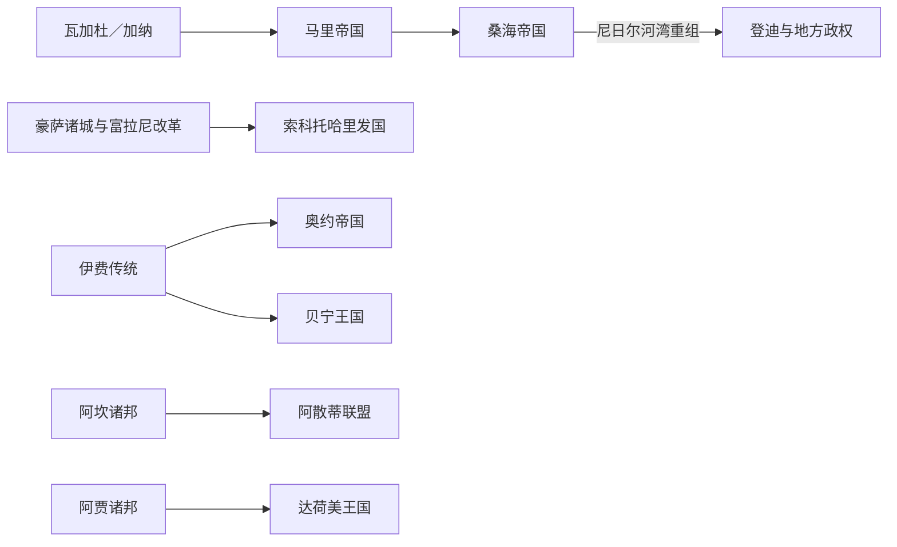

# 西非帝国与王国统治者世系表

## 编排原则

本表集中列出跨越多个现代国家、且已有较稳定统治序列的西非帝国与王国。口述传统、后世王表与同时代阿拉伯、欧洲文献之间不能互相印证的部分，明确标作“约”“顺序较可信、年代有争议”或“仅有个别统治者可确认”。没有保存下来的名字不以推测补齐。

## 瓦加杜／加纳帝国

瓦加杜没有可连续复原的“完整国王表”。后世口述传统以卡亚·马甘·西塞为王族始祖；11 世纪旅行家记载可较明确对应的在位者主要是约 1040—1063 年的巴西和 1063 年后在位的通卡·马宁。二者之外，许多名字只见于后世谱系，无法确定是否为同一政权、是否共治或是否属于附属王国。因而这里保留“史料可确认的全部统治者”，而不制造看似连续的年代。

| 顺序 | 统治者 | 在位 | 证据与备注 |
| --- | --- | --- | --- |
| 传统始祖 | 卡亚·马甘·西塞 | 年代不详 | 索宁克口述传统中的王族祖先，历史身份存在争议 |
| 1 | 巴西 | 约 1040—1063 | 阿拉伯文献所见国王；晚年时王储为通卡·马宁 |
| 2 | 通卡·马宁 | 约 1063—11 世纪后期 | 文献记述其宫廷、税收与宗教并存格局；帝国后期年代不详 |

1076 年“穆拉比特征服加纳”的传统叙述在现代研究中有争议；更稳妥的解释是贸易路线变化、附属地区脱离、干旱压力和穆斯林—王权关系重组共同削弱中心。

## 马里帝国曼萨

| 顺序 | 曼萨 | 在位 | 继承关系与关键事件 |
| --- | --- | --- | --- |
| 1 | **松迪亚塔·凯塔** | 约 1235—1255 | 凯塔王族；击败苏苏、建立曼丁联盟 |
| 2 | 瓦利一世 | 约 1255—1270 | 松迪亚塔之子；完成朝觐、巩固商路 |
| 3 | 瓦蒂 | 约 1270—1274 | 松迪亚塔之子；继承争端加剧 |
| 4 | 哈利法 | 约 1274—1275 | 松迪亚塔之子；因暴政被废 |
| 5 | 阿布·伯克尔一世 | 约 1275—1285 | 松迪亚塔兄弟之子；恢复旁系继承 |
| 6 | 萨库拉 | 约 1285—1300 | 原宫廷奴隶／将领，夺位后扩张；朝觐归途中遇害 |
| 7 | 高 | 约 1300—1305 | 凯塔王族复辟；阿布·伯克尔一世之后裔 |
| 8 | 穆罕默德·伊本·高 | 约 1305—1310 | 高之子 |
| 9 | 阿布·伯克尔二世 | 约 1310—1312 | 常与大西洋远航传说相连；身份、称号有争议 |
| 10 | **穆萨一世（曼萨·穆萨）** | 约 1312—1337 | 凯塔王族；朝觐、廷巴克图建设与帝国鼎盛 |
| 11 | 马甘一世 | 1337—1341 | 穆萨一世之子 |
| 12 | 苏莱曼 | 1341—1360 | 穆萨一世之弟；重整财政与宫廷 |
| 13 | 卡萨 | 1360 | 苏莱曼之子；短期在位 |
| 14 | 马里·贾塔二世 | 1360—1374 | 马甘一世之子；财政失序 |
| 15 | 穆萨二世 | 1374—1387 | 马里·贾塔二世之子；实际权力一度在大臣马里·贾塔手中 |
| 16 | 马甘二世 | 1387—1389 | 穆萨二世之弟 |
| 17 | 桑达基 | 1389—1390 | 宫廷大臣篡位；被杀 |
| 18 | 马哈茂德一世 | 约 1390—1400 | 凯塔王族复辟；此后记录出现大段缺口 |
| 19 | 穆萨三世 | 约 15 世纪中期 | 仅见后世重建，年代有争议 |
| 20 | 瓦利二世 | 约 15 世纪后期 | 顺序与在位年代均不确定 |
| 21 | 马哈茂德二世 | 约 1480 年代—1496 后 | 曾向葡萄牙寻求合作；帝国已收缩 |
| 22 | 马哈茂德三世 | 约 1496—1559 后 | 面对桑海扩张和地方脱离 |
| 23 | 马哈茂德四世 | 约 1590—1610 后 | 1599 年进攻杰内失败；通常视为帝国政治终局阶段 |

14—16 世纪后段王表并非逐年连续，以上列出学界常见的全部可命名曼萨，并把史料空白直接保留。马里帝国不是在一次战役中突然灭亡，而是因外围省份脱离、跨撒哈拉贸易节点转移、宫廷继承冲突和桑海扩张逐步收缩。

## 桑海帝国

### 松尼王朝与阿斯基亚王朝

| 顺序 | 统治者 | 在位 | 继承与事件 |
| --- | --- | --- | --- |
| 1 | **松尼·阿里** | 约 1464—1492 | 建立帝国性版图；征服廷巴克图、杰内并控制尼日尔河 |
| 2 | 松尼·巴鲁 | 1492—1493 | 松尼·阿里之子；被穆罕默德·图雷推翻 |
| 3 | **阿斯基亚·穆罕默德一世** | 1493—1528 | 推翻松尼王朝；行政分区、朝觐与学术网络扩张 |
| 4 | 阿斯基亚·穆萨 | 1528—1531 | 穆罕默德一世之子；宫廷政变上台，后被兄弟推翻 |
| 5 | 阿斯基亚·穆罕默德·本坎 | 1531—1537 | 王族旁支；迁移宫廷重心，被废 |
| 6 | 阿斯基亚·伊斯梅尔 | 1537—1539 | 穆罕默德一世之子；迎回被放逐的父亲 |
| 7 | 阿斯基亚·伊沙克一世 | 1539—1549 | 伊斯梅尔之弟；强化税收，因暴政被废 |
| 8 | **阿斯基亚·达乌德** | 1549—1582 | 长期稳定与文化繁荣；帝国最后一个较稳固时期 |
| 9 | 阿斯基亚·穆罕默德二世·哈吉 | 1582—1586 | 达乌德之子；疾病与派系斗争削弱统治 |
| 10 | 阿斯基亚·穆罕默德三世·巴尼 | 1586—1588 | 达乌德之子；军队哗变中身亡 |
| 11 | **阿斯基亚·伊沙克二世** | 1588—1591 | 达乌德之子；通迪比战败后失去核心城市 |
| 12 | 阿斯基亚·穆罕默德·高 | 1591 | 摩洛哥军控制区承认后被诱杀 |
| 13 | 阿斯基亚·努赫一世 | 1591—约 1599 | 在登迪继续抵抗；帝国转为区域性继承政权 |

1591 年摩洛哥军在通迪比以火器击败桑海主力，是帝国核心解体的直接触发点；远距离占领成本、王族内斗、财政依赖商路和区域抵抗则决定了征服后没有形成同等强度的新中央帝国。

## 索科托哈里发国与苏丹位

| 顺序 | 哈里发／苏丹 | 在位 | 备注 |
| --- | --- | --- | --- |
| 1 | **奥斯曼·丹·福迪奥** | 1804—1817 | 吉哈德领袖；建立哈里发国，后期把行政分授亲族 |
| 2 | **穆罕默德·贝洛** | 1817—1837 | 奥斯曼之子；制度化酋长国网络与学术行政 |
| 3 | 阿布·伯克尔·阿蒂库一世 | 1837—1842 | 奥斯曼之子 |
| 4 | 阿里·巴巴·本·贝洛 | 1842—1859 | 贝洛之子 |
| 5 | 艾哈迈杜·阿蒂库 | 1859—1866 | 阿蒂库一世之子 |
| 6 | 阿里尤·卡拉米 | 1866—1867 | 贝洛之子；短期在位 |
| 7 | 艾哈迈杜·鲁法伊 | 1867—1873 | 奥斯曼家族 |
| 8 | 阿布·伯克尔·阿蒂库二世 | 1873—1877 | 贝洛之子 |
| 9 | 穆阿祖 | 1877—1881 | 贝洛之子 |
| 10 | 乌马鲁·本·阿里 | 1881—1891 | 阿里·巴巴之子 |
| 11 | 阿卜杜勒·拉赫曼·阿蒂库 | 1891—1902 | 阿蒂库一世之子 |
| 12 | **穆罕默德·阿塔希鲁一世** | 1902—1903 | 英军征服索科托后出走，抵抗中战死 |
| 13 | 穆罕默德·阿塔希鲁二世 | 1903—1915 | 英国间接统治下就任；主权哈里发国已终结 |
| 14 | 穆罕默德·迈图拉雷 | 1915—1924 | 殖民体系中的索科托苏丹 |
| 15 | 穆罕默德·坦巴里 | 1924—1931 | 同上 |
| 16 | 哈桑·丹·穆阿祖 | 1931—1938 | 同上 |
| 17 | 西迪克·阿布巴卡尔三世 | 1938—1988 | 传统与宗教领袖，跨越殖民和独立时期 |
| 18 | 易卜拉欣·达苏基 | 1988—1996 | 被尼日利亚军政府废黜 |
| 19 | 穆罕默德·马奇多 | 1996—2006 | 空难遇难 |
| 20 | 穆罕默德·萨阿杜·阿布巴卡尔三世 | 2006—至今 | 传统苏丹、尼日利亚穆斯林重要领袖；无国家主权 |

1903 年以后“苏丹”是殖民与尼日利亚国家框架内的传统职位，不应把其连续性误写成哈里发国主权延续。

## 马西纳与图库洛尔政权

| 政权 | 顺序 | 统治者 | 在位 | 结局 |
| --- | --- | --- | --- | --- |
| 马西纳帝国 | 1 | **塞库·阿马杜** | 1818—1845 | 建立哈姆达拉希神权国家 |
| 马西纳帝国 | 2 | 阿马杜·塞库 | 1845—1853 | 建国者之子 |
| 马西纳帝国 | 3 | 阿马杜·阿马杜 | 1853—1862 | 被哈吉·奥马尔·塔勒征服 |
| 图库洛尔帝国 | 1 | **哈吉·奥马尔·塔勒** | 约 1852—1864 | 征服塞古与马西纳；在冲突中失踪／身亡 |
| 图库洛尔帝国 | 2 | 艾哈迈杜·塔勒 | 1864—1890 | 在塞古继承；法国攻占塞古后东撤 |
| 瓦苏卢帝国 | 1 | **萨莫里·杜尔** | 约 1878—1898 | 建立机动军政国家；被法军俘获后帝国终结 |

这些改革国家并非彼此简单直线继承：马西纳被图库洛尔征服，图库洛尔又面对地方反抗和法国扩张；瓦苏卢在更南部形成并以战略迁移抵抗法国。

## 达荷美王国

| 顺序 | 国王 | 在位 | 继承与关键事件 |
| --- | --- | --- | --- |
| 传统先祖 | 多-阿克林 | 约 17 世纪初 | 阿拉达王族迁入阿博美的传统始祖 |
| 1 | 达科多努 | 约 1620—1645 | 建立早期宫廷中心 |
| 2 | **韦格巴贾** | 约 1645—1685 | 制度化王权、宫殿与年度礼仪 |
| 3 | 阿卡巴 | 1685—1708 | 韦格巴贾之子 |
| 摄政 | **杭贝** | 1708—1711 | 阿卡巴之妹；长期被官方王表淡化，现多获承认 |
| 4 | **阿加贾** | 1711—1740 | 征服阿拉达、维达并控制海岸贸易 |
| 5 | 特格贝苏 | 1740—1774 | 阿加贾之子；巩固行政与军队 |
| 6 | 克彭格拉 | 1774—1789 | 强化王室贸易垄断 |
| 7 | 阿贡格洛 | 1789—1797 | 宫廷政变中遇害 |
| 8 | 阿丹多赞 | 1797—1818 | 后被盖佐推翻，其统治曾遭官方记忆删除 |
| 9 | **盖佐** | 1818—1858 | 军政改革、摆脱奥约贡赋；对奴隶贸易转型态度矛盾 |
| 10 | 格莱莱 | 1858—1889 | 与法国沿海势力冲突升级 |
| 11 | **贝汉津** | 1889—1894 | 两次法达战争后流亡；主权王国终结 |
| 12 | 阿戈利-阿博 | 1894—1900 | 法国扶立的地方国王，后被废黜 |

## 阿散蒂王国／联盟

| 顺序 | 阿散蒂赫内 | 在位 | 备注 |
| --- | --- | --- | --- |
| 1 | **奥塞·图图一世** | 约 1701—1717 | 与祭司奥科姆福·阿诺基整合金凳联盟 |
| 2 | **奥波库·瓦雷一世** | 约 1720—1750 | 扩张并制度化省份、贡赋 |
| 3 | 库西·奥博多姆 | 1750—1764 | 王族继承 |
| 4 | 奥塞·夸多 | 1764—1777 | 行政改革、扩大非王族官员 |
| 5 | 奥塞·夸梅·帕宁 | 1777—1803 | 长期统治，后被废 |
| 6 | 奥波库·福菲耶 | 1803—1804 | 短期在位 |
| 7 | **奥塞·邦苏** | 1804—1824 | 对芳蒂与英国战争，帝国达高峰 |
| 8 | 奥塞·亚乌·阿科托 | 1824—1834 | 1824 年击败英军，后受贸易与战争压力 |
| 9 | 夸库·杜阿一世 | 1834—1867 | 与英国关系反复 |
| 10 | 科菲·卡里卡里 | 1867—1874 | 1874 年英军攻占库马西后被废 |
| 11 | 门萨·邦苏 | 1874—1883 | 复兴中央权力失败，被废 |
| 12 | 夸库·杜阿二世 | 1884 | 在位数月病逝 |
| 13 | **普伦佩一世** | 1888—1931 | 1896 年被流放；1926 年以库马西赫内身份恢复，1935 年后制度重建 |
| 14 | 普伦佩二世 | 1931—1970 | 1935 年起任恢复后的阿散蒂赫内；职位属殖民／加纳国家内传统权威 |
| 15 | 奥波库·瓦雷二世 | 1970—1999 | 现代传统领袖 |
| 16 | 奥塞·图图二世 | 1999—至今 | 现代传统领袖，无国家主权 |

1717—1720、1883—1884、1884—1888 年为王位空缺或摄政期。1902 年阿散蒂正式并入英属黄金海岸，之后王位延续不等同于国家主权延续。

## 贝宁王国奥巴

早期奥巴顺序主要来自宫廷传统；15 世纪以前的绝对年代不能精确确定。下表保留传统认可的完整顺序，并从有较多外部文献和艺术史证据的时期起给出约略年代。

| 段落 | 奥巴顺序 | 年代与说明 |
| --- | --- | --- |
| 早期奥巴 | 埃韦卡一世 → 乌瓦库阿亨 → 亨米亨 → 埃韦多 → 奥古奥拉 → 埃多尼 → 乌达格贝多 → 奥亨 → 埃格贝卡 → 奥罗比鲁 → 乌瓦伊菲奥昆 | 约 13—15 世纪初；顺序较稳定，具体在位年有争议 |
| 帝国形成 | **埃瓦雷一世**（约 1440—1473）→ 埃佐蒂 → 奥卢阿 → 奥佐卢阿 → **埃西吉耶**（约 1504—1547）→ 奥尔霍格布阿 → 埃亨格布达 | 军事扩张、城防、宫廷艺术与葡萄牙贸易发展 |
| 17 世纪 | 奥胡安 → 奥亨扎埃 → 阿肯克帕耶 → 阿肯格贝多 → 奥雷-奥格内 | 王位继承冲突增多，年代有数年差异 |
| 18 世纪重整 | 埃瓦克佩 → 奥祖埃雷 → 阿肯祖阿一世 → 埃雷索延 → 阿肯格布达 | 宫廷与地方首领重新平衡 |
| 19 世纪 | 奥巴诺萨 → 奥格贝博 → 奥塞姆文德 → 阿多洛 → **奥文拉姆文·诺格巴伊西**（1888—1914） | 1897 年英国远征攻陷贝宁城，奥文拉姆文被流放 |
| 殖民后传统王位 | 埃韦卡二世（1914—1933）→ 阿肯祖阿二世（1933—1978）→ 埃雷迪奥瓦（1979—2016）→ 埃瓦雷二世（2016—至今） | 属尼日利亚殖民／国家体制内传统职位，无主权国家地位 |

## 奥约阿拉芬的史料边界

奥约王表把奥兰扬、阿贾卡、尚戈等神话—历史人物纳入同一谱系；早期年代常被推至 9—13 世纪，但缺少同时代记录。可较可靠地讨论的帝国时期统治者包括奥巴洛昆、阿吉博耶德、阿宾伊奥杜、奥罗姆波托、阿贾格博、奥达拉武、卡兰贝、杰伊因、阿约多、奥索洛、奥尼西莱、拉布西、阿沃恩比奥朱、阿格博卢阿杰、马吉奥图、阿比奥敦、阿沃莱、阿德博、马库阿、阿莫多、奥卢埃武；1830 年代奥卢埃武战死与旧奥约废弃标志帝国性王权终结。由于不同口述版本对顺序、复位和年代分歧很大，本表不为这些名字强配伪精确年份。

新奥约继续保有阿拉芬传统职位，但属于尼日利亚国家内的传统王位，不是旧帝国主权延续。理解奥约兴衰应同时观察阿拉芬、奥约梅西元老会、巴绍伦和阿雷-奥纳-卡坎福军职之间的制衡；18 世纪末权力冲突、伊洛林脱离与区域战争共同导致旧奥约崩解。

## 相关笔记

- [萨赫勒帝国与跨撒哈拉贸易](/%E4%BA%BA%E6%96%87%E7%A7%91%E5%AD%A6/%E5%8E%86%E5%8F%B2/%E9%9D%9E%E6%B4%B2/%E8%A5%BF%E9%9D%9E/%E8%90%A8%E8%B5%AB%E5%8B%92%E5%B8%9D%E5%9B%BD%E4%B8%8E%E8%B7%A8%E6%92%92%E5%93%88%E6%8B%89%E8%B4%B8%E6%98%93.md)
- [森林王国、城邦与大西洋沿岸](/%E4%BA%BA%E6%96%87%E7%A7%91%E5%AD%A6/%E5%8E%86%E5%8F%B2/%E9%9D%9E%E6%B4%B2/%E8%A5%BF%E9%9D%9E/%E6%A3%AE%E6%9E%97%E7%8E%8B%E5%9B%BD%E3%80%81%E5%9F%8E%E9%82%A6%E4%B8%8E%E5%A4%A7%E8%A5%BF%E6%B4%8B%E6%B2%BF%E5%B2%B8.md)
- [伊斯兰改革、殖民征服与独立](/%E4%BA%BA%E6%96%87%E7%A7%91%E5%AD%A6/%E5%8E%86%E5%8F%B2/%E9%9D%9E%E6%B4%B2/%E8%A5%BF%E9%9D%9E/%E4%BC%8A%E6%96%AF%E5%85%B0%E6%94%B9%E9%9D%A9%E3%80%81%E6%AE%96%E6%B0%91%E5%BE%81%E6%9C%8D%E4%B8%8E%E7%8B%AC%E7%AB%8B.md)
