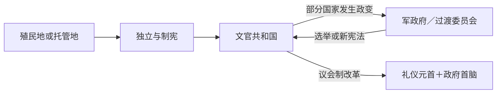

# 西非独立国家元首与权力结构表

## 使用范围

本表集中维护西非各独立国家从建国到 **2026 年 7 月 14 日** 的国家元首连续性。表中将总统、军政府主席、过渡元首和君主立宪期分开说明；“掌握实权者”不等同于法定国家元首。总理职位若不存在、被撤销或由总统兼任，均在各国表后说明，避免把国家元首与政府首脑混为一谈。

## 佛得角

| 顺序 | 国家元首 | 在任 | 身份与交接 |
| --- | --- | --- | --- |
| 1 | 阿里斯蒂德斯·佩雷拉 | 1975—1991 | 独立建国总统；非洲独立党一党体制 |
| 2 | 安东尼奥·马斯卡雷尼亚斯·蒙特罗 | 1991—2001 | 多党选举后的首次政党轮替 |
| 3 | 佩德罗·皮雷斯 | 2001—2011 | 前总理；经竞争性选举两任 |
| 4 | 若热·卡洛斯·丰塞卡 | 2011—2021 | 民主运动支持的总统 |
| 5 | 若泽·马里亚·内韦斯 | 2021—至今 | 议会制下的国家元首 |

总理是政府首脑：佩德罗·皮雷斯（1975—1991）、卡洛斯·韦加（1991—2000）、瓜尔贝托·多罗萨里奥（2000—2001）、若泽·马里亚·内韦斯（2001—2016）、乌利塞斯·科雷亚·席尔瓦（2016—至今）。总统主要承担国家代表和宪法仲裁功能，内阁由议会多数支持的总理领导。

## 冈比亚

| 顺序 | 国家元首 | 在任 | 身份与交接 |
| --- | --- | --- | --- |
| 1 | 伊丽莎白二世 | 1965—1970 | 冈比亚女王；总督约翰·保罗、法里芒·辛加特代表行使职权 |
| 2 | 达乌达·贾瓦拉 | 1970—1994 | 共和国首任总统；1994 年政变被推翻 |
| 3 | 叶海亚·贾梅 | 1994—2017 | 先任军政府主席，1996 年起任总统；拒绝承认败选后在区域压力下离境 |
| 4 | 阿达马·巴罗 | 2017—至今 | 因安全危机先在达喀尔宣誓，后在西非国家经济共同体干预下接掌国内政权 |

1965—1970 年贾瓦拉任总理；1970 年改行总统制后，总统兼任政府首脑，不另设总理。

## 几内亚

| 顺序 | 国家元首 | 在任 | 身份与交接 |
| --- | --- | --- | --- |
| 1 | 艾哈迈德·塞古·杜尔 | 1958—1984 | 独立建国总统；一党体制 |
| 2 | 路易·兰萨纳·贝阿沃吉 | 1984-03-26—1984-04-03 | 总理代行总统职务 |
| 3 | 兰萨纳·孔戴 | 1984—2008 | 军事政变上台，后改以选举总统身份执政 |
| 4 | 阿布巴卡尔·松帕雷 | 2008-12-22—2008-12-24 | 国民议会议长依法短暂代理 |
| 5 | 穆萨·达迪斯·卡马拉 | 2008—2009 | 国家民主与发展委员会主席；遇刺受伤后离任 |
| 6 | 塞库巴·科纳特 | 2009—2010 | 过渡总统，组织 2010 年选举 |
| 7 | 阿尔法·孔戴 | 2010—2021 | 首位经竞争性选举产生的总统；2021 年政变被推翻 |
| 8 | 马马迪·敦布亚 | 2021—至今 | 2021—2026 年先任过渡元首；2025 年选举获胜，2026-01-17 就任七年制总统 |

政府首脑与元首并非始终同一职位。总理职位曾撤销和恢复；1996 年后主要总理依次为西迪亚·杜尔、拉明·西迪梅、弗朗索瓦·隆塞尼·法尔、塞卢·达莱因·迪亚洛、欧仁·卡马拉、兰萨纳·库亚特、艾哈迈德·蒂迪亚内·苏瓦雷、卡比内·科马拉、让-马里·多雷、穆罕默德·赛义德·福法纳、马马迪·尤拉、易卜拉希马·卡索里·福法纳、穆罕默德·贝阿沃吉、贝尔纳·古穆和巴·乌里。军政府时期实际权力来自军事委员会及其主席。

## 几内亚比绍

| 顺序 | 国家元首 | 在任 | 身份与交接 |
| --- | --- | --- | --- |
| 1 | 路易斯·卡布拉尔 | 1973—1980 | 解放区宣布独立后的首任国家元首；1980 年政变被推翻 |
| 2 | 若昂·贝尔纳多·维埃拉 | 1980—1999 | 先任革命委员会主席，后任总统；内战中下台 |
| 3 | 马朗·巴卡伊·萨尼亚 | 1999—2000 | 国民议会议长代理总统 |
| 4 | 昆巴·雅拉 | 2000—2003 | 民选总统；军方政变推翻 |
| 5 | 恩里克·罗萨 | 2003—2005 | 文职过渡总统 |
| 6 | 若昂·贝尔纳多·维埃拉 | 2005—2009 | 复任；2009 年遇刺身亡 |
| 7 | 雷蒙多·佩雷拉 | 2009 | 国民议会议长第一次代理 |
| 8 | 马朗·巴卡伊·萨尼亚 | 2009—2012 | 民选总统；任内病逝 |
| 9 | 雷蒙多·佩雷拉 | 2012-01—2012-04 | 第二次代理；选举期间遭政变扣押 |
| 10 | 曼努埃尔·塞里福·尼亚马乔 | 2012—2014 | 2012 年政变后的过渡总统；军方保有否决力 |
| 11 | 若泽·马里奥·瓦斯 | 2014—2020 | 民选总统；与历任总理长期冲突 |
| 12 | 乌马罗·西索科·恩巴洛 | 2020—2025 | 选举结果有争议；2025-11-26 政变中被推翻 |
| 13 | 奥尔塔·因塔-阿·纳曼（奥尔塔·恩塔姆） | 2025—至今 | “恢复国家安全与公共秩序高级军事指挥部”过渡总统；宣布 2026-12-06 举行选举 |

总理名义上领导政府，但总统、议会多数、军队总参谋部与政党联盟屡次争夺任免权。2012 与 2025 年过渡期中，军事指挥机构是实际最高权力中心，不能只按文官总理名单理解政权运作。

## 利比里亚

| 顺序 | 国家元首 | 在任 | 备注 |
| --- | --- | --- | --- |
| 1—10 | 约瑟夫·詹金斯·罗伯茨；斯蒂芬·艾伦·本森；丹尼尔·巴希尔·沃纳；詹姆斯·斯普里格斯·佩恩；爱德华·詹姆斯·罗伊；詹姆斯·斯克夫林·史密斯；罗伯茨（复任）；佩恩（复任）；安东尼·加德纳；阿尔弗雷德·弗朗西斯·拉塞尔 | 1848—1884 | 早期美裔利比里亚人共和国；史密斯为代理总统 |
| 11—18 | 希拉里·约翰逊；约瑟夫·詹姆斯·奇斯曼；威廉·科尔曼；加勒特森·吉布森；阿瑟·巴克利；丹尼尔·爱德华·霍华德；查尔斯·邓巴·伯吉斯·金；埃德温·巴克利 | 1884—1944 | 真辉格党长期主导，内陆社会政治参与受限 |
| 19 | 威廉·塔布曼 | 1944—1971 | 统一政策与外资增长并行，长期总统制 |
| 20 | 威廉·托尔伯特 | 1971—1980 | 改革有限；大米骚乱后在政变中被杀 |
| 21 | 塞缪尔·多伊 | 1980—1990 | 先任人民救赎委员会主席，后任总统；内战中被杀 |
| 22—25 | 阿莫斯·索耶；戴维·克波马克波尔；威尔顿·桑卡武洛；露丝·佩里 | 1990—1997 | 多套和平协议下的临时国家委员会主席，权力受军阀割据限制 |
| 26 | 查尔斯·泰勒 | 1997—2003 | 民选总统；第二次内战与国际压力下辞职 |
| 27 | 摩西·布拉 | 2003-08—2003-10 | 短期代理总统 |
| 28 | 居德·布赖恩特 | 2003—2006 | 全国过渡政府主席 |
| 29 | 埃伦·约翰逊-瑟利夫 | 2006—2018 | 战后首位民选总统；完成两届任期 |
| 30 | 乔治·维阿 | 2018—2024 | 和平选举轮替 |
| 31 | 约瑟夫·博阿凯 | 2024—至今 | 2023 年胜选后于 2024 年就任 |

利比里亚自 1848 年起实行总统制，除内战过渡委员会时期外，国家元首兼政府首脑，不另设总理。内战阶段法定临时元首与控制领土的武装派别并不等同。

## 加纳

| 顺序 | 国家元首 | 在任 | 身份与交接 |
| --- | --- | --- | --- |
| 1 | 伊丽莎白二世 | 1957—1960 | 加纳女王；总督查尔斯·阿登-克拉克、利斯托韦尔伯爵代表 |
| 2 | 夸梅·恩克鲁玛 | 1960—1966 | 共和国首任总统；政变被推翻 |
| 3 | 约瑟夫·安克拉 | 1966—1969 | 民族解放委员会主席 |
| 4 | 阿夸西·阿夫里法 | 1969—1970 | 军政委员会主席，向第二共和国交权 |
| 5 | 爱德华·阿库福-阿多 | 1970—1972 | 第二共和国礼仪总统；布西亚任总理并掌政府 |
| 6 | 伊格内修斯·阿昌庞 | 1972—1978 | 军政府首脑 |
| 7 | 弗雷德·阿库福 | 1978—1979 | 最高军事委员会主席 |
| 8 | 杰里·罗林斯 | 1979-06—1979-09 | 武装部队革命委员会主席，随后交权 |
| 9 | 希拉·利曼 | 1979—1981 | 第三共和国总统；政变被推翻 |
| 10 | 杰里·罗林斯 | 1981—2001 | 先任临时全国保卫委员会主席，1993 年起为宪政总统 |
| 11 | 约翰·库福尔 | 2001—2009 | 首次和平政党轮替 |
| 12 | 约翰·阿塔·米尔斯 | 2009—2012 | 任内病逝 |
| 13 | 约翰·德拉马尼·马哈马 | 2012—2017 | 继任并在选举后完成任期 |
| 14 | 纳纳·阿库福-阿多 | 2017—2025 | 两届总统 |
| 15 | 约翰·德拉马尼·马哈马 | 2025—至今 | 复任总统 |

1957—1960 年恩克鲁玛任总理；1969—1972 年科菲·阿布雷法·布西亚任政府首脑。第四共和国实行总统制，总统兼政府首脑。

## 塞内加尔

| 顺序 | 国家元首 | 在任 | 交接 |
| --- | --- | --- | --- |
| 1 | 莱奥波尔德·塞达尔·桑戈尔 | 1960—1980 | 独立建国总统；主动辞职 |
| 2 | 阿卜杜·迪乌夫 | 1981—2000 | 依宪继任，后在选举中败选 |
| 3 | 阿卜杜拉耶·瓦德 | 2000—2012 | 首次反对党胜选；两届后败选 |
| 4 | 马基·萨勒 | 2012—2024 | 两届总统，2024 年选举延后争议后交权 |
| 5 | 巴西鲁·迪奥马耶·法耶 | 2024—至今 | 2024 年胜选；2026 年与原执政搭档分裂 |

总理序列为：马马杜·迪亚（独立前后至 1962）、阿卜杜·迪乌夫（1970—1980）、阿比卜·蒂亚姆、穆斯塔法·尼亚斯、阿比卜·蒂亚姆（复任）、马马杜·拉明·卢姆、穆斯塔法·尼亚斯（复任）、马姆·马迪奥尔·博耶、伊德里萨·塞克、马基·萨勒、谢赫·哈吉布·苏马雷、苏莱曼·恩德内·恩迪亚耶、阿卜杜勒·姆巴耶、阿米纳塔·杜尔、穆罕默德·迪奥纳、阿马杜·巴、西迪基·卡巴、乌斯曼·松科（2024—2026）、艾哈迈杜·阿尔阿米努·穆罕默德·洛（2026—至今）。职位在 1962—1970、1983—1991、2019—2022 年撤销。2026 年法耶解除松科总理职务后，前搭档转任国民议会议长，形成总统、政府与执政党议会多数之间的新权力张力。

## 塞拉利昂

| 顺序 | 国家元首 | 在任 | 身份与交接 |
| --- | --- | --- | --- |
| 1 | 伊丽莎白二世 | 1961—1971 | 塞拉利昂女王；总督代表行使元首职权 |
| 2—4 | 戴维·兰萨纳；安德鲁·贾克森-史密斯；约翰·班古拉 | 1967—1968 | 政变与反政变期间的军方实际元首；其权力与总督法定地位重叠 |
| 5 | 西亚卡·史蒂文斯 | 1971—1985 | 共和国首任总统；逐步建立一党制 |
| 6 | 约瑟夫·赛杜·莫莫 | 1985—1992 | 军方支持继任，后被政变推翻 |
| 7 | 瓦伦丁·斯特拉瑟 | 1992—1996 | 全国临时统治委员会主席 |
| 8 | 朱利叶斯·马达·比奥 | 1996-01—1996-03 | 宫廷政变后短期军政元首，组织交权 |
| 9 | 艾哈迈德·泰詹·卡巴 | 1996—1997 | 民选总统；被军事政变推翻 |
| 10 | 约翰尼·保罗·科罗马 | 1997—1998 | 武装部队革命委员会主席，与联阵结盟 |
| 11 | 艾哈迈德·泰詹·卡巴 | 1998—2007 | 在西非部队干预后复位 |
| 12 | 欧内斯特·巴伊·科罗马 | 2007—2018 | 两届任期 |
| 13 | 朱利叶斯·马达·比奥 | 2018—至今 | 经选举重返国家元首职位 |

1961—1971 年总理为米尔顿·马尔盖、阿尔伯特·马尔盖和西亚卡·史蒂文斯；1971 年后实行总统制，总统兼政府首脑。内战期实际权力还受革命联合阵线、军政府与西非维和部队控制范围影响。

## 多哥

| 顺序 | 国家元首 | 在任 | 身份与交接 |
| --- | --- | --- | --- |
| 1 | 西尔瓦努斯·奥林匹欧 | 1960—1963 | 独立建国总统；政变中遇害 |
| 2 | 尼古拉·格鲁尼茨基 | 1963—1967 | 军方扶植的文职总统；再度被推翻 |
| 3 | 克莱贝尔·达乔 | 1967-01—1967-04 | 民族和解委员会主席 |
| 4 | 纳辛贝·埃亚德马 | 1967—2005 | 军事强人，后以一党与多党选举形式长期执政 |
| 5 | 福雷·纳辛贝 | 2005-02-05—2005-02-25 | 军方促成的首次短暂继任，因内外压力辞职 |
| 6 | 邦福·阿巴斯 | 2005-02—2005-05 | 国民议会议长代理总统 |
| 7 | 福雷·纳辛贝 | 2005—2025 | 经选举复任并连续执政 |
| 8 | 让-吕西安·萨维·德托韦 | 2025—至今 | 第五共和国由议会选出的礼仪性总统 |

2025 年第五共和国改行议会制后，**福雷·纳辛贝以部长会议主席身份担任政府首脑并掌握行政实权**，萨维·德托韦主要履行国家礼仪与宪法代表职能。因而 2025 年不是纳辛贝家族实际权力的终结，而是权力职位的制度性转换。

## 尼日利亚

| 顺序 | 国家元首 | 在任 | 身份 |
| --- | --- | --- | --- |
| 1 | 伊丽莎白二世 | 1960—1963 | 尼日利亚女王；纳姆迪·阿齐基韦任总督 |
| 2 | 纳姆迪·阿齐基韦 | 1963—1966 | 第一共和国礼仪总统；阿布巴卡尔·塔法瓦·巴莱瓦任总理 |
| 3 | 约翰逊·阿吉伊-伊龙西 | 1966-01—1966-07 | 军事元首 |
| 4 | 雅库布·戈翁 | 1966—1975 | 内战时期军事元首 |
| 5 | 穆尔塔拉·穆罕默德 | 1975—1976 | 遇刺身亡 |
| 6 | 奥卢塞贡·奥巴桑乔 | 1976—1979 | 军事元首，向第二共和国交权 |
| 7 | 谢胡·沙加里 | 1979—1983 | 第二共和国总统 |
| 8 | 穆罕默杜·布哈里 | 1983—1985 | 军事元首 |
| 9 | 易卜拉欣·巴班吉达 | 1985—1993 | 军事总统 |
| 10 | 欧内斯特·肖内坎 | 1993-08—1993-11 | 临时国家政府首脑 |
| 11 | 萨尼·阿巴查 | 1993—1998 | 军事元首 |
| 12 | 阿卜杜勒萨拉米·阿布巴卡尔 | 1998—1999 | 军事元首，推动还政 |
| 13 | 奥卢塞贡·奥巴桑乔 | 1999—2007 | 第四共和国民选总统 |
| 14 | 奥马鲁·亚拉杜瓦 | 2007—2010 | 任内病逝 |
| 15 | 古德勒克·乔纳森 | 2010—2015 | 先代行总统，后继任并当选 |
| 16 | 穆罕默杜·布哈里 | 2015—2023 | 经选举重返权力 |
| 17 | 博拉·蒂努布 | 2023—至今 | 第四共和国总统 |

1960—1966 年总理是塔法瓦·巴莱瓦；此后除短暂的临时安排外，国家元首兼政府首脑。联邦州长、军区和安全机构在军事统治及内战阶段拥有显著实际权力。

## 尼日尔

| 顺序 | 国家元首 | 在任 | 交接 |
| --- | --- | --- | --- |
| 1 | 哈马尼·迪奥里 | 1960—1974 | 独立建国总统；政变被推翻 |
| 2 | 赛义尼·孔切 | 1974—1987 | 最高军事委员会主席；任内病逝 |
| 3 | 阿里·赛布 | 1987—1993 | 军政继任后推动有限开放 |
| 4 | 马哈曼·奥斯曼 | 1993—1996 | 首位多党民选总统；政变被推翻 |
| 5 | 易卜拉欣·巴雷·迈纳萨拉 | 1996—1999 | 政变上台；再度政变中被杀 |
| 6 | 达乌达·马拉姆·万凯 | 1999 | 过渡军政府主席 |
| 7 | 马马杜·坦贾 | 1999—2010 | 延长任期引发宪政危机，政变被推翻 |
| 8 | 萨卢·吉博 | 2010—2011 | 民主复兴最高委员会主席 |
| 9 | 马哈马杜·伊素福 | 2011—2021 | 两届总统并和平交权 |
| 10 | 穆罕默德·巴祖姆 | 2021—2023 | 民选总统；被总统卫队扣押推翻 |
| 11 | 阿卜杜拉赫曼·蒂亚尼 | 2023—至今 | 先任保卫祖国国家委员会主席；2025-03 起宣誓任五年过渡期“共和国总统” |

尼日尔通常由总统兼任政府权力中心；设总理时，总理由元首任命并负责日常内阁协调。2023 年后安全委员会与军队指挥层高于文职总理，法定头衔变化不能掩盖军政实质。

## 布基纳法索

| 顺序 | 国家元首 | 在任 | 身份 |
| --- | --- | --- | --- |
| 1 | 莫里斯·亚梅奥果 | 1960—1966 | 独立建国总统 |
| 2 | 桑古莱·拉米扎纳 | 1966—1980 | 军政元首，后任总统 |
| 3 | 赛耶·泽博 | 1980—1982 | 军事复兴委员会主席 |
| 4 | 让-巴蒂斯特·韦德拉奥果 | 1982—1983 | 人民救国委员会主席 |
| 5 | 托马斯·桑卡拉 | 1983—1987 | 全国革命委员会主席；政变中遇害 |
| 6 | 布莱斯·孔波雷 | 1987—2014 | 政变上台，后长期任总统；群众抗议中辞职 |
| 7 | 伊萨克·齐达 | 2014-11 | 短期代行国家元首 |
| 8 | 米歇尔·卡凡多 | 2014—2015 | 文职过渡总统；2015 年政变期间一度被扣押后复职 |
| 9 | 吉尔贝尔·迪安德雷 | 2015-09 | 短命“全国民主委员会”主席；不获承认并交权 |
| 10 | 罗克·马克·克里斯蒂安·卡博雷 | 2015—2022 | 民选总统；安全危机中被政变推翻 |
| 11 | 保罗-亨利·桑达奥果·达米巴 | 2022-01—2022-09 | 保卫与复兴爱国运动主席 |
| 12 | 易卜拉欣·特拉奥雷 | 2022—至今 | 第二次 2022 年政变上台；过渡总统、国家元首 |

总统制与军政府阶段均由国家元首掌握政府主导权；文职总理负责行政协调但受军政委员会约束。2024 年过渡宪章延长军政安排，不能按原定选举日推定已经完成还政。

## 毛里塔尼亚

| 顺序 | 国家元首 | 在任 | 交接 |
| --- | --- | --- | --- |
| 1 | 莫克塔尔·乌尔德·达达赫 | 1960—1978 | 独立建国总统；西撒哈拉战争压力下被推翻 |
| 2 | 穆斯塔法·乌尔德·萨莱克 | 1978—1979 | 国家复兴军事委员会主席 |
| 3 | 穆罕默德·马哈茂德·乌尔德·卢利 | 1979—1980 | 军政元首 |
| 4 | 穆罕默德·库纳·乌尔德·海达拉 | 1980—1984 | 军政元首 |
| 5 | 马维亚·乌尔德·西德艾哈迈德·塔亚 | 1984—2005 | 政变上台，后以总统身份长期执政 |
| 6 | 埃利·乌尔德·穆罕默德·瓦勒 | 2005—2007 | 军事司法与民主委员会主席，组织选举 |
| 7 | 西迪·乌尔德·谢赫·阿卜杜拉希 | 2007—2008 | 民选总统；政变被推翻 |
| 8 | 穆罕默德·乌尔德·阿卜杜勒·阿齐兹 | 2008—2009 | 最高国务委员会主席 |
| 9 | 巴·马马杜·姆巴雷 | 2009 | 参议院议长代理总统 |
| 10 | 穆罕默德·乌尔德·阿卜杜勒·阿齐兹 | 2009—2019 | 经选举任总统 |
| 11 | 穆罕默德·乌尔德·谢赫·加兹瓦尼 | 2019—至今 | 2019 年当选、2024 年连任 |

设总理领导日常政府，但总统控制国防、外交和高级任命；多次军政更替中，军队参谋系统是决定交接的实际力量。

## 科特迪瓦

| 顺序 | 国家元首 | 在任 | 交接 |
| --- | --- | --- | --- |
| 1 | 费利克斯·乌弗埃-博瓦尼 | 1960—1993 | 独立建国总统；任内病逝 |
| 2 | 亨利·科南·贝迪埃 | 1993—1999 | 依宪继任；政变被推翻 |
| 3 | 罗贝尔·盖伊 | 1999—2000 | 全国公共救国委员会主席；选举失败后下台 |
| 4 | 洛朗·巴博 | 2000—2011 | 内战与南北分裂时期总统；2010 年败选后拒绝交权 |
| 5 | 阿拉萨内·瓦塔拉 | 2010／2011—至今 | 2010 年国际承认的胜选者；2011-04 控制全国，2025 年再次当选 |

1990 年恢复总理职位后，政府首脑依次包括阿拉萨内·瓦塔拉、达尼埃尔·卡布兰·敦坎、赛义杜·迪亚拉、帕斯卡尔·阿菲·恩盖桑、赛义杜·迪亚拉（复任）、夏尔·科南·班尼、纪尧姆·索罗、让诺·阿乌苏-夸迪奥、敦坎（复任）、阿马杜·贡·库利巴利、阿梅德·巴卡约科、帕特里克·阿希和罗贝尔·伯格雷·芒贝。2002—2011 年叛军控制北部、政府控制南部，法定职位不能完整代表实际领土权力；2010—2011 年巴博与瓦塔拉一度并立。

## 贝宁

| 顺序 | 国家元首 | 在任 | 身份 |
| --- | --- | --- | --- |
| 1 | 于贝尔·马加 | 1960—1963 | 独立建国总统 |
| 2 | 克里斯托夫·索格洛 | 1963—1964 | 军方临时元首 |
| 3 | 苏鲁-米冈·阿皮蒂 | 1964—1965 | 文职总统 |
| 4 | 塔伊鲁·孔加库 | 1965-11—1965-12 | 国民议会议长代理 |
| 5 | 克里斯托夫·索格洛 | 1965—1967 | 再次军政掌权 |
| 6—9 | 让-巴蒂斯特·阿谢姆；莫里斯·库安德特；阿尔方斯·阿马杜·阿莱；埃米尔·德兰·津苏 | 1967—1969 | 政变、军方内部交接与受军方支持的文职总统 |
| 10 | 莫里斯·库安德特 | 1969-12 | 短期军政元首 |
| 11 | 保罗-埃米尔·德苏扎 | 1969—1970 | 军事执政委员会主席 |
| 12 | 于贝尔·马加 | 1970—1972 | 三人总统委员会首位轮值主席 |
| 13 | 贾斯坦·阿奥马德贝-托梅坦 | 1972-05—1972-10 | 轮值主席；政变被推翻 |
| 14 | 马蒂厄·克雷库 | 1972—1991 | 军事政变上台，建立马克思主义一党国家 |
| 15 | 尼塞福尔·索格洛 | 1991—1996 | 全国会议转型后的民选总统 |
| 16 | 马蒂厄·克雷库 | 1996—2006 | 经选举复任 |
| 17 | 亚伊·博尼 | 2006—2016 | 两届总统 |
| 18 | 帕特里斯·塔隆 | 2016—2026 | 两届总统并依宪交权 |
| 19 | 罗穆阿尔德·瓦达尼 | 2026—至今 | 2026-04-12 胜选，2026-05-24 就任 |

贝宁现行总统制下，总统兼政府首脑，不设总理。1970—1972 年三人总统委员会原计划由马加、阿皮蒂、阿奥马德贝轮值，实际仅前两人完成轮值，随后被克雷库政变中断。

## 马里

| 顺序 | 国家元首 | 在任 | 交接 |
| --- | --- | --- | --- |
| 1 | 莫迪博·凯塔 | 1960—1968 | 独立建国总统；政变被推翻 |
| 2 | 穆萨·特拉奥雷 | 1968—1991 | 军政元首，后任总统；群众运动与军变中下台 |
| 3 | 阿马杜·图马尼·杜尔 | 1991—1992 | 人民救国过渡委员会主席，组织多党选举 |
| 4 | 阿尔法·乌马尔·科纳雷 | 1992—2002 | 两届民选总统 |
| 5 | 阿马杜·图马尼·杜尔 | 2002—2012 | 经选举重返权力；政变中下台 |
| 6 | 阿马杜·萨诺戈 | 2012-03—2012-04 | 恢复民主与重建国家委员会实际首脑 |
| 7 | 迪翁孔达·特拉奥雷 | 2012—2013 | 国民议会议长转任过渡总统 |
| 8 | 易卜拉欣·布巴卡尔·凯塔 | 2013—2020 | 民选总统；政变被推翻 |
| 9 | 阿西米·戈伊塔 | 2020-08—2020-09 | 全国人民救国委员会主席 |
| 10 | 巴·恩多 | 2020—2021 | 文职过渡总统；第二次政变中被解除职务 |
| 11 | 阿西米·戈伊塔 | 2021—至今 | 过渡总统、国家元首；2023 年宪法强化总统权力 |

马里设总理，但 2020 年后军方过渡机构与总统控制安全、外交和战略决策。北部叛乱、伊斯兰主义武装与外部军事伙伴使“法定政府”与“有效控制”长期不完全重合。

## 相关笔记

- [西非通史](/%E4%BA%BA%E6%96%87%E7%A7%91%E5%AD%A6/%E5%8E%86%E5%8F%B2/%E9%9D%9E%E6%B4%B2/%E8%A5%BF%E9%9D%9E/README.md)
- [伊斯兰改革、殖民征服与独立](/%E4%BA%BA%E6%96%87%E7%A7%91%E5%AD%A6/%E5%8E%86%E5%8F%B2/%E9%9D%9E%E6%B4%B2/%E8%A5%BF%E9%9D%9E/%E4%BC%8A%E6%96%AF%E5%85%B0%E6%94%B9%E9%9D%A9%E3%80%81%E6%AE%96%E6%B0%91%E5%BE%81%E6%9C%8D%E4%B8%8E%E7%8B%AC%E7%AB%8B.md)
