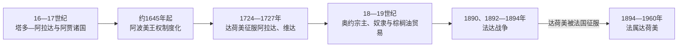

# 贝宁的前殖民社会与殖民统治

## 时间

古代—1960年

## 概括

贝宁共和国与尼日利亚的贝宁王国不是同一政治体。今贝宁南部由阿贾、丰和约鲁巴国家组成，阿波美的达荷美王国17世纪后扩张；北部博尔古地区则有尼基等巴里巴王国。

## 本地演进图

## 王国形成与统治机制

达荷美由阿波美国王、王母／克波吉托、男女性对应官员、省长和常备军组成，年度礼仪既分配贡赋也展示王权。阿加贾征服阿拉达和维达后直接接触大西洋贸易，却长期向奥约纳贡；盖佐时期才摆脱奥约约束。王室控制战争、贸易和宫廷工场，但地方社群、商人和被征服人口保有不同程度自治与反抗。

北部尼基等博尔古王国以巴里巴骑兵、市场和王族分支维持跨境政治；波多诺伏有约鲁巴—阿贾宫廷和独立贸易利益。现代贝宁并非达荷美王国简单延续，国名在1975年选择“贝宁”正是为避免单一南方王国代表全境。

## 主要社会与政权

| 社会或政权 | 大致时期 | 特征 |
|---|---|---|
| 阿拉达与波多诺伏 | 16—19世纪 | 阿贾—约鲁巴沿海王国与港口贸易 |
| 达荷美王国 | 约1625—1894年 | 阿波美中央王权、常备军事与贡赋体系 |
| 尼基等博尔古王国 | 北部 | 骑兵、市场和跨区商路 |

## 法国征服的具体过程

法国先以科托努租借和保护波多诺伏扩大海岸影响，贝汉津拒绝法国把这些安排解释为主权让渡。1890年第一次法达战争暂以条约停战；1892年多兹率法军凭步枪、炮兵和非洲部队沿河、铁路推进，达荷美军包括女性军团多次正面抵抗。1894年贝汉津流亡，法国扶立阿戈利-阿博，1900年又废黜他，表明“保护”最终转为直接殖民主权。

法属达荷美1899年纳入法属西非，向北同英属尼日利亚和德属多哥划界。区长、获承认酋长和地方行政征税劳役；棕榈油、铁路和港口面向出口。教育培养一批文职精英，使达荷美有“拉丁区”之称，却未解决地区不均。

## 殖民统治

达荷美通过征服和奴隶贸易与欧洲商人往来，19世纪棕榈油贸易增长。法国为控制科托努和波多诺伏与国王贝汉津交战，1894年征服达荷美；殖民地纳入法属西非并向北划界。

## 重要事件

- 1727年达荷美征服维达，直接进入大西洋贸易。
- 18世纪达荷美在奥约帝国压力下纳贡，后逐步摆脱。
- 1890、1892—1894年发生两次法达战争。
- 贝汉津国王抵抗失败后被流放，法国建立殖民统治。

## 达荷美兴衰与殖民转型

| 层次 | 因素 | 作用 |
|---|---|---|
| 崛起机制 | 宫廷官僚、常备军、贡赋与海岸贸易 | 支撑阿波美向南扩张 |
| 结构弱点 | 对战争俘虏和出口依赖、地方反抗与继承争议 | 奴隶贸易受限后财政转型困难 |
| 外部压力 | 奥约早期宗主、法国对科托努和波多诺伏扩张 | 限制王国战略空间 |
| 直接触发 | 1892法军全面进攻、1894贝汉津流亡、1900废黜阿戈利-阿博 | 终结主权王国并取消残余王权 |

从达科多努、杭贝到贝汉津、阿戈利-阿博的完整序列及被删除／摄政统治者，见[西非帝国与王国统治者世系表](/%E4%BA%BA%E6%96%87%E7%A7%91%E5%AD%A6/%E5%8E%86%E5%8F%B2/%E9%9D%9E%E6%B4%B2/%E8%A5%BF%E9%9D%9E/%E8%A5%BF%E9%9D%9E%E5%B8%9D%E5%9B%BD%E4%B8%8E%E7%8E%8B%E5%9B%BD%E7%BB%9F%E6%B2%BB%E8%80%85%E4%B8%96%E7%B3%BB%E8%A1%A8.md)。殖民行政由法属西非总督—达荷美总督／副总督—区长—酋长构成。

## 演变关系

殖民统治把不同社会纳入同一行政边界，并为[贝宁的独立建国与现代发展](/%E4%BA%BA%E6%96%87%E7%A7%91%E5%AD%A6/%E5%8E%86%E5%8F%B2/%E9%9D%9E%E6%B4%B2/%E8%A5%BF%E9%9D%9E/%E8%B4%9D%E5%AE%81/%E7%8B%AC%E7%AB%8B%E5%BB%BA%E5%9B%BD%E4%B8%8E%E7%8E%B0%E4%BB%A3%E5%8F%91%E5%B1%95.md)留下中央机构、出口经济和地区差异。
