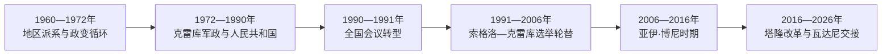

# 贝宁的独立建国与现代发展

## 时间

1960年至今

## 概括

1960年达荷美共和国独立，地区派系和军队导致频繁政变。马蒂厄·克雷库1972年掌权并建立马克思列宁主义人民共和国；经济危机促使1990年全国会议和平转向多党民主。

## 政权演进图

## 主要政治阶段

| 阶段 | 时间 | 权力结构与特征 |
|---|---|---|
| 第一共和国与政变循环 | 1960—1972年 | 地区领导人竞争，军人反复干政 |
| 贝宁人民共和国 | 1972—1990年 | 克雷库一党社会主义，1975年改国名为贝宁 |
| 多党共和国 | 1990年至今 | 全国会议、竞争性选举和文官轮替 |

## 政变循环、全国会议与2026年交接

独立后马加、阿皮蒂、阿奥马德贝分别代表不同地区政治网络，财政薄弱和联盟不稳使军方反复“仲裁”。1970年三人总统委员会按轮值设计妥协，尚未完成全部轮换便在1972年被克雷库推翻。克雷库建立马克思列宁主义党国，1975年改国名；国有部门危机、拖欠工资和社会抗议最终迫使其接受1990年全国主权会议。

全国会议任命索格洛为总理并限制克雷库，1991年索格洛胜选。克雷库1996年又经选举复任并在两届后离任，说明前军政领导也能被纳入规则。亚伊·博尼两届后于2016年交权给塔隆。

塔隆推进基础设施、税务和行政改革，同时选举法、反对派准入与司法独立受到争议。其依两届限制没有再参选，前财政部长罗穆阿尔德·瓦达尼在2026年4月选举获胜，5月24日就任，构成一次按宪交接；评估民主质量仍须区分“能交接”与“竞争是否充分”。

## 重要转折

- 1960年8月1日独立。
- 1972年克雷库政变，后宣布马克思列宁主义路线。
- 1975年国家由达荷美改名贝宁，避免以单一历史王国代表全国。
- 1990年全国主权会议限制总统权力并任命过渡政府。
- 1991年尼塞福尔·索格洛胜选，实现非洲早期和平民主转型之一。

## 政权兴衰与制度条件

| 层次 | 因素 | 影响 |
|---|---|---|
| 早期脆弱 | 地区派系、财政不足和军队自任仲裁者 | 造成1963—1972年密集政变 |
| 转型压力 | 国企危机、工资拖欠、工会与教会动员 | 促成1990年全国会议 |
| 稳定机制 | 两届限制、选举交接和军队退出政治 | 1991年后避免成功军事政变 |
| 新争议 | 选举门槛、反对派空间和总统权集中 | 使制度稳定不等同于充分竞争 |

完整元首、短期军政、轮值委员会和2026年交接见[西非独立国家元首与权力结构表](/%E4%BA%BA%E6%96%87%E7%A7%91%E5%AD%A6/%E5%8E%86%E5%8F%B2/%E9%9D%9E%E6%B4%B2/%E8%A5%BF%E9%9D%9E/%E8%A5%BF%E9%9D%9E%E7%8B%AC%E7%AB%8B%E5%9B%BD%E5%AE%B6%E5%85%83%E9%A6%96%E4%B8%8E%E6%9D%83%E5%8A%9B%E7%BB%93%E6%9E%84%E8%A1%A8.md)。贝宁不设总理，总统兼政府首脑；截至2026年7月，罗穆阿尔德·瓦达尼任总统。

## 演变关系

前接[贝宁的前殖民社会与殖民统治](/%E4%BA%BA%E6%96%87%E7%A7%91%E5%AD%A6/%E5%8E%86%E5%8F%B2/%E9%9D%9E%E6%B4%B2/%E8%A5%BF%E9%9D%9E/%E8%B4%9D%E5%AE%81/%E5%89%8D%E6%AE%96%E6%B0%91%E7%A4%BE%E4%BC%9A%E4%B8%8E%E6%AE%96%E6%B0%91%E7%BB%9F%E6%B2%BB.md)。现代国家的边界、行政语言和经济结构继承殖民框架，同时又被本国社会运动、军队、政党与区域组织重新塑造。
