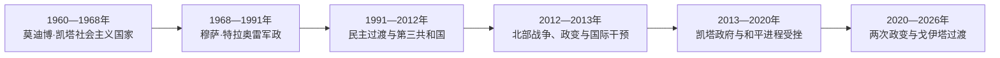

# 马里的独立建国与现代发展

## 时间

1960年至今

## 概括

马里先与塞内加尔组成马里联邦，1960年联邦解体后建立共和国。莫迪博·凯塔实行社会主义建国，1968年政变开启军政循环；1991年民主化后，北部图阿雷格问题、地区不平等与跨境武装持续挑战国家。

## 政权演进图

## 主要政治阶段

| 阶段 | 时间 | 权力结构与特征 |
|---|---|---|
| 凯塔第一共和国 | 1960—1968年 | 一党社会主义、国有化与泛非外交 |
| 特拉奥雷军政时期 | 1968—1991年 | 军政府和一党制，旱灾与社会抗议加剧 |
| 多党政治与安全危机 | 1991年至今 | 民主宪政、北部叛乱、2012年危机及后续政变交织 |

## 建国、北部危机与军政转向

马里联邦解体后，莫迪博·凯塔建立一党社会主义国家、退出法郎区并推进国有化，财政紧张和军队不满促成1968年穆萨·特拉奥雷政变。旱灾、腐败和学生—工会抗议在1991年达到高峰，阿马杜·图马尼·杜尔倒戈推翻特拉奥雷，组织全国会议和1992年选举。

第三共和国前期完成两届交接，但北部图阿雷格叛乱、地方发展不足和军队能力问题未解决。2012年从利比亚回流的武装和民族解放运动进攻，萨诺戈政变瓦解指挥链，伊斯兰主义武装排挤分离组织并控制廷巴克图、加奥；2013年法国和非洲部队干预收复城市。2015年阿尔及尔协议执行迟缓，暴力向中部扩散。

2020年军方推翻易卜拉欣·布巴卡尔·凯塔，先由巴·恩多任过渡总统；2021年戈伊塔再次扣押文职领导并自任过渡总统。新宪法强化总统权，政治党派活动受限；马里同布基纳法索、尼日尔组成萨赫勒国家联盟并在2025年正式退出西共体。截至2026年7月仍未完成民选交接，安全战事持续。

## 重要转折

- 1960年9月22日马里共和国独立。
- 1968年穆萨·特拉奥雷政变。
- 1991年军队倒戈结束一党统治并启动多党宪政。
- 2012年北部叛乱、军事政变和武装组织占领北方城市引发国际干预；2020、2021年再次发生政变。

## 国家危机的因果分层

| 层次 | 因素 | 影响 |
|---|---|---|
| 结构因素 | 南北距离、地方自治不足、军队与公共服务薄弱 | 和平协议难落实，边缘区反复叛乱 |
| 外部压力 | 利比亚武器回流、跨境圣战网络与外国军力 | 2012年迅速扩大国家崩解 |
| 政治因素 | 腐败、选举信任下降和军方自任救国者 | 2020、2021年连续政变 |
| 直接触发 | 2012政变破坏指挥、2020抗议与兵变 | 把长期安全危机转化为中央政权更替 |

完整元首、政变实际首脑与过渡安排见[西非独立国家元首与权力结构表](/%E4%BA%BA%E6%96%87%E7%A7%91%E5%AD%A6/%E5%8E%86%E5%8F%B2/%E9%9D%9E%E6%B4%B2/%E8%A5%BF%E9%9D%9E/%E8%A5%BF%E9%9D%9E%E7%8B%AC%E7%AB%8B%E5%9B%BD%E5%AE%B6%E5%85%83%E9%A6%96%E4%B8%8E%E6%9D%83%E5%8A%9B%E7%BB%93%E6%9E%84%E8%A1%A8.md)。截至2026年7月，阿西米·戈伊塔任过渡总统并兼掌核心安全决策；总理负责日常政府但不构成独立权力中心。

## 演变关系

前接[马里的前殖民社会与殖民统治](/%E4%BA%BA%E6%96%87%E7%A7%91%E5%AD%A6/%E5%8E%86%E5%8F%B2/%E9%9D%9E%E6%B4%B2/%E8%A5%BF%E9%9D%9E/%E9%A9%AC%E9%87%8C/%E5%89%8D%E6%AE%96%E6%B0%91%E7%A4%BE%E4%BC%9A%E4%B8%8E%E6%AE%96%E6%B0%91%E7%BB%9F%E6%B2%BB.md)。现代国家的边界、行政语言和经济结构继承殖民框架，同时又被本国社会运动、军队、政党与区域组织重新塑造。
