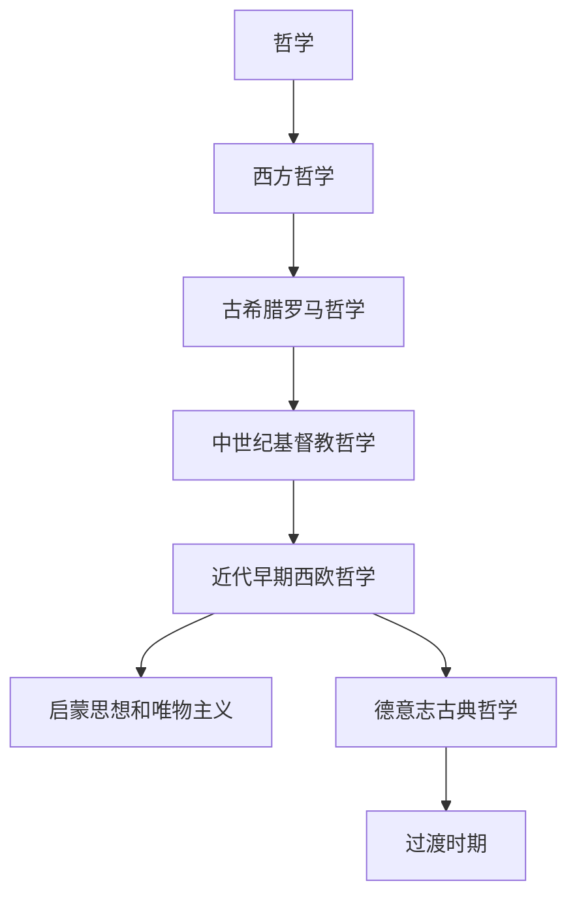

# 哲学

哲学关注存在、知识、价值、理性、语言、心灵、社会和历史等根本问题。整理哲学笔记时，优先按“传统 / 时期 / 学派 / 人物 / 问题”组织，不把人物清单和思想命题混在一起。

## 总览

| 方向 | 时间范围 | 主线 | 说明 |
|---|---|---|---|
| [西方哲学](/%E4%BA%BA%E6%96%87%E7%A7%91%E5%AD%A6/%E5%93%B2%E5%AD%A6/%E8%A5%BF%E6%96%B9%E5%93%B2%E5%AD%A6/README.md) | 古希腊至现代 | 自然、本体、知识、伦理、政治、宗教、历史与主体性 | 当前目录先整理西方哲学主线。 |

## 整理原则

- 总览页负责展示时期关系、主问题和主要学派。
- 阶段页保留人物、观点、承继和影响，不保留图片来源性描述。
- 哲学人物应放在其所处时期和学派中理解；同一人物可以同时与多条问题线相关。
