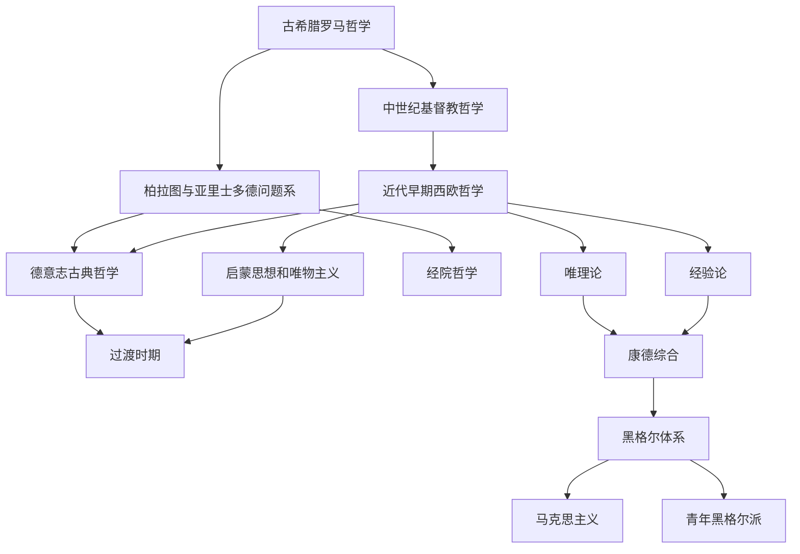

# 西方哲学

## 范围

西方哲学从古希腊自然哲学和城邦伦理政治思考展开，经过希腊化和罗马时期的学派化，中世纪与基督教神学结合，近代早期转向主体、知识和自然科学方法，18 世纪进入启蒙、自然法和唯物主义，德意志古典哲学则集中处理理性、自由、主体、历史和辩证法，19 世纪后出现马克思主义、实证主义、非理性主义、存在主义前史等过渡线索。

## 演变关系

## 阶段

| 阶段 | 时间 | 核心问题 | 代表人物 / 流派 |
|---|---|---|---|
| [古希腊罗马哲学](/%E4%BA%BA%E6%96%87%E7%A7%91%E5%AD%A6/%E5%93%B2%E5%AD%A6/%E8%A5%BF%E6%96%B9%E5%93%B2%E5%AD%A6/%E5%8F%A4%E5%B8%8C%E8%85%8A%E7%BD%97%E9%A9%AC%E5%93%B2%E5%AD%A6/README.md) | 前6世纪-4世纪 | 自然、本原、存在、知识、德性、城邦生活 | 泰勒斯、巴门尼德、赫拉克利特、苏格拉底、柏拉图、亚里士多德、伊壁鸠鲁、斯多葛派、新柏拉图主义 |
| [中世纪基督教哲学](/%E4%BA%BA%E6%96%87%E7%A7%91%E5%AD%A6/%E5%93%B2%E5%AD%A6/%E8%A5%BF%E6%96%B9%E5%93%B2%E5%AD%A6/%E4%B8%AD%E4%B8%96%E7%BA%AA%E5%9F%BA%E7%9D%A3%E6%95%99%E5%93%B2%E5%AD%A6/README.md) | 4世纪-14世纪 | 信仰与理性、上帝、普遍概念、经院论证 | 奥古斯丁、波爱修、安瑟尔谟、阿伯拉尔、阿奎那、司各脱、奥卡姆 |
| [近代早期西欧哲学](/%E4%BA%BA%E6%96%87%E7%A7%91%E5%AD%A6/%E5%93%B2%E5%AD%A6/%E8%A5%BF%E6%96%B9%E5%93%B2%E5%AD%A6/%E8%BF%91%E4%BB%A3%E6%97%A9%E6%9C%9F%E8%A5%BF%E6%AC%A7%E5%93%B2%E5%AD%A6/README.md) | 14世纪-18世纪 | 人文主义、宗教改革、经验论、唯理论、自然神论 | 彼特拉克、培根、霍布斯、洛克、贝克莱、休谟、笛卡尔、斯宾诺莎、莱布尼茨 |
| [启蒙思想和唯物主义](/%E4%BA%BA%E6%96%87%E7%A7%91%E5%AD%A6/%E5%93%B2%E5%AD%A6/%E8%A5%BF%E6%96%B9%E5%93%B2%E5%AD%A6/%E5%90%AF%E8%92%99%E6%80%9D%E6%83%B3%E5%92%8C%E5%94%AF%E7%89%A9%E4%B8%BB%E4%B9%89/README.md) | 18世纪 | 自然法、自由、理性、社会批判、机械唯物主义 | 伏尔泰、孟德斯鸠、卢梭、狄德罗、拉美特利、爱尔维修、霍尔巴赫 |
| [德意志古典哲学](/%E4%BA%BA%E6%96%87%E7%A7%91%E5%AD%A6/%E5%93%B2%E5%AD%A6/%E8%A5%BF%E6%96%B9%E5%93%B2%E5%AD%A6/%E5%BE%B7%E6%84%8F%E5%BF%97%E5%8F%A4%E5%85%B8%E5%93%B2%E5%AD%A6/README.md) | 1770-1844 | 批判哲学、主体、自由、绝对精神、辩证法 | 康德、费希特、谢林、黑格尔、费尔巴哈、青年黑格尔派 |
| [过渡时期](/%E4%BA%BA%E6%96%87%E7%A7%91%E5%AD%A6/%E5%93%B2%E5%AD%A6/%E8%A5%BF%E6%96%B9%E5%93%B2%E5%AD%A6/%E8%BF%87%E6%B8%A1%E6%97%B6%E6%9C%9F/README.md) | 1844-1900 | 资本、历史、非理性、实证科学、现代哲学分化 | 马克思、叔本华、克尔凯郭尔、孔德、穆勒、斯宾塞、尼采 |

## 说明

- 西方哲学不是单线进步史，而是多个问题系之间的继承、反驳和重组。
- 柏拉图、亚里士多德、奥古斯丁、阿奎那、笛卡尔、休谟、康德、黑格尔、马克思等人物是多个阶段之间的枢纽。
