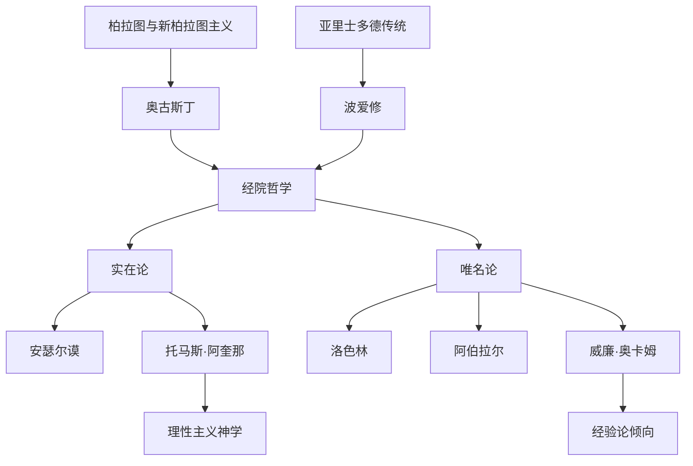

# 中世纪基督教哲学

## 时间

4世纪至14世纪。

## 概括

中世纪基督教哲学围绕信仰与理性、上帝与世界、灵魂与救赎、普遍概念和经院论证展开。它继承柏拉图、亚里士多德和新柏拉图主义，又把这些资源纳入基督教神学框架中。

## 演变关系

## 主要人物

| 人物 | 位置 | 关键思想 |
|---|---|---|
| 奥古斯丁 | 教父哲学核心 | 上帝言说、原罪、恩典、上帝之城与世俗之城、光照说。 |
| 波爱修 | 古典哲学向中世纪传递的枢纽 | 翻译和保存逻辑传统，使亚里士多德问题进入中世纪讨论。 |
| 爱留根纳 | 早期经院哲学 | 权威与理性、四重自然、泛神论倾向。 |
| 安瑟尔谟 | 经院哲学、实在论 | 关于上帝存在的本体论证明，被称为经院哲学之父。 |
| 图尔的贝伦伽尔 | 唯名论相关争论 | 圣餐和普遍概念争论中的重要节点。 |
| 洛色林 | 唯名论 | 唯名论创始人之一。 |
| 阿伯拉尔 | 经院逻辑与神学 | 理解导致信仰、概念论、经院逻辑学。 |
| 阿维洛伊 | 亚里士多德解释传统 | 双重真理、统一的人类理性，对拉丁经院哲学影响很大。 |
| 大阿尔伯特 | 亚里士多德传统 | 阿奎那的老师，推动亚里士多德哲学进入基督教神学。 |
| 托马斯·阿奎那 | 经院哲学高峰、实在论 | 理性真理与启示真理、五路证明、宇宙论、目的论、世界系统。 |
| 罗吉尔·培根 | 经验和科学意识 | 科学意识、经验论、反托马斯主义倾向。 |
| 约翰·邓斯·司各脱 | 唯名论与意志主义相关线索 | 忘志主义、哲学神学分立、经验证据。 |
| 威廉·奥卡姆 | 晚期唯名论 | 奥卡姆剃刀、公议会主义、经验主义倾向。 |

## 说明

- 中世纪哲学不是单纯神学附庸，而是围绕理性论证和概念分析形成了高度技术化的经院传统。
- “实在论 / 唯名论”之争集中于普遍概念是否具有独立实在性。
- 阿奎那把亚里士多德哲学系统地纳入基督教神学，是中世纪理性神学的高峰。
- 奥卡姆和晚期唯名论削弱了中世纪经院体系，为近代经验论和科学方法留下空间。

## 上级

- [西方哲学](/%E4%BA%BA%E6%96%87%E7%A7%91%E5%AD%A6/%E5%93%B2%E5%AD%A6/%E8%A5%BF%E6%96%B9%E5%93%B2%E5%AD%A6/README.md)

## 参考图

