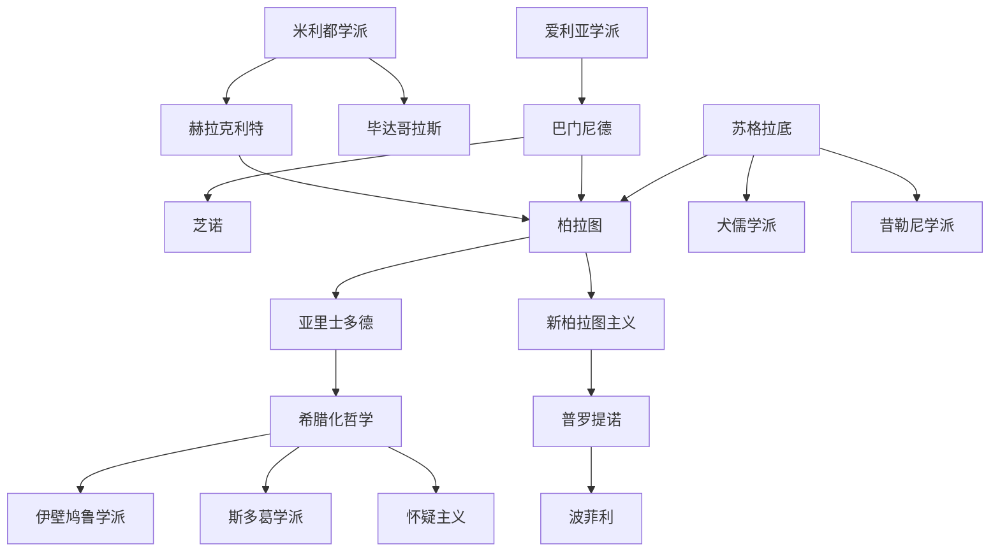

# 古希腊罗马哲学

## 时间

前6世纪至4世纪。

## 概括

古希腊罗马哲学从对自然本原的追问开始，逐渐形成存在论、知识论、伦理学、政治哲学和逻辑学。苏格拉底、柏拉图、亚里士多德构成古典哲学中心；希腊化和罗马时期则以伊壁鸠鲁学派、斯多葛学派、怀疑主义和新柏拉图主义延续并改造古典问题。

## 演变关系

## 主要阶段

| 阶段 / 学派 | 代表人物 | 核心问题 |
|---|---|---|
| 米利都学派 | 泰勒斯、阿那克西曼德、阿那克西美尼 | 万物本原、自然解释、无限定者、气等本原设想。 |
| 毕达哥拉斯传统 | 毕达哥拉斯 | 数、和谐、宇宙秩序、灵魂与净化。 |
| 爱利亚学派 | 克塞诺芬尼、巴门尼德、芝诺、麦里梭 | 存在、不变、真理与意见、运动悖论。 |
| 多元论与原子论 | 恩培多克勒、阿那克萨戈拉、德谟克利特 | 四根、努斯、原子、虚空、影像。 |
| 智者学派 | 普罗泰戈拉、高尔吉亚 | 人为尺度、修辞、认识相对性、城邦教育。 |
| 苏格拉底问题 | 苏格拉底 | 认识你自己、德性即知识、精神接生术。 |
| 柏拉图学派 | 柏拉图 | 理型论、灵魂、理念世界、理想国、哲学王。 |
| 亚里士多德体系 | 亚里士多德 | 第一哲学、实体、四因、形式与质料、逻辑、伦理、政治。 |
| 希腊化哲学 | 伊壁鸠鲁、芝诺、克里安泰、克吕西普、西塞罗、塞涅卡、爱比克泰德、马可·奥勒留 | 幸福、欲望、自然、命运、德性、内在自由。 |
| 新柏拉图主义 | 斐洛、普罗提诺、波菲利 | 太一、灵魂、努斯、流溢、回归。 |

## 说明

- 早期自然哲学从神话解释转向以自然本原解释世界。
- 苏格拉底之后，哲学中心从自然本原转向灵魂、德性、知识和城邦生活。
- 柏拉图与亚里士多德的分歧成为后世本体论、认识论、伦理学和政治哲学的长期问题源。
- 希腊化时期哲学更强调个体如何在不稳定世界中获得安宁、自由和德性。

## 上级

- [西方哲学](/%E4%BA%BA%E6%96%87%E7%A7%91%E5%AD%A6/%E5%93%B2%E5%AD%A6/%E8%A5%BF%E6%96%B9%E5%93%B2%E5%AD%A6/README.md)

## 参考图

