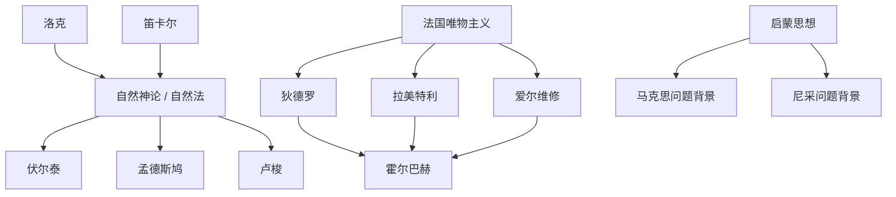

# 启蒙思想和唯物主义

## 时间

18世纪。

## 概括

法兰西启蒙思想以理性、自由、自然法、社会批判和政治制度改革为主线；法兰西唯物主义则进一步把自然、心灵和社会解释纳入机械论或自然主义框架。它们共同反对专制、教权和盲目信仰，推动近代政治哲学、社会理论和世俗知识体系的发展。

## 演变关系

## 主要人物

| 方向 | 人物 | 关键思想 |
|---|---|---|
| 自然神论 / 自然法 | 伏尔泰 | 上帝合理、自由乃意志必然。 |
| 自然法与政治制度 | 孟德斯鸠 | 自然法、君主立宪、三权分立、泛法论、地理决定论。 |
| 社会批判 | 卢梭 | 自然本性、人类不平等起源、社会契约、文明批判、公意、民主共和制。 |
| 百科全书派 | 狄德罗 | 自然系统、知识普及、反教权。 |
| 机械唯物主义 | 拉美特利 | 人是机器。 |
| 唯物主义伦理 | 爱尔维修 | 肉体感受、利益、自爱、教育万能。 |
| 系统唯物主义 | 霍尔巴赫 | 自然体系、自然定义、机械论、功利主义伦理学。 |

## 说明

- 启蒙思想并不是单一学派，而是围绕理性、自由、自然权利和社会批判形成的思想运动。
- 法兰西唯物主义把近代自然科学和机械论用于解释人、社会和伦理。
- 这一时期的政治哲学和社会批判后来成为法国大革命、自由主义、社会主义和现代批判理论的重要背景。

## 上级

- [西方哲学](/%E4%BA%BA%E6%96%87%E7%A7%91%E5%AD%A6/%E5%93%B2%E5%AD%A6/%E8%A5%BF%E6%96%B9%E5%93%B2%E5%AD%A6/README.md)

## 参考图

