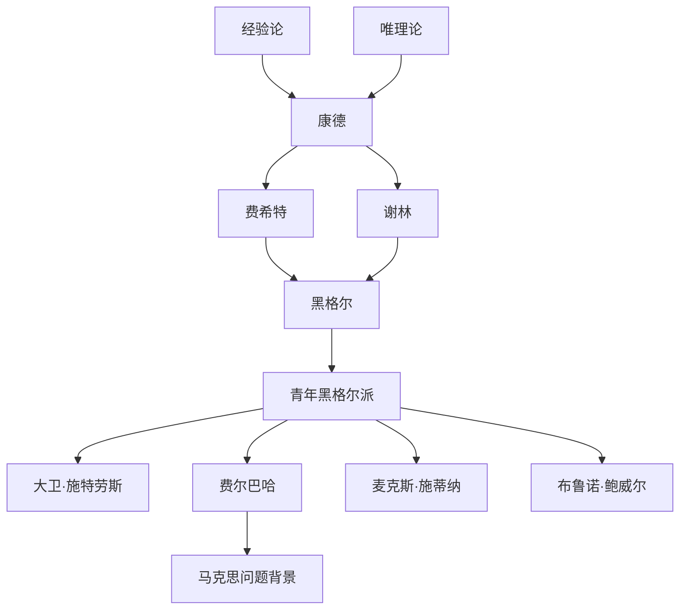

# 德意志古典哲学

## 时间

1770年至1844年前后。

## 概括

德意志古典哲学从康德的批判哲学出发，试图回应经验论与唯理论的对立，并把认识、自由、主体、自然、历史和精神统一到系统哲学中。费希特、谢林和黑格尔把康德的问题推进为主体哲学、自然哲学和绝对精神体系；青年黑格尔派和费尔巴哈则在宗教批判和人的感性存在上瓦解黑格尔体系，为马克思主义和现代思想转向铺路。

## 演变关系

## 主要人物

| 人物 | 位置 | 关键思想 |
|---|---|---|
| 康德 | 批判哲学起点 | 纯粹理性批判、先验感性论、知性范畴、经验实在论、先验观念论、实践理性、自由、道德律、判断力批判。 |
| 费希特 | 主体哲学 | 自我意识、我即我、知识学基本原理、绝对自我。 |
| 谢林 | 自然哲学与同一哲学 | 绝对理性、自我意识、自然哲学、先验哲学、偶然中的必然、理智直观、艺术直观。 |
| 黑格尔 | 绝对唯心主义体系 | 绝对精神、自在 / 自为 / 自在自为、辩证法、存在论、本质论、概念论、自然哲学、精神哲学、历史终结论。 |
| 大卫·施特劳斯 | 青年黑格尔派 | 实体精神、宗教批判。 |
| 费尔巴哈 | 青年黑格尔派、人本主义 | 宗教本质是人的异化、感性人类学、爱与感性、人的自然存在。 |
| 麦克斯·施蒂纳 | 青年黑格尔派边缘 | 唯我主义、个体性。 |
| 布鲁诺·鲍威尔、埃德加·鲍威尔 | 青年黑格尔派 | 自我意识、个人实体、无神论、宗教批判。 |

## 说明

- 康德不是简单折中经验论和唯理论，而是改变问题结构：考察经验知识何以可能。
- 黑格尔把逻辑、本体论、自然和精神组织成体系，辩证法成为后世继承和反叛的核心。
- 青年黑格尔派把黑格尔体系转向宗教批判、政治批判和人的现实存在。
- 费尔巴哈对宗教异化的解释直接影响马克思早期思想，但马克思随后把批判重心转向实践、劳动和社会关系。

## 上级

- [西方哲学](/%E4%BA%BA%E6%96%87%E7%A7%91%E5%AD%A6/%E5%93%B2%E5%AD%A6/%E8%A5%BF%E6%96%B9%E5%93%B2%E5%AD%A6/README.md)

## 参考图

